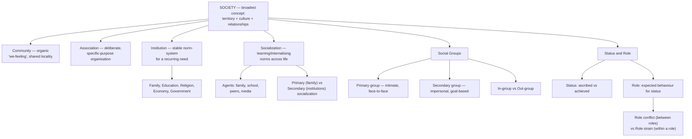

# SOC Unit 2 — Primary Concepts

Covers: the foundational vocabulary of sociology — society, community, association, institution, socialization, social groups, and status and role — the conceptual toolkit every later unit in this paper (family, social control, culture) depends on.

## Society

**Society** is a large, relatively self-sufficient group of people who share a common territory, culture, and a network of social relationships, and who continue their existence across generations through shared institutions. The key features usually listed are: a definite territory, a shared culture (values, norms, language), organised social relationships (structured interaction, not just a random crowd), and continuity over time. Society is the broadest of the concepts in this unit — every other concept here (community, association, institution) is best understood as a *part* or *component* of society.

## Community

A **community** is a group of people living within a specific geographic area who share a sense of belonging and common life, arising more organically (from shared locality and daily interaction) than from deliberate organisation. The classic distinguishing feature of community is a shared "we-feeling" or sense of togetherness that develops simply from people living near each other and depending on shared local resources and institutions (markets, local governance, shared spaces) — a village or a neighbourhood is the standard example. Community is narrower than society (a society contains many communities) but broader and less deliberately organised than an association.

## Association

An **association** is a group of people who are deliberately and consciously organised to pursue one or more specific, common interests or goals (contrast this directly with community's organic, unplanned "we-feeling"). Examples include a trade union, a sports club, a political party, or a professional body. Defining features: a specific purpose, formal organisation (rules, membership, often a structure of officers/leadership), and voluntary membership around that shared purpose. The key exam contrast: community exists because people share a *place and general life*; an association exists because people share one *specific interest* and organise deliberately around it.

## Institution

A **social institution** is an established, relatively stable and organised system of social norms and relationships that fulfils a basic, recurring social need. Institutions are not physical buildings (a common student misconception) but sets of norms and practices — "marriage," "the family," "education," "religion," "the economy," and "government" are all institutions in this sense, not places. Each addresses a specific societal need: the family regulates reproduction and early socialisation, education transmits knowledge and skills, religion addresses meaning and moral order, the economy organises production and distribution, and government organises authority and social order. Institutions are the *structural* backbone that both community and association ultimately operate within and through.

## Socialization

**Socialization** is the lifelong process by which individuals learn and internalise the norms, values, behaviours, and social skills of their society and culture, enabling them to function as competent members of that society. It is the mechanism by which society reproduces itself across generations — without socialization, cultural norms and institutions (as defined above) would have to be reinvented by every new individual from scratch. Socialization occurs through several key **agents**: the family (the primary and earliest agent), schools (formal, structured socialization), peer groups (socialization among equals, especially influential in adolescence — directly connecting to the peer-relations material in the Life Span Development paper), and media (an increasingly significant modern agent, transmitting norms and models of behaviour at scale). Socialization is typically distinguished into *primary socialization* (early childhood, mainly within the family, establishing basic language, norms, and values) and *secondary socialization* (later, more specialised learning of norms appropriate to specific institutional contexts like school, workplace, or particular social roles).

## Social Groups

A **social group** is a collection of two or more people who interact with one another, share a sense of common identity, and have some structured pattern of relationship (as opposed to a random, unconnected collection of individuals, sometimes called an *aggregate*, e.g., strangers waiting at a bus stop, who share a location but not an ongoing structured relationship or shared identity). Key distinctions drawn among social groups:
- **Primary groups** — small, intimate, long-lasting groups with face-to-face interaction and strong emotional bonds (family, close friends); primary groups are where primary socialization (above) chiefly happens.
- **Secondary groups** — larger, more impersonal, goal-oriented groups with relationships that are often formal and temporary (a workplace, a classroom, a large organisation).
- **In-group and out-group** — a group a person identifies with and feels loyalty toward ("us") versus a group perceived as different or outside that identification ("them") — this distinction underlies a great deal of intergroup behaviour, prejudice, and conflict studied later in sociology and social psychology.

## Status and Role

**Status** is a recognised social position that a person occupies within a social structure (e.g., student, teacher, mother, doctor), and every individual typically occupies multiple statuses simultaneously (a person can be a student, a daughter, and a part-time employee all at once — this full set is sometimes called a "status set"). Statuses are distinguished by how they are acquired:
- **Ascribed status** — assigned to a person at birth or involuntarily, without effort or choice (e.g., being someone's son/daughter, caste in traditional systems, sex/gender assigned at birth).
- **Achieved status** — attained through a person's own effort, choice, or accomplishment (e.g., becoming a doctor, an athlete, or a graduate).

A **role** is the set of expected behaviours, rights, and obligations associated with a particular status — status is the *position*, role is the *behavioural expectation attached to that position*. A "mother" (status) is expected to nurture and care for her children (role); a "teacher" (status) is expected to instruct and evaluate students (role). Because individuals hold multiple statuses at once, they can experience **role conflict** (competing demands from different roles, e.g., a working parent torn between a work deadline and a child's school event) and **role strain** (competing demands *within* a single role, e.g., a teacher who must both support and discipline the same student). Status and role together are the basic building blocks sociologists use to describe how individuals fit into the larger structures (institutions, groups) covered earlier in this unit.

## Concept Map

## Flashcards
Q: Distinguish society from community.
A: Society is the broad, self-sufficient group sharing territory, culture, and organised relationships across generations; community is a narrower group sharing a locality and an organic sense of belonging ("we-feeling").

Q: How does an association differ from a community?
A: An association is deliberately and consciously organised around a specific shared interest or goal, while a community arises organically from shared locality and general life, not a specific deliberate purpose.

Q: What is a social institution, and what common misconception should be avoided?
A: A stable, organised system of norms and relationships fulfilling a basic social need; the misconception is thinking of institutions as physical buildings rather than systems of norms and practices.

Q: Define socialization and name its four main agents.
A: The lifelong process of learning and internalising a society's norms, values, and behaviours; agents are family, schools, peer groups, and media.

Q: Distinguish primary socialization from secondary socialization.
A: Primary socialization happens in early childhood mainly within the family, establishing basic norms and values; secondary socialization happens later, teaching norms appropriate to specific institutional contexts like school or work.

Q: Distinguish a primary group from a secondary group, with an example of each.
A: A primary group is small, intimate, and long-lasting with strong emotional bonds (e.g., family); a secondary group is larger, impersonal, and goal-oriented (e.g., a workplace).

Q: What distinguishes a social group from a mere aggregate?
A: A social group has interaction, a shared sense of identity, and a structured pattern of relationships; an aggregate is just people in the same place without an ongoing structured relationship (e.g., strangers at a bus stop).

Q: Distinguish ascribed status from achieved status.
A: Ascribed status is assigned at birth or involuntarily (e.g., being someone's child); achieved status is attained through effort or accomplishment (e.g., becoming a doctor).

Q: Distinguish status from role.
A: Status is the recognised social position a person occupies; role is the set of expected behaviours, rights, and obligations attached to that status.

Q: Distinguish role conflict from role strain.
A: Role conflict is competing demands between two different roles (e.g., parent vs. employee); role strain is competing demands within a single role (e.g., a teacher who must both support and discipline the same student).
