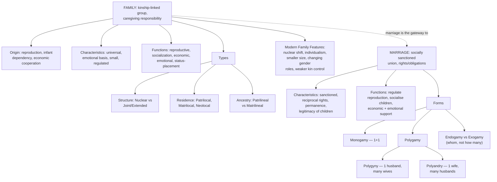

# SOC Unit 3 — Family and Marriage

Covers: the family's meaning, origin, characteristics, and functions, types of family classified by structure/residence/ancestry, the features distinguishing the modern family, and marriage's meaning, characteristics, functions, and forms — two of sociology's most classic "primary concepts made concrete" institutions.

## The Family: Meaning, Origin, and Characteristics

The **family** is a social institution and group of persons directly linked by kinship ties (blood, marriage, or adoption), whose adult members assume responsibility for caring for children and typically live together in a shared household. As the concrete, universal example of "institution" from Unit II, the family is the primary unit through which primary socialization happens.

**Origin of the family** — sociologists generally treat the family as arising from the basic, universal human needs for reproduction, the prolonged dependency of human infants (far longer than most species, requiring sustained caregiving), and economic cooperation, meaning some form of family-like grouping appears in essentially every known human society, even though its exact structure varies enormously across cultures and history.

**Characteristics** commonly identified in the family as an institution:
- **Universality** — some form of family exists in virtually every society.
- **Emotional basis** — relationships within the family are grounded in emotional bonds (love, affection, obligation), not purely contractual ones.
- **Limited size** — compared to other institutions/groups, the family is typically small.
- **Nuclear position within a larger structure** — the family is embedded within, and connected to, wider kinship networks.
- **Social regulation** — the family (especially through marriage) is subject to social norms and regulation regarding who can form a family with whom.

## Functions of the Family

The family performs several functions that make it central to the whole social structure discussed in Unit II:
- **Reproductive function** — provides the socially sanctioned context for producing and raising the next generation.
- **Socialization function** — the primary agent of primary socialization (directly continuing Unit II), where children first learn language, norms, and values.
- **Economic function** — historically a unit of production (e.g., a farming family working land together) and, even in modern economies, a unit of consumption and economic support.
- **Emotional/psychological function** — provides emotional security, affection, and a sense of belonging to its members.
- **Social status/placement function** — confers an initial social status on its members (through ascribed status, connecting back to Unit II), which they can later add to through achieved status of their own.

## Types of Family: Structure, Residence, and Ancestry

Families are classified along several independent dimensions, and exam questions often ask you to classify a described family along more than one dimension at once:

**Based on structure:**
- **Nuclear family** — parents and their dependent children living as an independent unit.
- **Joint/extended family** — multiple generations and/or siblings' families living together (or functioning) as one unit, sharing resources, property, and often a common household — historically the dominant form in traditional Indian society, which the syllabus's "features of modern family" section (below) contrasts against.

**Based on residence** (where a newly married couple lives):
- **Patrilocal residence** — the couple lives with or near the husband's family.
- **Matrilocal residence** — the couple lives with or near the wife's family.
- **Neolocal residence** — the couple establishes an independent residence separate from both families — characteristically more common in modern, urban, nuclear-family-oriented societies.

**Based on ancestry/descent** (how lineage and inheritance are traced):
- **Patrilineal descent** — lineage and inheritance traced through the father's line.
- **Matrilineal descent** — lineage and inheritance traced through the mother's line.

## Features of the Modern Family

Modern (particularly urban, industrial) families show several characteristic shifts away from the traditional joint-family pattern:
- A shift toward the **nuclear family** as the dominant form, driven by industrialisation and urbanisation (people moving to cities for work, away from ancestral joint households).
- **Increased individualism** — greater emphasis on individual choice (in marriage partner selection, career, lifestyle) relative to strict family/kin control.
- **Smaller family size**, partly reflecting changing economic pressures and the reduced economic necessity of many children (contrast with agrarian joint families, where children were an important labour resource).
- **Changing gender roles**, especially increased participation of women in paid work outside the home, altering the traditional division of domestic labour and authority within the family.
- **Weakening of extended kin control**, with more decisions (marriage, residence, career) made by the nuclear unit or the individual rather than the wider joint family.

## Marriage: Meaning, Characteristics, and Function

**Marriage** is a socially and often legally recognised union between individuals that establishes rights and obligations between them (and typically in relation to any children), and functions as the primary institution that regulates and legitimises family formation (directly connecting back to family's origin, above — marriage is the socially sanctioned "gateway" into forming a new family unit).

**Characteristics of marriage:**
- It is a **socially sanctioned union** — recognised and regulated by the society/culture, not merely a private arrangement.
- It typically involves **reciprocal rights and obligations** between the partners (and toward children).
- It is generally intended to be **relatively permanent**, though norms about dissolution (divorce) vary greatly across societies and have shifted historically.
- It usually confers **legitimacy** on children born within it, historically an important social function.

**Functions of marriage** largely mirror and enable the functions of the family covered above: it regulates sexual/reproductive behaviour, provides a stable structure for socialising children, organises economic cooperation between partners, and provides emotional and social support.

## Forms of Marriage

Marriage forms are classified primarily by the number of spouses involved:
- **Monogamy** — one spouse at a time (one husband, one wife); the dominant legally recognised form in most modern societies, including India.
- **Polygamy** — marriage involving more than two spouses, further divided into:
  - **Polygyny** — one husband with multiple wives.
  - **Polyandry** — one wife with multiple husbands (historically rarer, but documented in specific societies/communities).
- Other classifications sometimes taught alongside these include **endogamy** (marriage within one's own social group, e.g., caste, community) and **exogamy** (marriage outside one's own defined group, e.g., outside one's immediate clan/gotra) — both are rules about *whom* one may marry, cutting across the monogamy/polygamy classification of *how many* one may marry.

## Concept Map

## Flashcards
Q: According to sociologists, what basic human needs explain the near-universal origin of the family?
A: Reproduction, the prolonged dependency of human infants, and economic cooperation.

Q: List three characteristics commonly attributed to the family as an institution.
A: Universality, emotional basis of relationships, and limited/small size (also: embedded in a larger kin structure, socially regulated).

Q: Name the five main functions of the family.
A: Reproductive, socialization, economic, emotional/psychological, and social status-placement functions.

Q: Distinguish nuclear family from joint/extended family.
A: Nuclear family is parents and dependent children as an independent unit; joint/extended family is multiple generations or siblings' families living/functioning together as one unit.

Q: Distinguish patrilocal, matrilocal, and neolocal residence.
A: Patrilocal: couple lives with/near the husband's family. Matrilocal: with/near the wife's family. Neolocal: an independent residence separate from both families.

Q: Distinguish patrilineal from matrilineal descent.
A: Patrilineal traces lineage/inheritance through the father's line; matrilineal traces it through the mother's line.

Q: Name three features of the modern family compared to the traditional joint family.
A: Shift toward the nuclear family, increased individualism in choices, and changing gender roles (also: smaller family size, weakening of extended kin control).

Q: What is the difference between polygyny and polyandry?
A: Polygyny is one husband with multiple wives; polyandry is one wife with multiple husbands.

Q: Distinguish endogamy from exogamy.
A: Endogamy is marriage within one's own social group (e.g., caste/community); exogamy is marriage outside one's own defined group (e.g., outside one's clan/gotra).

Q: What function does marriage historically serve regarding children?
A: It confers legitimacy on children born within the union.
