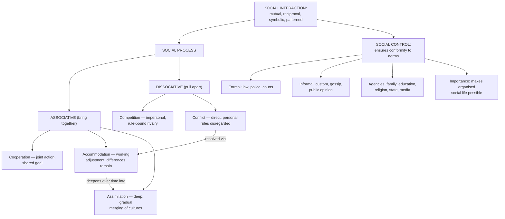

# SOC Unit 4 — Social Process and Social Control

Covers: social interaction's meaning and characteristics, the five classic forms of social process (cooperation, competition, conflict, accommodation, assimilation), and social control's meaning, types/agencies, and importance.

## Social Interaction: Meaning and Characteristics

**Social interaction** is the process by which people act and react in relation to one another — the basic building block of all social life, since every group, institution, and process covered in earlier units (Unit II's groups and statuses, Unit III's family) is ultimately built out of repeated social interactions between individuals.

**Characteristics of social interaction:**
- It requires **at least two actors** (individuals or groups) who are mutually aware of and responsive to each other.
- It is **reciprocal** — each party's actions influence and are influenced by the other's, distinguishing genuine interaction from one person simply acting while being unnoticed.
- It is **meaningful/symbolic** — human interaction is carried out through shared symbols (language, gestures, norms) that both parties interpret in roughly compatible ways.
- It is **patterned** — interaction tends to follow recognisable, repeated forms rather than being entirely random, which is exactly why sociologists can classify it into the distinct "social processes" below.

## Social Process: the umbrella concept

**Social process** refers to the recurring forms or patterns that social interaction characteristically takes as people and groups pursue their goals in relation to one another. The syllabus identifies five classic forms, conventionally grouped into two broad categories: **associative processes** (which bring people together — cooperation, accommodation, assimilation) and **dissociative/disjunctive processes** (which pull people apart or set them against each other — competition, conflict). Learning them as this pair of categories, rather than five isolated terms, makes the relationships between them much easier to retain.

## Cooperation

**Cooperation** is joint or coordinated action by two or more people/groups working together toward a common goal, where each party benefits from the joint effort. It is the most basic and fundamental associative process — sociologists generally treat it as necessary for any group or society to function at all (an entirely uncooperative group could not sustain any of the institutions from Unit III). Cooperation can be direct (people working literally side by side on the same task) or indirect (a division of labour where different people do different tasks that jointly serve a shared goal, as in an economy).

## Competition

**Competition** is a dissociative process in which two or more parties strive for the same limited goal or resource under agreed-upon rules, without directly attacking one another — think of it as a "regulated" or "impersonal" struggle. Because competition is bound by shared rules that all parties generally respect (unlike conflict, below), it is considered a relatively mild and often socially productive dissociative process — it can motivate effort and innovation (e.g., economic or academic competition) even while distributing scarce resources or positions unevenly.

## Conflict

**Conflict** is a more intense dissociative process in which parties directly and deliberately try to defeat, harm, or eliminate one another (or each other's position) to obtain a goal, often disregarding shared rules that would otherwise be observed in competition. The key distinction from competition: competition is impersonal and rule-bound (opponents pursue the same goal without targeting each other directly); conflict is personal and direct, aimed specifically at the opposing party. Conflict can range from mild interpersonal disputes to large-scale social conflict (class conflict, ethnic conflict, war), and sociological theory (especially conflict theory, tracing back to Marx from Unit I) treats conflict as a major driver of social change, not merely a breakdown of social order.

## Accommodation

**Accommodation** is the process by which conflicting or competing parties reach a working adjustment that allows them to continue functioning together, even without fully resolving their underlying differences. It is the typical *outcome* that follows a period of conflict or competition — parties don't necessarily agree or merge their differences, but they establish a modus vivendi (a way of coexisting) through mechanisms like compromise, toleration, arbitration, or simply a truce. Accommodation restores a working order to social interaction without requiring the deeper cultural merging involved in the next process.

## Assimilation

**Assimilation** is a deeper associative process in which individuals or groups from different cultural backgrounds gradually adopt the culture (values, norms, language, practices) of another group, eventually reducing or eliminating the original cultural distinctions between them. Assimilation typically happens gradually, over an extended period and often across generations (a classic example is the multi-generational assimilation of immigrant communities into a host society's culture). The key contrast to hold onto: accommodation is a relatively quick, practical adjustment that lets people coexist despite continuing differences; assimilation is a slow, deep process that actually reduces those cultural differences over time.

## Social Control: Meaning, Types, Agencies, and Importance

**Social control** is defined as the methods and means by which a society ensures the conformity of its members to established norms, values, and expectations — essentially, how society keeps the patterned interactions and processes above from collapsing into pure, unregulated conflict.

**Types of social control** are conventionally split into two categories:
- **Formal social control** — control exercised through explicit, codified rules and organised sanctioning bodies: laws, the police, courts, and other formal institutions of the state, with clearly defined and often legally enforceable consequences for non-conformity.
- **Informal social control** — control exercised through unwritten, everyday social mechanisms: customs, traditions, public opinion, gossip, ridicule, and social approval/disapproval, which regulate behaviour without any codified rule or official enforcement body.

**Agencies of social control** are the specific institutions and groups through which these types operate: the family and education system (through primary and secondary socialization, directly recalling Unit II — much of social control actually happens by getting norms internalised before any external sanction is ever needed), religion (moral authority and sanctioned beliefs), the state/legal system (formal laws and enforcement), and public opinion/media (informal but often powerful social pressure).

**Importance of social control** — social control is what allows the institutions, groups, and processes covered across this entire paper (family, associations, cooperation) to function predictably: without some mechanism ensuring general conformity to shared norms, social order, cooperation, and the maintenance of institutions like family and government would be unstable or impossible. Social control is therefore not simply about punishing deviance — its deeper function is making organised social life possible at all.

## Concept Map

## Flashcards
Q: What are the two broad categories social processes are grouped into?
A: Associative processes (cooperation, accommodation, assimilation) and dissociative processes (competition, conflict).

Q: Distinguish cooperation from competition.
A: Cooperation is joint action toward a shared goal where all parties benefit; competition is parties striving for the same limited goal under agreed rules, without directly attacking each other.

Q: What is the key distinction between competition and conflict?
A: Competition is impersonal and rule-bound; conflict is direct and personal, aimed at defeating or harming the opposing party, often disregarding shared rules.

Q: What is accommodation, and how does it typically arise?
A: A working adjustment that lets conflicting/competing parties continue functioning together without resolving underlying differences; it typically follows a period of conflict or competition.

Q: How does assimilation differ from accommodation?
A: Accommodation is a relatively quick, practical adjustment allowing coexistence despite continuing differences; assimilation is a slow, deep process that actually reduces cultural differences over time.

Q: Distinguish formal social control from informal social control.
A: Formal social control uses codified rules and organised sanctioning bodies (law, police, courts); informal social control uses unwritten mechanisms like custom, gossip, and public opinion.

Q: Name four agencies of social control.
A: Family, education system, religion, and the state/legal system (also public opinion/media).

Q: Why is the family considered an agency of social control, not just of socialization?
A: Because internalising norms through primary socialization is itself a major mechanism of social control, reducing the need for external sanctions later.

Q: What is the deeper function of social control, beyond punishing deviance?
A: Making organised, predictable social life possible at all, by ensuring general conformity to shared norms.

Q: What four characteristics define social interaction?
A: It involves at least two mutually aware actors, is reciprocal, is meaningful/symbolic, and is patterned.
