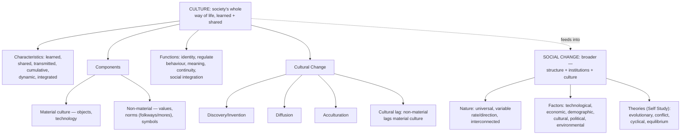

# SOC Unit 5 — Culture and Social Change

Covers: culture's meaning, characteristics, components, and functions, cultural change/process, and social change's meaning, nature, characteristics, and factors — the syllabus's closing unit, tying together everything from society (Unit II) through social process (Unit IV) into how societies actually transform over time. Note: the theories of social change (evolutionary, conflict, cyclical, equilibrium) are flagged in the distilled source as **Self Study** — not covered in taught detail here, but named below so you know what they are if referenced elsewhere.

## Culture: Meaning and Characteristics

**Culture** is the entire way of life of a society — the shared beliefs, values, norms, customs, knowledge, art, and material objects that are learned and transmitted across generations, rather than biologically inherited. Culture is what actually fills in the content of every concept from earlier units: it's the specific values a family (Unit III) socialises its children into, the specific norms a society's institutions (Unit II) encode, and the specific rules of accommodation and assimilation (Unit IV) that different cultural groups negotiate between.

**Characteristics of culture:**
- **Learned, not innate/biological** — culture is acquired through socialization (directly recalling Unit II), not through genetic inheritance; this is why children raised in different cultures acquire entirely different cultural content despite similar biology.
- **Shared** — culture is held in common by members of a group or society, which is precisely what allows social interaction (Unit IV) to be meaningful and symbolic between strangers who share that culture.
- **Transmitted across generations** — culture is passed down through socialization, education, and tradition, giving it continuity over time.
- **Cumulative** — culture builds up over time as new elements are added to an existing cultural stock, rather than each generation starting from zero.
- **Dynamic/changing** — despite being transmitted and cumulative, culture is not static; it changes over time (setting up the "cultural change" section below).
- **Integrated** — a culture's different parts (values, norms, institutions) tend to fit together into a relatively coherent whole, so a change in one part often has ripple effects on others.

## Components of Culture

Culture is conventionally broken into two broad components:
- **Material culture** — the physical, tangible objects a society produces and uses: tools, technology, buildings, art, clothing, and other physical artifacts.
- **Non-material culture** — the intangible aspects: beliefs, values, norms, language, symbols, and knowledge. Non-material culture further includes specific sub-elements worth naming individually: **values** (shared ideas about what is good, desirable, or important), **norms** (specific rules of expected behaviour, further split into *folkways* — everyday customs/conventions with mild sanctions for violation, e.g., table manners — and *mores* — norms with strong moral significance and serious sanctions, e.g., prohibitions on theft or violence), **symbols** (anything that carries shared meaning, most importantly language, which is the primary vehicle through which all other culture is transmitted).

## Functions of Culture

Culture performs several functions for both society and the individual:
- **Provides identity and belonging** — gives individuals and groups a shared sense of who they are and where they fit.
- **Regulates behaviour** — through its norms (folkways and mores above), culture provides shared standards for acceptable behaviour, reducing the need for constant explicit social control (Unit IV).
- **Provides meaning** — helps individuals interpret and make sense of their experiences and the world around them.
- **Ensures continuity** — by being transmitted across generations (as noted above), culture allows a society to maintain its identity and way of life over time, even as individual members are born and die.
- **Facilitates social integration** — a shared culture is precisely what allows the associative processes of Unit IV (cooperation, accommodation, assimilation) to function, since shared meanings and values give people common ground to cooperate and negotiate from.

## Cultural Change and Cultural Process

**Cultural change** refers to modifications in a society's culture over time — its values, norms, technology, and practices — and happens through several recognised processes:
- **Discovery and invention** — new knowledge or technology introduced from within a society (e.g., the invention of the internet transforming communication norms).
- **Diffusion** — the spread of cultural traits from one society or group to another through contact (trade, migration, media), rather than being independently invented in each place.
- **Acculturation** — the process by which a group or individual adopts elements of another culture through sustained direct contact, often as a step on the way toward the fuller cultural merging discussed as "assimilation" in Unit IV.
- **Cultural lag** — a concept describing how non-material culture (values, norms, laws) tends to change more slowly than material culture (technology), producing a period of imbalance or misfit between the two (e.g., new technology emerging faster than the laws or ethical norms needed to govern its use).

## Social Change: Meaning, Nature, and Characteristics

**Social change** is defined as any significant alteration over time in a society's social structure, institutions, patterns of relationships, or culture — a broader concept than cultural change alone, since it includes shifts in social structure and institutions (family forms, economic organisation, political systems) alongside cultural shifts.

**Nature and characteristics of social change:**
- **Universal/constant** — every society changes over time to some degree; no society is completely static.
- **Variable in rate** — the *speed* of change varies considerably across societies and historical periods (e.g., the rapid pace of change during industrialisation versus slower change in more traditional periods).
- **Variable in direction and consequence** — change is not automatically "progress"; it can have both intended and unintended consequences, and different groups within a society may experience the same change very differently (winners and losers of a given change).
- **Interconnected** — a change in one part of the social structure (e.g., the economy) tends to produce corresponding changes elsewhere (e.g., family structure, as seen with industrialisation's push toward the nuclear family in Unit III).

## Factors of Social Change

The syllabus identifies several major factors that drive social change:
- **Technological factors** — new technology can transform how people work, communicate, and organise their lives (e.g., industrial technology reshaping family structure, as covered in Unit III's "modern family" section).
- **Economic factors** — shifts in economic systems and organisation (e.g., agrarian to industrial to service-based economies) reshape social relationships and institutions.
- **Demographic factors** — changes in population size, composition, and distribution (e.g., urbanisation, migration, aging populations) alter social structures and needs.
- **Cultural factors** — the diffusion, acculturation, and innovation processes discussed above directly drive social change by altering the values and norms a society holds.
- **Political/legal factors** — changes in laws, government policy, and political movements can deliberately or incidentally reshape social structures (e.g., legal reforms affecting family or marriage practices).
- **Environmental factors** — changes in the natural environment (resource availability, climate, disasters) can force adaptations in social organisation and economic activity.

**Theories of social change (Self Study, per the syllabus)** — named here for completeness since they may appear in a broader reading list even though not covered in depth in class: **evolutionary theory** (society develops through progressive, sequential stages, echoing Comte's "law of three stages" from Unit I), **conflict theory** (change driven by struggle between groups with opposing interests, echoing Marx from Unit I and the "conflict" social process from Unit IV), **cyclical theory** (societies rise and fall in recurring cycles rather than moving in one direction), and **equilibrium theory** (society tends toward a stable balance, and change occurs as the system adjusts back toward equilibrium after a disturbance).

## Concept Map

## Flashcards
Q: Define culture.
A: The entire way of life of a society — shared beliefs, values, norms, customs, knowledge, art, and material objects, learned and transmitted across generations.

Q: Name the two components of culture and give an example of each.
A: Material culture (tangible objects, e.g., technology, tools) and non-material culture (intangible, e.g., values, norms, language).

Q: Distinguish folkways from mores.
A: Folkways are everyday customs/conventions with mild sanctions for violation (e.g., table manners); mores are norms with strong moral significance and serious sanctions (e.g., prohibitions on theft or violence).

Q: What does it mean to say culture is "cumulative"?
A: Culture builds up over time as new elements are added to an existing cultural stock, rather than each generation starting from zero.

Q: Distinguish diffusion from acculturation.
A: Diffusion is the spread of cultural traits between societies through contact; acculturation is the process by which a group or individual adopts elements of another culture through sustained direct contact.

Q: What is cultural lag?
A: The tendency for non-material culture (values, norms, laws) to change more slowly than material culture (technology), producing a period of imbalance between the two.

Q: How does social change differ from cultural change?
A: Social change is broader, covering shifts in social structure and institutions as well as culture; cultural change specifically refers to shifts in values, norms, technology, and practices.

Q: Name three characteristics of the nature of social change.
A: It is universal/constant, variable in rate, and variable in direction/consequence (also: interconnected across parts of the social structure).

Q: Name four factors that drive social change.
A: Technological, economic, demographic, and cultural factors (also political/legal and environmental factors).

Q: Name the four theories of social change flagged as self-study in the syllabus.
A: Evolutionary theory, conflict theory, cyclical theory, and equilibrium theory.
