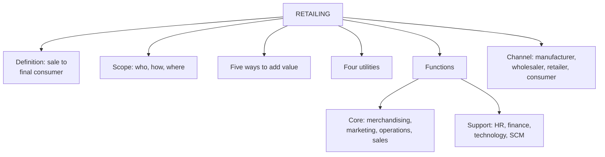

# MR-1: Retailing Foundations

Covers: the definition and scope of retailing, what retail management is, where the retailer sits in the channel, the five ways retailers add value, the four utilities, core and support functions, and why retailing matters. **(syllabus)**

## Where this fits in the ESE

Assumed pattern (no course plan was supplied): 50 marks, Section A 3 × 5, Section B 2 × 10, Section C one compulsory 15-mark case. This node feeds the easiest 5-mark answers in the unit ("Define retailing and explain its scope", "Five ways retailers add value", "Four utilities") and the opening paragraph of every 10-mark answer. Expect one of these as a 5-marker.

## Definition and scope (syllabus)

- **Etymology:** *retail* comes from the Old French *retaillier*, "to cut off or break bulk".
- **Retailer:** a dealer who sells goods or services in small quantities to consumers for personal or family use.
- **Retailing (Kotler's definition, as on the slide):** "all the activities involved in selling goods or services directly to final consumers for personal, non-business use."
- **Retailing (value view):** a set of business activities that adds value to the products and services sold to consumers. It is the final step in the distribution of merchandise for consumption by the end consumer.

**Scope rule to quote in the exam:** it does not matter who sells, how they sell, or where. If the buyer is a final consumer, it is retailing.

| Dimension | Possibilities |
|---|---|
| WHO sells | manufacturer, wholesaler, retailer |
| HOW | in person, mail or telephone, vending machine, internet |
| WHERE | in a store, on the street, in the consumer's home |

## Retail management (syllabus)

**Definition:** the process of promoting greater sales and customer satisfaction by better understanding the consumers of a company's goods and services.

Three defining characteristics: it drives sales and satisfaction; it is an end-to-end process (attract, serve and retain the shopper); it is an art and a science (management tools for complete end-user satisfaction).

## Where the retailer fits (syllabus)

Manufacturer, then wholesaler, then retailer, then consumer.

- The manufacturer designs and makes, selling to wholesalers or retailers.
- The wholesaler buys, stores and handles goods in bulk and resells in smaller lots.
- The retailer links the chain to the consumer, adding value and service.
- Key line: **wholesalers focus on satisfying retailers' needs; retailers direct their efforts to satisfying the needs of the final consumer.**

(textbook) Wholesaling sells to resellers and business users, usually in larger lots; retailing sells to final consumers in small lots. A firm can do both, and only the sale to the final consumer is retailing.

## Five ways retailers add value (syllabus)

1. **Providing assortment:** many items from several brands, so customers choose across designs, sizes and colours in one place.
2. **Breaking bulk:** smaller quantities tailored to household use; a wholesaler's pallet becomes a single retail unit.
3. **Holding inventory:** stock in user-friendly sizes, so products are available when wanted.
4. **Providing services:** credit, delivery, installation, advice; easier to buy and use.
5. **Increasing value:** together these raise the value consumers receive beyond what the manufacturer alone delivers.

## Four utilities (syllabus)

| Utility | Meaning | Retail lever |
|---|---|---|
| Form | goods in the form, size and packaging consumers want | pack sizes, assortment |
| Time | available when needed | opening hours, replenishment, quick delivery |
| Place | convenient, accessible locations | store network, delivery |
| Possession | ownership passes smoothly | credit, easy checkout, return policy |

Trap: the five ways and the four utilities are two different lists. Value-adding activities (what the retailer does) produce utilities (what the consumer gets).

## Functions of retailing (syllabus)

**Core (customer-facing):** merchandising (procuring the right merchandise), marketing (advertising, promotion, public relations, often central), store operations (monitoring performance and profits by region), sales (associates, cashiers, stock receiving).

**Support:** human resources; accounting and finance (cash flow, credit policy); technology and e-commerce; supply of information (educating customers); visual merchandising (look and feel of the store); SCM and logistics (fast-emerging key focus).

## Economic and social significance (syllabus)

Retail sales contribute to overall economic activity; retail is among the largest sources of employment, with deep rural penetration; it fuels the wider distribution economy; it creates value (assortment, bulk breaking, inventory, services); it supplies information; and it carries social responsibility (for example lower store energy use, paper bags).

**Why study retailing:** it is where every upstream decision (merchandising, supply chain, pricing, branding) is validated by a buying decision, and it combines strategy, operations, marketing, HR and technology in daily decisions. India context from the slides: private final consumption expenditure about 61.5% of GDP in FY26 (first advance estimates) **[VERIFY: time-bound statistic]**.

## Worked example, laid out as an exam answer

**Question (5 marks).** A tailoring shop sells shirts to office-goers; its owner also sells bulk fabric to a school; a manufacturer runs an online store; a wholesaler's counter sells a single pack of tea to a walk-in homemaker. Which are retailing?

1. **Test:** is the buyer a final consumer buying for personal, non-business use?
2. **Apply:**

| Sale | Seller | Buyer | Retailing? |
|---|---|---|---|
| Shirt to office-goer | shop | final consumer | Yes |
| Bulk fabric to school | shop | institution | No (business use) |
| Online store sale | manufacturer | final consumer | Yes (manufacturer retailing) |
| Single tea pack, walk-in | wholesaler | final consumer | Yes |

3. **Decision:** three of four are retailing. **Interpretation:** retailing is defined by the buyer, not by the seller or the method, so manufacturers going direct-to-consumer and wholesalers with counter sales are retailers for those sales and compete with traditional stores.

## Traps

- Defining retailing by "a shop that sells goods". The slide's rule is buyer-based.
- Mixing the five ways of adding value with the four utilities.
- Listing technology only as support. It is still a support function in the slides, though the student's note argues it is becoming a differentiator.
- Saying retailers "sell in bulk". The retailer's value is breaking bulk into household-sized units.

## What to remember

- Retailing = all activities in selling to final consumers for personal, non-business use; buyer decides, not seller, method or place.
- Retail management = promoting sales and satisfaction by understanding consumers; end-to-end, art and science.
- Value: assortment, breaking bulk, holding inventory, services, increased value.
- Utilities: form, time, place, possession.
- Core functions: merchandising, marketing, store operations, sales; support: HR, finance, technology, information, visual merchandising, SCM.

## Concept map

## Flashcards
Q: Give Kotler's definition of retailing as used on the slide.
A: Retailing includes all the activities involved in selling goods or services directly to final consumers for personal, non-business use.

Q: What is the origin of the word retail?
A: The Old French retaillier, meaning to cut off or break bulk.

Q: State the scope rule of retailing.
A: It does not matter who sells, how, or where; if the buyer is a final consumer it is retailing.

Q: List the five ways retailers add value.
A: Providing assortment, breaking bulk, holding inventory, providing services, increasing value.

Q: Name the four utilities retailing creates.
A: Form, time, place and possession utility.

Q: Which function does the slide call fast-emerging and key in modern retail?
A: SCM and logistics.

Q: Name the three defining characteristics of retail management.
A: It drives sales and satisfaction, it is an end-to-end process, and it is an art and a science.

Q: How do the customers of a wholesaler and a retailer differ?
A: Wholesalers satisfy retailers' needs; retailers satisfy the needs of the final consumer.

## Sources
- Faculty deck RM Unit 1 (Foundations, Supply Chain, Value Creation, Functions, Significance slides) and RM Notes
- Student notes: What is Retailing, Retail Management, Functions of Retailing, Supply Chain and Value Addition, Reasons for Studying Retailing
- Next node: [[Retail Management Unit 1 - MR-2 Retail in India and the World]]
- [[Retail Management Unit 1 - Modern Retailing MOC (Node Map)]]
