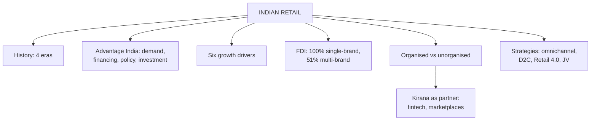

# MR-2: Retail in India and the World

Covers: global retail, the history of Indian retail, "Advantage India", growth drivers, FDI policy, organised versus unorganised retail, strategies adopted by retailers, and careers. **(syllabus)** All statistics below are from the slides dated February 2026 and are **[VERIFY]** for any exam that asks for a current figure.

## Where this fits in the ESE

Most likely 10-mark question from Unit 1: "Explain the growth drivers of Indian retail" or "Organised vs unorganised retail in India". Also a natural 5-marker: "FDI policy in Indian retail" or "History of retailing in India". In a case, this node supplies the environment paragraph.

## Retailing as a global industry (syllabus)

- Walmart is the global leader (#1), with sales more than 3 times those of Carrefour, the second largest. The slides track the top 20 global retailers.
- Many retailers grow by expanding into other countries. Retailers focused on **hard lines** (consumer electronics, appliances, furniture) often outperform FMCG and apparel retailers in profitability.
- Retailing and distribution channels differ widely across the world.
- 2026 focus areas: AI-powered retail, omnichannel, supply chain modernisation, value-driven consumers, sustainability.
- Named global players in the notes: Walmart, Amazon, Costco, Carrefour, Aldi, IKEA, Tesco; Reliance Retail is the Indian name.

## History of retailing in India (syllabus)

| Era | What happened |
|---|---|
| Pre-1990s | Traditional and fragmented; manufacturers opened their own outlets |
| 1990-2005 | Large-scale entry of international brands; pure-play retailers saw the potential; growth mostly in apparel |
| 2005-2010 | Large Indian corporates committed substantial investment; entry into food and general merchandise; pan-India expansion to top 100 cities; existing players repositioned |
| 2010 onwards | FDI in multi-brand retail approved up to 51%; 100% FDI in single-brand under the automatic route; sourcing and investment rules for supermarkets relaxed; movement to smaller cities and rural areas |

The slide places "Pan-India expansion to top 100 cities" and "Repositioning" under 2005-2010 and the FDI items under 2010 onwards. Quote the slide's placement.

Insight: every era's shift was policy-driven (liberalisation, FDI relaxation), so each unlock brought a new type of entrant.

## Advantage India: four pillars (syllabus)

1. **Robust demand:** retail on track to exceed US$ 2,361 billion from US$ 1,094 billion in 2025; organised retail projected at US$ 230 billion by 2030 (Deloitte-RAI); record leasing in 2025, with D2C brands about 27% of leasing.
2. **Innovation in financing:** banks and financial houses enable easy credit for durables.
3. **Policy support:** simpler registration of wholly owned foreign subsidiaries.
4. **Increasing investment:** Amazon's additional US$ 15 billion over seven years from 2023; IKEA's announced investment plan (January 2026); retail trading FDI inflow cumulative since April 2000.

Retail accounts for over 10% of GDP and about 8% of the workforce (35+ million), with 25 million new jobs expected by 2030.

## Six growth drivers (the RM Notes list, give this one)

1. **Rise in income and purchasing power:** India third in GDP by PPP (2026); about 75 million new middle-income and 25 million affluent households by 2030.
2. **Increase in digital payments:** UPI reached 20.39 billion transactions worth Rs. 26.84 lakh crore in February 2026.
3. **Change in consumer mindset and consumer finance:** experience-driven retail, flagships, pop-ups, Gen Z formats.
4. **Brand consciousness:** premium brands; "mini" beauty packs.
5. **Hybrid retail model (Retail 4.0):** personalisation with an offline plus online approach.
6. **Investment:** stakes in existing assets or greenfield platforms.

The slide deck gives other versions of the six drivers (favourable demographics; rise in income; change in consumer mindset; brand consciousness; easy consumer credit; and a second slide with consumer preference, digital payments, consumer finance, FDI approval, hybrid model, investment). The RM Notes list above is the faculty's summary, so write it, and add "favourable demographics" and "FDI approval" as extras if space allows.

**Growth value proposition (slides):** demand factors (higher brand consciousness, rising incomes, aspiration, credit availability, young population and working women, urbanisation); supply factors (real estate and infrastructure, new categories, expansion by existing players, supply chain efficiency, R&D and new product development).

**Four growth opportunities (slides):** large number of outlets, private label opportunities (EY: 52% of Indian consumers opted for private labels in 2025), sourcing base, luxury retailing.

## FDI policy (syllabus)

| Sector | Route | Limit |
|---|---|---|
| Wholesale cash and carry trading | Automatic | 100% |
| Single-brand product retailing | Automatic | 100% |
| Multi-brand front-end retail | "Foreign Investment and Promotion Board" approval (slide) | 51% |

Benefits: employment, technological advancement, infrastructure investment, removing middlemen, benefit to Indian manufacturers.

**[VERIFY]** The slide names the Foreign Investment Promotion Board. That Board was abolished in 2017 and approvals now go through the government route administered via DPIIT; confirm current multi-brand conditions before quoting more than "51%, with government approval". In the exam, write the table as on the slide.

## Organised versus unorganised (syllabus)

| Basis | Organised | Unorganised |
|---|---|---|
| Registration | Licensed, registered for sales tax, income tax | Usually unregistered, not regulated by statute |
| Ownership | Corporate chains, large private firms | Individual or family |
| Management | Professional | Owner-managed |
| Format | Supermarkets, hypermarkets, department stores | Kirana, paan and beedi shops, hand carts, pavement vendors |
| Operations | Standardised systems, formal accounts | Informal, limited records |
| Technology | POS, ERP, digital | Limited |
| Share in India | Smaller but growing | More than 90% of retail business (slide text) |
| Examples | DMart, Reliance Retail, Westside | Kirana stores, hawkers |

**Slide chart:** traditional retail 81%, organised 12%, e-commerce 8% in 2023 (sums to 101% by rounding); 2035F: traditional 61%, organised 17%, e-commerce 22%. The text adds 12% organised in February 2025, 17-19% by 2035. **Conflict:** "more than 90% unorganised" (text) against 81% traditional plus 8% e-commerce (chart). The slides do not reconcile them. Quote "more than 90% unorganised" for the structure of the sector, "organised about 12%" for today, and name the chart as the source of the 2035 projection.

**Bridging the divide:** 63% of unorganised retailers are interested in digital payments; PayNearby, PhonePe, BharatPe and Mswipe serve small shops; Amazon partnered with local stores; Walmart runs 28 "best-priced" stores serving local stores.

## Strategies adopted by Indian retailers (slides)

Strong distribution and logistics; expansion (IKEA, Zudio, Nykaa store openings); omnichannel; direct-to-consumer; value-added services (loyalty programmes); partnerships (for example Nykaa with Kiehl's); Retail 4.0; strong supply chain; personalisation; shift from cash on delivery to digital payment; joint ventures.

## Recent M&A (slides)

HUL acquired a 49% stake in Zywie Ventures (February 2026) and 90.5% of Minimalist (January 2025); Aditya Birla Digital Fashion Ventures and Wrogn; Reliance Consumer Products and Manna Foods; Amazon and Axio; Reliance Retail and Kelvinator.

## Careers (syllabus)

Roles: retail management trainee, store manager, category manager, merchandising executive. Skills: CRM, sales and operations, inventory, merchandising and visual display, leadership, communication and negotiation, data analysis (Excel, Power BI), digital marketing, problem-solving, retail analytics and AI.

## Worked example, laid out as an exam answer

**Question (5 marks).** The slides give India's retail market as US$ 1,093.89 billion in 2025 and US$ 2,361.11 billion at the horizon. Compute the implied growth rate for both candidate horizons and say which is credible.

1. **Formula (textbook):** CAGR = (end ÷ start)^(1/n) − 1. Ratio = 2,361.11 ÷ 1,093.89 = 2.158.
2. **Compute:**

| Horizon | n (years) | CAGR |
|---|---|---|
| 2030 (Advantage India text) | 5 | 16.6% |
| 2035F (chart label) | 10 | 8.0% |

3. **Decision:** the 2035F reading (8.0% a year) is the more plausible one, because another slide in the deck quotes a retail CAGR of 6.8%, and 16.6% a year would be more than double that. **Interpretation:** the slide set is not internally clean (the same chart also jumps from 1,094 in 2025 to 1,407 in 2026F, +28.6% in a year). So in the exam show the CAGR formula, name the horizon you assume, and write "US$ 1,094 billion (2025) to US$ 2,361 billion (2035F per the chart; the text says 2030)". **[VERIFY]**

**Other checks (illustrative arithmetic on slide figures):** Reliance Retail's 77.4 million sq. ft. over 20,000 stores is an average of 3,870 sq. ft. per store, so its network is mostly small and medium formats. The direct selling figure of Rs. 22,142 crore with 4.4% growth implies about Rs. 21,209 crore the year before. UPI's Rs. 26.84 lakh crore over 20.39 billion transactions is about Rs. 1,316 per transaction.

## Conflicts inside the sources (say so in the exam only if asked for exact numbers)

- India's retail destination rank: the card says "Rank of India: 5" while the text and student note say "third largest". Write "among the top global retail destinations".
- Retail FDI cumulative: slide 10 says Rs. 41,645 crore (US$ 4.86 billion) to June 2025; later slides say Rs. 36,241.37 crore (US$ 4.97 billion) to December 2025. A cumulative total cannot fall, so one is wrong. **[VERIFY]** The student note uses the second.
- IKEA investment: Rs. 10,500 crore (US$ 1.19 billion), or Rs. 200 billion (US$ 2.2 billion), or Rs. 20,000 crore, in different slides. Quote "over US$ 1 billion over five years" if unsure.
- Star Bazaar: 79 stores (hypermarket slide) and 72 stores (supermarket list).
- Direct selling: US$ 2.57 billion (first slide) against US$ 2.58 billion (later text); Rs. 22,142 crore either way.

## What to remember

- Policy drove each phase: pre-1990 manufacturer outlets, 1990-2005 international brands, 2005-2010 Indian corporates and food, 2010 onward FDI and smaller cities.
- FDI: 100% single-brand (automatic), 100% cash and carry (automatic), 51% multi-brand (approval).
- Six drivers (RM Notes): income, digital payments, consumer mindset and finance, brand consciousness, hybrid Retail 4.0, investment.
- Unorganised retail is more than 90% of business; organised about 12% and rising to 17% by 2035F.
- Kirana is treated as a partner (fintech, marketplaces), not only a competitor.

## Concept map

## Flashcards
Q: Name the four eras of the history of retailing in India.
A: Pre-1990s, 1990-2005, 2005-2010 and 2010 onwards.

Q: What is the FDI limit in single-brand and multi-brand retail on the slides?
A: 100% (automatic route) in single-brand and wholesale cash and carry; 51% (approval route) in multi-brand front-end retail.

Q: Name the four pillars of Advantage India.
A: Robust demand, innovation in financing, policy support, increasing investment.

Q: List the six growth drivers in the RM Notes.
A: Rise in income and purchasing power, digital payments, change in consumer mindset and consumer finance, brand consciousness, hybrid retail model (Retail 4.0), investment.

Q: What share of Indian retail does the unorganised sector hold, according to the slide text?
A: More than 90% of retail business.

Q: What does the 2035F chart show for traditional retail, organised retail and e-commerce?
A: 61%, 17% and 22% respectively.

Q: Which retail category do the slides say often outperforms FMCG and apparel in profitability?
A: Hard lines such as consumer electronics, appliances and furniture.

Q: Why does the student note call kirana stores partners?
A: Fintechs and marketplaces enable them with digital payments and onboarding, so organised players treat their trust and hyperlocal reach as an asset.

Q: Which implied CAGR comes from US$ 1,094 billion to US$ 2,361 billion over ten years?
A: About 8.0% a year; over five years it would be 16.6%.

## Sources
- Faculty deck RM Unit 1 (India growth, history, FDI, strategies) and RM Notes (six drivers, organised vs unorganised table)
- Student notes: History of Retailing in India, India's Retail Growth Story, The Indian Retail Landscape, Retailing as a Global Industry, Career Opportunities in Retail
- Previous node: [[Retail Management Unit 1 - MR-1 Retailing Foundations]]; next: [[Retail Management Unit 1 - MR-3 Classifying Retailers and Store Formats]]
- [[Retail Management Unit 1 - Modern Retailing MOC (Node Map)]]
