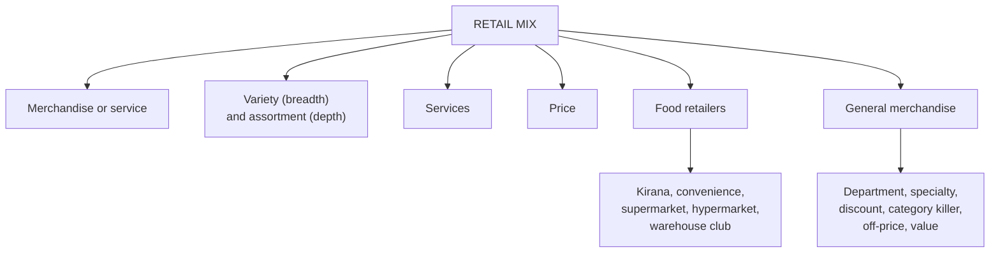

# MR-3: Classifying Retailers and Store Formats

Covers: the four-dimension retail mix, the three broad retailer families, the classification tree, the food and general merchandise format tables, off-price retailing, and brand-model outlet types. **(syllabus)**

## Where this fits in the ESE

A reliable 10-mark question: "Classify retailers and explain the main store formats" or "Differentiate department store, specialty store and discount store". 5-mark versions: "Retail mix", "Supermarket vs hypermarket", "Off-price retailers". In the case, you will often be asked to classify a firm: do it along all four dimensions.

## The retail mix: four classification dimensions (syllabus)

1. **Type of merchandise or service:** the core category sold.
2. **Variety and assortment:** **variety = breadth** (number of categories); **assortment = depth** (items within a category); **SKU** = each distinct item tracked.
3. **Services offered:** level and range of customer services (credit, delivery, personal shopping, installation).
4. **Price of merchandise:** the price positioning that targets a chosen segment.

Classification always uses all four. The same label, say "specialty store", can sit in very different positions on variety, assortment and price.

(textbook) Do not confuse this "retail mix" (classification basis) with the marketing-style retail mix in Unit 2 (merchandise variety, layout, pricing, service used to attract customers). The words are the same; the use differs. Unit 2 (MA-1) defines the second sense.

## Three broad categories and the tree (syllabus)

| Family | Contains |
|---|---|
| A. Food retailers | supermarkets, supercentres, hypermarkets, warehouse clubs, cash and carry, convenience stores |
| B. General merchandise | department, discount, specialty, drugstores, category specialists, extreme-value, off-price |
| C. Service retailers | firms that primarily sell services (MR-4) |

Tree on the slide: **Store retailers** (food, general merchandise, service); **Ownership** (single store, corporate chain; the later ownership slide adds franchise); **Non-store retailers** (online, mobile commerce, direct selling, social commerce).

## Food retailers (syllabus)

| Type | Size (sq. ft.) | Assortment | Pricing | Target | Indian examples |
|---|---|---|---|---|---|
| Kirana, mom-and-pop | 100-1,000 | narrow but deep in daily essentials | moderate, negotiable, credit | local residents | local kirana stores |
| Convenience store | 500-3,000 | very narrow, fast-moving items | higher (convenience premium) | busy professionals, travellers, students | 24Seven, Reliance Smart Point, In and Out |
| Supermarket | 10,000-50,000 | wide: groceries, dairy, frozen, bakery, personal care | competitive, promotional | middle-income families | Reliance Fresh, More, Spencer's, Star Bazaar |
| Supercentre or hypermarket | 50,000-200,000+ | extremely wide: food, apparel, electronics, furniture | everyday low pricing (EDLP) via bulk buying | one-stop families | DMart, Reliance Smart Bazaar, Lulu Hypermarket |
| Warehouse club or cash and carry | 80,000-150,000 | moderate, bulk packs | very low via bulk purchasing | businesses, large families | Metro Cash and Carry, Reliance Market |

Global examples to add: 7-Eleven, Tesco, Walmart Supercenter, Carrefour, Costco, Sam's Club.

Store counts on the slides (selected, **[VERIFY]**): DMart 415; Vishal Mega Mart 696; Reliance Market 52 (cash and carry); Metro 31 (pioneered cash and carry in India).

## General merchandise retailers (syllabus)

| Type | Size (sq. ft.) | Assortment | Pricing | Indian examples |
|---|---|---|---|---|
| Department store | 50,000-200,000 | wide, moderate depth, by department | medium to premium | Shoppers Stop, Lifestyle, Central |
| Specialty store | 2,000-40,000 | narrow, very deep | moderate to premium | Croma, Tanishq, FirstCry, FabIndia |
| Discount store | 20,000-100,000 | wide, frequently bought goods | low via volume | DMart, Vishal Mega Mart, V-Mart |
| Category specialist (category killer) | 30,000-150,000 | very narrow, extremely deep | competitive via specialisation | Decathlon, Croma, IKEA India |
| Off-price retailer | 15,000-50,000 | changing, surplus and previous-season | deep discount, 20-60% lower | Brand Factory (historically), Max Fashion |
| Value retailer | 10,000-40,000 | moderate; essential apparel, home, footwear | very affordable | V-Mart, Reliance Trends, Max Fashion |

Global: Macy's, Apple Store, Sephora, Home Depot, Best Buy, TJ Maxx, Primark.

**Off-price (closeout) retailers (syllabus):** inconsistent assortment of brand-name goods at significant discounts off the manufacturer's suggested retail price (MSRP). Buying is opportunistic: overruns, cancelled orders, forecasting errors, excess inventory, closeouts and irregulars. They buy cheaply by forgoing advertising allowances, return privileges and delayed payments. **Closeouts** = end-of-season goods not used the next season; **irregulars** = goods with minor construction mistakes; **outlet or factory stores** = off-price stores owned by manufacturers or retailers.

**Retail types by brand and distribution model (slides):**

- **Mono or exclusive branded shops:** showrooms owned or franchised by a manufacturer; complete range of one brand, certified quality.
- **Multi-branded shops:** one product category, most available brands; customers are spoilt for choice.
- **Convergence outlets:** consumer electronics, communication and IT lines in one place; one-stop shop.
- **E-retailers:** online shopping, 24 × 7 access, saves time, secure transactions; widely used for electronics, health and wellness.

**Competitive landscape numbers (slides, [VERIFY]):** Titan 3,433 stores in 440 towns (February 2026); Aditya Birla fashion business 4,500+ stores; Pantaloons 400+ stores in 190 towns; Westside 300+ stores in 97 cities; Shoppers Stop 117; Lifestyle 107; Vijay Sales 160+; Crossword 120 stores in 40 cities; Star Bazaar 79 stores (a different slide says 72). Reliance Retail: 20,000 stores, 77.4 million sq. ft. (November 2025).

## Conflict note: formats and sizes

The slide set gives different size bands for the same format in different units. Unit 1 says supermarket 10,000-50,000 and department store 50,000-200,000 sq. ft.; the Unit 2 layout table says supermarket 10,000-30,000, hypermarket 50,000-100,000+ and department store 20,000-50,000. Quote the table from the unit being asked about. Kirana is 100-1,000 sq. ft. in the Unit 1 table and 200-1,000 in Unit 2.

## Worked example, laid out as an exam answer

**Question (5 marks).** A quick-commerce app sells groceries, dairy, snacks, personal care and small electronics from dark stores and delivers in minutes. Classify it.

1. **Test:** apply the four retail mix dimensions, then the tree.
2. **Apply** (the assumed numbers are illustrative: 10 categories with about 40 SKUs each, so about 400 SKUs against thousands in a hypermarket):

| Dimension | Position |
|---|---|
| Merchandise | mostly food and grocery, some general merchandise |
| Variety and assortment | moderate variety (about 10 categories), shallow depth (about 400 SKUs) |
| Services | delivery in minutes, no store browsing |
| Price | convenience premium plus promotions |

3. **Tree:** non-store retailer (online and mobile commerce), with a fulfilment network of small stores.
4. **Decision:** it sits between a convenience store and an e-retailer. **Interpretation:** it competes on time and place utility (MR-1), not on assortment depth, so its rivals are convenience stores and kirana, not hypermarkets. This is channel competition in the Unit 2 sense (MA-4).

## (textbook) Wheel of retailing

A new low-cost, low-service format enters and wins on price; over time it adds services and prices rise; this opens room for the next discount entrant. Use it to explain why discount stores drift upmarket. (textbook; covered in standard retailing texts such as Levy and Weitz) **[VERIFY page reference before citing]**

## Traps

- Confusing variety (breadth, categories) with assortment (depth, items per category).
- Calling a discount store "off-price". Discount stores sell current branded goods at low margins; off-price buys surplus opportunistically.
- Giving one size band for every unit. Quote the unit's own table.
- Forgetting that off-price retailers forgo return privileges and advertising allowances.

## What to remember

- Four dimensions: merchandise, variety and assortment, services, price.
- Variety = breadth, assortment = depth, SKU = each item.
- Food formats climb from kirana, convenience, supermarket, hypermarket, to warehouse club.
- Specialty is narrow and deep; category killer is very narrow and extremely deep; department store is wide and moderately deep.
- Off-price: opportunistic buying, no allowances, 20-60% below regular price.

## Concept map

## Flashcards
Q: What are the four dimensions of the retail mix used to classify retailers?
A: Type of merchandise or service, variety and assortment, services offered, and price.

Q: Define variety, assortment and SKU.
A: Variety is breadth (number of categories); assortment is depth (items within a category); SKU is each distinct item tracked.

Q: Which format combines a supermarket and a department store, and how does it price?
A: The supercentre or hypermarket, priced on everyday low pricing through bulk buying.

Q: Describe a category killer in one line.
A: A retailer that dominates one category at scale with a very narrow but extremely deep assortment, for example Decathlon or Croma.

Q: Why can off-price retailers sell 20-60% below regular price?
A: They buy opportunistically (overruns, closeouts, irregulars) and forgo advertising allowances, return privileges and delayed payments.

Q: Define closeouts and irregulars.
A: Closeouts are end-of-season goods not used in following seasons; irregulars are goods with minor construction mistakes.

Q: What are mono-branded and multi-branded retail shops?
A: Mono-branded shops are manufacturer-owned or franchised exclusive showrooms; multi-branded shops focus on one category and carry most available brands.

Q: Which Indian company pioneered the cash and carry model, and how many stores does the slide give?
A: Metro, with 31 stores across Mumbai, Kolkata, Delhi, Punjab, Hyderabad and Bengaluru.

## Sources
- Faculty deck RM Unit 1 (classification, food and general merchandise tables, off-price) and RM Notes
- Student notes: The Retail Mix Framework, Food Retailers, General Merchandise Retailers
- Previous node: [[Retail Management Unit 1 - MR-2 Retail in India and the World]]; next: [[Retail Management Unit 1 - MR-4 Service Retailing Non-Store and Merchandising]]
- [[Retail Management Unit 1 - Modern Retailing MOC (Node Map)]]
