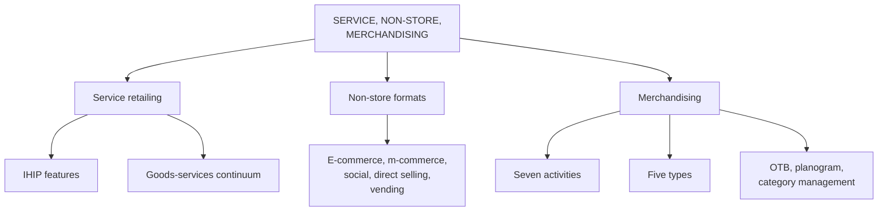

# MR-4: Service Retailing, Non-Store Formats and Merchandising

Covers: what service retailers are and the four features that set them apart, the goods-services continuum, non-store formats, and merchandising (definitions, activities, types, open-to-buy). **(syllabus)**

## Where this fits in the ESE

Typical 5-markers: "Four features of services (IHIP)", "Non-store retail formats", "Merchandising: meaning and activities". A 10-mark can combine: "Explain service retailing and the goods-services continuum". Open-to-buy gives a small numerical for the case.

## Service retailing (syllabus)

Service retailers primarily sell services rather than merchandise, a large and fast-growing part of retail.

- Some serve businesses as well as consumers: airlines, banks, hotels, insurance, express mail.
- Others are local with no national presence: lawyers, doctors.
- Banks, hospitals, spas, entertainment firms and universities increasingly adopt retailing principles as competition rises.

| Category | Offer | Indian examples |
|---|---|---|
| Healthcare | consultation, diagnosis, treatment | Apollo Hospitals, Fortis, Manipal |
| Banking and financial | savings, loans, investments, insurance | ICICI Bank, HDFC Bank, SBI |
| Hospitality | accommodation, food, conferences | Taj Hotels, ITC Hotels, Oberoi |
| Fitness and wellness | gym, yoga, training | Cult.fit, Gold's Gym India, Talwalkars |
| Home services | cleaning, plumbing, beauty, repair | Urban Company |
| Entertainment and streaming | movies, TV, music | JioHotstar, Sony LIV |

The slide extension also lists PVR INOX and MakeMyTrip.

### Four features distinguishing services from merchandise (syllabus)

1. **Intangibility:** cannot be seen, touched or held before purchase.
2. **Simultaneous production and consumption:** produced and consumed at the same time.
3. **Perishability:** cannot be stored; an empty seat or idle salon chair is lost revenue.
4. **Inconsistency:** quality varies from one delivery to the next.

(textbook) The usual mnemonic is IHIP (intangibility, heterogeneity, inseparability, perishability). The slide's "inconsistency" is heterogeneity and "simultaneous production and consumption" is inseparability. The extended services marketing mix adds People, Process and Physical evidence.

### Goods-services continuum (syllabus)

All retailers sell a mix. **Goods-dominant:** warehouse clubs, category specialists (merchandise sells itself). **Mixed:** supermarkets, department stores, optical centres. **Service-dominant:** restaurants, banks, universities.

## Non-store retail formats (syllabus)

Retailing without a traditional physical store.

| Format | Note | Example |
|---|---|---|
| E-commerce | web-based selling | Amazon, Flipkart |
| Mobile commerce | transactions through smartphone apps | Nykaa, Ajio |
| Social commerce | shopping through social platforms | Instagram Shops, Meesho |
| Direct selling | person-to-person outside a fixed location | Amway, Tupperware (global) |
| Vending machines | automated, low labour, location-flexible | |

India's direct selling industry: Rs. 22,142 crore (US$ 2.58 billion; the first slide says 2.57) in FY24, growth 4.4% year on year, five-year CAGR 7.15% (IDSA, **[VERIFY]**).

**Advantages:** lower fixed cost, wider reach, scalable, 24 × 7. **Limitations:** no sensory or tactile experience, high dependence on logistics, trust-building, and reputation risk for direct selling if not transparent.

## Merchandising (syllabus)

**Definition (slide):** the planning, purchasing, pricing, displaying, promoting and managing of products in a retail store to attract customers and maximise sales and profitability. In simple terms, the art and science of presenting the **right product, at the right place, at the right time, at the right price and in the right quantity** to encourage customers to buy.

Academic definitions on the slide: Nair (2025), *Retail Management*, 2nd ed.: planning and managing merchandise to satisfy customer needs while achieving sales and profit objectives. Pandian and Muthulakshmi (2025): selecting, procuring, displaying, pricing and promoting merchandise so as to maximise satisfaction and profitability.

**Seven activities (slide table):** merchandise planning, buying, assortment planning, pricing, display (visual merchandising), promotion, inventory management.

Pairing check: in the text extract of the slide table the explanations appear shifted by one row (for example "Assortment planning" next to "Purchasing products from suppliers"). The student note has the correct pairing, which is: planning = deciding what to sell; buying = purchasing from suppliers; assortment planning = selecting variety and depth; pricing = setting prices; display = arranging products attractively; promotion = advertising and sales promotion; inventory management = ensuring availability.
**Five types:** product (clothing in Lifestyle), retail (planning products for stores, Reliance Fresh), visual (Zara window displays), digital (Amazon recommendations), omnichannel (consistent presentation across store and app, Nike).

**Strategy examples (slides):** Apple minimalist interactive displays; IKEA room-like displays; DMart EDLP with efficient placement; Reliance Trends seasonal and festive display; Amazon AI recommendations; Nykaa personalised beauty recommendations.

### The planning machinery (RM Notes)

- **Open-to-buy (OTB):** how much a buyer may still purchase in a period without breaching the budget. **OTB = planned sales + planned markdowns + planned end-of-month stock − planned beginning-of-month stock − stock already on order.** Recalculated monthly or weekly.
- **Category management:** a "category captain" vendor shares sell-through data to help plan the category; the retailer stays the decision-maker.
- **Planogram:** a diagram of which SKU goes on which shelf, at what height, facing, depth; compliance audits matter (the notes say non-compliant stores can underperform by 10-15% in that category).
- **Assortment planning:** width against depth; SKU rationalisation ranks SKUs by contribution margin × velocity and cuts the bottom 10-20% each season.
- **Demand forecasting:** history, weather, festivals (Diwali demand planned 3-4 months ahead); speed of correction beats accuracy of prediction.
- **Markdown management:** planned cadence, for example 20% off at week 6 if sell-through is below a target.
- **Store clustering:** assortments tuned by store cluster (income, demography, climate).

Detail on these returns in Unit 4 (merchandise and product management).

## Worked example 1 (OTB), laid out as an exam answer

**Question (5 marks).** A buyer's monthly plan, all at retail value (illustrative): planned sales Rs. 40 lakh, planned markdowns Rs. 4 lakh, planned end-of-month stock Rs. 30 lakh, planned beginning-of-month stock Rs. 28 lakh, stock already on order Rs. 12 lakh. Find the open-to-buy.

1. **Formula (RM Notes):** OTB = sales + markdowns + planned EOM stock − BOM stock − on order.
2. **Compute:**

| Item | Rs. lakh |
|---|---|
| Planned sales | 40 |
| Planned markdowns | 4 |
| Planned EOM stock | 30 |
| Sub-total (stock needed) | 74 |
| Less BOM stock | (28) |
| Less on order | (12) |
| **OTB** | **34** |

3. **Decision:** the buyer may place orders worth Rs. 34 lakh at retail value. **Interpretation:** if the buyer commits Rs. 40 lakh in this category, the extra Rs. 6 lakh must be cut from another category or carried as inventory risk. Keep every term at the same valuation basis (retail), or the result is wrong.

## Worked example 2 (perishability), laid out as an exam answer

**Question (5 marks).** A salon has 6 chairs open 8 hours a day, each hour sold at Rs. 400, and sells 55% of capacity (illustrative). Quantify the cost of perishability and suggest a response.

1. **Capacity:** 6 × 8 = 48 chair-hours; potential revenue 48 × 400 = Rs. 19,200 a day.
2. **Actual:** 55% × 19,200 = Rs. 10,560; **lost: Rs. 8,640 a day**, which cannot be recovered because idle time cannot be stored.
3. **Response:** demand shaping, such as off-peak pricing and appointment slots. If utilisation reaches 70% (before any discount cost) revenue rises by Rs. 2,880 a day.
4. **Interpretation:** the perishable-capacity logic is why gyms, salons, hotels and airlines use off-peak and dynamic pricing. Discounts must be netted off against the extra volume.

## Traps

- Calling service retailers "not retailers". The slides treat them as the third family.
- Mixing up the slide's merchandising table columns (see above).
- Writing OTB with some terms at cost and others at retail.
- Treating direct selling as e-commerce. It is person-to-person selling outside a fixed location.

## What to remember

- Service features: intangibility, simultaneous production and consumption, perishability, inconsistency.
- Continuum: goods-dominant, mixed, service-dominant; every retailer has a service component.
- Non-store: e-commerce, mobile, social, direct selling, vending.
- Merchandising: right product, place, time, price, quantity; seven activities, five types.
- OTB = sales + markdowns + EOM stock − BOM stock − on order.

## Concept map

## Flashcards
Q: Name the four features that distinguish service from merchandise retailers.
A: Intangibility, simultaneous production and consumption, perishability, inconsistency.

Q: Place a supermarket, a warehouse club and a university on the goods-services continuum.
A: Supermarket is mixed, warehouse club is goods-dominant, university is service-dominant.

Q: List the non-store retail formats on the slide.
A: E-commerce, mobile commerce, social commerce, direct selling and vending machines.

Q: Give the slide's simple definition of merchandising.
A: The art and science of presenting the right product, at the right place, at the right time, at the right price and in the right quantity.

Q: List the seven activities of merchandising.
A: Merchandise planning, buying, assortment planning, pricing, display (visual merchandising), promotion, inventory management.

Q: Name the five types of merchandising.
A: Product, retail, visual, digital and omnichannel merchandising.

Q: Write the open-to-buy formula.
A: OTB = planned sales + planned markdowns + planned end-of-month stock − planned beginning-of-month stock − stock already on order.

Q: A buyer has sales 40, markdowns 4, EOM stock 30, BOM stock 28 and on-order 12 (Rs. lakh). What is OTB?
A: Rs. 34 lakh.

Q: What is a planogram?
A: A diagram specifying which SKU goes on which shelf, at what height, facing, and how many units deep.

## Sources
- Faculty deck RM Unit 1 (service retailers, non-store, merchandising) and RM Notes (service features, merchandising tables, OTB section)
- Student notes: Service Retailing, Non-Store Retail Formats, Merchandising Fundamentals
- Previous node: [[Retail Management Unit 1 - MR-3 Classifying Retailers and Store Formats]]; next: [[Retail Management Unit 1 - MR-5 Ownership Formats and Franchising]]
- [[Retail Management Unit 1 - Modern Retailing MOC (Node Map)]]
