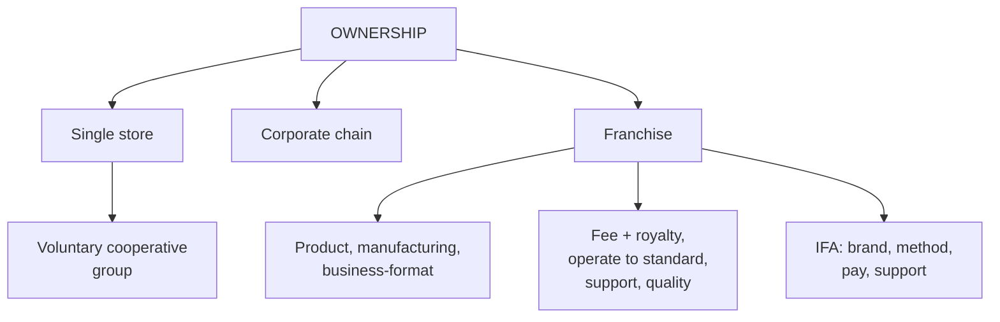

# MR-5: Ownership Formats and Franchising

Covers: classifying retailers by ownership (independent single store, corporate chain, franchise), the single store versus chain comparison table, and franchising in full: definition, history, contract, IFA definition, three types, advantages and limitations. **(syllabus)**

## Where this fits in the ESE

Strong 10-mark candidate: "Explain the ownership-based classification of retailers" or "What is franchising? Explain its types, advantages and limitations". The 11-row single store versus chain table is a ready 5-marker. In a case, the "which route to expand" question is almost always chain versus franchise.

## Three ownership classes (syllabus)

| Class | One-line definition |
|---|---|
| A. Independent, single store | one owner-managed outlet making the full range of retail decisions |
| B. Corporate chain | multiple units under common ownership with centralised decision-making |
| C. Franchise | a contract that licenses a proven business format to independent operators |

## Single store establishment (syllabus)

An independently owned retail outlet operating from one location; a single owner or family; serves a local market; decisions on merchandise, pricing and service are independent.

Characteristics: owner is an individual, family or sole proprietor; one store; independent and flexible decisions; low to moderate investment; assortment limited to local demand; highly personalised relationships; limited buying power; limited expansion because of financial and managerial constraints.

Advantages: personalised service, quick decisions, strong community relationships.

**Competing against chains:** some independents join a **wholesaler-sponsored voluntary cooperative group**, which gives a shared merchandising programme on a voluntary basis. They pool buying power and keep their ownership independence.

Indian examples: local kirana store, independent pharmacy, local bakery, family textile shop, stationery store, independent bookstore, boutique.

## Corporate chain (syllabus)

Two or more stores owned and managed by one company, under the same brand, following standardised policies for purchasing, pricing, merchandising and customer service. Ranges from a two-store drugstore to giants such as Walmart, Target and JCPenney.

Characteristics: single corporation; multiple outlets; centralised decisions; high investment; standardised assortment with some local adaptation; very high buying power; uniform brand; national and international expansion.

Benefits: standardisation, strong branding, economies of scale.

Examples on the slides: DMart, Starbucks, Apollo Pharmacy, IKEA, Decathlon, Reliance Retail, Domino's, McDonald's.

## Single store versus corporate chain (syllabus table)

| Basis | Single store | Corporate chain |
|---|---|---|
| Ownership | individual or family | corporation |
| Number of stores | one | multiple |
| Management | independent | centralised |
| Decision making | quick and flexible | standardised and centralised |
| Capital investment | low | high |
| Product assortment | limited, locally selected | broad and standardised |
| Buying power | low | high (bulk purchasing) |
| Brand recognition | local | national or international |
| Customer service | highly personalised | standardised but professional |
| Expansion | limited | high growth potential |
| Technology adoption | basic | advanced (ERP, CRM, AI, POS) |

## Franchising (syllabus)

**Definition:** a method of doing business through a contractual agreement between two parties for the marketing and distribution of products and services. The **franchisor** is the provider; the **franchisee** pays for and operates a business using the franchisor's name, product and business format. It combines the advantages of owner-managed businesses with the efficiencies of a centralised chain.

**History:** 1850s, Singer Sewing Machine sold sales rights to independent entrepreneurs to raise capital; 1970s, McDonald's became one of the first to sell franchises internationally.

**How the contract works (four steps):**

1. **Fee plus royalty:** a lump sum plus a royalty on all sales for the right to operate in a specific location.
2. **Operate to standard:** the outlet is run strictly to the franchisor's procedures.
3. **Franchisor support:** locating and building the store, developing products, training managers, advertising.
4. **Consistent quality:** every outlet delivers the same products and service.

**IFA definition (International Franchise Association):** a licence between two independent parties giving the franchisee the **right to the brand** (trademark or trade name) and the **right to the method** (operating methods), with an **obligation to pay** fees, while the franchisor has an **obligation to support**.

**Three types:**

| Type | Meaning |
|---|---|
| Product franchise | manufacturers control how retailers distribute their products; retailers use the name and trademark and pay fees or buy a minimum quantity |
| Manufacturing franchise | the franchisor lets a manufacturer produce and sell goods under its name and trademark; common in food and beverage |
| Business-format franchise | a company supplies independent owners with a complete, established business including name and trademark; the most common modern model (fast food, retail chains) |

| Advantages | Limitations |
|---|---|
| easy start of business | franchise costs and ongoing fees |
| continuous support: training, campaigns, marketing | lack of creativity, excessive control |
| ready-made business relationships | operating restrictions set by the franchisor |
| increased purchasing power | |
| lower failure rate | |
| built-in credibility, goodwill, recognition | |

(textbook) Franchising gives the franchisor capital-light growth and gives the franchisee a proven format. The cost is control: the franchisor must police quality in outlets it does not own.

## Worked example, laid out as an exam answer

**Question (10 marks, numerical core).** A family supermarket (single store, Rs. 6 crore sales) wants four more outlets. Option A: open four company-owned stores at an illustrative Rs. 1.5 crore each. Option B: franchise four outlets, each franchisee paying a Rs. 10 lakh fee plus a 5% royalty on sales, expected sales Rs. 2 crore a store a year (all illustrative). Compare.

1. **Option A (chain):** capital = 4 × Rs. 1.5 crore = Rs. 6 crore of the owner's money; full control; full profit and full risk.
2. **Option B (franchise):** the owner invests no store capital. Fees = 4 × Rs. 10 lakh = Rs. 40 lakh once; royalty = 4 × 5% × Rs. 2 crore = Rs. 40 lakh a year.

| Item | Franchisor income |
|---|---|
| Year 1 | Rs. 40 lakh fee + Rs. 40 lakh royalty = Rs. 80 lakh |
| 3 years | Rs. 40 lakh + 3 × Rs. 40 lakh = Rs. 1.6 crore |

   For one franchisee, the 3-year cost of the franchise is Rs. 10 lakh + 3 × Rs. 10 lakh royalty = Rs. 40 lakh.
3. **Decision:** choose by objective. **Interpretation:** Option A keeps all margin and quality control but ties up Rs. 6 crore and management time; Option B reaches four towns almost without capital but earns only fee and royalty and risks quality drift in outlets the owner does not run. For a family firm with limited capital and no chain management team, franchising (business-format) is the stronger fit; the royalty income does not recover Rs. 6 crore quickly, so the brand and systems must already be proven.

## Traps

- Calling franchising a type of corporate chain. It is a separate ownership model with independent owners.
- Confusing the three types: product (distribution), manufacturing (produce and sell), business format (whole business).
- Writing the royalty as one-off. It is a percentage of sales; the lump sum is the fee.
- McDonald's and Domino's appear on the slide's corporate chain list, and McDonald's is also the franchising example. A brand can run company-owned and franchised outlets, so classify by who owns the outlet **[VERIFY ownership mix for the Indian outlets]**.
- Omitting the voluntary cooperative group when asked how small independents compete with chains.

## What to remember

- Three ownership classes: single store, corporate chain, franchise.
- Single store: quick, personal, low capital, limited buying power; joins a wholesaler-sponsored voluntary cooperative group to compete.
- Chain: centralised, standardised, high capital, economies of scale.
- Franchise = brand plus method for a fee plus royalty, with franchisor support.
- Business-format franchise is the most common type; the main limit is control and fees.

## Concept map

## Flashcards
Q: Define a single store establishment.
A: An independently owned retail outlet operating from one location under a single owner or family, making independent decisions on merchandise, pricing and service.

Q: How can an independent retailer compete with chains, according to the slides?
A: By joining a wholesaler-sponsored voluntary cooperative group that provides a shared merchandising programme.

Q: Define a corporate retail chain.
A: Two or more stores owned and managed by one company under the same brand with standardised purchasing, pricing, merchandising and service policies.

Q: Name the three benefits of a corporate chain.
A: Standardisation, strong branding and economies of scale.

Q: Define franchising and name the two parties.
A: A contractual agreement for marketing and distribution in which the franchisee pays for and operates a business under the franchisor's name, product and format.

Q: State the IFA definition in its four parts.
A: Right to the brand, right to the method, obligation to pay fees, and obligation of the franchisor to support.

Q: Name the three types of franchising.
A: Product franchise, manufacturing franchise and business-format franchise.

Q: List two limitations of franchising.
A: Franchise costs and ongoing fees; lack of creativity and excessive control or operating restrictions.

Q: In the Option B example, what is the franchisor's year-1 income?
A: Rs. 80 lakh (Rs. 40 lakh in fees plus Rs. 40 lakh in royalty); illustrative figures.

## Sources
- Faculty deck RM Unit 1 (ownership slides) and RM Notes (comparison table, IFA definition, franchise types)
- Student notes: Single Store Establishment, Corporate Retail Chain, Franchising
- Previous node: [[Retail Management Unit 1 - MR-4 Service Retailing Non-Store and Merchandising]]; next: [[Retail Management Unit 1 - MR-6 Multichannel and Omnichannel Retailing]]
- [[Retail Management Unit 1 - Modern Retailing MOC (Node Map)]]
