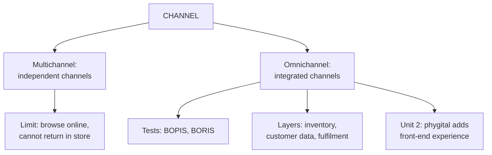

# MR-6: Multichannel and Omnichannel Retailing

Covers: what a channel is, multichannel and omnichannel definitions, the comparison table, real examples, the BOPIS and BORIS tests, and the three layers of integration. **(syllabus)** The phygital refinement is in Unit 2 (MA-7).

## Where this fits in the ESE

Almost certain 5-marker: "Differentiate multichannel and omnichannel retailing" (the five-row table is the answer). It also supports the digital paragraph of any case and links to the Unit 2 question "Omnichannel vs phygital".

## What is a channel (syllabus)

A **channel** is a medium through which retailers sell products or communicate with customers: physical store, website, mobile application, social media, telephone or call centre, catalogue, marketplace (Amazon, Flipkart).

## Multichannel retailing (syllabus)

**Definition:** a retail strategy in which a retailer sells through **two or more independent channels**, letting customers interact through different platforms such as stores, websites, apps, social media, catalogues or call centres. It increases convenience and market reach (Nair, 2025, as cited on the slide).

Channels are largely **independent**: separate inventory, sometimes separate pricing and promotions, an experience that differs by channel. Classic limitation: a customer browses online but cannot return the product in the store.

Presence table on the slide (store, website, app, social media all ticked): Reliance Trends, Nykaa, Croma, Nike, Apple, IKEA. The extension slide also lists Reliance Digital.

## Omnichannel retailing (syllabus)

**Definition:** a retail strategy in which **all sales channels are fully integrated**, giving a seamless and consistent experience across stores, websites, apps, social media and call centres, with **customer information, inventory, pricing, promotions and services synchronised**.

| Company | Omnichannel features on the slide |
|---|---|
| Apple | stores, website, app, synchronised accounts, in-store pickup, Genius Bar support |
| Nike | app, website, stores, membership, personalised offers, store pickup |
| Nykaa | app, website, stores, loyalty, synchronised promotions and purchase history |
| Reliance Retail | physical stores, JioMart app, website, home delivery, unified promotions |
| IKEA | website, app, stores, click-and-collect, home delivery |
| Target | online shopping, curbside pickup, in-store returns, app integration |

## Multichannel versus omnichannel (syllabus table; give this in the exam)

| Basis | Multichannel | Omnichannel |
|---|---|---|
| Definition | uses multiple sales channels | integrates all channels into one seamless experience |
| Channel integration | limited or partial | fully integrated |
| Customer experience | may differ across channels | consistent across every channel |
| Inventory | often managed separately | unified inventory system |
| Example | browses online but cannot return in store (slide variant: different offers online and offline) | buys online, picks up in store, returns through the mobile app |

## Beyond the slides (student notes and textbook)

- **BOPIS** (buy online, pick up in store) and **BORIS** (buy online, return in store) are the most common tangible tests of omnichannel maturity.
- Genuine omnichannel needs three layers together: **unified inventory** (one source of truth for stock), **unified customer data** (single customer view), **unified fulfilment** (any channel can serve any order). Under-investment in one breaks the "seamless" promise.
- Omnichannel is a backend integration achievement, not a front-end feature. Many retailers start with multichannel (a website beside the stores) and later invest in the harder backend work.
- Slide context for India: omnichannel business could grow five times, to US$ 55 billion by 2027, from about US$ 11 billion; over 60% of national brands use one form or another **[VERIFY]**. (Check: 55 ÷ 11 = 5.0, so the "five times" statement is consistent.)

## Worked example, laid out as an exam answer

**Question (5 marks).** "Lakeside Home (fictional)" has stores, a website and an app. Online prices differ from store prices; stock is held separately; online orders cannot be returned in store; the loyalty account works only on the app; store pickup is available. Classify it.

1. **Test:** apply five integration checks (a revision device, not a textbook standard): one inventory, one price and promotion set, return across channels, one customer record, any channel can fulfil.
2. **Apply:**

| Check | Result |
|---|---|
| Unified inventory | No |
| Same price and promotions | No |
| Cross-channel returns (BORIS) | No |
| Single customer record | No (app only) |
| Cross-channel fulfilment (store pickup) | Yes, BOPIS only |

   Score: 1 of 5.
3. **Decision:** Lakeside Home is a **multichannel** retailer. **Interpretation:** it has channel presence but not integration. It should first unify inventory and customer data, then align prices and returns. Until then a customer who buys online and wants to return in store has a broken experience, which is the textbook multichannel limitation.

## Traps

- Saying omnichannel simply means "more channels". It means integrated channels.
- Treating one feature (a click-and-collect option) as proof of omnichannel.
- Mixing up with phygital. Omnichannel is about backend integration; phygital (Unit 2) is about front-end blending of physical and digital experience.
- Writing only definitions. The table rows and the example carry the marks.

## What to remember

- Channel = medium for selling or communicating.
- Multichannel = multiple independent channels; separate inventory and experience.
- Omnichannel = integrated channels; synchronised customer data, inventory, prices, promotions, services.
- Slide example pair: browse online, cannot return in store (multi) versus buy online, pick up in store, return through the app (omni).
- Three layers: unified inventory, customer data, fulfilment.

## Concept map

## Flashcards
Q: What is a channel in retailing?
A: A medium through which retailers sell products or communicate with customers, such as a store, website, app, social media, call centre, catalogue or marketplace.

Q: Define multichannel retailing.
A: Selling through two or more independent channels, usually with separate inventory and sometimes separate pricing and experience.

Q: Define omnichannel retailing.
A: Fully integrated channels giving a seamless, consistent experience, with customer information, inventory, pricing, promotions and services synchronised.

Q: Give the slide's example of a multichannel limitation.
A: A customer browses online but cannot return the product in the store.

Q: Give the slide's example of omnichannel.
A: A customer buys online, picks up in store and returns through the mobile app.

Q: What do BOPIS and BORIS stand for?
A: Buy online, pick up in store; buy online, return in store.

Q: Name the three layers needed for genuine omnichannel.
A: Unified inventory, unified customer data and unified fulfilment.

Q: Which Indian retailer's omnichannel features on the slide include the JioMart app?
A: Reliance Retail.

## Sources
- Faculty deck RM Unit 1 (multichannel and omnichannel slides) and RM Notes (comparison table)
- Student notes: Multichannel Retailing, Omnichannel Retailing
- Previous node: [[Retail Management Unit 1 - MR-5 Ownership Formats and Franchising]]; next: [[Retail Management Unit 1 - MR-7 Unit 1 Exam Answers]]
- [[Retail Management Unit 1 - Modern Retailing MOC (Node Map)]]
