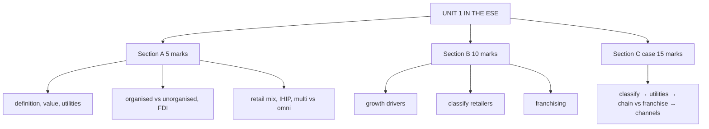

# MR-7: Unit 1 Exam Answers

Covers: what the ESE is likely to ask from Unit 1, 5-mark and 10-mark skeletons, and a 15-mark case layout with a model answer. Numbers come from MR-1 to MR-6.

## What the test will ask

Assumed pattern, copied from Bond Market because no course plan exists for Retail Management: 50 marks, Section A 3 × 5 (internal choice), Section B 2 × 10 (internal choice), Section C one compulsory 15-mark case. Unit 1 is almost all theory, so the marks go to structure: definition first, a table, an Indian example, a closing line. Only small numerical pieces appear (CAGR in MR-2, franchise fees in MR-5, OTB in MR-4). **[VERIFY with faculty if the paper pattern differs.]**

## Five-mark answer skeletons

**1. Define retailing and explain its scope (MR-1).** Kotler definition, Old French origin, the who/how/where table, closing rule "if the buyer is a final consumer it is retailing".

**2. Five ways retailers add value, or four utilities (MR-1).** Five items with one example each; or utilities table with the retail lever.

**3. Organised vs unorganised retail in India (MR-2).** Eight-row table (registration, ownership, management, format, operations, technology, share, examples); close with kirana as partner.

**4. FDI policy in Indian retail (MR-2).** Table: 100% automatic for single-brand and wholesale cash and carry, 51% approval for multi-brand; five benefits; one-line VERIFY on the approval route.

**5. Retail mix (MR-3).** Four dimensions, variety versus assortment versus SKU, one example classification.

**6. Four features of services (MR-4).** Intangibility, simultaneous production and consumption, perishability, inconsistency; one retail example each; the salon capacity example.

**7. Single store vs corporate chain (MR-5).** Take six to eight rows of the table; add the voluntary cooperative group line.

**8. Multichannel vs omnichannel (MR-6).** Five-row table plus the two slide examples.

**9. Merchandising and open-to-buy (MR-4).** Slide definition, seven activities, OTB formula and the Rs. 34 lakh example.

## Ten-mark answer skeletons

**A. Growth drivers of Indian retail (MR-2).** Opening line on India's scale → Advantage India four pillars → six drivers (RM Notes list) with one fact each → FDI policy → challenges (unorganised dominance, unsecured credit stress is on the slides, logistics) → conclusion on the phase India is in. 

**B. Classify retailers and explain the main store formats (MR-3, MR-4, MR-5).** Retail mix four dimensions → three families (food, general merchandise, service) → one comparison table of three formats each → non-store → ownership in one line → example.

**C. Franchising: meaning, types, advantages, limitations (MR-5).** Definition and parties → history line → four-step contract → IFA definition → three types → advantages and limitations table → when to franchise rather than own.

**D. Retail management and the retailer's place in the channel (MR-1).** Definition → scope table → channel chain → five ways of adding value → utilities → functions (core and support) → significance.

**E. Multichannel to omnichannel (MR-6, plus MA-7 if the question says phygital).** Channel definition → multichannel with limits → omnichannel with BOPIS and BORIS → table → three integration layers → Indian examples (Nykaa, Reliance Retail) → recommendation.

## Fifteen-mark case layout (Unit 1 case)

1. **Classify the retailer (3):** retail mix four dimensions, plus ownership class.
2. **Value and utilities (3):** which of the five ways of adding value and four utilities the firm wins and concedes.
3. **Expansion route (5):** chain versus franchise, with the numbers.
4. **Channel strategy (4):** diagnose multichannel versus omnichannel, then give a step plan.

### Case (illustrative, fictional)

"Hilltop Bazaar (fictional)" is a family-owned supermarket in a tier-2 town, annual sales Rs. 6 crore. It stocks 8 categories with about 150 SKUs each, prices on weekly promotions, offers home delivery for regular customers and credit to known families. Orders arrive by phone, and the owners recently added a basic website whose stock list is not linked to the store. They want four more outlets in nearby towns. Option A: four company-owned stores at about Rs. 1.5 crore each. Option B: franchise four outlets, each paying Rs. 10 lakh and a 5% royalty on expected sales of Rs. 2 crore a year.

### Model answer, laid out as the exam answer

1. **Classification (3):**

| Dimension | Hilltop Bazaar |
|---|---|
| Merchandise | food and grocery |
| Variety / assortment | variety 8 categories, assortment about 150 SKUs each, so about 1,200 SKUs (8 × 150) |
| Services | home delivery, credit |
| Price | promotional pricing, mid-market |

   Family: **food retailer, supermarket** (size and breadth of range fit). Ownership: **independent single store**. Channels: multichannel at best.

2. **Value and utilities (3):** it adds value through assortment, bulk breaking and services (credit, delivery). It wins **possession utility** (credit) and **time and place utility** locally (delivery). It concedes breadth of assortment to hypermarkets and speed to quick-commerce. **Interpretation:** the owners' strength is trust and service, which the slides recognise in kirana-style outlets, so growth should replicate trust, not just shelf space.

3. **Expansion (5):**
   - Option A needs 4 × Rs. 1.5 crore = **Rs. 6 crore**, equal to a full year of today's sales, plus management it does not yet have.
   - Option B needs no store capital. Franchisor income: year 1 = Rs. 40 lakh fees + Rs. 40 lakh royalty (4 × 5% × Rs. 2 crore) = **Rs. 80 lakh**; over 3 years = **Rs. 1.6 crore**. Each franchisee pays about Rs. 40 lakh over 3 years.
   - **Decision:** franchise the format (business-format franchise) once the operating manual, supplier terms and brand are proven in the home store; keep one or two company stores as the benchmark. **Interpretation:** Option B grows faster with the owners' limited capital, but income is only fee plus royalty and quality control is harder; Option A earns full margin but is infeasible on the owners' capital.

4. **Channel strategy (4):** today it is **multichannel**, with one clear gap: the website stock list is not linked to the store (no unified inventory). Steps: (i) link the website to store stock, (ii) one customer record across phone, web and store, (iii) same price and promotions, (iv) offer BOPIS then BORIS. **Interpretation:** the aim is omnichannel integration in the backend before spending on new channels. Do not add social commerce until inventory is unified.

5. **Close (one line):** *the figures are illustrative; actual royalty, capex and sales would need market data, and the franchise route depends on a proven format.*

## Time rule

Do the numerical piece and the table first (they carry the marks), then the interpretation sentence. In 10-markers, spend the first minute on the skeleton, not on the definition.

## What to remember

- Unit 1 is theory-heavy; answer structure is definition, table, Indian example, closing line.
- Easy 5-markers: retailing and scope, value and utilities, organised vs unorganised, FDI, retail mix, IHIP, single vs chain, multi vs omni.
- 10-mark favourites: growth drivers, classification of retailers, franchising.
- Case: classify, utilities, chain versus franchise with fees, channel integration.
- Franchise example: Rs. 6 crore capex versus Rs. 80 lakh year-1 franchisor income.

## Concept map

## Flashcards
Q: What is the layout for the Unit 1 case?
A: Classify the retailer on the four retail mix dimensions and ownership; analyse value and utilities; compare chain and franchise with numbers; diagnose multichannel or omnichannel and give steps.

Q: What are the three most likely 10-mark topics from Unit 1?
A: Growth drivers of Indian retail, classification of retailers and store formats, and franchising.

Q: In the Hilltop case, what does Option A cost?
A: Rs. 6 crore (4 stores at Rs. 1.5 crore each, illustrative).

Q: In the Hilltop case, what is the franchisor's year-1 income under Option B?
A: Rs. 80 lakh (Rs. 40 lakh fees plus Rs. 40 lakh royalty).

Q: What closes every answer for full marks?
A: A decision line with an interpretation, and a one-line caveat that the figures are illustrative.

Q: Which Unit 1 numerical formula is the easiest to forget?
A: Open-to-buy: planned sales plus markdowns plus end-of-month stock minus beginning stock minus stock on order.

## Sources
- Assumed ESE pattern (no course plan supplied for Retail Management) and nodes MR-1 to MR-6
- [[Retail Management Unit 1 - Modern Retailing MOC (Node Map)]]
