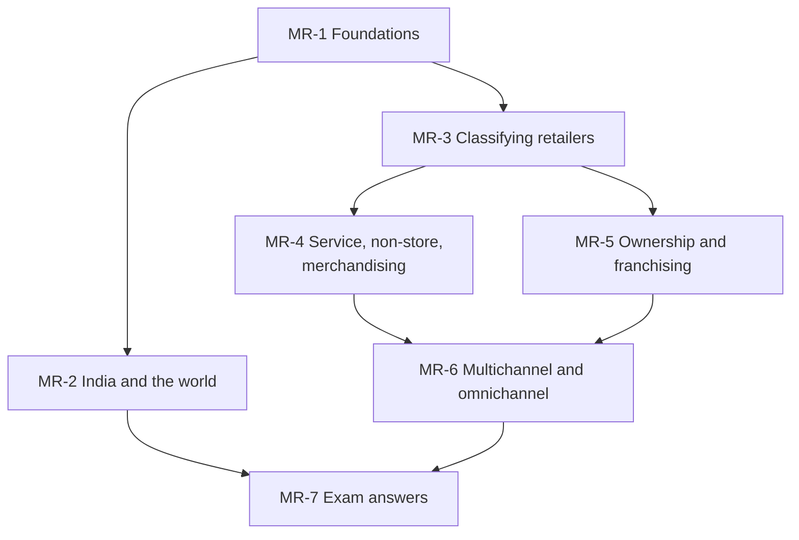

# Retail Management Unit 1: Introduction to Modern Retailing, node map

ESE (assumed, copied from Bond Market because no course plan exists): 50 marks, Section A 3 × 5, Section B 2 × 10, Section C one compulsory 15-mark question. Unit 1 is theory-heavy with small numerical pieces (CAGR, franchise fees, open-to-buy). Tags in the nodes: (syllabus) for slide and student-note content, (textbook) for additions. Indian company facts come from the faculty slides dated February 2026 and carry **[VERIFY]**; case firms are fictional and illustrative.

## Nodes

| Node | Topic | Deps | Minutes | Exam focus |
|---|---|---|---|---|
| MR-1 | Retailing Foundations | none | 30 | yes |
| MR-2 | Retail in India and the World | MR-1 | 40 | yes |
| MR-3 | Classifying Retailers and Store Formats | MR-1 | 40 | yes |
| MR-4 | Service Retailing, Non-Store and Merchandising | MR-3 | 35 | yes |
| MR-5 | Ownership Formats and Franchising | MR-3 | 30 | yes |
| MR-6 | Multichannel and Omnichannel Retailing | MR-4, MR-5 | 25 | yes |
| MR-7 | Unit 1 Exam Answers | MR-1 to MR-6 | 25 | yes |

Total reading time: about 225 minutes.

## Dependency graph

## Key frameworks

- Retailing: sale to a final consumer for personal, non-business use; scope = who, how, where.
- Five ways of adding value and four utilities (form, time, place, possession).
- Retail mix: merchandise, variety (breadth) and assortment (depth), services, price.
- Three families: food, general merchandise, service. Non-store: online, mobile, social, direct selling, vending.
- Ownership: single store, corporate chain, franchise (product, manufacturing, business-format).
- Multichannel (independent channels) versus omnichannel (integrated channels).
- India: four eras, Advantage India (four pillars), six growth drivers, FDI 100% single-brand and 51% multi-brand, unorganised sector more than 90%.

## Headline numbers and facts to know

- CAGR from US$ 1,093.89 billion (2025) to US$ 2,361.11 billion: 8.0% over 10 years (2035F), 16.6% over 5 years (2030). The slides label both horizons; prefer 2035F and say so.
- Franchise example (illustrative): four company stores need Rs. 6 crore; four franchisees pay Rs. 80 lakh in year 1 (Rs. 40 lakh fees plus Rs. 40 lakh royalty), Rs. 1.6 crore over 3 years.
- OTB example: 40 + 4 + 30 − 28 − 12 = Rs. 34 lakh.
- Salon perishability example: Rs. 8,640 lost per day at 55% utilisation.
- Slide conflicts to know: India's retail rank (5 versus third largest), cumulative retail FDI (Rs. 41,645 crore versus Rs. 36,241.37 crore), IKEA investment (three figures), organised share (more than 90% unorganised versus 81% traditional plus 8% e-commerce), store size bands that differ between Unit 1 and Unit 2.

## Links
- [[Retail Management MOC]]
- [[Retail Management Unit 2 - Market Analysis MOC (Node Map)]]
