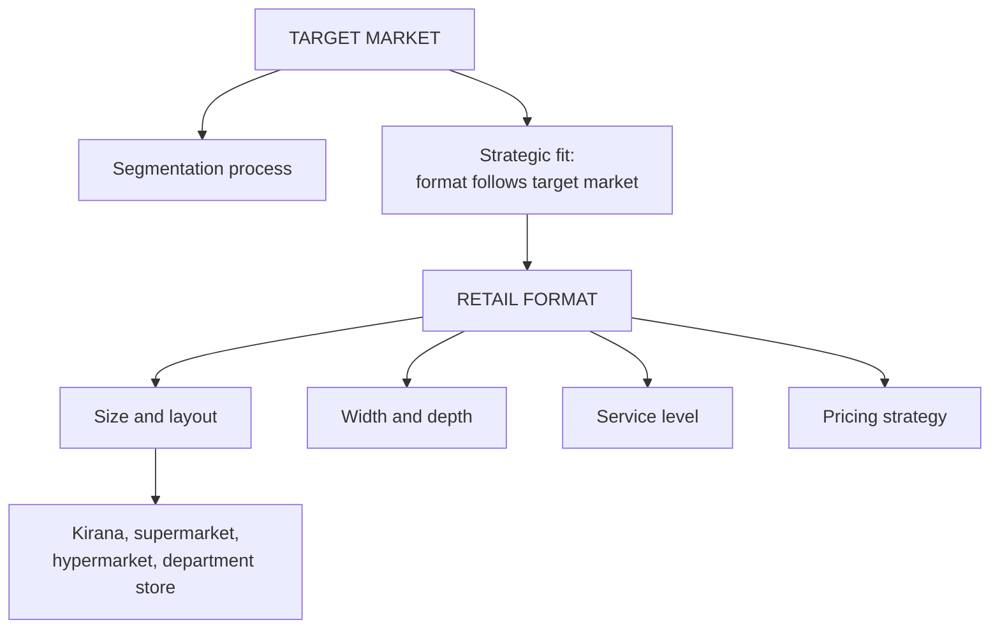

# MA-1: Target Market, Segmentation and Retail Formats

Covers: target market and market segmentation, retail format and the retail mix (marketing sense), the target-market-to-format fit tables, company examples, and the four characteristics that define a format (size and layout, width and depth, service level, pricing). **(syllabus)**

## Where this fits in the ESE

Assumed pattern: 50 marks, 3 × 5, 2 × 10, one 15-mark case. This node gives the standard 5-markers "Define target market and segmentation" and "Retail format and the four characteristics that define it", and the decision logic for a case ("which format for this customer?"). The principle to quote: **format follows target market, not the reverse.**

## Definitions (syllabus)

- **Target market:** a specific group of consumers a retailer aims to serve, characterised by shared needs, preferences or behaviours that distinguish them from the broader market.
- **Market segmentation:** the process of dividing a broad consumer or business market, normally consisting of existing and potential customers, into sub-groups based on some type of shared characteristics.
- **Retail format:** the nature of the retailer's operations, including the mix of merchandise and services, pricing strategy, store design, location and customer service; the way a retailer presents itself to the target market. Analogy: fine dining, fast food, street food. A "blueprint" or "template".
- **Retail mix (marketing sense):** the combination of merchandise variety, store layout, pricing and customer service used to attract and satisfy customers. (Unit 1's retail mix, MR-3, is a classification basis. Same words, different use.)

(textbook) Common bases for segmentation: geographic, demographic (age, income, family), psychographic (lifestyle, values) and behavioural (usage, loyalty). The slides give no list of bases, so name them as textbook background.

The slide heading says "the three main categories of retail formats" but lists five: department stores, specialty stores, supermarkets, convenience stores and online retailing. Write five.

## Target market to format (syllabus table)

| Target market | Customer characteristics | Suitable format | Examples |
|---|---|---|---|
| Mass market | all income groups, everyday needs | supermarket, hypermarket, discount store | DMart, Reliance Smart, More |
| Premium market | high-income, quality and exclusivity | specialty store, luxury boutique, premium department store | Apple Store, Sephora, Gucci |
| Budget-conscious | price-sensitive | discount store, factory outlet | DMart, Brand Factory |
| Convenience seekers | quick purchases | convenience store, kirana | 7-Eleven, SPAR Express, local kirana |
| Family shoppers | groceries and household items | hypermarket, warehouse club | Reliance Smart Bazaar, Lulu Hypermarket |
| Young adults and students | trend-conscious, technology-oriented | specialty, fast fashion, online | Zara, H&M, Myntra |
| Children | parents shopping for kids | toy store, children's specialty | Hamleys, FirstCry |
| Health-conscious | organic and healthy products | organic store, pharmacy, health store | Nature's Basket, Organic World |
| Business customers (B2B) | bulk purchases | cash and carry, wholesale club | Metro Wholesale |
| Rural consumers | value-focused, limited accessibility | rural retail stores, cooperatives, mobile retail vans | ITC Choupal Sagar, Rural Mart |
| Online shoppers | digital shopping, home delivery | e-commerce, omnichannel | Amazon, Flipkart, Nykaa |
| Fashion enthusiasts | latest apparel and accessories | specialty fashion, department store | Lifestyle, Pantaloons, Shoppers Stop |

## Format to best target market (syllabus)

Supermarket: families, mass market. Hypermarket: mass market, family shoppers. Department store: middle and upper-middle income. Specialty store: niche and premium. Convenience store: busy urban consumers. Discount store: price-sensitive. Factory outlet: bargain hunters. E-commerce: tech-savvy and convenience seekers. Cash and carry: business customers. Luxury boutique: high-income.

## Company-level examples (syllabus)

| Company | Target market | Format |
|---|---|---|
| Walmart | families, price-conscious | hypermarket, supercentre, discount, e-commerce |
| Amazon | online shoppers of all incomes | e-commerce marketplace |
| IKEA | homeowners, families, students | specialty furniture, large warehouse store |
| Costco | families, small businesses, bulk buyers | membership warehouse club |
| Zara | fashion-conscious young adults | specialty fashion, online |
| H&M | budget-conscious fashion shoppers | specialty apparel, online |
| Apple | premium, technology-focused | brand-owned specialty, online |
| Reliance Retail | Indian families, urban and rural | supermarket, hypermarket, convenience, fashion, e-commerce |
| DMart | middle-income, value-conscious families | hypermarket and supermarket |
| Decathlon | sports enthusiasts, students, fitness | specialty sporting goods, online |
| Starbucks | students, professionals, coffee lovers | coffeehouse chain (specialty retail) |
| Nykaa | beauty and personal care | omnichannel (online plus physical) |

**Pairing check:** in the text extract of the slide the last four rows are shifted (DMart appears against "Specialty Sporting Goods Store", Decathlon against "Coffeehouse Chain"). The table above restores the evident row order, and it matches the student note and common sense. Quote this version.

## Four characteristics that define a format (syllabus)

**1. Size and layout** (Unit 2 slide bands):

| Format | Size (sq. ft.) | Layout | Objective |
|---|---|---|---|
| Kirana or convenience | 200-1,000 | counter service, high-density shelf | space use, quick transactions |
| Supermarket | 10,000-30,000 | grid | shelf exposure, streamline high-volume traffic |
| Hypermarket | 50,000-100,000+ | modified grid or loop | guide shoppers across categories |
| Department store | 20,000-50,000 | free-flow or boutique | leisurely exploration, brand visibility, impulse buys |

**2. Product range (width and depth):** specialty store: narrow and deep (Croma, Decathlon); hypermarket: very broad, moderate depth; category killer: moderately narrow, extremely deep (IKEA in home furnishings); convenience store: broad, shallow (In and Out, Freshpik).

**3. Customer service:** self-service (DMart, Aldi: clear signage, self-checkout); assisted self-service (Croma, Landmark Books: staff for technical questions); full or personalised service (luxury boutiques: styling, shopping assistance, post-purchase support).

**4. Pricing and value proposition:** discount store, EDLP (DMart); supermarket or hypermarket, high-low or promotional pricing (Reliance Smart); specialty or premium, value-based or premium pricing (Nature's Basket); boutique or luxury, prestige pricing.

### Conflicts with Unit 1 slides

- Size bands differ across units: Unit 1 gives supermarket 10,000-50,000, hypermarket 50,000-200,000+, department store 50,000-200,000 and kirana 100-1,000 sq. ft. Quote the unit's own table (MR-3).
- Category killer: "very narrow, extremely deep" in Unit 1, "moderately narrow, extremely deep" here.
- Hypermarket examples: this unit's layout table gives Big Bazaar and Lulu; the student note uses Reliance Smart Bazaar. Big Bazaar's status as an independent chain has changed; use Lulu, DMart or Reliance Smart Bazaar **[VERIFY before naming Big Bazaar]**.

## Strategic fit (syllabus)

A successful retail strategy aligns the target market with an appropriate format. High-end fashion brands target affluent customers with luxury department stores or specialty boutiques (exclusive merchandise, personalised service). Discount retailers target budget-conscious consumers with warehouse clubs or discount stores (low prices, high volume).

## Worked example, laid out as an exam answer

**Question (5 marks).** A retailer plans one store in a tier-2 town for price-sensitive families who buy groceries and household goods weekly. Recommend a format.

1. **Segment (textbook bases):** demographic (family, lower-middle income) plus behavioural (weekly bulk buying, price-sensitive).
2. **Match using the fit tables:**

| Characteristic | Choice | Reason |
|---|---|---|
| Format | hypermarket or discount store | family shoppers; budget-conscious |
| Size and layout | 50,000+ sq. ft., loop or modified grid | guide shoppers across categories |
| Width and depth | very broad, moderate depth | one-stop shopping |
| Service | self-service | keeps cost low |
| Pricing | EDLP | price-sensitive segment |

3. **Decision:** a self-service discount hypermarket on EDLP. **Interpretation:** the format follows the target market. Use of a boutique-style layout or prestige pricing would contradict the segment's need and confuse customers. If the town cannot support that size of catchment, step down to a supermarket, since larger formats need a large catchment (Unit 3, trading area).

## Traps

- Choosing a format first and then looking for customers.
- Treating target market and segmentation as the same thing. Segmentation is the process; the target market is the segment chosen.
- Mixing the two retail mix meanings.
- Writing "three formats" because the slide heading says three.

## What to remember

- Target market = chosen group; segmentation = the dividing process.
- Format = blueprint: merchandise and services, pricing, store design, location, service.
- Fit rule: format follows target market.
- Four format characteristics: size and layout, width and depth, service level, pricing strategy.
- Mass = supermarket, hypermarket, discount; premium = specialty, boutique, premium department store; convenience = kirana, convenience store.

## Concept map

## Flashcards
Q: Define target market.
A: A specific group of consumers a retailer aims to serve, with shared needs, preferences or behaviours that distinguish them from the broader market.

Q: Define market segmentation.
A: Dividing a broad consumer or business market into sub-groups based on shared characteristics.

Q: What is a retail format?
A: The nature of the retailer's operations (merchandise and services mix, pricing, store design, location, service); the way it presents itself to its target market.

Q: State the fit principle for target market and format.
A: Format follows target market, not the reverse.

Q: Which format suits price-sensitive customers and which pricing does it use?
A: A discount store, using everyday low pricing (EDLP).

Q: Name the four characteristics that define a retail format.
A: Size and layout, product range (width and depth), customer service approach, and pricing strategy and value proposition.

Q: What are the service levels for formats?
A: Self-service (DMart), assisted self-service (Croma), and full or personalised service (luxury boutiques).

Q: Contrast specialty store and convenience store on width and depth.
A: Specialty is narrow and deep; convenience is broad and shallow.

Q: Which pricing strategy goes with boutique or luxury stores?
A: Prestige pricing.

## Sources
- Faculty deck RM Unit 2 (target market, formats, characteristics slides) and RM Notes (format tables)
- Student notes: Target Market and Market Segmentation, Retail Formats
- Previous: [[Retail Management Unit 1 - MR-3 Classifying Retailers and Store Formats]]; next: [[Retail Management Unit 2 - MA-2 Strategic Retail Planning Growth and Operations]]
- [[Retail Management Unit 2 - Market Analysis MOC (Node Map)]]
