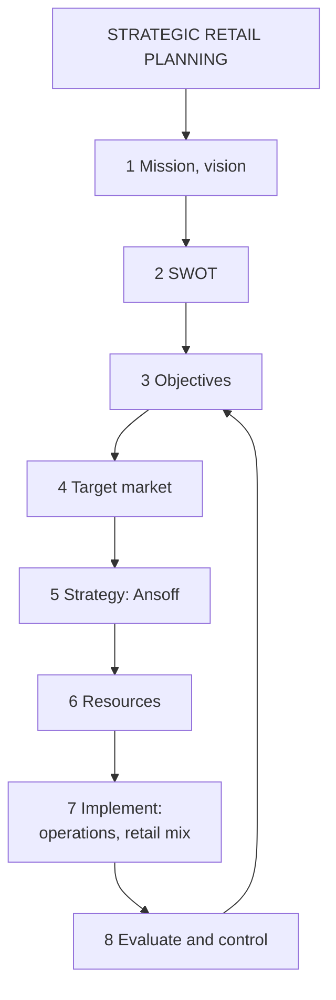

# MA-2: Strategic Retail Planning, Growth Strategies and Operations

Covers: the eight-step strategic retail planning process, the Ansoff growth matrix applied to retail, and the seven areas of retail operations management. **(syllabus)**

## Where this fits in the ESE

Assumed pattern: 50 marks, 3 × 5, 2 × 10, one 15-mark case. "Explain the strategic retail planning process" is a classic 10-marker; "Ansoff matrix with retail examples" and "Areas of retail operations management" are 5-markers. In a case the Ansoff quadrant and the eight-step logic justify the recommendation.

## Strategic retail planning process (syllabus)

A long-term process of achieving retail objectives through effective planning. **Eight steps:**

1. **Define mission and vision:** the retailer's fundamental purpose and long-term direction.
2. **Conduct SWOT analysis:** internal strengths and weaknesses, external opportunities and threats.
3. **Set objectives:** specific, measurable financial and non-financial goals.
4. **Identify target market** (MA-1).
5. **Select retail strategy:** choose the growth path (below).
6. **Allocate resources:** budget, staffing, capital.
7. **Implement strategy:** execute the retail mix (location, merchandise, pricing, promotion, service).
8. **Evaluate and control performance:** track results against objectives and adjust.

Slide example: a supermarket identifies young families as its target market (step 4) and plans promotions accordingly (step 7).

Points to add in the answer: the process is **iterative**, as step 8 feeds back into steps 3 and 5; SWOT bridges mission and objectives and prevents over-optimistic goals; a common failure is jumping from mission to strategy without SWOT or objectives. (student note)

(textbook) Objectives are best written as SMART goals (specific, measurable, achievable, relevant, time-bound), for example "raise same-store sales growth to 8% this year". The performance measures in MA-5 are the control tools of step 8.

## Growth strategies: Ansoff's matrix (syllabus)

Growth strategies are used by retailers to expand sales, market share and profitability. The matrix plots existing or new **products** against existing or new **markets**.

| | Existing products | New products |
|---|---|---|
| **Existing markets** | **Market penetration:** sell more existing products to existing customers (lowest risk) | **Product development:** introduce new products to existing customers |
| **New markets** | **Market development:** enter new geographic markets or customer segments | **Diversification:** new products in new markets (highest risk) |

Slide examples: **DMart opening stores in new cities = market development**; **Apple launching a new iPhone = product development**.

Student-note examples: expanding into tier-2 and tier-3 cities = market development; adding a private label to existing stores = product development; a grocery retailer launching unrelated financial services = diversification. The matrix is attributed to Ansoff.

Risk rises from penetration to diversification. Sequence growth from lower to higher risk, since retail depends on deep category and customer knowledge.

## Retail operations management (syllabus)

Managing the day-to-day activities of a retail store efficiently. **Seven areas:**

1. **Inventory management:** the right stock at the right time.
2. **Store layout and visual merchandising:** shelf and space organisation for sales and customer flow.
3. **Customer service:** assistance, complaint handling, shopper experience.
4. **Billing and POS management:** fast, accurate transactions.
5. **Staff scheduling and training:** match labour to demand and build capability.
6. **Supply chain coordination:** reliable flow of goods into the store.
7. **Performance monitoring:** track KPIs (sales, footfall, conversion).

Slide example: Reliance Smart ensures products are stocked, shelves organised, staff assist customers and billing is quick. Operations is the daily version of step 7 in the planning process. Store managers act as operational "general managers": a weakness in one area, say scheduling, spills into others, say service and billing.

## Worked example, laid out as an exam answer

**Question (5 marks).** Classify each move on the Ansoff matrix and rank by risk (illustrative moves): (a) a hypermarket chain runs a loyalty offer to raise visits from current shoppers; (b) it opens stores in three new towns; (c) it launches a private-label range in existing stores; (d) it starts an unrelated travel-booking business.

1. **Method:** for each move ask "are the products new? are the markets new?"
2. **Classify:**

| Move | Product | Market | Quadrant | Risk rank |
|---|---|---|---|---|
| (a) loyalty offer | existing | existing | market penetration | 1 (lowest) |
| (b) three new towns | existing | new | market development | 2 or 3 |
| (c) private label in current stores | new | existing | product development | 2 or 3 |
| (d) travel booking | new | new | diversification | 4 (highest) |

3. **Decision:** pursue (a), then (b) and (c) in the order capability allows, and avoid (d) for now. **Interpretation:** penetration and development build on existing capabilities; diversification needs new competencies and has the highest failure risk. The matrix does not rank (b) against (c); say "medium" for both and justify with the retailer's strengths.

## Traps

- Putting "new store in an existing city" under market development. The market (customers) is existing there; it is closer to penetration, so say that you assume existing customers.
- Treating the eight steps as a one-way line. Step 8 feeds the next cycle.
- Placing target market before SWOT. The slide order is mission, SWOT, objectives, target market.
- Listing operations areas without the Reliance Smart style example.

## What to remember

- Eight steps: mission and vision, SWOT, objectives, target market, strategy, resources, implementation, evaluate and control.
- Ansoff: penetration, market development, product development, diversification; risk rises towards diversification.
- Slide examples: DMart new cities (market development), Apple new iPhone (product development).
- Seven operations areas: inventory, layout and visual merchandising, customer service, billing and POS, staff scheduling and training, supply chain coordination, performance monitoring.

## Concept map

## Flashcards
Q: List the eight steps of strategic retail planning in order.
A: Define mission and vision; conduct SWOT; set objectives; identify target market; select retail strategy; allocate resources; implement strategy; evaluate and control performance.

Q: Why does SWOT sit between mission and objectives?
A: It forces an honest internal and external assessment before commitments, preventing over-optimistic goals.

Q: Name the four Ansoff strategies.
A: Market penetration, market development, product development and diversification.

Q: Which Ansoff quadrant is DMart opening stores in new cities?
A: Market development (existing format and products, new geography).

Q: Which quadrant is Apple launching a new iPhone?
A: Product development (new product for existing customers).

Q: Which quadrant carries the highest risk and why?
A: Diversification, because it needs new products and new markets, so entirely new competencies.

Q: List the seven areas of retail operations management.
A: Inventory management; store layout and visual merchandising; customer service; billing and POS; staff scheduling and training; supply chain coordination; performance monitoring.

Q: How does step 8 of the planning process connect to the rest?
A: It feeds back into objectives and strategy selection for the next planning cycle.

## Sources
- Faculty deck RM Unit 2 (growth strategies, strategic planning, operations slides) and RM Notes
- Student notes: Growth Strategies, Strategic Retail Planning Process, Retail Operations Management
- Previous: [[Retail Management Unit 2 - MA-1 Target Market Segmentation and Retail Formats]]; next: [[Retail Management Unit 2 - MA-3 Competitive Advantage and Positioning]]
- [[Retail Management Unit 2 - Market Analysis MOC (Node Map)]]
