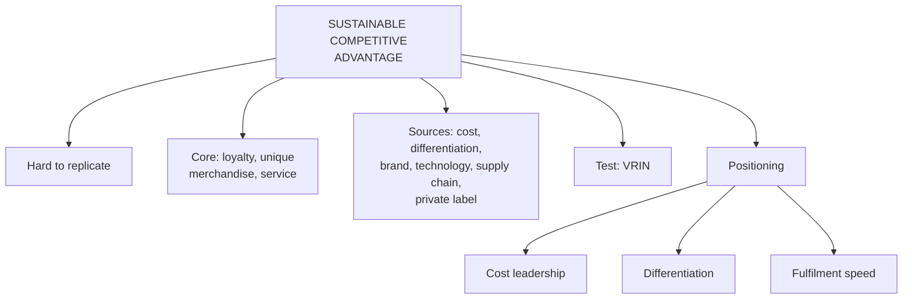

# MA-3: Competitive Advantage and Positioning

Covers: sustainable competitive advantage (SCA) and its sources with company examples, how to test whether an advantage is durable, and the three generic positioning options in retail. **(syllabus)**

## Where this fits in the ESE

Assumed pattern: 50 marks, 3 × 5, 2 × 10, one 15-mark case. "Explain sustainable competitive advantage with examples" is a standard 5- or 10-marker; the three positioning options feed any case that asks "what should this retailer's strategy be?".

## Sustainable competitive advantage (syllabus)

**Definition:** an advantage that allows a retailer to outperform its competitors over a long period. It is achieved by offering unique products, services or experiences that are difficult for competitors to replicate.

**Three core strategies (slide):** customer loyalty programmes (reward repeat customers); unique merchandise (exclusive products); superior customer service (exceeding expectations).

### Sources of SCA with company examples (slide table)

| Company | Advantage | How |
|---|---|---|
| Walmart | everyday low prices | efficient supply chain and bulk purchasing |
| Amazon | fast delivery and technology | Prime membership, AI recommendations, extensive logistics |
| IKEA | affordable, stylish furniture | flat-pack furniture reduces costs |
| Costco | membership model | recurring membership revenue plus bulk products at competitive prices |
| Zara | fast fashion | quickly designs, manufactures and stocks trend-responsive items |
| Apple Store | premium customer experience | high-quality products, knowledgeable staff, seamless after-sales |
| Reliance Retail | large retail network | extensive store presence, supplier relationships, digital integration |
| DMart | cost efficiency | owns many store locations, focuses on essential products |
| Decathlon | private-label products | designs and sells its own sports brands at lower prices |
| Starbucks | customer experience | comfortable atmosphere, personalised service, loyalty programme |

**Common sources (slide):** low-cost leadership (Walmart, DMart); product differentiation (IKEA, Apple); excellent customer service (Starbucks, Nordstrom); strong brand reputation (Nike, Apple); technology and AI (Amazon); fast supply chain (Zara); loyalty programmes (Starbucks Rewards, Amazon Prime); exclusive or private-label products (Decathlon, Costco's Kirkland Signature).

**Why SCA is needed:** retail has low entry barriers and high imitation; prices, promotions and layouts are copied quickly. The strongest performers **stack reinforcing advantages** (Amazon: technology plus logistics plus membership; Zara: speed plus limited batches plus locations). Limitation: no advantage is permanent; technology shifts and new entrants can erode it.

### Testing durability: VRIN (student note, corrected)

**Your note has:** "VRIN-style test: Valuable, Rare, hard to Imitate, and can the organization exploit it (Non-substitutable)." **Correct is:** VRIN = **V**aluable, **R**are, **I**nimitable (hard to imitate), **N**on-substitutable. "Can the organisation exploit it" is the **O** of the related VRIO test (Organised to capture the value). The note merged the two. (textbook, resource-based view; the slides do not cover VRIN.)

Use: loyalty programmes alone rarely last, because rivals can launch similar ones. Durable advantage needs a structural source underneath (supply chain, technology, exclusive product).

## Generic positioning options (syllabus)

When competing in a crowded landscape, retailers adopt one of three approaches:

| Option | Focus | Examples (slide) |
|---|---|---|
| **1. Cost leadership and scale** (cost-driven) | operational frugality, high inventory turns, massive procurement volume, everyday low prices | DMart, Walmart |
| **2. Differentiation and experiential retail** (value-driven) | superior in-store experience, curated lines, staff consultation, premium private brands | Nature's Basket, Lush |
| **3. Fulfilment and omnichannel speed** (convenience-driven) | proximity, frictionless checkout, app integration, rapid delivery | Zepto, Blinkit, Amazon Prime |

| Option | Advantage | Limitation |
|---|---|---|
| Cost leadership | high volume, resilient to price wars | thin margins; vulnerable to lower-cost entrants |
| Differentiation | strong margins, loyal base | limited volume; vulnerable if premium perception erodes |
| Fulfilment speed | stickiness once habituated | high fixed cost of dense logistics; unclear long-term profitability |

(student note) This adapts Porter's generic strategies (cost leadership, differentiation, focus) with convenience and speed as a separate third axis. A firm that commits to none risks being **stuck in the middle**, neither cheapest, most differentiated nor fastest. Lock the choice early and reflect it across the retail mix; discount pricing with premium store design sends mixed signals.

Application: DMart's lean format and tight supply chain are cost leadership; Nature's Basket's curated premium assortment is differentiation; Blinkit and Zepto's dark-store networks are fulfilment speed.

## Worked example, laid out as an exam answer

**Question (5 marks).** "Zippy Basket (fictional)" claims its advantage is a loyalty app that gives 5% points. Test it, and say what else it needs.

1. **Test with VRIN:**

| Test | Result | Reason |
|---|---|---|
| Valuable | Yes | repeat purchase and data |
| Rare | No | most chains run loyalty programmes |
| Inimitable | No | a rival can copy 5% points in weeks |
| Non-substitutable | No | rivals can offer discounts instead |

2. **Decision:** the loyalty app is a **competitive parity**, not an SCA. **Interpretation:** it keeps customers but does not separate Zippy from rivals. To make it sustainable it must sit on a structural source: an exclusive private-label range (Decathlon, Costco model), faster replenishment (Zara model), or lower cost-to-serve (DMart model). Layer the app on top.
3. **Positioning link:** pick one of the three options (cost, differentiation, speed) and align store design, pricing and technology to it.

## Traps

- Listing sources without examples. The company table is where marks are.
- Calling a loyalty programme a durable SCA.
- Stating VRIN with "exploit" as the N (see correction above).
- Claiming one retailer fits all three positions. The slide pairs each option with a primary example.

## What to remember

- SCA = long-run outperformance through unique products, services or experiences that are hard to copy.
- Core strategies: loyalty programmes, unique merchandise, superior service.
- Eight common sources: low cost, differentiation, service, brand, technology and AI, fast supply chain, loyalty, private label.
- Durable advantage stacks several sources.
- Three positions: cost leadership, differentiation, fulfilment speed; avoid stuck in the middle.

## Concept map

## Flashcards
Q: Define sustainable competitive advantage in retail.
A: An advantage that lets a retailer outperform competitors over a long period through unique products, services or experiences that are hard to replicate.

Q: Give the SCA of Zara, Costco and Decathlon.
A: Zara: fast fashion supply chain; Costco: membership model; Decathlon: private-label products.

Q: Why is a loyalty programme alone a weak SCA?
A: Competitors can launch similar programmes; durable advantage needs a structural source underneath.

Q: What does VRIN stand for?
A: Valuable, Rare, Inimitable, Non-substitutable.

Q: Which test adds "organised to exploit"?
A: VRIO; the O stands for organisation.

Q: Name the three generic positioning options in retail.
A: Cost leadership and scale, differentiation and experiential retail, fulfilment and omnichannel speed.

Q: Give the slide examples for each positioning option.
A: DMart and Walmart; Nature's Basket and Lush; Zepto, Blinkit and Amazon Prime.

Q: What does "stuck in the middle" mean?
A: A retailer that commits to no clear position is neither cheapest, most differentiated nor fastest.

Q: Which positioning has high fixed logistics cost and unclear long-term profitability?
A: Fulfilment and omnichannel speed.

## Sources
- Faculty deck RM Unit 2 (SCA slides and strategic positioning options) and RM Notes (SCA table, positioning)
- Student notes: Building a Sustainable Competitive Advantage in Retail, Generic Competitive Positioning Strategies in Retail
- Previous: [[Retail Management Unit 2 - MA-2 Strategic Retail Planning Growth and Operations]]; next: [[Retail Management Unit 2 - MA-4 Evaluating Competition in Retailing]]
- [[Retail Management Unit 2 - Market Analysis MOC (Node Map)]]
