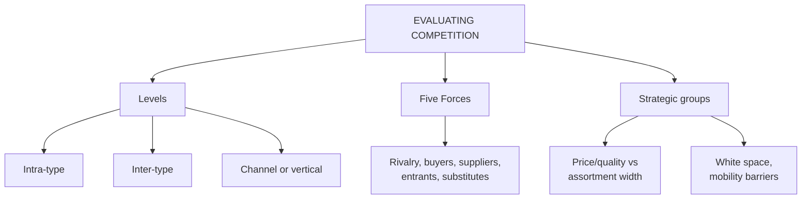

# MA-4: Evaluating Competition in Retailing

Covers: the three levels of retail competition, Porter's Five Forces applied to retail, and strategic group analysis. **(syllabus)** The competitor metrics (four pillars) are in MA-5.

## Where this fits in the ESE

Assumed pattern: 50 marks, 3 × 5, 2 × 10, one 15-mark case. "Explain Porter's Five Forces in the retail context" is the most likely 10-marker from Unit 2; "Levels of retail competition" and "Strategic group analysis" are 5-markers. Cases usually need one of these for the competitor paragraph.

## Levels of retail competition (syllabus)

Competition is categorised by how closely formats and offerings align.

| Level | Definition | Core dynamics | Example (slide) |
|---|---|---|---|
| **Intra-type** | retailers of the **same format** targeting similar segments | price, merchandise selection, layout, service | DMart vs Reliance Smart (both offline hypermarkets) |
| **Inter-type** | **different formats** selling similar categories | convenience, shopping experience, depth vs breadth, service model | Croma (specialty electronics) vs Smart Bazaar (hypermarket electronics section) |
| **Channel or vertical** | **different selling mediums** (offline store, pure-play e-commerce, quick commerce) | fulfilment speed, physical experience, returns, digital convenience | local kirana or supermarket vs Blinkit or Zepto vs Amazon |

Responses (student note): intra-type, counter with pricing and service differentiation; inter-type, with format innovation; channel, with speed and convenience investment. Retailers that watch only intra-type rivals suffer **competitive myopia**, the classic failure when traditional retailers dismissed e-commerce. Channel competition is the newest and fastest-growing threat.

## Porter's Five Forces in retailing (syllabus table)

The model assesses the structural attractiveness and profit potential of a retail market.

| Force | Intensity | Key retail drivers | Strategic impact |
|---|---|---|---|
| Rivalry among existing competitors | **Very high** | low switching costs, market saturation, thin margins | promotional price wars, loyalty programmes, store network expansion |
| Bargaining power of buyers | **Very high** | online price transparency, abundant options, low effort to switch | focus on value propositions, customer experience, exclusive private labels |
| Bargaining power of suppliers | **Moderate to low** | large chains hold scale leverage over FMCG brands; niche suppliers hold more power | modern trade demands slotting fees, trade margins, favourable credit terms |
| Threat of new entrants | **Moderate to high** | low barriers for online and D2C; high capital needed for large physical chains | chains build moats with prime real estate, supply chain scale, technology integration |
| Threat of substitutes | **High** | D2C websites, quick-commerce apps, rental platforms | forces brick-and-mortar to pivot to omnichannel and experiential retail |

Reading: very high rivalry plus very high buyer power squeeze margins from both sides; low-to-moderate supplier power is the one force that works for retailers. The asymmetry between low online entry barriers and high physical-chain barriers explains digital-native disruptors. Substitutes are the most urgent force because they threaten the relevance of the format itself (student note). Supplier power flips high for an iconic, must-stock brand.

## Strategic group analysis (syllabus)

Map retailers on a matrix with **x-axis: price/quality positioning** (low-cost or value to premium or luxury) and **y-axis: format scope or assortment width** (narrow or specialised to broad or full-range). Retailers in the same region form a **strategic group**; they pursue structurally similar strategies and compete most directly, even if they do not sell identical products.

Use: reveals who the most dangerous competitors are (same strategic position, not same products), and **white space** (unoccupied positions). **Mobility barriers** (brand perception, supply chain capability, real estate) make moving between groups slow and rare. Limitation: two dimensions simplify reality; service level, technology and brand equity are left out.

The slide sets up the "competitors to evaluate" pillars (sales and productivity, merchandise efficiency, cost and footprint, customer metrics), worked in MA-5.

## Worked example 1 (Five Forces), laid out as an exam answer

**Question (5 marks).** A regional supermarket chain sees quick-commerce apps launching in its city. Apply the Five Forces and recommend a response.

1. **Rate each force (illustrative judgement, following the slide pattern):**

| Force | Rating | Evidence in this case |
|---|---|---|
| Rivalry | very high | hypermarkets and app players discount aggressively |
| Buyer power | very high | apps and price-comparison make switching free |
| Supplier power | moderate | FMCG brands sell through the apps too, so the chain's scale advantage weakens |
| New entrants | moderate to high | app entry needs less capital than stores |
| Substitutes | high | 10-minute delivery replaces top-up trips |

2. **Decision:** the most urgent force is **substitutes** (channel competition in the level table). **Interpretation:** the chain cannot win on price alone because buyers have free choice and rivalry is intense. Response: build omnichannel (Unit 1, MR-6) with home delivery from existing stores, defend with private labels and loyalty (MA-3), and keep the supplier scale advantage by pooling orders. This is channel or vertical competition; intra-type pricing tools are not enough.

## Worked example 2 (strategic group map), laid out as an exam answer

**Question (5 marks).** Place five retailers on a strategic map using illustrative scores (1 = low, 10 = high) for price/quality and assortment width, and identify white space.

| Retailer | Price/quality | Assortment width | Group |
|---|---|---|---|
| DMart | 3 | 9 | broad value |
| Reliance Smart | 4 | 9 | broad value |
| Nature's Basket | 8 | 4 | narrow premium |
| Croma | 6 | 3 | narrow specialist |
| Quick-commerce app | 5 | 5 | convenience, mid-width |

1. **Group:** DMart and Reliance Smart sit together (price/quality 3-4, width 9), so they are each other's most direct rivals, matching the slide's DMart versus Reliance Smart intra-type example.
2. **Distance:** Nature's Basket (8, 4) is far from DMart (3, 9), so they are in different groups and do not compete directly even in food.
3. **White space:** nothing sits at high price/quality with broad width (top right), so a premium full-range store would face no group-level rival.
4. **Decision and interpretation:** a repositioning by DMart towards that space would need to cross mobility barriers (brand perception built on low price, supply chain tuned for volume). The scores are the examiner's judgement, not data, so state them as assumptions.

## Traps

- Reading the Five Forces table as a list of five definitions. The marks are for intensity, drivers and impact.
- Saying supplier power is high in modern retail. The slide says moderate to low, with exceptions.
- Mapping strategic groups by product category rather than by price/quality and assortment width.
- Confusing intra-type (same format) with inter-type (different formats, similar goods).

## What to remember

- Three levels: intra-type, inter-type, channel or vertical (newest and fastest-growing).
- Five Forces in retail: rivalry very high; buyer power very high; suppliers moderate to low; entrants moderate to high; substitutes high.
- Moats against entrants: prime real estate, supply chain scale, technology integration.
- Strategic groups use price/quality and assortment width; white space and mobility barriers.
- Monitor all three levels to avoid competitive myopia.

## Concept map

## Flashcards
Q: Name the three levels of retail competition with one example each.
A: Intra-type (DMart vs Reliance Smart), inter-type (Croma vs a hypermarket's electronics section), channel or vertical (kirana vs Blinkit or Zepto vs Amazon).

Q: What is the intensity of buyer power and rivalry in modern retail, according to the slide?
A: Both very high.

Q: What is the intensity of supplier power in modern retail, and why?
A: Moderate to low, because large chains hold scale leverage over FMCG brands (niche suppliers hold more).

Q: Which force does the student note call the most strategically urgent, and why?
A: Threat of substitutes, because it threatens the relevance of the format itself.

Q: What moats do chains use against new entrants?
A: Prime real estate, supply chain scale and technology integration.

Q: What are the two axes of the retail strategic group map?
A: Price/quality positioning and format scope or assortment width.

Q: Define a strategic group and white space.
A: A strategic group is a cluster of retailers with similar strategies on the map; white space is an unoccupied position with few or no rivals.

Q: What are mobility barriers?
A: Brand perception, supply chain capability and real estate that make moving between strategic groups difficult.

Q: What failure does watching only intra-type rivals cause?
A: Competitive myopia, being blindsided by inter-type or channel disruption.

## Sources
- Faculty deck RM Unit 2 (evaluating competition slides) and RM Notes (Five Forces table, strategic group axes)
- Student notes: Evaluating Competition in Retailing, Porter's Five Forces in Retailing, Strategic Group Analysis in Retail
- Previous: [[Retail Management Unit 2 - MA-3 Competitive Advantage and Positioning]]; next: [[Retail Management Unit 2 - MA-5 Retail Performance Metrics]]
- [[Retail Management Unit 2 - Market Analysis MOC (Node Map)]]
