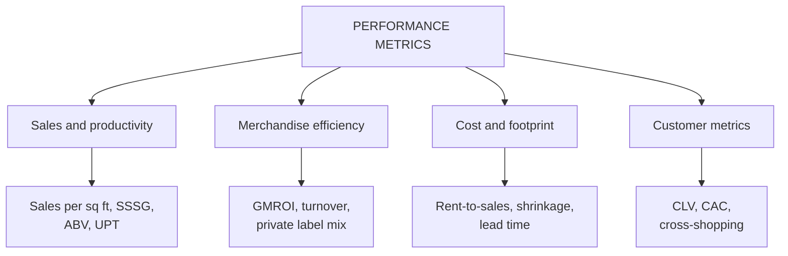

# MA-5: Retail Performance Metrics

Covers: the four metric pillars, the formula for each metric, and worked numerical examples (sales per sq. ft., SSSG, basket value and UPT, inventory turnover, GMROI, rent-to-sales, shrinkage, CLV and CAC). **(syllabus)** names the metrics; the **formulas are (textbook)**, because the slides name the metrics but define only sales per sq. ft. Every number below was recomputed in Python.

## Where this fits in the ESE

Assumed pattern: 50 marks, 3 × 5, 2 × 10, one 15-mark case. This is the numerical node of the unit and the core of the Unit 2 case: compute metrics for two stores, interpret them, recommend. Expect "Explain the four pillars of performance metrics" as a 5-marker and a compute-and-interpret question inside the case. No phone calculators are assumed, so use round numbers and write the formula first.

## The four pillars (syllabus)

| Pillar | Metrics | What it reveals |
|---|---|---|
| 1. Sales and productivity | sales per sq. ft. (sales ÷ store area); same-store sales growth (SSSG); average basket value and units per transaction (UPT) | spatial efficiency, store health, sales momentum |
| 2. Merchandise efficiency | GMROI; inventory turnover ratio; private label mix (%) | product profitability, stock management efficiency, pricing power |
| 3. Cost and footprint | rent-to-sales ratio (%); shrinkage rate; supply chain lead time and warehousing density | real estate selection, cost structure, logistics capability |
| 4. Customer metrics | customer lifetime value (CLV); customer acquisition cost (CAC); omnichannel cross-shopping rate | brand equity, retention, digital integration |

Rule of reading: no metric alone tells the story. SSSG, not total growth, is what analysts use for a growing chain.

## Formulas (textbook, write them before substituting)

| Metric | Formula |
|---|---|
| Sales per sq. ft. | net sales ÷ selling area (sq. ft.); state the period, annual or monthly |
| SSSG | (sales this period − sales last period) ÷ sales last period, for **stores open in both periods only** |
| Average basket value (ABV) | sales ÷ number of transactions |
| UPT | units sold ÷ number of transactions |
| Conversion rate | transactions ÷ footfall |
| Inventory turnover | cost of goods sold ÷ average inventory **at cost**; days of stock = 365 ÷ turnover |
| GMROI | gross margin ÷ average inventory at cost |
| Private label mix | private label sales ÷ total sales × 100 |
| Rent-to-sales | rent ÷ sales × 100 |
| Shrinkage rate | slide: shrinkage as % of inventory lost = (book inventory − physical inventory) ÷ book inventory; textbooks often use % of sales |
| CAC | acquisition spend ÷ new customers acquired |
| CLV (simple) | annual gross profit per customer × expected lifetime in years; discounted version uses the annuity factor |
| Cross-shopping rate | customers using two or more channels ÷ total customers |

**Link between turnover and GMROI (error-proof route):** GMROI = inventory turnover × (gross margin ÷ COGS). Use it to check your answer: if turnover and the markup on cost agree with your GMROI, the arithmetic is right.

Conflict note: the slide defines shrinkage as "% of inventory lost". Write that in the exam and add "(some texts use % of sales)" in brackets, then state which base you used.

## Worked example 1: one store, all pillars

**Data (illustrative, "Greenleaf Fresh (fictional)"):** area 20,000 sq. ft.; annual sales Rs. 12,00,00,000 (Rs. 12 crore); COGS Rs. 9,00,00,000; opening inventory at cost Rs. 1,10,00,000, closing Rs. 1,30,00,000; last year's sales for the same store Rs. 10,80,00,000; transactions 2,40,000; units sold 7,20,000; footfall 6,00,000; private label sales Rs. 2,40,00,000; rent Rs. 35 per sq. ft. per month; book inventory Rs. 1,30,00,000, physical count Rs. 1,27,66,000.

1. **Sales per sq. ft.** = 12,00,00,000 ÷ 20,000 = **Rs. 6,000 a year** (Rs. 500 a month).
2. **SSSG** = (12.00 − 10.80) ÷ 10.80 = **11.1%**.
3. **ABV** = 12,00,00,000 ÷ 2,40,000 = **Rs. 500**; **UPT** = 7,20,000 ÷ 2,40,000 = **3.0**; **conversion** = 2,40,000 ÷ 6,00,000 = **40%**.
4. **Gross margin** = 12.00 − 9.00 = Rs. 3.00 crore = 25% of sales.
5. **Average inventory** = (1.10 + 1.30) ÷ 2 = Rs. 1.20 crore.
6. **Inventory turnover** = 9.00 ÷ 1.20 = **7.5 times**; days of stock = 365 ÷ 7.5 = **48.7 days**.
7. **GMROI** = 3.00 ÷ 1.20 = **2.5**. Check: 7.5 × (3.00 ÷ 9.00) = 7.5 × 0.3333 = 2.5.
8. **Private label mix** = 2.40 ÷ 12.00 = **20%**.
9. **Rent** = 35 × 20,000 × 12 = Rs. 84,00,000; **rent-to-sales** = 0.84 ÷ 12.00 = **7.0%**.
10. **Shrinkage** = 1,30,00,000 − 1,27,66,000 = Rs. 2,34,000 = **1.8% of book inventory** (0.195% of sales).

| Metric | Value |
|---|---|
| Sales per sq. ft. (annual) | Rs. 6,000 |
| SSSG | 11.1% |
| ABV / UPT / conversion | Rs. 500 / 3.0 / 40% |
| Inventory turnover / days | 7.5 / 48.7 |
| GMROI | 2.5 |
| Private label mix | 20% |
| Rent-to-sales | 7.0% |
| Shrinkage | 1.8% of inventory |

**Decision and interpretation:** GMROI of 2.5 means Rs. 2.50 of gross margin for every Rs. 1 of inventory at cost, achieved by a 25% margin on 7.5 turns. The store is productive, growing on a like-for-like basis and keeps rent at 7%. Watch shrinkage (1.8% of inventory), which RFID and stock controls can reduce. Whether 2.5 is "good" depends on the retailer's own hurdle and peers; compare, do not judge in isolation.

## Worked example 2: GMROI to allocate space

**Data (illustrative, one store, Rs. crore):**

| Category | Sales | COGS | Average inventory at cost |
|---|---|---|---|
| Staples | 5.00 | 4.30 | 0.30 |
| Packaged food | 4.00 | 3.00 | 0.50 |
| Electronics | 3.00 | 2.40 | 0.60 |

1. Gross margin = sales − COGS: staples 0.70; packaged 1.00; electronics 0.60.
2. Turnover = COGS ÷ average inventory: staples 14.33; packaged 6.00; electronics 4.00.
3. GMROI = GM ÷ average inventory: staples **2.33**; packaged **2.00**; electronics **1.00**.

| Category | GM % | Turnover | GMROI |
|---|---|---|---|
| Staples | 14.0% | 14.33 | 2.33 |
| Packaged food | 25.0% | 6.00 | 2.00 |
| Electronics | 20.0% | 4.00 | 1.00 |

4. **Decision:** shift shelf space and inventory budget from electronics towards staples and packaged food, or cut electronics stock. **Interpretation:** staples have the thinnest margin (14%) but the best GMROI because they turn 14 times; electronics has a better margin than staples (20%) but ties up most inventory per rupee of margin. A margin percentage alone would have ranked packaged food first and misled the buyer. High GMROI with low turnover would instead mark a slow, high-margin category worth protecting rather than discounting (student note).

## Worked example 3: CLV against CAC

**Data (illustrative):** annual gross profit per loyal customer Rs. 1,800; expected life 5 years; a campaign spends Rs. 1,50,00,000 to win 6,000 new customers; discount rate 10%.

1. **CAC** = 1,50,00,000 ÷ 6,000 = **Rs. 2,500**.
2. **Simple CLV** = 1,800 × 5 = **Rs. 9,000**; CLV ÷ CAC = **3.6**.
3. **Discounted CLV:** annuity factor for 5 years at 10% = **3.791** (table, 3 decimals); 1,800 × 3.791 = **Rs. 6,823.80** (exact factor 3.7908 gives Rs. 6,823.42); CLV ÷ CAC = **2.73**.
4. **Decision:** the campaign passes on the simple basis and falls below 3:1 once discounted. **Interpretation:** a common rule of thumb asks for CLV at least about three times CAC **[VERIFY: heuristic from marketing practice, not on the slides]**; here the programme is acceptable but not strong, so raise retention (longer life) or cut acquisition cost before scaling. The student note's key test stands: CLV must meaningfully exceed CAC.

## Worked example 4: why SSSG, not total growth

Two stores sold Rs. 20.5 crore last year and Rs. 22.5 crore this year; a third store opened this year with Rs. 4.0 crore.

1. Total growth = (22.5 + 4.0) ÷ 20.5 − 1 = **29.3%**.
2. SSSG (the two comparable stores) = 22.5 ÷ 20.5 − 1 = **9.8%**.
3. **Interpretation:** about 19.5 percentage points of the 29.3% come from the new store. Analysts quote SSSG to separate organic momentum from expansion.

## Traps

- Computing inventory turnover with sales over inventory at cost (unit mismatch). Use COGS over cost inventory, or sales over inventory at retail.
- Using closing inventory instead of the average.
- Including new stores in SSSG.
- Saying GMROI is a percentage. It is a ratio (Rs. of margin per Re. 1 of inventory); 2.5 equals 250%.
- Reporting sales per sq. ft. without the period (annual or monthly).
- Judging a category on gross margin % alone.

## What to remember

- Four pillars: sales and productivity; merchandise efficiency; cost and footprint; customer metrics.
- GMROI = gross margin ÷ average inventory at cost = turnover × (GM ÷ COGS).
- Turnover = COGS ÷ average inventory at cost; days = 365 ÷ turnover.
- SSSG excludes new stores; rent-to-sales and shrinkage guard cost.
- CLV must exceed CAC; compare discounted CLV.

## Concept map

## Flashcards
Q: Name the four pillars of retail performance metrics.
A: Sales and productivity, merchandise efficiency, cost and footprint, and customer metrics.

Q: Write the formula for GMROI.
A: Gross margin ÷ average inventory at cost (equivalently inventory turnover × gross margin ÷ COGS).

Q: Write the formula for inventory turnover and days of stock.
A: COGS ÷ average inventory at cost; days of stock = 365 ÷ turnover.

Q: A store has sales Rs. 12 crore, COGS Rs. 9 crore, average inventory Rs. 1.2 crore at cost. Find GMROI and turnover.
A: GMROI 2.5 (3.00 ÷ 1.20); turnover 7.5 (9.00 ÷ 1.20).

Q: Why use same-store sales growth rather than total sales growth?
A: It excludes new-store effects and shows organic momentum; total growth is inflated by openings.

Q: Define rent-to-sales ratio.
A: Rent ÷ sales × 100, the real estate cost efficiency measure; for example 84 lakh on 12 crore is 7%.

Q: How does the slide define shrinkage rate?
A: Percentage of inventory lost to theft, damage or administrative error.

Q: Define CAC and CLV, and what relation should hold?
A: CAC is the cost to acquire each new customer; CLV is the total projected profit from a customer relationship; CLV should meaningfully exceed CAC.

Q: A category has GM 14% but turns 14.33 times, another has GM 20% and turns 4 times. Which has the better GMROI?
A: The 14% category (GMROI 2.33 against 1.00), because turnover outweighs margin.

Q: What do UPT and average basket value measure?
A: Purchase depth: units per transaction and sales per transaction.

## Sources
- Faculty deck RM Unit 2 (key dimensions and metrics for evaluating competitors) and RM Notes (four metric pillars)
- Student note: Retail Performance Metrics
- Formula definitions: textbook (Levy and Weitz; Berman and Evans; Kotler and Keller), not given on the slides
- Previous: [[Retail Management Unit 2 - MA-4 Evaluating Competition in Retailing]]; next: [[Retail Management Unit 2 - MA-6 Retail Market Information Data and Research]]
- [[Retail Management Unit 2 - Market Analysis MOC (Node Map)]]
