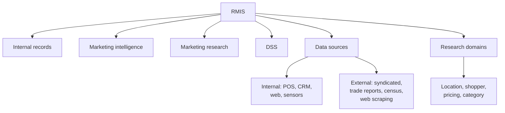

# MA-6: Retail Market Information, Data and Research

Covers: the Retail Market Information System (RMIS) and its four components, internal and external sources, the importance of RMIS, the four market research domains, and the internal and external data source matrices. **(syllabus)**

## Where this fits in the ESE

Assumed pattern: 50 marks, 3 × 5, 2 × 10, one 15-mark case. "What is an RMIS? Explain its components" is a 5-marker and combines well into a 10-marker with data sources and research types. In a case, this node supplies the "what information should the retailer collect" paragraph.

## RMIS (syllabus)

**Definition:** a system that collects, stores, analyses and distributes information to help retailers make better decisions about customers, products, pricing, inventory, competitors and sales. It takes raw data from multiple environments, processes it through central systems and delivers actionable insight.

| Component | Purpose | Example |
|---|---|---|
| **Internal records** | information about store performance | daily sales reports, inventory records, billing data |
| **Marketing intelligence** | information about competitors and market trends | competitor pricing, new product launches |
| **Marketing research** | customer-specific information | satisfaction surveys, focus groups |
| **Decision support system (DSS)** | analyses data to support managerial decisions | sales forecasting, demand prediction |

Reading (student note): internal records are **passive** collection, intelligence and research are **active** gathering, and the DSS is **analytical** transformation. A retailer needs all four. Retailers often over-invest in internal records (a by-product of operations) and under-invest in intelligence and research. The DSS is the most valuable component because it turns data into decisions, even though it creates no new raw data.

| Internal sources | External sources |
|---|---|
| sales records | government reports |
| inventory database | industry publications |
| customer purchase history | competitor websites |
| CRM database | social media reviews |
| loyalty card data | market research agencies |

**Importance:** better decision making; customer understanding (preferences, buying patterns); inventory control (prevents stock-outs and excess); sales forecasting; competitive advantage (tracks competitors); improved satisfaction (personalised offers); higher profitability (price and inventory decisions).

(textbook) RMIS follows the marketing information system layout in Kotler and Keller: internal records, marketing intelligence, marketing research and analytical marketing (the DSS).

## Retail data sources matrix (syllabus)

**Internal:**

| Source | Data captured | Output |
|---|---|---|
| POS | SKU transactions, time, basket size, payment modes | sales per sq. ft., UPT, average order value |
| Loyalty and CRM programmes | demographics, purchase history, redemption | CLV, RFM (recency, frequency, monetary) segmentation |
| Web and app analytics | impressions, click-through, cart abandonment, dwell time | funnel optimisation, re-targeting, conversion path analysis |
| In-store sensors and Wi-Fi | footfall counts, aisle dwell, entry heatmaps | capture rate, window display effectiveness, conversion ratios |

**External and syndicated:**

| Category | Representative sources | Insight |
|---|---|---|
| Syndicated market audit | NielsenIQ, Kantar Worldpanel | category market share, brand penetration, numerical vs weighted distribution (slide) |
| Industry and trade reports | IMAGES Group (India Phygital Index), McKinsey, Deloitte | channel growth benchmarks, consumer shifts, omnichannel adoption |
| Geographic and census data | census, GIS (for example Esri) | catchment demographics, per capita income, purchasing power |
| Competitive web scraping | competitive intelligence APIs, price-tracking tools | real-time competitor prices, stock availability, online discounts |

Internal data is accurate and specific to the firm but silent on the market; external data gives market context but is less granular, may lag and can be costly (NielsenIQ and Kantar subscriptions). Best practice is to **triangulate** both. Governance point: finer in-store tracking raises data privacy questions.

## Retail market research: four domains (syllabus)

| Research type | Focus | Methods | Core application |
|---|---|---|---|
| **Location and site** | spatial analysis for new stores | gravity models, footfall heatmaps, traffic density | real estate selection, catchment analysis (Unit 3) |
| **Shopper and store behaviour** | in-store movement and dwell times | eye-tracking glasses, video analytics, mystery shopping | planogram and aisle flow optimisation |
| **Pricing and elasticity** | sensitivity to price points | conjoint analysis, A/B dynamic price testing online | markdown timing, promotion strategy |
| **Category and assortment** | SKU depth and width | brand health tracking, exit surveys, basket analysis | private label launch, category management |

Sequence research to the decision: a site choice needs location research first; a margin problem needs pricing or category research. Mystery shopping captures service quality that video analytics cannot; video captures movement at scale. Small retailers must prioritise one domain.

## Worked example, laid out as an exam answer

**Question (5 marks).** A store's POS shows sales in one category fell from Rs. 10.0 crore to Rs. 9.6 crore. A syndicated audit shows the category in the same catchment fell from Rs. 250 crore to Rs. 230 crore (illustrative). Diagnose.

1. **Method:** triangulate internal and external data using market share = own sales ÷ category sales.
2. **Compute:**

| Item | Last year | This year | Change |
|---|---|---|---|
| Own sales (POS), Rs. crore | 10.0 | 9.6 | −4.0% |
| Category market (audit), Rs. crore | 250 | 230 | −8.0% |
| Own market share | 4.00% | 4.17% | +0.17 points (+4.3% relative) |

3. **Decision:** the decline is a **category downturn, not a company-specific problem**; the store is gaining share. **Interpretation:** POS alone would suggest failure; the external audit shows the store is outperforming. The response is to protect share and manage inventory for a shrinking category (use the DSS to forecast), not to cut service. If the audit were unavailable the manager could not tell the two cases apart, which is why a complete RMIS needs both internal records and external intelligence.

## Which research for which decision (quick map)

| Decision | Research domain | Data source |
|---|---|---|
| Open a new store | location and site | census and GIS, footfall heatmaps |
| Fix queue and shelf layout | shopper and store behaviour | video analytics, mystery shopping |
| Time a markdown | pricing and elasticity | POS, A/B tests |
| Launch a private label | category and assortment | basket analysis, brand health tracking |

## Traps

- Calling the four RMIS components "sources". They are functions (records, intelligence, research, analysis).
- Treating the DSS as a data collector. It analyses.
- Mixing research domains and data sources. Domains are questions; sources are inputs.
- Saying internal data is enough for strategy.

## What to remember

- RMIS = collect, store, analyse, distribute information. Four components: internal records, marketing intelligence, marketing research, DSS.
- Internal sources: POS, loyalty and CRM, web and app, in-store sensors; external: syndicated audit, trade reports, census and GIS, web scraping.
- Four research domains: location and site, shopper behaviour, pricing and elasticity, category and assortment.
- Triangulate internal and external data.

## Concept map

## Flashcards
Q: Define RMIS.
A: A system that collects, stores, analyses and distributes information to help retailers make better decisions about customers, products, pricing, inventory, competitors and sales.

Q: Name the four components of an RMIS.
A: Internal records, marketing intelligence, marketing research and the decision support system (DSS).

Q: Which RMIS component is analytical rather than a collector?
A: The DSS, for example sales forecasting and demand prediction.

Q: Give four internal retail data sources.
A: POS, loyalty and CRM programmes, web and app analytics, in-store sensors and Wi-Fi.

Q: Give four categories of external or syndicated data.
A: Syndicated market audit (NielsenIQ, Kantar), industry and trade reports, geographic and census data (GIS), competitive web scraping.

Q: Name the four market research domains.
A: Location and site, shopper and store behaviour, pricing and elasticity, category and assortment.

Q: Which method suits which research: gravity model, conjoint analysis, eye-tracking, basket analysis?
A: Gravity model: location and site; conjoint analysis: pricing and elasticity; eye-tracking: shopper behaviour; basket analysis: category and assortment.

Q: Why triangulate internal and external data?
A: To tell whether a sales change is company-specific or a category-wide trend.

Q: A store's category sales fall 4% while the market falls 8%; what has happened to its share?
A: It has risen (from 4.00% to 4.17% in the example).

## Sources
- Faculty deck RM Unit 2 (RMIS, market research, data source matrices) and RM Notes
- Student notes: Retail Market Information System (RMIS), Retail Data Sources, Retail Market Research Types
- Previous: [[Retail Management Unit 2 - MA-5 Retail Performance Metrics]]; next: [[Retail Management Unit 2 - MA-7 Omnichannel vs Phygital Retailing]]
- [[Retail Management Unit 2 - Market Analysis MOC (Node Map)]]
