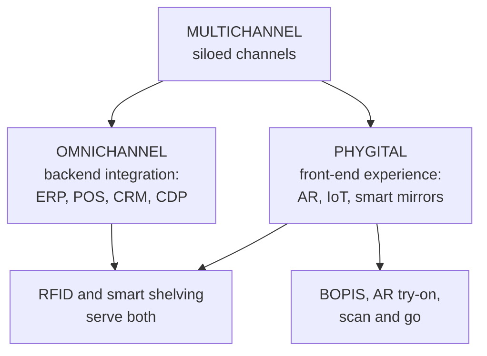

# MA-7: Omnichannel vs Phygital Retailing

Covers: the three-way comparison of multichannel, omnichannel and phygital; the key phygital touchpoints and enablers; and how the two investment tracks differ. **(syllabus)** Builds on MR-6 (multichannel and omnichannel definitions).

## Where this fits in the ESE

Assumed pattern: 50 marks, 3 × 5, 2 × 10, one 15-mark case. "Differentiate omnichannel and phygital retailing" is a likely 5-marker; a 10-marker can pair it with MR-6 ("multichannel to omnichannel to phygital"). In a case it answers "what technology should the retailer invest in first?"

## The distinction (syllabus)

Both bridge online and offline touchpoints. **Omnichannel** focuses on **backend channel integration and data synchronisation**; **phygital** focuses on the **front-end experiential blending** of physical and digital technology.

| Dimension | Multichannel | Omnichannel | Phygital |
|---|---|---|---|
| Core philosophy | operates multiple independent sales channels | unifies all channels into one continuous customer journey | blends physical environments with digital technology for interactive experience |
| Integration focus | low, siloed (store stock ≠ app stock) | high, systemic (ERP, POS, CRM linked in real time) | experiential (sensory and interactive interfaces in store) |
| Customer journey | fragmented; shopper restarts across channels | seamless; moves fluidly across touchpoints | immersive; digital interfaces enhance the physical store |
| Primary enabler | basic e-commerce platforms and physical stores | unified data layer or customer data platforms (CDPs) | IoT, AR/VR, RFID, smart mirrors |

Core idea (student note): omnichannel is a **systems and data problem**; phygital is a **customer-experience design problem**.

## Key phygital touchpoints and enablers (syllabus)

| Technology | Operational role | Impact | Example |
|---|---|---|---|
| **BOPIS** (buy online, pick up in store) | links web or app fulfilment to store inventory | reduces shipping cost, drives high-margin foot traffic | Target, Reliance Smart |
| **AR try-ons** | overlays digital products onto virtual or mirror visuals | fewer returns, faster decisions | L'Oréal, Sephora Virtual Artist |
| **RFID and smart shelving** | tracks items on shelves automatically | prevents stock-outs, reduces shrinkage, real-time inventory visibility | Zara, Decathlon |
| **Self-checkout or scan and go** | scan barcodes via app and pay digitally | removes queue friction, cuts cashier labour | Decathlon app, Amazon Go |

Pairing note: in the text extract of the slide, the examples column sits offset from the rows. The pairing above follows the order of the rows (BOPIS: Target, Reliance Smart; AR: L'Oréal and Sephora; RFID: Zara, Decathlon; scan and go: Decathlon app, Amazon Go), and matches the student note.

## How the two relate (student note, textbook logic)

- A retailer can be strong in one and weak in the other: a retailer with excellent AR try-ons but siloed stock is phygital but not omnichannel, with a great moment and a broken cross-channel experience.
- **RFID and smart shelving serve both:** real-time inventory visibility (omnichannel backend) and a frictionless, interactive store (phygital front end). That makes it one of the highest-leverage investments.
- **Two separate investment tracks:** omnichannel needs IT investment and data governance; phygital needs in-store technology, user-experience design and often hardware capital (smart mirrors, AR kiosks). Prioritising visible phygital features over the invisible but foundational omnichannel backend carries a risk: customers see the gadget, then hit stock-outs or inconsistent prices.
- Slide data source: IMAGES Group's India Phygital Index appears under external data (MA-6) as a benchmark of omnichannel adoption.

## Worked example, laid out as an exam answer

**Question (5 marks).** A fashion chain has a siloed app and stores, and 18% of online orders are returned. It can fund one project: AR try-on (Rs. 40,000 a month, expected to cut returns from 18% to 12%) or an inventory integration project. Orders are 10,000 a month; each return costs Rs. 120 to process (illustrative). Evaluate the AR option and classify each project.

1. **Classify:** AR try-on is **phygital** (front-end experience); inventory integration is **omnichannel** (backend).
2. **Compute the AR saving:** returns now = 10,000 × 18% = 1,800; after AR = 10,000 × 12% = 1,200; fewer returns = 600; saving = 600 × Rs. 120 = **Rs. 72,000** a month.
3. **Net:** Rs. 72,000 − Rs. 40,000 = **Rs. 32,000** a month.

| Item | Rs. a month |
|---|---|
| Return-handling saving | 72,000 |
| AR cost | (40,000) |
| **Net benefit** | **32,000** |

4. **Decision:** the AR project pays on return costs alone. **Interpretation:** it should not displace the integration project, because siloed stock keeps causing cross-channel failures that AR does not fix. Recommended order: link stock and customer data (omnichannel), then add AR on top. The saving ignores any lift in sales; state that as an assumption.

## Traps

- Treating phygital and omnichannel as synonyms.
- Putting RFID in only one column. It supports both.
- Forgetting that multichannel is the siloed starting point of the table's first column.
- Offsetting the examples (BOPIS with Target and Reliance Smart, not with L'Oréal).

## What to remember

- Omnichannel = backend integration and data synchronisation; phygital = front-end experiential blending.
- Multichannel: siloed; omnichannel: unified data layer or CDP; phygital: IoT, AR/VR, RFID, smart mirrors.
- Four touchpoints: BOPIS, AR try-on, RFID and smart shelving, self-checkout or scan and go.
- RFID bridges both paradigms.
- Treat them as two investment tracks; fix the backend first.

## Concept map

## Flashcards
Q: State the difference between omnichannel and phygital in one line.
A: Omnichannel is backend channel integration and data synchronisation; phygital is front-end experiential blending of physical and digital technology.

Q: What is the primary enabler of omnichannel, and of phygital?
A: Omnichannel: unified data layer or customer data platforms (CDPs); phygital: IoT, AR/VR, RFID and smart mirrors.

Q: Describe the customer journey in multichannel, omnichannel and phygital.
A: Multichannel: fragmented, the shopper restarts; omnichannel: seamless across touchpoints; phygital: immersive, with digital interfaces enhancing the store.

Q: Name the four key phygital touchpoints.
A: BOPIS, augmented reality try-ons, RFID and smart shelving, and self-checkout or scan and go.

Q: What does BOPIS achieve for a retailer?
A: It links web or app fulfilment to store inventory, reduces shipping costs and drives high-margin foot traffic.

Q: Why does RFID bridge omnichannel and phygital?
A: It gives real-time inventory visibility (omnichannel) and enables frictionless interactive in-store experience (phygital), also cutting stock-outs and shrinkage.

Q: What risk comes from prioritising phygital over the omnichannel backend?
A: Visible features may sit on siloed stock and inconsistent data, so cross-channel failures persist.

Q: In the AR example, what is the monthly net benefit?
A: Rs. 32,000 (saving of Rs. 72,000 on 600 fewer returns less Rs. 40,000 cost; illustrative).

## Sources
- Faculty deck RM Unit 2 (omnichannel vs phygital slides) and RM Notes (conceptual distinction table)
- Student note: Omnichannel vs Phygital Retailing; MR-6 for the multichannel and omnichannel definitions
- Previous: [[Retail Management Unit 2 - MA-6 Retail Market Information Data and Research]]; next: [[Retail Management Unit 2 - MA-8 Unit 2 Exam Answers]]
- [[Retail Management Unit 2 - Market Analysis MOC (Node Map)]]
