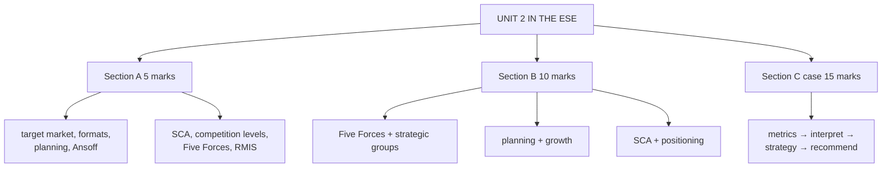

# MA-8: Unit 2 Exam Answers

Covers: what the ESE is likely to ask from Unit 2, 5-mark and 10-mark skeletons, and a 15-mark case layout with a model answer using the performance metrics. Numbers come from MA-1 to MA-7 and were recomputed in Python.

## What the test will ask

Assumed pattern, copied from Bond Market because no course plan exists for Retail Management: 50 marks, Section A 3 × 5 (internal choice), Section B 2 × 10 (internal choice), Section C one compulsory 15-mark case; no phone calculators. Unit 2 mixes frameworks (Five Forces, Ansoff, positioning, strategic groups) with one numerical block (performance metrics). The case is most likely to use the metrics, so practise MA-5. **[VERIFY with faculty if the paper pattern differs.]**

## Five-mark answer skeletons

**1. Target market and segmentation; format follows target market (MA-1).** Two definitions, format definition, two or three rows of the fit table, the fit principle.

**2. Four characteristics that define a retail format (MA-1).** Size and layout; width and depth; service level; pricing strategy; one example each (kirana to department store; specialty vs hypermarket; self-service vs assisted vs personalised; EDLP vs high-low vs prestige).

**3. Strategic retail planning process (MA-2).** Eight steps, one line each, slide example, feedback loop.

**4. Ansoff matrix with retail examples (MA-2).** 2 × 2 table, DMart and Apple examples, risk order.

**5. Sustainable competitive advantage (MA-3).** Definition, three core strategies, six company examples, durability test (VRIN).

**6. Levels of retail competition (MA-4).** Table of three levels with examples and responses; competitive myopia.

**7. Porter's Five Forces in retail (MA-4).** Five-row table with intensity, drivers, impact; one-line reading.

**8. RMIS and its components (MA-6).** Definition, four components, internal and external sources, importance.

**9. Omnichannel vs phygital (MA-7).** Three-column table and the RFID bridge.

**10. Retail performance metrics, four pillars (MA-5).** Four pillars, two metrics each with formula, "no metric alone".

## Ten-mark answer skeletons

**A. Porter's Five Forces and strategic group analysis in retail (MA-4).** Five Forces table → reading (rivalry and buyer power squeeze margins) → substitutes as the most urgent → strategic group map with two axes → white space and mobility barriers → worked retail example.

**B. Strategic retail planning with growth strategies (MA-2, MA-1).** Eight steps → target market and format fit → Ansoff matrix → operations areas as implementation → evaluation with metrics.

**C. Building a sustainable competitive advantage and positioning (MA-3).** Definition → sources table → stacking and VRIN → three positioning options with pros and cons → stuck in the middle → Indian examples (DMart, Nature's Basket, Blinkit).

**D. Retail market information, data and research (MA-6).** RMIS four components → internal and external data matrices → four research domains with methods → triangulation example → governance note.

**E. Evaluating a retailer's performance (MA-5).** Four pillars → formulas → one numerical (GMROI and turnover) → interpretation → combine metrics.

## Fifteen-mark case layout (Unit 2 case)

1. **Compute the metrics (6):** sales per sq. ft., SSSG, inventory turnover, GMROI, rent-to-sales, shrinkage, for both stores.
2. **Interpret and compare (4):** which store is stronger on which pillar, and why; diagnose the weaker store.
3. **Strategy (3):** positioning option, Five Forces (the force at work), Ansoff quadrant.
4. **Recommendation (2):** fix and expand decisions with a number.

### Case (illustrative, fictional)

"Metro Mart (fictional)" runs two supermarkets in a city. A quick-commerce app has launched locally, and the chain is considering its own app.

| Item | North store | East store |
|---|---|---|
| Area (sq. ft.) | 25,000 | 10,000 |
| Sales this year (Rs. crore) | 15.00 | 7.50 |
| Sales last year (Rs. crore) | 13.50 | 7.00 |
| COGS (Rs. crore) | 11.55 | 5.70 |
| Opening / closing inventory at cost (Rs. crore) | 1.60 / 1.70 | 1.20 / 1.20 |
| Rent (Rs. per sq. ft. per month) | 35 | 75 |
| Book / physical inventory (Rs. crore) | 1.70 / 1.683 | 1.20 / 1.164 |
| Transactions | 3,00,000 | 1,25,000 |

App project: CAC Rs. 1,500; annual gross profit per app customer Rs. 1,400; expected life 3 years.

### Model answer, laid out as the exam answer

1. **Computation (6):** state each formula first (MA-5).

| Metric | North | East |
|---|---|---|
| Gross margin (Rs. crore, % of sales) | 3.45 (23.0%) | 1.80 (24.0%) |
| Sales per sq. ft. a year | Rs. 6,000 | Rs. 7,500 |
| SSSG | (15.00 − 13.50) ÷ 13.50 = **11.1%** | (7.50 − 7.00) ÷ 7.00 = **7.1%** |
| Average inventory (Rs. crore) | (1.60 + 1.70) ÷ 2 = 1.65 | 1.20 |
| Inventory turnover | 11.55 ÷ 1.65 = **7.0** (52 days) | 5.70 ÷ 1.20 = **4.75** (77 days) |
| GMROI | 3.45 ÷ 1.65 = **2.09** | 1.80 ÷ 1.20 = **1.50** |
| Rent (Rs. crore) and rent-to-sales | 35 × 25,000 × 12 = 1.05; **7.0%** | 75 × 10,000 × 12 = 0.90; **12.0%** |
| Shrinkage (of book inventory) | Rs. 1.7 lakh = **1.0%** | Rs. 3.6 lakh = **3.0%** |
| Average basket value | Rs. 500 | Rs. 600 |

   Check: North 7.0 × (3.45 ÷ 11.55) = 2.09; East 4.75 × (1.80 ÷ 5.70) = 1.50.

2. **Interpretation (4):** East has the better sales per sq. ft. (Rs. 7,500 against Rs. 6,000) and a bigger basket, but lower SSSG (7.1% against 11.1%), slower stock turn (77 against 52 days), GMROI of 1.50 against 2.09, rent at 12% of sales and shrinkage three times North's. **Decision:** East is a productive but over-stocked, high-rent, leaky store; North is the healthier model. **Interpretation:** East's problem is cost and stock control, not demand; its high rent explains why sales per sq. ft. must be high just to break even. No single metric tells this: sales per sq. ft. alone would have ranked East first.

3. **Strategy (3):** Positioning: a chain with a 23-24% margin and annual stock turns of 7.0 and 4.75 sits between cost leadership and differentiation, which risks "stuck in the middle"; commit to **convenient value** (cost-driven, with delivery from existing stores). Five Forces: **substitutes** (the quick-commerce app) and very high buyer power. Ansoff: opening a similar store in a new locality is **market development**; the own app serving existing customers is **market penetration** (a new channel for current customers) or product development if framed as a new service, so state which you assume.

4. **Recommendation (2):**
   - **Fix East before expanding:** cut average inventory from Rs. 1.20 crore to about Rs. 0.90 crore at the same sales and margin: turnover rises to 5.70 ÷ 0.90 = 6.33 and **GMROI to 2.00** (assumes margin unchanged); renegotiate rent from Rs. 75 to Rs. 55 a sq. ft., which cuts rent-to-sales from 12.0% to **8.8%**; attack shrinkage (3% against 1%) with stock controls and RFID.
   - **App:** CLV = 1,400 × 3 = Rs. 4,200 against CAC Rs. 1,500: ratio **2.8**, below the common 3:1 rule of thumb **[VERIFY: heuristic]**. Approve only a limited pilot, and lift retention or lower CAC first.
   - **Expansion:** replicate the North format (market development) after East's metrics improve.

   Close with: *the figures are illustrative; GMROI and turnover assumptions must be tested against peer benchmarks and the quick-commerce response.*

## Time rule

Do the metrics table first, with formulas stated; it carries 6 of 15 marks and the interpretation reuses it. If short of time, give the two worst metrics (East rent-to-sales 12%, East GMROI 1.50) and one recommendation line.

## What to remember

- Unit 2 = frameworks plus the metrics block; the case usually tests the metrics.
- Case numbers: North GMROI 2.09, turnover 7.0, rent 7.0%; East GMROI 1.50, turnover 4.75, rent 12.0%, shrinkage 3.0%.
- East fix: inventory to Rs. 0.90 crore gives GMROI 2.00; rent at Rs. 55 gives 8.8%.
- App: CLV Rs. 4,200 against CAC Rs. 1,500, ratio 2.8.
- Always end with a decision line and one interpretation sentence.

## Concept map

## Flashcards
Q: Which block of Unit 2 is most likely to be a numerical in the case?
A: Retail performance metrics: sales per sq. ft., SSSG, inventory turnover, GMROI, rent-to-sales, shrinkage, CLV and CAC.

Q: What is the layout for the Unit 2 case?
A: Compute the metrics for each store, interpret and compare, give strategy (positioning, Five Forces, Ansoff), then recommend with a number.

Q: In the Metro Mart case, which store has the higher GMROI and what is it?
A: North, at 2.09 against East's 1.50.

Q: Why does East's high sales per sq. ft. not make it the better store?
A: Its rent is 12% of sales, its stock turns slowly (4.75), shrinkage is 3% and GMROI is only 1.50.

Q: What GMROI does East reach if average inventory falls to Rs. 0.90 crore at unchanged margin?
A: 2.00 (1.80 ÷ 0.90).

Q: In the Metro Mart case, what is the app project's CLV to CAC ratio?
A: 2.8 (Rs. 4,200 over Rs. 1,500), below the usual 3:1 rule of thumb.

Q: Which Five Forces force is most urgent in the case?
A: Threat of substitutes, from the quick-commerce app.

Q: What closes every case answer for full marks?
A: A decision line with its interpretation, and a one-line caveat that the figures are illustrative.

## Sources
- Assumed ESE pattern (no course plan supplied for Retail Management) and nodes MA-1 to MA-7
- [[Retail Management Unit 2 - Market Analysis MOC (Node Map)]]
