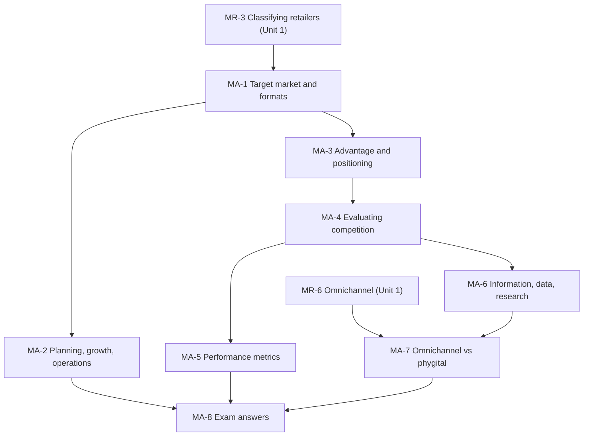

# Retail Management Unit 2: Retail Consumer Behaviour and Market Analysis, node map

ESE (assumed, copied from Bond Market because no course plan exists): 50 marks, Section A 3 × 5, Section B 2 × 10, Section C one compulsory 15-mark question; no phone calculators. Unit 2 is frameworks (Five Forces, Ansoff, positioning, strategic groups, RMIS) plus one numerical block (performance metrics). Tags in the nodes: (syllabus) for slide and student-note content, (textbook) for additions such as the metric formulas. Case firms are fictional and every figure is illustrative.

## Nodes

| Node | Topic | Deps | Minutes | Exam focus |
|---|---|---|---|---|
| MA-1 | Target Market, Segmentation and Retail Formats | MR-3 | 35 | yes |
| MA-2 | Strategic Retail Planning, Growth and Operations | MA-1 | 30 | yes |
| MA-3 | Competitive Advantage and Positioning | MA-1 | 30 | yes |
| MA-4 | Evaluating Competition in Retailing | MA-3 | 35 | yes |
| MA-5 | Retail Performance Metrics | MA-4 | 45 | yes |
| MA-6 | Retail Market Information, Data and Research | MA-4 | 35 | yes |
| MA-7 | Omnichannel vs Phygital Retailing | MR-6, MA-6 | 25 | yes |
| MA-8 | Unit 2 Exam Answers | MA-1 to MA-7 | 30 | yes |

Total reading time: about 265 minutes.

## Dependency graph

## Key frameworks

- Target market and segmentation; fit rule: format follows target market. Four format characteristics: size and layout, width and depth, service level, pricing strategy.
- Strategic retail planning: eight steps (mission and vision, SWOT, objectives, target market, strategy, resources, implementation, evaluate and control).
- Ansoff matrix: penetration, market development, product development, diversification.
- Sustainable competitive advantage (sources, stacking, VRIN); three positioning options: cost leadership, differentiation, fulfilment speed.
- Levels of competition: intra-type, inter-type, channel or vertical. Five Forces in retail. Strategic groups (price/quality against assortment width).
- Four metric pillars: sales and productivity, merchandise efficiency, cost and footprint, customer metrics.
- RMIS: internal records, marketing intelligence, marketing research, DSS. Four research domains.
- Omnichannel (backend integration) versus phygital (front-end experience).

## Headline numbers and facts to know

- Single-store example (illustrative): sales per sq. ft. Rs. 6,000 a year; SSSG 11.1%; turnover 7.5; GMROI 2.5; rent-to-sales 7.0%; shrinkage 1.8% of inventory.
- GMROI = gross margin ÷ average inventory at cost = turnover × (GM ÷ COGS).
- Category example: GMROI staples 2.33, packaged food 2.00, electronics 1.00.
- CLV against CAC: simple 3.6; discounted at 10% over 5 years 2.73 (factor 3.791).
- Case: North GMROI 2.09, turnover 7.0, rent 7.0%; East GMROI 1.50, turnover 4.75, rent 12.0%, shrinkage 3.0%; East fixed: GMROI 2.00 at inventory Rs. 0.90 crore, rent-to-sales 8.8% at Rs. 55 a sq. ft.
- Triangulation example: category sales down 4% while the market is down 8% means share rises from 4.00% to 4.17%.
- Slide conflicts to know: slide heading says "three" formats but lists five; size bands and category killer width differ from Unit 1; company-target table row shift in the extract; VRIN correction in the student note.

## Links
- [[Retail Management MOC]]
- [[Retail Management Unit 1 - Modern Retailing MOC (Node Map)]]
