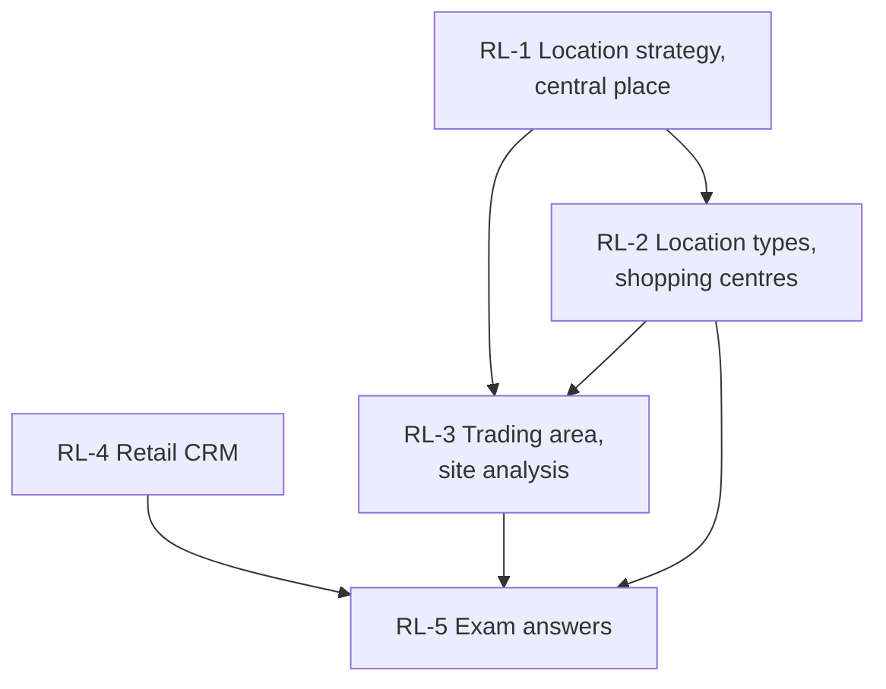

# Retail Management Unit 3: Retail Locations and Retail CRM, node map

ESE (assumed, no course plan): 50 marks, Section A 3 x 5, Section B 2 x 10, Section C one compulsory 15-mark case. Unit 3 mixes location theory and types (theory), trading area numericals (Reilly, Huff, scorecard, rent check) and retail CRM (RFM, lifecycle programmes, CLV). Examples are **illustrative**; slide material is tagged (syllabus) and additions (textbook) in each node.

## Nodes

| Node | Topic | Deps | Minutes | Exam focus |
|---|---|---|---|---|
| RL-1 | Location Strategy and Central Place Theory | none | 30 | yes |
| RL-2 | Types of Retail Locations and Shopping Centres | RL-1 | 40 | yes |
| RL-3 | Trading Area and Site Analysis | RL-1, RL-2 | 45 | yes |
| RL-4 | Retail CRM Databases, Segmentation and Programmes | none | 40 | yes |
| RL-5 | Unit 3 Exam Answers | RL-1 to RL-4 | 30 | yes |

Total reading time: about 185 minutes.

## Dependency graph

## Key frameworks and formulas

- Location theory, 9 factors: customers, purchasing power, access, traffic, competition, rent, visibility, parking, future development.
- Central Place Theory (Christaller): threshold = minimum demand; range = maximum travel distance.
- Trading area zones: primary about 60 to 65%, secondary about 20%, tertiary the rest. Region (which area) versus site (exactly where).
- Reilly: Ba/Bb = (Pa/Pb) x (Db/Da)²; breaking point = Dab ÷ (1 + √(Pa/Pb)). Example: 38.46% and 61.54%, 23.25 km.
- Huff: P = (S ÷ T^λ) ÷ Σ(S ÷ T^λ). Example: 25.81%, 64.52%, 9.68%.
- Saturation: IRS = (customers x spend per customer) ÷ existing floor space. Example ₹4,800 per sq ft.
- Rent check: ₹3 lakh a month is ₹36 lakh a year; HomeNest rent-to-sales 8.64% (power centre) versus 17.6% (mall).
- Matching: department store to regional mall, category specialist to power centre, grocery to strip centre, drugstore to stand-alone.
- CRM: goals retention, CLV, personalisation; RFM; five lifecycle programmes; CLV = margin x 1 ÷ (1 - retention): ₹15,000 (₹20,000 at 85%).
- Case answer (RL-5): Reilly 28.51% versus 71.49%; Huff 32.89% versus 21.61%; rent-to-sales 9.50% versus 11.57%.

## Open flags

- Indian mall rankings, US location-table figures, airport rent claims, the Sephora and JCPenney example and the DPDP rules are tagged [VERIFY] in RL-2 and RL-4.

## Links
- [[Retail Management MOC]]
