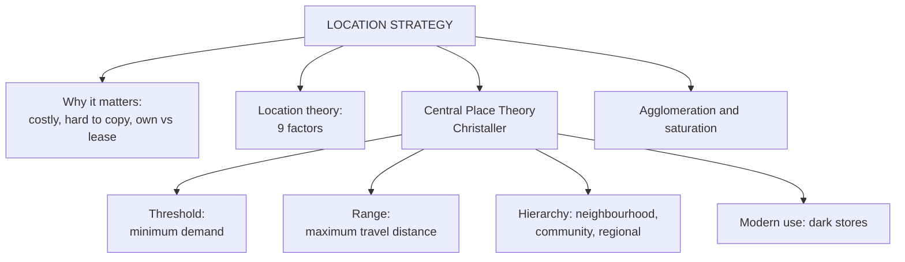

# RL-1: Location Strategy and Central Place Theory

Covers: why location is the strategic element of the retail mix, the nine location-theory factors, Christaller's Central Place Theory (threshold and range), agglomeration and saturation, and a threshold calculation. **(syllabus)** with one calculation added **(textbook)**.

## Where this fits in the ESE

There is no course plan for Retail Management, so the ESE pattern is assumed to match Bond Market: 50 marks, Section A 3 x 5, Section B 2 x 10, Section C one compulsory 15-mark case. Unit 3 starts the location theme. Expect a 5-mark "threshold and range" or "factors in location theory", and location reasoning inside the 15-mark case.

## Location in the retail mix

Location is one of six elements of the retail mix: merchandise assortment, pricing, communication mix, store display and design, customer service, and **location strategy**. The other five can be changed within weeks. A location is slow and costly to reverse, so it is a **strategic** choice. **(syllabus)**

- "Location, location, location": location is usually the first thing a customer weighs when choosing a store.
- A prime site is hard to copy once taken, so it builds **sustainable competitive advantage**.
- It is risky: the retailer must decide whether to **own or lease** the property.

## Location theory (class slide)

Location theory asks where a retailer should locate to attract the most customers and earn the most profit. The retailer should choose a site where the right customers are available, can reach the store easily, and where expected sales justify the cost of the location. **(syllabus)**

Nine factors, in the slide order:

| # | Factor | Question to ask |
|---|---|---|
| 1 | Customer population | How many potential customers live, work or study nearby? |
| 2 | Purchasing power | Can they afford the product? |
| 3 | Accessibility | Can they reach the store easily? |
| 4 | Traffic and pedestrian flow | How many people pass the site? |
| 5 | Competition | Threat, or a cluster that draws shoppers? |
| 6 | Rent and operating cost | Do expected sales justify the rent? |
| 7 | Visibility | Can customers see the store? |
| 8 | Parking and transportation | Is it convenient to reach? |
| 9 | Future development | Is the area likely to grow? |

Memory hook: **P-P-A-T-C-R-V-P-F** (people, purchasing power, access, traffic, competition, rent, visibility, parking, future).

## Theory of Central Place (class slide)

Associated with **Walter Christaller**. Think of a store as a **central place** that serves customers living around it. A large shopping centre draws from a wide area; a neighbourhood grocer draws from a small one. **(syllabus)**

- **Threshold:** the minimum number of customers or level of demand needed to keep the business viable. A bakery needs a small neighbourhood; a luxury car showroom needs a large purchasing-power base because the product is dear and bought rarely.
- **Range:** the maximum distance customers will travel for the product. Milk or bread: 5 to 10 minutes. A car, expensive jewellery, a specialised medical service: much farther.

Memory line: **Threshold = minimum demand. Range = how far they will go.**

| | Lower-order goods | Higher-order goods |
|---|---|---|
| Examples | Milk, bread, groceries | Furniture, jewellery, cars |
| Purchase frequency | High | Low |
| Range | Short | Long |
| Threshold | Small | Large |
| Fits | Convenience store, kirana, neighbourhood centre | Hypermarket, regional mall, showroom |

**Hierarchy of centres** (notes): neighbourhood centres (convenience goods) then community centres (shopping goods) then regional or super-regional malls (comparison and specialty goods). Indian version: kirana, neighbourhood supermarket, large-format mall.

## Companion ideas in your notes

- **Retail agglomeration:** retailers cluster (malls, high streets, market districts) because the cluster raises footfall for all. Two similar stores can co-locate on purpose.
- **Saturation:** a trade area with too many stores of one type for its demand. The quantified version is in RL-3.
- **Modern twist:** quick commerce and dark stores apply the same logic with a delivery-time range of 10 to 30 minutes and a demand threshold per dark store.
- **Limit:** the theory assumes static geography and travel distance. Online retail replaces "range" with delivery time and cost.

## Worked example: does the neighbourhood clear the threshold?

**Question (illustrative, fictional chain):** CrustCorner (fictional) needs annual sales of ₹1.2 crore to break even at a new bakery. A typical household spends ₹6,000 a year on bakery products, and the store expects to capture 20% of that spend. The primary zone has 7,500 households. Does it clear the threshold?

1. Value of one household to the store = ₹6,000 x 20% = ₹1,200 a year.
2. Households needed (threshold) = ₹1,20,00,000 ÷ ₹1,200 = **10,000 households**.
3. Sales from the primary zone = 7,500 x ₹1,200 = **₹90,00,000**, which is ₹30 lakh short of break-even.

| Item | Value |
|---|---|
| Threshold sales | ₹1,20,00,000 |
| Households needed | 10,000 |
| Households available | 7,500 |
| Shortfall | 2,500 households or ₹30,00,000 |

**Decision:** the site does not meet the threshold. **Interpretation:** either widen the range (a site on a main road, or add delivery) or raise capture share, otherwise choose a denser area. A bakery is a lower-order good, so range is short and cannot be stretched much.

## Traps

- Do not swap the two terms. Threshold is about demand volume. Range is about distance.
- Higher-order goods have both a larger range and a larger threshold, not a larger range with a smaller threshold.
- "Competition nearby" is not always bad. Cite agglomeration.

## What to remember

- Location is strategic because it is costly to reverse and hard to copy; the own-or-lease decision carries risk.
- Nine factors: customers, purchasing power, access, traffic, competition, rent, visibility, parking, future growth.
- Central Place Theory (Christaller): threshold = minimum demand, range = maximum travel distance.
- Higher-order goods (jewellery, cars) need a larger threshold and have a longer range than lower-order goods (milk, bread).
- Agglomeration explains clusters; quick commerce is a modern version of the same logic.

## Concept map

## Flashcards
Q: Name the six elements of the retail mix.
A: Merchandise assortment, pricing, communication mix, store display and design, customer service, location strategy.

Q: Why is a location decision strategic rather than tactical?
A: It is expensive and slow to reverse, and a prime site is hard for competitors to copy, so it can build sustainable competitive advantage.

Q: Define threshold in Central Place Theory.
A: The minimum number of customers or level of demand needed to keep a retail business viable.

Q: Define range in Central Place Theory.
A: The maximum distance customers are willing to travel to buy a product or service.

Q: Who proposed the Theory of Central Place?
A: Walter Christaller.

Q: Which goods have a long range and a large threshold?
A: Higher-order goods such as cars, jewellery and furniture.

Q: Give the nine factors in location theory.
A: Customer population, purchasing power, accessibility, traffic and pedestrian flow, competition, rent and operating cost, visibility, parking and transportation, future development.

Q: What is retail agglomeration?
A: The tendency of retailers to cluster, because clustering raises total footfall for all of them.

Q: A bakery needs ₹1.2 crore sales, earns ₹1,200 a year per household. How many households does it need?
A: 10,000 households (₹1,20,00,000 ÷ ₹1,200).

## Sources
- RM Unit 3 slides: location theory and Theory of Central Place
- Student notes: Location Strategy and Types of Retail Locations; Retail Location Theory and Theory of Central Place
- Levy and Weitz, Retailing Management; Berman and Evans, Retail Management
- Next node: [[Retail Management Unit 3 - RL-2 Types of Retail Locations and Shopping Centres]]
- [[Retail Management Unit 3 - Locations and CRM MOC (Node Map)]]
