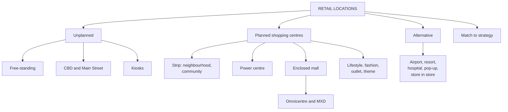

# RL-2: Types of Retail Locations and Shopping Centres

Covers: the four families of location, unplanned sites (freestanding, kiosk, CBD, main street), the seven planned shopping-centre types with Indian examples, malls, omnicentres and mixed-use developments, alternative locations, and matching format to location. **(syllabus)**

## Where this fits in the ESE

A 10-mark "types of retail locations and how a retailer chooses one" or a 5-mark "types of shopping centres". The matching table at the end is the quickest way to score in a case.

## Four families of location

- **Free-standing sites:** one store, unconnected to other retailers.
- **City or town locations:** inner city (Central Business District, CBD) and Main Street.
- **Shopping centres:** strip centres and malls (planned, owned and managed as one property).
- **Other opportunities:** airports, resorts, hospitals, store-within-a-store, pop-up stores.

A location type is chosen by weighing five trade-offs: **trade area size, occupancy cost, pedestrian and vehicle traffic, restrictions on operations, and customer convenience.** The core seesaw is **rent versus traffic**: low-traffic unplanned sites are cheap, high-traffic planned sites charge a premium.

## Unplanned locations

| Type | Advantages | Disadvantages | Indian example (slide) |
|---|---|---|---|
| **Free-standing** | Convenience, high visibility and vehicle traffic, modest rent, no neighbouring competitor, few restrictions | No foot traffic, no drawing power from neighbours | Brand Factory stores, IKEA Nagasandra (Bengaluru) |
| **CBD** | Business-hours crowds, transport hub, strong pedestrian flow, resident population | High security need, shoplifting, poor parking, quiet evenings and weekends | Connaught Place (New Delhi), Commercial Street and MG Road (Bengaluru) |
| **Main Street** | Lower rent than CBD, regular local footfall | Fewer stores, smaller selection, less entertainment, some planner restrictions | Main commercial street of a town or neighbourhood |
| **Merchandise kiosk** | Small, temporary selling station in walkways of malls, airports, stations, office lobbies | Limited range | Vending kiosks with touchscreen checkout in airports |

Legacy mall anchors are moving to free-standing formats (your notes name JCPenney, Sears, Walgreens in the US).

## The seven planned shopping-centre types

A shopping centre is a group of retail and commercial establishments **planned, developed, owned and managed as a single property**. The basic shape is a **mall** (enclosed, climate-controlled, walkway in front of stores) or a **strip centre** (a row of stores with parking in front). **(syllabus)**

| # | Type | One-line feature | India (slide) |
|---|---|---|---|
| 1 | **Neighbourhood and community (strip) centres** | Attached stores, front parking, everyday needs; low rent, limited trade area, no weather protection | Local sector market complexes, HUDA market strips (Gurgaon) |
| 2 | **Power centres** | Big-box stores and category specialists in an open-air setup; free-standing anchors, low rent, large trade area | IKEA-anchored retail parks in suburban Noida and Gurgaon; Mondeal Retail Park (Ahmedabad) |
| 3 | **Enclosed malls** | Multi-level, climate-controlled; department stores, specialty apparel, dining; anchors needed | Select CITYWALK (New Delhi), Phoenix Marketcity |
| 4 | **Lifestyle centres** | Open-air; upscale chain specialty stores, restaurants, entertainment, in affluent areas | CyberHub (Gurgaon), UB City (Bengaluru) |
| 5 | **Fashion and specialty centres** | High-end fashion; tourist areas or CBD; no anchor needed; high rent, large trade area | DLF Emporio (New Delhi), Jio World Plaza (Mumbai) |
| 6 | **Outlet centres** | Factory outlets and off-price retailers; very large trade area, low rent | Marathahalli Factory Outlets (Bengaluru), Ghitorni (Delhi) |
| 7 | **Theme and festival centres** | Entertainment, dining, tourist theme; historic or tourist sites | Dilli Haat (New Delhi), Kingdom of Dreams area (Gurgaon) |

**India's two-category view (notes):** *regional shopping centres or malls* (largest, two or more department-store anchors, enclosed, high rent; Ansal Plaza, Spencer's Plaza, DLF City) and *neighbourhood or community centres* (grocery, chemist, variety store, convenience goods).

Shopping-centre management controls parking, security, lighting, signage, advertising and events, and these shared costs shape the tenant's lease.

## Master comparison (notes, from a US textbook)

| Location | Trade area | Occupancy cost | Pedestrian traffic | Vehicle traffic | Restrictions |
|---|---|---|---|---|---|
| Free-standing | 3 to 7 miles | 15 to 30 ($/sq ft) | Low | High | Limited |
| CBD | Varies | 8 to 20 | High | Low | Limited to medium |
| Neighbourhood and community | 3 to 7 | 8 to 20 | Low | High | Medium |
| Power centre | 5 to 10 | 10 to 20 | Medium | Medium | Limited |
| Enclosed mall | 5 to 25 | 10 to 70 | High | Low | High |
| Lifestyle | 5 to 15 | 15 to 35 | Medium | Medium | Medium to high |
| Fashion and specialty | 5 to 15 | 10 to 70 | High | Low | High |
| Outlet | 25 to 75 | 8 to 15 | High | High | Limited |
| Theme and festival | n/a | 20 to 70 | High | Low | Highest |

The figures are US miles and US dollars from the textbook behind your notes **[VERIFY]** for any current value. Do not memorise them. Learn the **pattern**: occupancy cost and pedestrian traffic rise together; vehicle traffic moves opposite to pedestrian traffic; outlet centres have the biggest trade area (people travel for the discount) with low rent.

## Malls, omnicentres and mixed-use developments

- **Regional vs super-regional (your notes):** regional below 1 million sq ft, super-regional above. The textbook (ICSC) classifies by smaller thresholds. Your note's version is the one in the notes; if the exam asks, give it and add "classification varies by source" **[VERIFY]**.
- **Indian mall sizes (notes):** DLF Noida about 20 lakh sq ft, Lulu Kochi 17 lakh, Ambience Gurgaon 16 lakh, Phoenix Market City Mumbai 10 lakh, Mantri Square Bengaluru 8.9 lakh. Rankings change often **[VERIFY]**; quote two or three at most.
- **Advantages of malls:** many stores and assortments, draws shoppers, acts as "Main Street", no weather concern, comfortable, uniform hours. **Disadvantages:** high occupancy cost, tenants resist management control, intense competition.
- **Challenges:** time-pressed shoppers, limited growth in apparel, ageing malls, fewer anchor tenants. **Responses:** make shopping enjoyable (seating, play areas), become a food destination, tailor to demographics, renovate.
- **Omnicentre:** combines enclosed mall, lifestyle centre and power centre in one development to raise pedestrian traffic and trip length and capture cross-shoppers.
- **Mixed-use development (MXD):** shopping, offices, hotels, residences, civic and convention centres together, so people can work, live and play nearby. Risk: it depends on all uses doing well at once.

## Alternative locations

- **Airports:** captive audience with idle time. Notes: rents about 20% above malls and sales per sq ft 3 to 4 times mall levels **[VERIFY]** (textbook figure, US). Best where there are many connecting flights.
- **Resorts:** captive, well-off customers with time to shop.
- **Hospitals:** patients and visitors cannot leave; gift shops.
- **Store-within-a-store:** a small retailer inside a larger host (coffee bars, banks, clinics inside a grocer). Your notes cite Sephora inside JCPenney **[VERIFY]** as the partnership has changed; the idea is a low-risk way to test a market.
- **Pop-up stores:** temporary; seasonal demand or market tests without a long lease.

## Matching location to strategy (the table to reproduce)

| Retail format | Typical location |
|---|---|
| Department stores | Regional mall |
| Specialty apparel | CBD, regional malls |
| Category specialists | Power centres, free-standing |
| Grocery stores | Strip shopping centres |
| Drug stores | Stand-alone |

Reasoning: the location must fit the target customer's shopping behaviour, the size of the target market and the retailer's position. A drugstore is a frequent, convenience purchase, so it wants easy access. A department store is a destination for comparison shopping, so it wants the mall's traffic.

## Worked example: power centre or mall for a category specialist?

**Question (illustrative, fictional chain):** HomeNest (fictional), a furniture category specialist, needs 20,000 sq ft. Option 1: a power centre at ₹90 per sq ft per month, expected annual sales ₹25 crore. Option 2: an enclosed mall at ₹220 per sq ft per month, expected annual sales ₹30 crore. Which site?

1. Annual rent, power centre = 20,000 x ₹90 x 12 = **₹2,16,00,000** (₹2.16 crore).
2. Annual rent, mall = 20,000 x ₹220 x 12 = **₹5,28,00,000** (₹5.28 crore).
3. Rent-to-sales, power centre = 2.16 ÷ 25 = **8.64%**. Mall = 5.28 ÷ 30 = **17.6%**.

| | Power centre | Enclosed mall |
|---|---|---|
| Rent per year | ₹2.16 crore | ₹5.28 crore |
| Expected sales | ₹25 crore | ₹30 crore |
| Rent-to-sales | 8.64% | 17.60% |
| Traffic | Medium, drive-in | High, pedestrian |
| Fit with format | Category specialist (matching table) | Department and apparel |

**Decision:** choose the power centre. **Interpretation:** the mall adds ₹5 crore of sales but ₹3.12 crore of extra rent, and furniture is a destination purchase where shoppers come on purpose, so mall footfall is worth less to this format. The matching table gives the same answer.

## Traps

- Putting a drugstore in a mall or a category specialist only in malls reverses the matching logic.
- Free-standing is not "no traffic": it has high **vehicle** traffic and low **pedestrian** traffic.
- Outlet centres have low rent but a huge trade area. Do not call them "convenient".

## What to remember

- Four families: free-standing, city or town (CBD, Main Street), shopping centres, other (airport, resort, hospital, store-within-store, pop-up).
- Seven planned centre types: neighbourhood and community, power, enclosed mall, lifestyle, fashion and specialty, outlet, theme and festival.
- Rent versus traffic is the central trade-off; vehicle and pedestrian traffic move opposite.
- Omnicentres combine three centre types; MXDs add offices, hotels and housing.
- Match: department store to regional mall, category specialist to power centre, grocery to strip centre, drugstore to stand-alone.

## Concept map

## Flashcards
Q: What are the five trade-offs when choosing a location type?
A: Trade area size, occupancy cost, pedestrian and vehicle traffic, restrictions on operations, and customer convenience.

Q: Which seven shopping-centre types does the deck list?
A: Neighbourhood and community, power, enclosed malls, lifestyle, fashion and specialty, outlet, theme and festival.

Q: What is a power centre?
A: An open-air collection of big-box stores and category specialists with free-standing anchors, low rent, modest traffic and a large trade area.

Q: Why does an outlet centre have the largest trade area?
A: Shoppers travel specifically for the discount, so it draws from 25 to 75 miles despite low rent.

Q: How do omnicentres differ from MXDs?
A: An omnicentre combines mall, lifestyle and power centres; an MXD combines retail with offices, hotels, residences and civic uses.

Q: Which location suits a category specialist and which a drugstore?
A: Category specialist: power centre or free-standing. Drugstore: stand-alone.

Q: Why do airports give high sales per sq ft?
A: A captive audience with idle time, especially at airports with many connecting flights.

Q: Main Street versus CBD: what is the cost difference?
A: Main Street has lower occupancy cost but fewer stores, smaller selection and less traffic.

Q: HomeNest example: rent-to-sales at the power centre and at the mall?
A: 8.64% at the power centre (₹2.16 crore on ₹25 crore) and 17.6% at the mall (₹5.28 crore on ₹30 crore).

## Sources
- RM Unit 3 slides: free standing, urban or CBD, main street, seven shopping-centre types
- Student notes: Location Strategy; Unplanned Retail Locations; Types of Planned Shopping Centers; Shopping Malls, Omnicenters and MXDs; Alternative Retail Locations
- Previous node: [[Retail Management Unit 3 - RL-1 Location Strategy and Central Place Theory]]
- Next node: [[Retail Management Unit 3 - RL-3 Trading Area and Site Analysis]]
- [[Retail Management Unit 3 - Locations and CRM MOC (Node Map)]]
