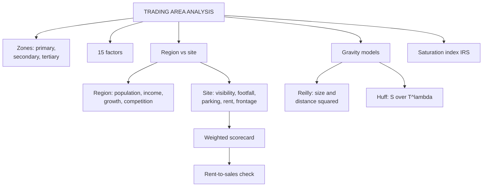

# RL-3: Trading Area and Site Analysis

Covers: the trading area and its three zones, the 15 factors, region demand versus site attractiveness, the weighted site scorecard, Reilly's law, the Huff model and the saturation index, with worked numericals. **(syllabus)** for the factors and the region-site split; the gravity models and saturation formula are **(textbook)** additions because the slides and notes name them without numbers.

## Where this fits in the ESE

The numerical heart of Unit 3. Likely forms: a 5-mark "trading area analysis" or "region versus site", a 10-mark "trading area analysis with gravity models", or a scorecard sum inside the 15-mark case. No phone calculators, so practise the arithmetic by hand.

## Trading area

A **trading area** is the geographical area from which a store attracts most of its customers. Example from the slide: a supermarket in HSR Layout, Bengaluru, draws from HSR Layout, Bommanahalli, Agara and nearby residential communities. **Trading area analysis** studies who lives there, how much they spend, what they buy and how easily they can reach the store. **(syllabus)**

Zones (notes):

| Zone | Share of customers | Pattern |
|---|---|---|
| Primary | about 60 to 65% | Closest, densest patronage |
| Secondary | about 20% | Farther out |
| Tertiary or fringe | the remainder | Wide, sparse |

Process (notes): define boundaries (drive time, distance rings, customer spotting) then profile demographics and psychographics, then estimate demand (population x per-capita spend), adjust for competitive saturation, forecast capture rate. Retail chains use GIS mapping and watch for **cannibalisation** (a new store simply diverting sales from your own nearby store).

## The 15 factors (class slide)

Group them to remember:

- **Customers:** population, demographics, income and purchasing power, lifestyle, customer spending pattern.
- **Competition and image:** competition, store image and positioning.
- **Access:** accessibility, traffic and footfall, parking, distance from customers.
- **Growth and surroundings:** future growth, commercial development (offices, schools, hospitals).
- **Economics:** sales potential, cost of location.

Slide examples worth quoting: 20,000+ households for a supermarket; luxury jewellery needs high-income households; pharmacy near a hospital; customers travel 5 to 10 minutes for groceries but much farther for a car.

## Region versus site (class slide)

| | Region | Site |
|---|---|---|
| Scope | Large geographical area | Specific location |
| Question | "Which area should I enter?" | "Exactly where should I open?" |
| Analyse | Population, income, demographics, lifestyle, economic growth, competition, future development | Visibility, footfall, parking, accessibility, rent, store frontage, nearby businesses |

Slide example, women's fashion store: Step 1 region (HSR Layout, Koramangala, Whitefield or Yelahanka?) using population, income, target customers, competition, growth. Step 2 site inside the chosen region (Main Street, shopping mall or residential street?) using footfall, visibility, accessibility, parking, rent, competition.

**Best Region + Best Site = Better Retail Location.** A great site in a weak region fails; a strong region with a poor site also fails.

Region factors, 13 (notes): population size, population growth, demographics, income, employment, lifestyle, household size, consumer spending, competition, tourism, economic conditions, infrastructure, future development.
Site factors, 14 (notes): visibility, accessibility, footfall, vehicle traffic, parking, frontage, rent, site size, competition nearby, complementary stores, safety, neighbourhood quality, future development, lease conditions.

Co-tenancy: a "generator" anchor (supermarket) lifts footfall for small neighbours. A destination format (furniture) can accept lower visibility; an impulse convenience format cannot.

## Weighted site scorecard

Rate each factor, multiply by its weight, add. Weights reflect the format.

### Worked example: women's fashion store in HSR Layout

**Question (illustrative):** score three candidate sites (1 to 10; 10 best; for rent, 10 means cheapest).

| Factor | Weight | Main Street | Mall | Residential street |
|---|---|---|---|---|
| Footfall | 0.25 | 8 | 9 | 5 |
| Visibility | 0.20 | 9 | 8 | 4 |
| Rent | 0.20 | 4 | 3 | 8 |
| Parking | 0.15 | 4 | 7 | 8 |
| Competition | 0.10 | 5 | 6 | 8 |
| Future growth | 0.10 | 7 | 8 | 6 |
| **Weighted score** | 1.00 | **6.40** | **6.90** | **6.25** |

1. Main Street: 2.00 + 1.80 + 0.80 + 0.60 + 0.50 + 0.70 = 6.40.
2. Mall: 2.25 + 1.60 + 0.60 + 1.05 + 0.60 + 0.80 = 6.90.
3. Residential: 1.25 + 0.80 + 1.60 + 1.20 + 0.80 + 0.60 = 6.25.

**Decision:** the mall scores highest. **Interpretation:** the lead over Main Street is only 0.50, and the mall's rent score is the weakest. Confirm with a rent-to-sales check (below) before signing, and test whether the ranking survives if the rent weight rises to 0.30.

## Reilly's law of retail gravitation (textbook)

Two competing centres divide the trade of an intermediate town in proportion to their **populations** and the **inverse square of the distances**:

**Ba / Bb = (Pa / Pb) x (Db / Da)²**

where B is the share of trade drawn, P is population, D is distance from the intermediate town. The **breaking point** (where the two centres draw equally) from the smaller city B is:

**Breaking point = Dab / (1 + √(Pa / Pb))**

### Worked example: Reilly's law

**Question (illustrative):** City A has 3,00,000 people, City B has 1,20,000, and they are 60 km apart. Town C lies on the road between them, 40 km from A and 20 km from B. How is C's retail trade split, and where is the breaking point?

1. Ba/Bb = (3,00,000 ÷ 1,20,000) x (20 ÷ 40)² = 2.5 x 0.25 = **0.625**.
2. A's share = 0.625 ÷ 1.625 = **38.46%**. B's share = **61.54%**.
3. Breaking point from B = 60 ÷ (1 + √2.5) = 60 ÷ 2.5811 = **23.25 km** (36.75 km from A).

**Decision:** C is 20 km from B, inside B's side of the breaking point (23.25 km), so B wins most of C's trade. **Interpretation:** A is 2.5 times larger, yet B wins because distance is squared. A retailer in A who wants C's customers must make A more attractive than size alone, for example a destination format, or open nearer.

## Huff gravity model (textbook)

The probability that a consumer in zone i shops at store j:

**P(ij) = [ Sj / Tij^λ ] ÷ Σ [ Sk / Tik^λ ]**

S is store size (attractiveness), T is travel time, λ is how strongly distance deters (commonly about 2; use the faculty's value if given). Expected sales = P x households x spend.

### Worked example: Huff model

**Question (illustrative):** a zone has 10,000 households spending ₹5,000 a month on the category. Three stores: A 40,000 sq ft, 10 minutes away; B 25,000 sq ft, 5 minutes; C 60,000 sq ft, 20 minutes. Take λ = 2.

| Store | Size S | Time T | S ÷ T² | Probability | Monthly sales |
|---|---|---|---|---|---|
| A | 40 | 10 | 0.400 | 25.81% | ₹1.29 crore |
| B | 25 | 5 | 1.000 | 64.52% | ₹3.23 crore |
| C | 60 | 20 | 0.150 | 9.68% | ₹0.48 crore |
| Total | | | 1.550 | 100% | ₹5.00 crore |

1. Zone spend = 10,000 x ₹5,000 = ₹5,00,00,000.
2. Share of A = 0.400 ÷ 1.550 = 25.81%; B = 1.000 ÷ 1.550 = 64.52%; C = 0.150 ÷ 1.550 = 9.68%.
3. Sales: A ₹1,29,03,226; B ₹3,22,58,065; C ₹48,38,710.

**Interpretation:** the smallest store wins because it is closest. C is the biggest but has 9.68%. With λ = 1 the same data give 33.3%, 41.7% and 25.0%: a low λ lets size matter more. Always state λ.

## Index of retail saturation (textbook)

**IRS = (C x RE) ÷ RF**, where C is customers (households), RE is retail expenditure per customer for the category, RF is existing retail floor space. It is sales potential per sq ft.

**Example (illustrative):** 40,000 households x ₹24,000 a year = ₹96 crore; existing space 2,00,000 sq ft; IRS = **₹4,800 per sq ft**. A new 20,000 sq ft store lowers it to ₹96,00,00,000 ÷ 2,20,000 = **₹4,364 per sq ft**. Compare with the sales per sq ft a store needs to break even.

## The rent trap in the slide examples

The slide lists "Rs 20 lakh annual sales" and "Rs 3 lakh monthly rent" as two separate examples. Do not combine them: ₹3 lakh a month is **₹36 lakh a year**, which is 180% of ₹20 lakh sales. If rent should be about 10% of sales, a ₹3 lakh monthly rent needs annual sales of ₹3.6 crore. The point of the slide is the check itself: **expected sales must justify the rent.**

## Limits (notes)

Models assume stable shopping and travel patterns. E-commerce, quick commerce and remote work move trading-area boundaries faster than models update, and quick commerce shrinks the effective area to a delivery radius.

## What to remember

- Trading area: primary (60 to 65%), secondary (about 20%), tertiary. 15 factors across customers, competition, access, growth, economics.
- Region asks "which area", site asks "exactly where"; best region plus best site makes the best location.
- Scorecard: weight x rating, sum; verify the winner with rent-to-sales.
- Reilly: Ba/Bb = (Pa/Pb) x (Db/Da)²; breaking point = Dab ÷ (1 + √(Pa/Pb)). Example gives 38.46% and 61.54%, 23.25 km.
- Huff: share = (S ÷ T^λ) ÷ sum; example gives 25.81%, 64.52%, 9.68%.
- Rent check: ₹3 lakh a month is ₹36 lakh a year.

## Concept map

## Flashcards
Q: Define a trading area.
A: The geographical area from which a store attracts most of its customers.

Q: Give the three trading-area zones and shares.
A: Primary about 60 to 65%, secondary about 20%, tertiary or fringe the remainder.

Q: Region versus site in one line each.
A: Region: which large area to enter. Site: where exactly to open within it.

Q: What is the "best location" equation on the slide?
A: Best region + best site = better retail location.

Q: State Reilly's law.
A: Ba/Bb = (Pa/Pb) x (Db/Da)²: trade splits by population and inverse square of distance.

Q: Reilly example: A 3,00,000, B 1,20,000, C 40 km from A and 20 km from B. A's share?
A: 0.625 ratio, so A gets 38.46% and B 61.54%.

Q: Breaking point formula?
A: Distance from the smaller city = Dab ÷ (1 + √(Pa/Pb)); 60 km, populations 3,00,000 and 1,20,000 gives 23.25 km from B.

Q: What do S, T and λ mean in the Huff model?
A: S is store size, T is travel time, λ is the distance-deterrence exponent (often 2).

Q: What is cannibalisation?
A: A new store diverting sales from the retailer's own nearby store instead of creating new demand.

Q: Why are ₹20 lakh sales and ₹3 lakh monthly rent not compatible?
A: Rent is ₹36 lakh a year, which exceeds the sales; at 10% rent-to-sales the store would need ₹3.6 crore.

## Sources
- RM Unit 3 slides: trading area analysis, 15 factors, region versus site, women's fashion store example
- Student notes: Trading Area Analysis; Factors Affecting Site Attractiveness and Regional Demand
- Reilly (law of retail gravitation); Huff (probabilistic trade-area model); Levy and Weitz
- Previous node: [[Retail Management Unit 3 - RL-2 Types of Retail Locations and Shopping Centres]]
- Next node: [[Retail Management Unit 3 - RL-4 Retail CRM Databases Segmentation and Programmes]]
- [[Retail Management Unit 3 - Locations and CRM MOC (Node Map)]]
