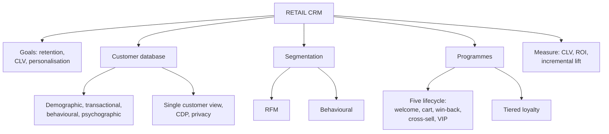

# RL-4: Retail CRM, Databases, Segmentation and Programmes

Covers: what retail CRM is, the Starbucks loop, the four data types and capture methods, the single customer view, RFM segmentation, the five lifecycle programmes, tiered loyalty, and the numbers (RFM scoring, CLV, incrementality). **(syllabus)** with the CLV formulae **(textbook)**.

## Where this fits in the ESE

A 5-mark "CRM and its goals" or "five lifecycle programmes", or a 10-mark "database to programme" answer. The Starbucks case is a ready-made 5-marker. Keep the answer in the retail setting (stores, loyalty, POS capture).

## What CRM is (class slides)

**CRM** is a strategic framework for managing a company's interactions with current and potential customers. It integrates technology, processes and data to track every interaction across the customer's lifecycle. **(syllabus)**

Three goals on the slide: **customer retention** (keeping a customer is cheaper than winning a new one), **maximising Customer Lifetime Value (CLV)**, and **personalisation** of messages, recommendations and offers. Example: Amazon analyses purchase history, recommends products and personalises emails for millions of users.

**Three-step CRM loop (the Starbucks case):**

1. **Collect data:** paying through the Rewards App captures purchase history, preferred stores, peak times (8:00 AM on weekdays), favourite drinks.
2. **Identify targets:** segment into "Morning Commuters" (coffee every weekday) and "Occasional Afternoon Visitors" (bakery on weekends).
3. **Develop programmes:** a push notification at 2:00 PM to the afternoon visitor: "Earn 20 Bonus Stars when you try a Nitro Cold Brew this afternoon."

Your notes add a fourth step, **measure and refine** (retention, CLV, programme ROI). Quote it as the closing step.

## Customer database

| Data type | Examples |
|---|---|
| Demographic | Age, gender, income, location, occupation |
| Transactional | Past purchases, total spent, frequency, returns |
| Behavioural | Pages visited, app paths, email opens, abandoned carts |
| Psychographic | Interests, values, survey feedback |

**Capture methods (slide):** e-commerce lead magnets (15% off the first order for an email address), POS capture (phone number or email at checkout for a digital receipt), in-app preferences at onboarding (pick three favourite genres). Touchpoints: POS, loyalty sign-up, website or app registration, customer service, social media.

**Concepts (notes):**
- **Single customer view (SCV):** all touchpoint data on one person in a unified profile; essential for omnichannel.
- **Customer Data Platform (CDP):** the central system that integrates channels.
- **Data hygiene:** deduplication, validation, updating.
- **Progressive profiling:** collect a little at each interaction rather than everything at sign-up.
- **Privacy:** consent, storage and use are regulated (GDPR in Europe; India's Digital Personal Data Protection Act, 2023, whose rules and timelines should be checked **[VERIFY]**). Loyalty enrolment is the most common permissioned way to build a database. Indian grocery and pharmacy chains often link billing to a mobile number.

## Segmentation: RFM

- **Recency:** how recently did the customer buy?
- **Frequency:** how often?
- **Monetary:** how much do they spend?

**Behavioural segmentation** groups by intent (bargain hunters versus premium buyers). Slide examples: a B2B software firm targets free-trial users who actively use power features; Louis Vuitton uses RFM to find VIPs for private previews.

### Worked example: RFM scoring

**Question (illustrative):** score five customers, 1 to 5 on each of R, F and M.

Scoring rule: Recency (days since last purchase): up to 15 = 5, up to 60 = 4, up to 120 = 3, up to 180 = 2, above 180 = 1. Frequency (orders a year): 20 or more = 5, 10 to 19 = 4, 5 to 9 = 3, 2 to 4 = 2, 1 = 1. Monetary (₹ a year): 40,000 or more = 5, 20,000 to 39,999 = 4, 5,000 to 19,999 = 3, 1,000 to 4,999 = 2, below 1,000 = 1.

| Customer | Days since last | Orders | Spend (₹) | R | F | M | Total |
|---|---|---|---|---|---|---|---|
| C1 | 5 | 24 | 48,000 | 5 | 5 | 5 | 15 |
| C2 | 40 | 6 | 9,000 | 4 | 3 | 3 | 10 |
| C3 | 120 | 2 | 3,000 | 3 | 2 | 2 | 7 |
| C4 | 10 | 12 | 30,000 | 5 | 4 | 4 | 13 |
| C5 | 300 | 1 | 1,500 | 1 | 1 | 2 | 4 |

**Decision:** C1 is a VIP (loyalty and VIP programme), C4 is loyal (cross-sell, tier upgrade), C2 is a growth prospect (nudge frequency), C3 is lapsing (win-back now), C5 is effectively lost (low-cost win-back only). **Interpretation:** the aim is to put the deepest personalisation and reward spend where it changes behaviour, not to treat all customers equally.

## Developing and implementing CRM programmes

**Five implementation steps (slide):** define objectives (for example reduce churn by 10% or lift repeat purchase within 30 days), select CRM technology (Salesforce, HubSpot, Zoho, Klaviyo), map the customer journey and triggers, execute lifecycle campaigns, analyse and optimise (open rate, conversion, CLV, ROI).

**Five lifecycle programmes (slide):**

| Programme | Objective | Trigger | Action | Examples (slide) |
|---|---|---|---|---|
| **Welcome and onboarding** | Build early engagement, habit | New account | Email or push sequence with tutorials and welcome offer | Canva, Duolingo, LinkedIn profile guide, a bank's app-setup guide |
| **Cart abandonment** | Recapture high-intent shoppers | Items in cart, no purchase | Message within 15 minutes to 3 hours with cart link or small discount | Amazon, Zara, Sephora, Zomato and Swiggy |
| **Win-back** | Reactivate dormant customers | No activity for 30 to 60+ days | "We miss you" offer | Netflix, Cult.fit (14 days), Paytm and PhonePe cashback prompts |
| **Cross-sell and up-sell** | Raise average order value and CLV | Purchase completed | Complementary add-on or upgrade | Lenskart lenses 3 days after glasses; Apple accessories |
| **Loyalty and VIP** | Reward top spenders, build advocacy | Spend threshold or tier reached | Perks, private invites, priority support | Starbucks Rewards, Sephora Beauty Insider, Marriott Bonvoy |

**Programme types (notes):** loyalty or rewards, personalised marketing, community and engagement, win-back. **Tiered loyalty** (silver, gold, platinum) encourages upward migration. Price-sensitive customers respond to discounts; premium customers respond to exclusivity.

## CLV and incrementality (textbook)

**Simple CLV** = annual gross margin per customer x expected lifetime, with lifetime = 1 ÷ (1 - retention rate).

**Discounted, future margins only:** CLV = m x r ÷ (1 + d - r).

### Worked example: CLV and the value of retention

**Question (illustrative):** a customer spends ₹12,000 a year at a 25% gross margin. Retention is 80%. Acquisition cost (CAC) is ₹3,000. Discount rate 10%.

1. Annual margin m = ₹12,000 x 25% = **₹3,000**.
2. Expected lifetime = 1 ÷ (1 - 0.80) = **5 years**. Simple CLV = ₹3,000 x 5 = **₹15,000**. CLV : CAC = 5 : 1.
3. Discounted (future margins) = 3,000 x 0.8 ÷ (1 + 0.10 - 0.80) = **₹8,000**.
4. Raise retention to 85%: lifetime = 1 ÷ 0.15 = 6.67 years; simple CLV = ₹3,000 ÷ 0.15 = **₹20,000** (up 33%); CLV : CAC = 6.67 : 1.

**Decision and interpretation:** five points of retention add a third to customer value, which is why CRM spends on retention before acquisition. Always say whether CLV is discounted.

### Worked example: is the loyalty programme incremental?

**Question (illustrative):** a loyalty offer goes to 10,000 members; a holdout group gets nothing. Members average 4.2 visits a quarter, the holdout 3.9. Margin per visit ₹150; programme cost ₹6,00,000.

1. Lift = 4.2 - 3.9 = 0.3 visits per member = 7.69% over the holdout.
2. Incremental visits = 0.3 x 10,000 = **3,000**.
3. Incremental margin = 3,000 x ₹150 = **₹4,50,000**, against cost ₹6,00,000: **a loss of ₹1,50,000**.

**Interpretation:** total participation looked healthy but true behavioural lift does not pay for the programme. Notes: judge CRM on **incremental** behaviour, not enrolment numbers.

## Correction to your notes

- Your note lists "Tata's InfinITI" as a loyalty ecosystem. Infiniti Retail is the Tata Group company behind Croma, a retailer, not a loyalty scheme; the group's loyalty and super-app platform is Tata Neu with NeuCoins **[VERIFY]**. Write "Tata Neu" in the exam.
- Your note says DMart's "loyalty mechanics" are evolving. DMart is better known for everyday low pricing than for a loyalty programme **[VERIFY]**; use Sephora or Starbucks as the loyalty example.

## What to remember

- CRM goals: retention, CLV, personalisation; loop = collect, identify, programme (then measure).
- Four data types: demographic, transactional, behavioural, psychographic; SCV and a CDP unify them; progressive profiling reduces friction.
- RFM = recency, frequency, monetary; behavioural segmentation groups by intent.
- Five lifecycle programmes: welcome, cart abandonment, win-back, cross-sell and up-sell, loyalty and VIP.
- CLV = margin x lifetime; lifetime = 1 ÷ (1 - retention). Example: ₹15,000, or ₹20,000 at 85% retention.
- Judge programmes by incremental lift, not enrolment.

## Concept map

## Flashcards
Q: Define retail CRM and give its three goals.
A: A strategic approach integrating technology, process and data to manage every customer interaction; goals are retention, maximising CLV and personalisation.

Q: Describe the Starbucks CRM loop.
A: Collect data via the Rewards App, identify segments (morning commuters, afternoon visitors), then send targeted promotions such as a 2:00 PM bonus-stars notification.

Q: Name the four types of customer data.
A: Demographic, transactional, behavioural, psychographic.

Q: What is a single customer view?
A: A unified profile of one customer built from all touchpoints, essential for omnichannel retail.

Q: What does RFM stand for?
A: Recency, frequency, monetary value of purchases.

Q: List the five lifecycle CRM programmes.
A: Welcome and onboarding, cart abandonment, win-back, cross-sell and up-sell, loyalty and VIP.

Q: What triggers a win-back programme?
A: No activity or purchase for 30 to 60 or more days.

Q: How is simple CLV calculated, and what is it for ₹3,000 margin and 80% retention?
A: Annual margin x 1 ÷ (1 - retention): ₹3,000 x 5 = ₹15,000.

Q: What does a retention rise from 80% to 85% do to that CLV?
A: Lifetime becomes 6.67 years and CLV ₹20,000, up 33%.

Q: Why can a loyalty programme with high enrolment still fail?
A: It may reward purchases customers would have made anyway; measure incremental lift against a holdout group.

## Sources
- RM Unit 3 slides: Overview of CRM, Starbucks case, collecting customer database, identifying target customers, developing and implementing CRM programmes
- Student notes: CRM in Retail Overview; Building and Using Customer Databases; Developing and Implementing CRM Programs
- Kumar and Reinartz, Customer Relationship Management
- Next node: [[Retail Management Unit 3 - RL-5 Unit 3 Exam Answers]]
- [[Retail Management Unit 3 - Locations and CRM MOC (Node Map)]]
