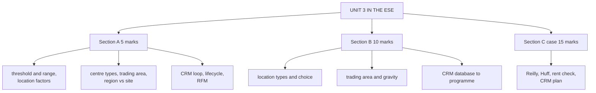

# RL-5: Unit 3 Exam Answers

Covers: what the ESE will ask from Unit 3, 5-mark and 10-mark skeletons, and a 15-mark case layout with a model answer. Numbers come from RL-1 to RL-4.

## What the test will ask

There is no course plan for Retail Management, so the pattern is **assumed** to match Bond Market: 50 marks, Section A 3 x 5 (internal choice), Section B 2 x 10 (internal choice), Section C one compulsory 15-mark case. Confirm with the faculty. Unit 3 is mostly theory with one numerical family (gravity models, scorecard, rent check, RFM or CLV). Expect at least one 5- or 10-marker from locations and one from CRM.

## Five-mark answer skeletons

**1. Threshold and range (RL-1).** Christaller; central place; threshold = minimum demand; range = maximum travel distance; one example each (bakery versus luxury car; milk versus diamond necklace); higher-order goods need both more.

**2. Factors in location theory (RL-1).** Nine factors in one line each: customers, purchasing power, access, traffic, competition, rent, visibility, parking, future development; close with "sales must justify cost".

**3. Seven shopping-centre types (RL-2).** One feature and one Indian example each: strip (HUDA markets), power (IKEA parks), enclosed (Select CITYWALK), lifestyle (CyberHub), fashion (DLF Emporio), outlet (Marathahalli), theme (Dilli Haat).

**4. Trading area analysis (RL-3).** Definition; primary, secondary, tertiary zones; the question "who lives here, how much do they spend, what do they buy, how easily can they reach me"; factor groups; one limit.

**5. Region versus site (RL-3).** Table of scope, question and factors; women's fashion store in HSR Layout; "best region + best site".

**6. CRM and its loop (RL-4).** Definition; three goals; Starbucks collect, identify, programme; measure.

**7. Five lifecycle programmes (RL-4).** Table: objective, trigger, action, example.

**8. RFM (RL-4).** Three letters; scoring idea; two segments and what to do with each.

## Ten-mark answer skeletons

**A. Types of retail locations and how a retailer chooses (RL-2).** Four families, then the five trade-offs, the rent versus traffic seesaw, unplanned sites with pros and cons, seven planned centres, alternative locations, the matching table, and a worked choice (for example HomeNest: power centre 8.64% rent-to-sales versus mall 17.6%).

**B. Trading area analysis with gravity models (RL-3).** Definition and zones, factors, region then site, scorecard, Reilly's law with formula and a one-line number, Huff model with formula, limits (e-commerce, quick commerce).

**C. Retail CRM from database to programme (RL-4).** Goals, data types and capture, SCV and privacy, RFM, five lifecycle programmes, tiers, CLV and incrementality, one Indian and one global example.

**D. Choosing a location: region, then site (RL-1, RL-3).** Central place logic for the order of goods, nine factors, region demand, site attractiveness, scorecard, rent check, decision.

## Fifteen-mark case layout (location and CRM)

1. **Region (4):** apply Reilly's law and state which centre wins and why.
2. **Site (4):** Huff shares and expected sales for two sites, or a weighted scorecard.
3. **Economics (3):** rent-to-sales and a simple margin-after-rent comparison.
4. **CRM recommendation (4):** data capture, segmentation, two programmes, how to measure.

### Model answer, laid out as the exam answer

**Data (illustrative, fictional chain):** BrightBasket (fictional) is a supermarket chain wanting a new 30,000 sq ft store to serve shoppers of Town C. City A has 6,00,000 people, Town B has 1,50,000; A and B are 50 km apart, and C lies between them, 38 km from A and 12 km from B. In B's catchment there are 8,000 households spending ₹6,000 a month on groceries. Competitors: X (45,000 sq ft, 10 minutes) and Y (20,000 sq ft, 4 minutes). Site A for BrightBasket is 6 minutes from the catchment at rent ₹50 per sq ft per month; Site B is 8 minutes at ₹40. Gross margin 20%. Take λ = 2.

1. **Region (Reilly):** Ba/Bb = (6,00,000 ÷ 1,50,000) x (12 ÷ 38)² = 4 x 0.0997 = **0.399**. A draws **28.51%** of C's trade, B **71.49%**. Breaking point from B = 50 ÷ (1 + √4) = **16.67 km**; C at 12 km lies inside B's zone. **Region choice: Town B**, because proximity outweighs A's fourfold size.
2. **Site (Huff):** Site A: S ÷ T² = 30 ÷ 36 = 0.833; X = 45 ÷ 100 = 0.450; Y = 20 ÷ 16 = 1.250; total 2.533. Share = 0.833 ÷ 2.533 = **32.89%**. Site B (8 minutes): 30 ÷ 64 = 0.469; total 2.169; share **21.61%**.
3. **Sales and rent:**

| | Site A | Site B |
|---|---|---|
| Huff share | 32.89% | 21.61% |
| Annual sales (8,000 x ₹72,000 x share) | ₹18.95 crore | ₹12.45 crore |
| Annual rent (30,000 sq ft x rate x 12) | ₹1.80 crore | ₹1.44 crore |
| Rent-to-sales | 9.50% | 11.57% |
| Gross margin (20%) less rent | ₹1.99 crore | ₹1.05 crore |

4. **CRM recommendation:** capture the mobile number at billing and enrol shoppers in a tiered loyalty scheme; segment by RFM; run a welcome sequence for new members, a win-back message after 30 to 60 days of silence and a cross-sell (for example private-label staples) after each basket; measure incremental visits against a holdout group, since CLV and lift justify the spend.

**Decision line:** open at **Site A** in Town B's catchment. **Interpretation:** Site A is 2 minutes closer, wins 11 points more share and earns ₹94 lakh more after rent despite paying ₹10 more per sq ft. The model rests on assumed λ and spend; if λ falls to 1, distance matters less and the gap narrows. Say so in one sentence.

## Time rule

If short of time: do the Reilly ratio and shares, the two Huff shares, and the rent-to-sales line (these carry the marks), then two lines on CRM.

## What to remember

- Unit 3 = location theory and types (theory), trading area numerics, then retail CRM.
- Reilly case: 0.399, 28.51% and 71.49%, breaking point 16.67 km.
- Huff case: 32.89% (Site A) versus 21.61% (Site B); sales ₹18.95 crore versus ₹12.45 crore.
- Always finish a sum with a decision line and an interpretation.
- CRM is judged on incremental lift and CLV, not enrolment.

## Concept map

## Flashcards
Q: Which numerical families are most likely from Unit 3?
A: Reilly's law and breaking point, the Huff model, a weighted site scorecard with a rent-to-sales check, and RFM or CLV.

Q: Skeleton for a 10-mark "trading area analysis"?
A: Definition and zones, factors, region then site, scorecard, Reilly and Huff, limits.

Q: In the model case, why is Town B chosen as the region?
A: Reilly gives B 71.49% of Town C's trade because C is only 12 km from B, and distance is squared.

Q: In the model case, why choose Site A over Site B?
A: It is closer (6 versus 8 minutes), has a 32.89% Huff share against 21.61%, and earns more after rent.

Q: What does the Reilly breaking point of 16.67 km mean?
A: Towns closer to B than 16.67 km on that road shop mainly in B; farther towns lean to A.

Q: What closes a 15-mark case answer?
A: A decision line plus interpretation, and one sentence on the assumptions (λ, spend, margin).

## Sources
- Assumed ESE pattern (50 marks, 3 x 5, 2 x 10, 1 x 15 case)
- RL-1 to RL-4 and the Unit 3 slides and notes
- [[Retail Management Unit 3 - Locations and CRM MOC (Node Map)]]
