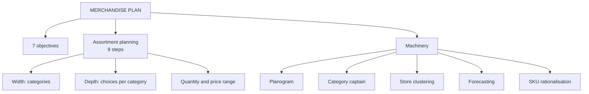

# MP-1: Merchandise Planning and Assortment

Covers: what a merchandise plan is, its seven objectives, the nine-step assortment process, width versus depth, planograms, store clustering, demand forecasting and SKU rationalisation, with a quantity and a ranking example. **(syllabus)**

## Where this fits in the ESE

Assumed pattern (no course plan): 50 marks, 3 x 5, 2 x 10, one 15-mark case. This node is a likely 5-mark "objectives of a merchandise plan" or "steps in assortment planning", and feeds the merchandise parts of the 15-mark case with MP-2 and MP-3.

## Merchandise plan

A merchandise plan is a systematic plan that decides **what to sell, how much to buy, when to buy and at what price** to meet demand and business objectives. In one line: **the right product, in the right quantity, at the right place, at the right time and at the right price.** **(syllabus)**

Slide example, DMart before school reopening in June: 10,000 notebooks, 5,000 school bags, 8,000 water bottles, 4,000 lunch boxes. The retailer must decide how much to buy, when, and where to distribute.

## Seven objectives (class slide)

| # | Objective | Slide example |
|---|---|---|
| 1 | Meet customer demand | A Bengaluru supermarket stocks more ready-to-eat food and beverages |
| 2 | Maintain optimum inventory | Too much gives storage cost, unsold goods and markdowns; too little gives stockouts. Buying 20,000 umbrellas for 5,000 expected sales is excess |
| 3 | Maximise sales | Casual wear outsells formal wear, so give it more space and stock |
| 4 | Maximise profitability | Product A sells ₹1,000 for ₹100 profit; Product B sells ₹800 for ₹250 profit, so favour B |
| 5 | Reduce markdowns and wastage | Too many winter jackets bought in April means a 50% discount at season end |
| 6 | Right product mix | A shoe store stocks men, women, children; sports, casual, formal; many sizes and prices |
| 7 | Achieve sales targets | A ₹50 lakh festive target drives extra stock for the products that carry it |

Check on objective 4: Product A earns 100 ÷ 1,000 = **10%**, Product B earns 250 ÷ 800 = **31.25%** on selling price. B is better per rupee of sales and per unit of shelf space, as the slide says.

Your notes' framing: poor planning causes the two costliest failures, **stockouts** (lost sales) and **overstock** (markdowns, cash locked up).

## Assortment planning (class slide)

Assortment planning decides which products, brands, models, sizes, colours, styles and price ranges the retailer offers. Slide question: "Exactly which products should we keep in our store or online catalogue?" Myntra cannot list every shirt in the world.

**Nine steps:**

1. Understand the target customer (premium young professionals versus a budget buyer).
2. Analyse past sales (black 2,000, white 1,500, yellow 400 T-shirts).
3. Study market trends (cargo pants rising).
4. Decide product categories (running, football, cricket, gym, yoga).
5. Decide **width**: the number of different categories.
6. Decide **depth**: the number of variations inside one category.
7. Decide quantity, with expected demand and safety stock (1,000, 1,200 or 1,500 black T-shirts?).
8. Decide price range (₹199, ₹499, ₹999, ₹2,499).
9. Review and revise: increase fast sellers, cut or discount slow ones.

**Width versus depth:** width = how many categories; depth = how many choices within each. A department store (clothing, cosmetics, footwear, electronics, home) is wide. A shoe store with 10 running brands, 8 styles, sizes 6 to 12 and several colours is deep. A discount grocer such as DMart tends towards **narrower and deeper** ranges, a department store or hypermarket towards **broader** ones.

**Terminology trap:** the slides say width and depth. Your Unit 1 notes say **variety = breadth** and **assortment = depth**. They mean the same two ideas under different words, so state the meaning, not just the label.

### Worked example: quantity from past sales

**Question (illustrative):** last season's sales were black 2,000, white 1,500, yellow 400. Next season demand is expected to grow 10%. How many of each should be bought, before safety stock?

1. Last season total = 2,000 + 1,500 + 400 = 3,900 units. Shares: black 51.3%, white 38.5%, yellow 10.3%.
2. Growth 10%: black 2,200, white 1,650, yellow 440.
3. Total buy = 2,200 + 1,650 + 440 = **4,290 units**.

| Colour | Last season | Share | Next-season buy |
|---|---|---|---|
| Black | 2,000 | 51.3% | 2,200 |
| White | 1,500 | 38.5% | 1,650 |
| Yellow | 400 | 10.3% | 440 |
| Total | 3,900 | 100% | 4,290 |

**Interpretation:** past sales anchor the plan; step 3 (trends) and step 7 (safety stock) then adjust it. A fashion colour such as yellow carries more forecast risk than a staple, so plan a smaller safety buffer or a quick re-order option.

SKU count example: 10 brands x 8 styles x 7 sizes x 4 colours = **2,240 SKUs** in the running-shoe category alone, which is why depth has a cost.

## Merchandising machinery (RM Notes)

- **Planograms:** a diagram of which SKU goes on which shelf, at what height, facing which way, how many units deep. Eye-level space goes to high-margin or high-velocity SKUs; cross-merchandising (chips next to salsa) follows basket data. Compliance audits matter: the notes say non-compliant stores can underperform by 10 to 15% in the category **[VERIFY]** (a claim in the faculty notes, source not given).
- **Category management and the category captain:** the dominant vendor in a category shares market research and helps plan the whole category; the retailer keeps the final decision. A possible conflict of interest.
- **Store clustering:** stores are grouped by income, demographics and climate, and each cluster gets a tuned assortment; a DMart in a dense middle-class area stocks differently from one in a small town.
- **Demand forecasting:** blends historical sell-through, external signals (weather, festivals; Diwali demand planned 3 to 4 months ahead) and trend signals. "Speed of correction beats accuracy of prediction": Zara's roughly 2-week cycle needs a worse forecast than a 6-month lead time does.
- **SKU rationalisation:** rank each SKU by contribution margin x velocity and cut the bottom 10 to 20% each season.
- **Markdown cadence:** planned before the season (see MP-3).

### Worked example: SKU rationalisation

**Question (illustrative):** five SKUs, with contribution margin per unit (₹) and sales velocity (units a week). Cut the bottom 20%.

| SKU | Margin per unit | Units a week | Margin x velocity |
|---|---|---|---|
| S1 | ₹40 | 12 | 480 |
| S2 | ₹25 | 30 | 750 |
| S3 | ₹30 | 2 | 60 |
| S4 | ₹15 | 8 | 120 |
| S5 | ₹60 | 5 | 300 |

1. Rank: S2 (750), S1 (480), S5 (300), S4 (120), S3 (60).
2. Bottom 20% of five SKUs = one SKU = **S3**.

**Decision:** drop S3. **Interpretation:** S3 has an attractive ₹30 margin per unit but sells two a week; the combined score, not margin alone, shows it earns the least from its shelf space. Check first that S3 is not a traffic builder or a required item.

## Limits

Assortment planning always carries forecasting uncertainty, especially in fashion. More choice is not always better: choice overload can lower sales. The trade-off is customer choice against operating and inventory efficiency.

## Indian and global examples

DMart: narrow, high-turnover assortment supports low cost. Zara: deliberately limited units per style (scarcity by design) to reduce markdown risk. Myntra and Reliance Trends for assortment decisions in fashion.

## What to remember

- Merchandise plan = what, how much, when, where, at what price.
- Seven objectives: demand, optimum inventory, sales, profit, fewer markdowns, right mix, targets.
- Nine steps from target customer to review; width = categories, depth = choices within each.
- Planogram, category captain, store clustering, forecasting, SKU rationalisation (rank margin x velocity, cut bottom 10 to 20%).
- Worked figures: Product B margin 31.25% versus A 10%; buy 4,290 T-shirts; drop S3.

## Concept map

## Flashcards
Q: Define a merchandise plan.
A: A systematic plan deciding what to sell, how much to buy, when to buy and at what price to satisfy demand and meet business objectives.

Q: List the seven objectives of a merchandise plan.
A: Meet demand, maintain optimum inventory, maximise sales, maximise profitability, reduce markdowns and wastage, ensure the right product mix, achieve sales targets.

Q: Width versus depth in assortment?
A: Width is the number of categories; depth is the number of variations within a category.

Q: Name the nine steps of assortment planning.
A: Target customer, past sales, market trends, categories, width, depth, quantity, price range, review and revise.

Q: Why is Product B (₹800, ₹250 profit) better than A (₹1,000, ₹100 profit)?
A: Margin on sales is 31.25% against 10%.

Q: What is a planogram?
A: A diagram specifying which SKU goes on which shelf, at what height, facing which way and how many units deep.

Q: What is a category captain?
A: A dominant vendor given sell-through data to help plan the whole category; the retailer keeps the final decision.

Q: What rule is used for SKU rationalisation?
A: Rank SKUs by contribution margin x velocity and cut the bottom 10 to 20% each season.

Q: Why does "speed of correction beat accuracy of prediction"?
A: A retailer that can react to real sell-through in about two weeks needs a much weaker forecast than one stuck with a six-month lead time.

Q: Last season 2,000 black T-shirts sold; demand grows 10%. Units to buy before safety stock?
A: 2,200.

## Sources
- RM Unit 4 slides: objectives of a merchandise plan; assortment planning process
- RM Notes: merchandising machinery (planogram, category management, clustering, forecasting)
- Student notes: Merchandise Planning Objectives and Assortment Planning
- Next node: [[Retail Management Unit 4 - MP-2 Open-to-Buy and Merchandise Metrics]]
- [[Retail Management Unit 4 - Merchandise MOC (Node Map)]]
