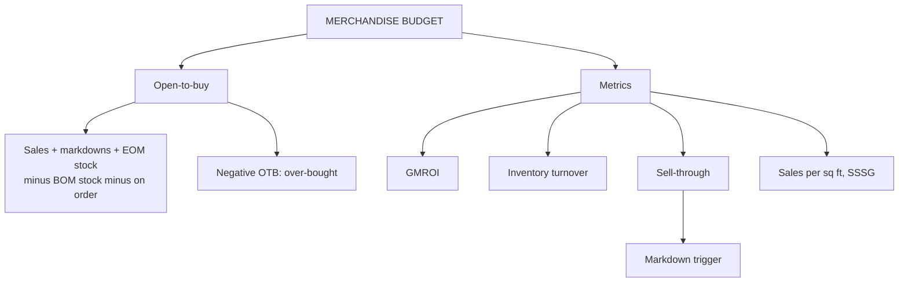

# MP-2: Open-to-Buy and Merchandise Metrics

Covers: the open-to-buy (OTB) formula and how to read a negative OTB, converting OTB to a cost budget, and the merchandise measures GMROI, inventory turnover, sell-through, sales per sq ft and same-store sales growth. **(syllabus)** for the OTB formula and the metric list; the cost conversion and sell-through trigger arithmetic are **(textbook)**.

## Where this fits in the ESE

The main numerical node of Unit 4 besides pricing. Expect a 5-mark OTB sum, or OTB and GMROI as a part of the 15-mark case. The OTB formula is in the faculty's RM Notes; the slides list GMROI under merchandise planning ("GMROI targets: high gross margin return on investment") without a formula, so the formulas below are the textbook ones.

## Merchandise budgeting and OTB

Merchandise budgeting sets planned sales, inventory and markdowns by category and period. **Open-to-buy** is the amount a buyer can still purchase in a period without breaking the budget. It is a rolling calculation, redone monthly or weekly. **(syllabus)**

**OTB = Planned sales + Planned markdowns + Planned end-of-month stock - Planned beginning-of-month stock - Stock already on order**

Read it as: what the period must have (sales, markdown allowance and closing stock) minus what the buyer already has (opening stock and orders in the pipeline). All items must be in the same value basis, normally **retail value**; convert to cost at the end.

If a buyer overspends OTB in one category, another category must be cut or the buyer carries the inventory risk. The notes' line: merchandising is "constrained budgeting dressed up as taste".

### Worked example: OTB

**Question (illustrative, ₹ lakh at retail):** for a month, planned sales 12, planned markdowns 1.5, planned end-of-month stock 14, beginning-of-month stock 10, on order 3. Find OTB, and the cost budget if the initial markup on retail is 40%.

1. Needs = 12 + 1.5 + 14 = **27.5**.
2. Already has = 10 + 3 = **13**.
3. **OTB = 27.5 - 13 = ₹14.5 lakh at retail.**
4. At cost = 14.5 x (1 - 0.40) = **₹8.7 lakh**.

| Item | ₹ lakh (retail) |
|---|---|
| Planned sales | 12.0 |
| Planned markdowns | 1.5 |
| Planned end-of-month stock | 14.0 |
| Total needed | 27.5 |
| Less: beginning stock | 10.0 |
| Less: on order | 3.0 |
| **Open-to-buy** | **14.5** |

**Interpretation:** the buyer may place up to ₹14.5 lakh of fresh orders at retail (₹8.7 lakh at cost) this month. Anything above that must be funded by cutting another category or accepted as over-buy risk.

### Worked example: a negative OTB

**Question (illustrative, ₹ lakh):** planned sales 8, markdowns 1, end-of-month stock 11, beginning stock 16, on order 6.

1. OTB = 8 + 1 + 11 - 16 - 6 = **-2**.

**Decision and interpretation:** OTB is **minus ₹2 lakh**, so the buyer is already over-bought. Defer or cancel ₹2 lakh of orders, or plan extra markdowns. A negative OTB is a warning signal, not an error.

## Metrics (RM Notes, merchandise efficiency and sales pillars)

| Metric | Formula | What it shows |
|---|---|---|
| **GMROI** | Gross margin ÷ average inventory at cost; also gross margin % x (sales ÷ average inventory at cost) | Gross profit earned per rupee invested in stock |
| **Inventory turnover** | Cost of goods sold ÷ average inventory at cost | How fast stock sells through |
| **Sell-through %** | Units sold ÷ units received (in a period) | Whether a lot is moving; trigger for markdowns |
| **Sales per sq ft** | Sales ÷ store area | Spatial efficiency |
| **SSSG** | (Sales this period - same period last year) ÷ last year, same stores only | Sales momentum without new-store effects |
| **Average basket value and UPT** | Sales ÷ transactions; units ÷ transactions | Depth of purchase |
| **Private label mix %** | Private label sales ÷ total sales | Share of higher-margin exclusive products |

### Worked example: GMROI, turnover and the rest

**Question (illustrative):** annual sales ₹60 lakh, cost of goods sold ₹45 lakh, average inventory at cost ₹7.5 lakh, store area 5,000 sq ft; same-store sales last year ₹54 lakh.

1. Gross margin = 60 - 45 = **₹15 lakh**, which is 25% of sales.
2. **GMROI** = 15 ÷ 7.5 = **2.0**. Check: 25% x (60 ÷ 7.5 = 8) = 2.0.
3. **Inventory turnover** = 45 ÷ 7.5 = **6.0 times**, about 365 ÷ 6 = **61 days** of stock.
4. **Sales per sq ft** = ₹60,00,000 ÷ 5,000 = **₹1,200**.
5. **SSSG** = 60 ÷ 54 - 1 = **11.11%**.

**Interpretation:** every rupee of stock at cost earned ₹2 of gross margin a year. GMROI rises by a higher margin or by faster turns; a slow-turning high-margin line and a fast-turning thin-margin line can have the same GMROI. Set the target from the retailer's own plan or the faculty's benchmark.

### Worked example: sell-through as a markdown trigger

**Question (illustrative):** a lot of 800 jackets is received. The plan says: "week 6, if sell-through is below 50%, mark down 20%". At week 6, 300 are sold.

1. Sell-through = 300 ÷ 800 = **37.5%**, below the 50% trigger.
2. Action: apply the planned 20% markdown now.

**Interpretation:** a rules-based trigger removes guesswork. Marking down too early gives up margin; too late means deeper discounts later (MP-3).

## Link to the rest of the unit

OTB limits how much you buy; assortment (MP-1) decides what; pricing and markdown (MP-3) decide at what price and when to clear; GMROI tells you whether the plan paid.

## Traps

- Mixing cost and retail values inside one OTB calculation.
- Forgetting the markdown allowance, which is added because markdowns reduce retail value of stock.
- Calling GMROI "gross margin %". It is a return on inventory investment.
- Using SSSG with new stores included.

## What to remember

- OTB = planned sales + planned markdowns + planned EOM stock - BOM stock - on order, at retail value.
- Example: ₹14.5 lakh at retail, ₹8.7 lakh at cost (40% initial markup on retail); negative OTB means over-bought.
- GMROI = gross margin ÷ average inventory at cost (2.0 in the example); turnover = COGS ÷ average inventory (6.0 times).
- Sell-through (units sold ÷ received) triggers markdowns; SSSG excludes new stores.
- Sales per sq ft measures spatial efficiency.

## Concept map

## Flashcards
Q: Define open-to-buy.
A: The amount of merchandise a buyer can still purchase in a period without exceeding the budget.

Q: Write the OTB formula.
A: Planned sales + planned markdowns + planned end-of-month stock - planned beginning-of-month stock - stock already on order.

Q: Planned sales 12, markdowns 1.5, EOM 14, BOM 10, on order 3 (₹ lakh). OTB?
A: ₹14.5 lakh at retail.

Q: Convert that OTB to cost at 40% initial markup on retail.
A: 14.5 x 0.60 = ₹8.7 lakh.

Q: What does a negative OTB mean?
A: The buyer has already over-bought; defer or cancel orders or plan extra markdowns.

Q: Define GMROI.
A: Gross margin divided by average inventory at cost: gross profit per rupee invested in stock.

Q: Gross margin ₹15 lakh, average inventory at cost ₹7.5 lakh. GMROI and what does it mean?
A: 2.0: each rupee of inventory at cost earned ₹2 of gross margin.

Q: How is inventory turnover calculated?
A: Cost of goods sold divided by average inventory at cost (₹45 lakh ÷ ₹7.5 lakh = 6.0 times).

Q: Define sell-through.
A: Units sold divided by units received in a period; used to trigger markdowns (300 of 800 is 37.5%).

Q: What does SSSG exclude?
A: The effect of new stores; it compares only stores open in both periods.

## Sources
- RM Notes: open-to-buy formula; the four metric pillars
- RM Unit 4 slide summary (GMROI targets)
- Levy and Weitz; Berman and Evans (merchandise budgeting and productivity measures)
- Previous node: [[Retail Management Unit 4 - MP-1 Merchandise Planning and Assortment]]
- Next node: [[Retail Management Unit 4 - MP-3 Retail Pricing and Price Adjustments]]
- [[Retail Management Unit 4 - Merchandise MOC (Node Map)]]
