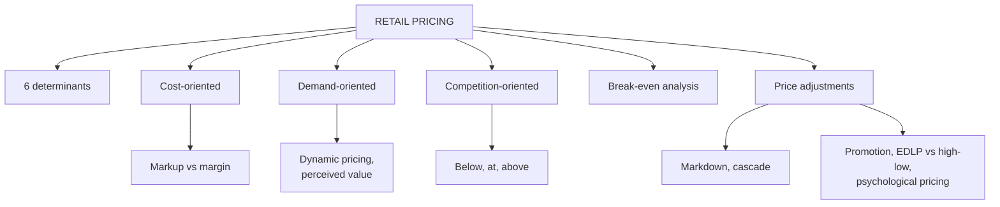

# MP-3: Retail Pricing and Price Adjustments

Covers: the six price determinants, cost, demand and competition-oriented pricing, markup versus margin and how to convert, break-even analysis, markdowns, promotions, EDLP versus high-low and psychological pricing, with five worked sums. **(syllabus)** for the slide and note content; conversions, markdown cascade and break-even sums are **(textbook)** arithmetic on the faculty's numbers.

## Where this fits in the ESE

Assumed pattern: 50 marks, 3 x 5, 2 x 10, one 15-mark case. This is the most numerical node of Unit 4. Likely: a 5-mark "three pricing orientations", a markup-versus-margin sum, a markdown or break-even sum, or a 10-mark "pricing strategies of a retailer" with examples.

## Retail pricing (class slide)

**Retail pricing** is determining the price at which merchandise is offered while balancing customer value, competition, costs, demand and profitability. **(syllabus)**

**Six factors that determine retail price:** (1) cost, (2) customer demand, (3) competition, (4) merchandise lifecycle (new, growing, mature), (5) inventory position (too much or too little), (6) technology and data (behaviour, sales history, search, competitor prices, forecasts).

**Right price** completes the merchandise mix: right merchandise, right quantity, right time, right place, right price.

Three orientations, one-line memory:
**Cost = what does it cost us? Demand = what will the customer pay? Competition = what are others charging?**

## 1. Cost-oriented pricing

**Selling price = Cost + Markup.** Retailers must recover purchase cost, transport, storage, packaging, staff, store expenses, technology and rent.

- **Cost-plus pricing:** a fixed percentage on cost (slide: cost ₹1,000, markup 20%, price ₹1,200).
- **Markup pricing:** different categories carry different markups, because demand, competition, lifecycle, turnover and customer expectations differ.

| Product | Cost (₹) | Markup on cost | Selling price (₹) | Margin on price |
|---|---|---|---|---|
| T-shirt | 500 | 50% | 750 | 33.3% |
| Jeans | 1,000 | 60% | 1,600 | 37.5% |
| Handbag | 1,500 | 40% | 2,100 | 28.6% |

**Advantages:** simple, ensures cost recovery, predictable, handy for thousands of SKUs. **Limitation (the biggest):** cost tells you what you need to earn, not what the customer will pay.

### Markup versus margin

- **Markup** is measured on **cost**. **Margin** is measured on **selling price**.
- Markup on cost to margin: **M = MU ÷ (1 + MU)**. Margin to markup: **MU = M ÷ (1 - M)**.

**Worked example 1: the shirt (class numbers).** Cost ₹800.

1. 50% markup: markup = 800 x 50% = ₹400; price = **₹1,200**. Margin on price = 400 ÷ 1,200 = **33.33%**.
2. Target 30% **margin**: price = 800 ÷ (1 - 0.30) = **₹1,142.86**. Markup on cost = 342.86 ÷ 800 = **42.86%**.

| Basis | Markup 50% on cost | Margin 30% on price |
|---|---|---|
| Price | ₹1,200 | ₹1,142.86 |
| Profit in rupees | ₹400 | ₹342.86 |
| Equivalent margin / markup | 33.33% margin | 42.86% markup |

**Interpretation:** the slide's warning is "50% markup is not 50% margin". Memory table: markup 25% = margin 20%; 50% = 33.3%; 100% = 50%. Quote which base you use.

**Worked example 2: limit of cost-plus (class jacket).** Cost ₹2,000, markup 50%, price ₹3,000; the competitor sells a similar jacket for ₹2,200.

1. Price at the competitor's level: ₹2,200. Markup on cost = 200 ÷ 2,000 = **10%**. Margin = 200 ÷ 2,200 = **9.09%**.

**Decision:** cost-plus gives a price customers will not pay. **Interpretation:** to sell at ₹2,200 the retailer must cut cost, differentiate (service, brand) or drop the line.

## 2. Demand-oriented pricing

The retailer asks "how much is the customer willing to pay?" Principle: **higher demand plus higher willingness to pay gives room for higher prices.** **(syllabus)**

- Hotel room ₹4,000 rises to ₹8,000 during a concert: cleaning cost has not doubled, demand has.
- Flight Bengaluru to Delhi: ₹4,000 two months before, ₹6,000 two weeks before, ₹9,000 two days before. This is **dynamic pricing**.
- Cricket jersey ₹1,000 rises to ₹1,300 before an important India match.
- **Perceived value:** design, quality, brand, convenience, sustainability, status (a ₹100 bottle versus a ₹500 branded bottle).
- **Technology:** search frequency, clicks, cart additions, past purchases, location, season, inventory and conversion rates reveal willingness to pay.

**Advantages:** more revenue in high-demand periods, customer-focused, suits limited inventory, supports dynamic pricing. **Limitations:** demand is hard to predict; customers may see unfairness (₹2,000 versus ₹1,500 for the same ticket an hour apart); needs data, analytics and technology.

## 3. Competition-oriented pricing

"If you open a phone store next to five others, can you ignore their prices?" Three approaches:

| Approach | Meaning | Example | Slide numbers |
|---|---|---|---|
| Below competitors | Charge less to attract and gain share | DMart | Competitor ₹1,000, price ₹950 |
| Going rate | Match the market | Airtel versus Jio plans | Competitor ₹1,000, price ₹1,000 |
| Above competitors | Charge more, justify with quality, service, brand, location, delivery | Apple | Competitor ₹1,000, price ₹1,200 |

A new phone brand at ₹35,000 against ₹22,000 to ₹25,000 rivals must answer "why pay ₹35,000?". **Limitation:** price wars and eroded differentiation. Most retailers blend all three: cost as the floor, competition as the reality check, demand and perceived value as the ceiling.

## Break-even analysis (class slide: "breakeven integration")

**Break-even quantity = Fixed costs ÷ (Price - variable cost per unit).** Break-even revenue = quantity x price.

**Worked example 3: break-even and target profit.** A store line has fixed costs ₹6,00,000, price ₹1,200, variable cost ₹800 per unit.

1. Contribution per unit = 1,200 - 800 = **₹400**.
2. Break-even quantity = 6,00,000 ÷ 400 = **1,500 units**; break-even revenue = 1,500 x 1,200 = **₹18,00,000**.
3. For a profit of ₹2,00,000: (6,00,000 + 2,00,000) ÷ 400 = **2,000 units**.
4. If 2,000 units are expected, margin of safety = (2,000 - 1,500) ÷ 2,000 = **25%**.

**Interpretation:** the price is viable only if the retailer can realistically sell more than 1,500 units; at 2,000 expected units there is a 25% cushion.

**Worked example 4: volume needed to justify a price cut.** Price ₹1,000, variable cost ₹600, so contribution ₹400. A 10% cut (₹100) leaves ₹300.

1. Required volume increase = 400 ÷ 300 - 1 = **33.3%** (or ΔP ÷ (contribution - ΔP) = 100 ÷ 300).

**Interpretation:** a 10% price cut needs a one-third rise in units just to keep the same total contribution. Promotions rarely do this unless they also drive basket additions.

## Price adjustments (notes)

- **Markdown:** a permanent or semi-permanent price cut to clear slow, seasonal or end-of-life stock. **Promotional pricing:** a temporary cut to drive traffic, returning to regular price afterwards.
- **Markdown cascading:** progressively deeper cuts as stock ages (fashion).
- **EDLP versus high-low:** EDLP (Walmart, DMart) avoids promotional swings and competes on consistently low prices; high-low uses frequent promotions against a higher regular price for urgency.
- **Psychological tactics:** odd pricing (₹999), bundling, reference pricing ("was/now").
- **Timing:** too early sacrifices margin, too late means steeper discounts or write-offs. Sophisticated retailers plan the **markdown cadence before the season** (for example week 6: 20% off if sell-through is below the target; week 10: 40% off if still below) and trigger it by sell-through (MP-2).
- Grocery retailers run short promotions on high-visibility items (milk, snacks) to drive footfall and full-margin baskets; Indian fashion uses the End-of-Season Sale (EOSS).
- **Risks:** shoppers learn to wait for sales; brand damage for premium positions; markdown is one of the largest preventable margin leaks.

**Worked example 5: a markdown cascade.** A jacket costing ₹2,000 is priced ₹3,000. First markdown 20%, second markdown 25% on the new price.

1. After the first: 3,000 x 0.80 = **₹2,400**.
2. After the second: 2,400 x 0.75 = **₹1,800**.
3. Cumulative markdown = (3,000 - 1,800) ÷ 3,000 = **40%**, not 45%.
4. At ₹1,800 the price is **₹200 below cost** (₹2,000): a loss of 200 ÷ 1,800 = **11.1% of the selling price** on each unit.

**Decision and interpretation:** the first cut still earned ₹400 over cost; the second cut crossed below cost. Decide in advance a **floor** (cost recovery, or the lowest loss the retailer will accept versus carrying the stock) before cascading. Do not add markdown percentages; multiply them.

## Indian and global examples

DMart: cost efficiency and low price with high volume. Tanishq: value-based pricing on jewellery. Costco: membership-funded cost-oriented model. Apple: value pricing despite commodity hardware. Airlines and hotels: dynamic pricing.

## What to remember

- Six price factors: cost, demand, competition, lifecycle, inventory, technology and data.
- Selling price = cost + markup. Markup is on cost, margin on price: M = MU ÷ (1 + MU); shirt ₹800 at 50% markup is ₹1,200 and a 33.33% margin; 30% margin gives ₹1,142.86.
- Demand-oriented: willingness to pay and dynamic pricing. Competition-oriented: below, at or above, justified by value.
- Break-even quantity = fixed costs ÷ contribution per unit (example 1,500 units); a 10% cut on a ₹400 contribution needs 33.3% more volume.
- Markdowns: plan the cadence, trigger by sell-through, multiply percentages (20% then 25% is 40%), set a floor.

## Concept map

## Flashcards
Q: List the six factors that determine retail price.
A: Cost, customer demand, competition, merchandise lifecycle, inventory position, technology and data.

Q: One-line memory for the three pricing orientations?
A: Cost = what does it cost us; demand = what will the customer pay; competition = what are others charging.

Q: Markup versus margin: which base does each use?
A: Markup is on cost; margin is on selling price.

Q: Shirt costs ₹800 and is marked up 50%. Price and margin?
A: ₹1,200; margin 400 ÷ 1,200 = 33.33%.

Q: Shirt costs ₹800 and the retailer wants a 30% margin. Price?
A: 800 ÷ 0.70 = ₹1,142.86 (a 42.86% markup on cost).

Q: What is the main limit of cost-oriented pricing?
A: It shows what the retailer needs to earn, not what customers will pay.

Q: Give two examples of demand-oriented pricing.
A: Airline fares rising as departure nears (₹4,000, ₹6,000, ₹9,000) and a hotel room doubling during a concert.

Q: Three competition-oriented approaches?
A: Price below competitors, match the going rate, price above with justified value.

Q: Break-even quantity formula and the example?
A: Fixed costs ÷ (price - variable cost): ₹6,00,000 ÷ ₹400 = 1,500 units.

Q: Cost ₹600, price ₹1,000, price cut of 10%. Volume increase needed to hold contribution?
A: 33.3% (contribution falls from ₹400 to ₹300).

Q: Jacket marked down 20% then 25% from ₹3,000. Final price and cumulative markdown?
A: ₹1,800 and 40%; at cost ₹2,000 this is below cost.

Q: EDLP versus high-low pricing?
A: EDLP keeps consistently low prices without promotions (Walmart, DMart); high-low uses frequent promotions against a higher regular price.

## Sources
- RM Unit 4 slides: Retail pricing, six factors, three strategies, markup versus margin, summary slide (breakeven integration, markdowns and promotions)
- RM Notes: markdown management
- Student notes: Retail Pricing Strategies; Price Adjustments to Stimulate Retail Sales
- Previous node: [[Retail Management Unit 4 - MP-2 Open-to-Buy and Merchandise Metrics]]
- Next node: [[Retail Management Unit 4 - MP-4 Supply Chain Logistics and Quick Response]]
- [[Retail Management Unit 4 - Merchandise MOC (Node Map)]]
