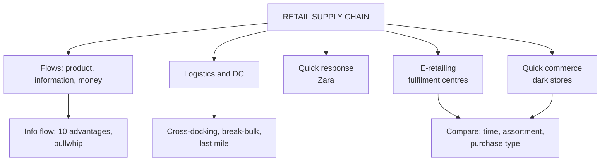

# MP-4: Supply Chain, Logistics and Quick Response

Covers: retail supply chain flows, the ten advantages of information flow, logistics and distribution centres (cross-docking, break-bulk, last mile), quick response, e-retailing, quick commerce and dark stores, with two numerical illustrations. **(syllabus)**

## Where this fits in the ESE

Assumed pattern: 50 marks, 3 x 5, 2 x 10, one 15-mark case. Likely 5-marks: "advantages of information flow", "why distribution centres matter", "quick response", "e-retailing versus quick commerce". A 10-mark "retail supply chain and logistics" is plausible. The slides use many Indian examples, so quote them.

## Supply chain management (class slide)

**SCM** is planning, coordinating and controlling the movement of **products, information and money** from suppliers to manufacturers or distributors and finally to the customer, so that the **right product reaches the right place, at the right time, in the right quantity and at the right cost.**

Flow: **Supplier, Manufacturer, Distribution Centre, Retail Store or e-commerce warehouse, Customer.** Slide example, shampoo: raw-material supplier, shampoo manufacturer, distribution centre, D-Mart or Amazon warehouse, customer.

**Flows run in opposite directions:** products flow forward; **information** flows backward (customer to retailer to distributor to manufacturer to supplier). Slide example: a supermarket sells 80 of 100 Coca-Cola bottles in a day; the system tells the distributor, who tells the manufacturer, who replenishes.

## Ten advantages of information flow (class slide)

| # | Advantage | Slide example |
|---|---|---|
| 1 | Better demand forecasting | Amazon predicts Diwali demand from past purchases and searches |
| 2 | Fewer stockouts | Supermarket informs distributor when milk falls below the level |
| 3 | Less excess inventory | Fashion retailer checks actual sales before ordering more winter jackets |
| 4 | Faster replenishment | Walmart uses store-level sales for timely replenishment |
| 5 | Better coordination | Manufacturer raises smartphone output when the retailer expects demand |
| 6 | Lower costs | Exact quantities prevent unnecessary deliveries |
| 7 | Better customer service | Amazon shows stock and delivery date |
| 8 | Faster decisions | A fast-selling SKU is re-ordered immediately |
| 9 | Greater visibility | Retailer tracks where its shipment is |
| 10 | Better response to market change | Heat wave raises air-conditioner demand; retailers tell suppliers |

Summary slide adds: real-time data, **bullwhip reduction** (preventing over-correction in orders), demand insights, transparency.

**Notes add:** the **bullwhip effect** is demand variability amplifying as orders move up the chain; **push** systems stock on forecasts, **pull** systems replenish on actual demand (modern chains blend both: fast sellers pulled, long-lead items pushed); **vendor-managed inventory (VMI)** has the supplier monitor and replenish the retailer's stock; EDI and ERP share data. Efficiency versus resilience: single-sourcing and thin buffers cut cost but raise disruption risk.

## Logistics and the distribution centre

**Logistics** is planning, implementing and controlling the movement and storage of goods, services and information from origin to consumption: the right product, place, time, quantity and condition. **(syllabus)**

A **distribution centre (DC)** receives, temporarily stores, sorts, packs and dispatches products to stores or customers; it links manufacturers with retailers. Slide flow: Hindustan Unilever factory, HUL distribution centre, D-Mart, customer.

**Six reasons DCs matter:** faster delivery, inventory consolidation, efficient transportation, better inventory management, reduced logistics cost, improved customer service.

**Central kitchen analogy (slide):** a DC is like a central kitchen. Ingredients are collected in one place, organised and sent to each restaurant by need. D-Mart's DC receives bulk from FMCG makers and supplies Bengaluru, Mysuru and Tumakuru stores.

**Amazon phone example (slide):** manufacturer or seller, then DC, storage, customer order, picking, packing, transportation, **last-mile** delivery.

**Terms:**
- **Cross-docking:** goods from suppliers are sorted and loaded straight onto outbound trucks with minimal storage (pioneered at scale by Walmart).
- **Break-bulk:** bulk shipments are divided into individual store orders.
- **Centralised versus regional DCs:** one big DC gives scale but longer lead times; several regional DCs are faster but costlier.
- **Last mile:** the final, costliest leg to the doorstep.
- **Dark stores:** micro-fulfilment points for online orders only.

### Worked example: why a DC cuts trips

**Question (illustrative):** 100 FMCG suppliers serve 3 stores. Compare deliveries.

1. Direct: every supplier ships to every store = 100 x 3 = **300 delivery routes**.
2. Through a DC: 100 inbound consolidated shipments + 3 outbound store runs = **103 routes**.

| | Direct to stores | Via DC |
|---|---|---|
| Routes | 300 | 103 |
| Reduction | | 65.7% |

**Interpretation:** the DC removes about two-thirds of the routes and gives one place to count stock. The gain grows with the number of stores. The cost is the DC's own rent and handling, which is why cross-docking (no storage) is used for fast movers.

## Quick response (QR) delivery systems (class slide)

A **Quick Response system** has retailers and suppliers share sales and inventory information quickly so products are replenished as soon as demand occurs. The aim is to cut the time between purchase and replenishment.

Slide example, Zara: a store sells 80% of a dress in a few days. Flow: customer purchase, sales captured, Zara analyses demand, more garments produced or dispatched, store replenished. Zara responds to what customers buy instead of producing huge quantities months ahead.

**Advantages:** fewer stockouts, less excess inventory, quicker response to trends, better customer satisfaction, lower holding cost. Summary slide: just-in-time methods, live sales trigger production, better inventory turnover. Classroom question: "What happens when a retailer knows today that a product is selling very fast?"

## E-retailing (class slide)

Selling through websites and mobile apps (Amazon, Flipkart, Myntra, Nykaa, Croma's online store). Myntra flow: select shoes, order and pay, order processed at the fulfilment centre, courier, delivery. The supply chain must coordinate **online order, inventory, warehouse, packing, transportation, last-mile delivery.**

**Advantages:** convenience (24/7), wider market, better customer information, less dependence on a store in every location.

## Quick commerce (class slide)

Quick commerce is e-commerce designed to deliver within a very short time, often **10 to 30 minutes**, mostly for frequently purchased and urgent items. Examples: Blinkit, Zepto, Swiggy Instamart. Blinkit example: you realise at 8:00 PM there are no tomatoes; the order goes to the **nearest dark store**, an employee picks and packs, a delivery partner collects, delivery follows.

| | E-retailing | Quick commerce |
|---|---|---|
| Delivery time | Hours or days | Minutes |
| Fulfilment | Larger fulfilment centres | Small local dark stores |
| Assortment | Wide range | Everyday and urgent products |
| Purchase type | Planned | Convenience and immediate need |

Notes add: q-commerce relies on **hyperlocal inventory** with a deliberately limited SKU range (speed versus assortment breadth); economics are hard because dense dark-store networks and riders carry high costs; speed is not free, so match delivery speed to category economics (margin per order, basket size, purchase frequency).

### Worked example: the dark-store economics

**Question (illustrative, fictional app):** QuickCart (fictional) earns a 20% gross margin. Per order costs: delivery ₹55, packaging ₹10, picking labour ₹12. Dark store fixed cost ₹6,00,000 a month. Compare an average order value (AOV) of ₹450 with ₹900.

1. AOV ₹450: gross margin = ₹90; variable costs = 55 + 10 + 12 = ₹77; **contribution = ₹13** per order. Orders to cover fixed cost = 6,00,000 ÷ 13 = **46,154 a month**, about **1,539 a day**.
2. AOV ₹900: gross margin = ₹180; contribution = 180 - 77 = **₹103**. Orders needed = 6,00,000 ÷ 103 = **5,826 a month**, about **194 a day**.

| | AOV ₹450 | AOV ₹900 |
|---|---|---|
| Gross margin per order | ₹90 | ₹180 |
| Variable cost per order | ₹77 | ₹77 |
| Contribution per order | ₹13 | ₹103 |
| Orders a month to break even | 46,154 | 5,826 |

**Interpretation:** doubling the basket raises contribution eight-fold, because delivery cost is per order, not per rupee. This is why quick-commerce apps push larger baskets, add higher-margin items and charge small-order fees. Figures are invented for teaching, not any company's data.

## Traps

- Information flows **backward**, products **forward**.
- A DC stores and sorts; **cross-docking** is the version with almost no storage.
- Quick commerce is not just faster e-commerce: the model changes to dark stores and a narrow range.

## What to remember

- SCM moves products, information and money; the right product, place, time, quantity, cost.
- Ten information-flow advantages; information flows backward and reduces bullwhip.
- DC: six reasons; 100 suppliers and 3 stores means 300 routes direct versus 103 via a DC.
- QR (Zara): sales data triggers fast small replenishment; fewer stockouts and less excess stock.
- Q-commerce: 10 to 30 minutes, dark stores, narrow assortment; basket size drives economics (₹13 versus ₹103 contribution per order in the example).

## Concept map

## Flashcards
Q: Define supply chain management in retail.
A: Planning, coordinating and controlling the movement of products, information and money from suppliers to the customer so the right product reaches the right place, time, quantity and cost.

Q: In which direction does information flow?
A: Backward from customer to retailer to distributor to manufacturer to supplier; products flow the opposite way.

Q: Name five of the ten advantages of information flow.
A: Better forecasting, fewer stockouts, less excess inventory, faster replenishment, lower costs (also coordination, service, decisions, visibility, response to change).

Q: What is a distribution centre?
A: A facility that receives, temporarily stores, sorts, packs and dispatches products to stores or customers.

Q: What is the central kitchen analogy?
A: A DC collects and organises goods in one place and sends each store what it needs, as a central kitchen supplies restaurants.

Q: What is cross-docking?
A: Moving incoming goods straight to outbound trucks with minimal storage.

Q: How many routes: 100 suppliers, 3 stores, direct versus via DC?
A: 300 direct versus 103 via a DC.

Q: Define a Quick Response system.
A: Retailer and supplier share sales and inventory data quickly so products are replenished as soon as demand occurs (Zara).

Q: Differences between e-retailing and quick commerce?
A: Hours or days versus minutes; large fulfilment centres versus dark stores; wide range versus everyday items; planned versus immediate purchases.

Q: What is a dark store?
A: A small fulfilment facility designed for online orders rather than walk-in customers.

Q: Why does a bigger basket help quick-commerce profitability?
A: Delivery cost is per order, so contribution rises sharply with basket size (₹13 at ₹450, ₹103 at ₹900 in the example).

## Sources
- RM Unit 4 slides: SCM, information flow, logistics and DC, quick response, e-retailing, quick commerce
- Student notes: Retail Supply Chain Management; Retail Logistics and Distribution Centres; Quick Response, E-Retailing and Quick Commerce
- Fisher, What Is the Right Supply Chain for Your Product
- Previous node: [[Retail Management Unit 4 - MP-3 Retail Pricing and Price Adjustments]]
- Next node: [[Retail Management Unit 4 - MP-5 Vendors Outsourcing and Private Labels]]
- [[Retail Management Unit 4 - Merchandise MOC (Node Map)]]
