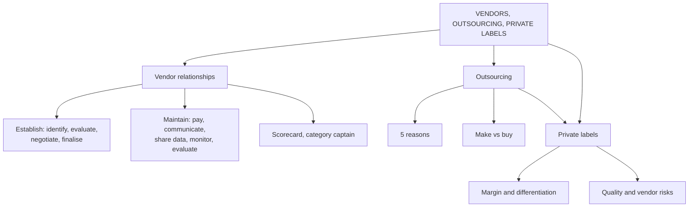

# MP-5: Vendors, Outsourcing and Private Labels

Covers: establishing and maintaining vendor relationships, the vendor scorecard, outsourcing and the make-or-buy test, private labels and store brands, with three numerical illustrations. **(syllabus)**

## Where this fits in the ESE

Assumed pattern: 50 marks, 3 x 5, 2 x 10, one 15-mark case. Likely 5-marks: "establishing and maintaining vendor relationships", "why do retailers outsource", "private labels: advantages and risks". A weighted vendor scorecard or a make-or-buy sum can appear in the case.

## Vendor relationships

A **vendor** supplies products or services to the retailer: D-Mart from FMCG suppliers, Myntra from fashion brands, Zara from fabric and garment suppliers. **(syllabus)**

**Establishing a relationship (class slide, four steps):**

1. **Identify potential vendors** (a supermarket seeking organic food looks for certified organic producers).
2. **Evaluate vendors** on quality, price, delivery reliability, production capacity, reputation, financial stability, flexibility.
3. **Negotiate terms:** price, quantity, delivery, payment terms, return policy, discounts (D-Mart commits to volume for a lower price).
4. **Finalise the agreement** on supply, quality, delivery and payment.

**Maintaining it (class slide, six points):**

1. Timely payments build trust.
2. Regular communication about expected demand, orders, promotions, customer-preference shifts.
3. Information sharing: if Diwali demand is expected up 30%, tell the vendor early so production rises in time.
4. Quality monitoring (daily dairy freshness).
5. Performance evaluation on quality, cost, delivery, responsiveness, service.
6. Long-term partnership: reliable vendors rather than constant switching.

**Notes add:** negotiation levers (price, payment terms, minimum order quantities, exclusivity, lead times, co-op marketing, slotting fees); **power asymmetry** (a large chain against a small supplier is very different from a small retailer against a dominant brand); **category captain** (a leading vendor shares category data and helps plan the category; collaborative but conflict-prone); over-aggressive negotiation damages priority during shortages and willingness to innovate. The summary slide stresses mutual trust, win-win negotiation, exclusive early access to new items and **EDI** sync.

### Vendor scorecard (class table)

| Vendor | Quality | Delivery | Price | Overall |
|---|---|---|---|---|
| A | Excellent | Good | High | Good |
| B | Good | Excellent | Low | Excellent |
| C | Poor | Good | Low | Average |

**Worked example: turning the scorecard into numbers (textbook).** Weights: quality 40%, delivery 30%, price 30%. Scores: Excellent = 5, Good = 4, Poor = 1; for price, Low (best for the retailer) = 5 and High = 2.

1. Vendor A = 0.4 x 5 + 0.3 x 4 + 0.3 x 2 = 2.0 + 1.2 + 0.6 = **3.8**.
2. Vendor B = 0.4 x 4 + 0.3 x 5 + 0.3 x 5 = 1.6 + 1.5 + 1.5 = **4.6**.
3. Vendor C = 0.4 x 1 + 0.3 x 4 + 0.3 x 5 = 0.4 + 1.2 + 1.5 = **3.1**.

| Vendor | Quality (40%) | Delivery (30%) | Price (30%) | Score |
|---|---|---|---|---|
| A | 2.0 | 1.2 | 0.6 | 3.8 |
| B | 1.6 | 1.5 | 1.5 | 4.6 |
| C | 0.4 | 1.2 | 1.5 | 3.1 |

**Decision:** pick B. **Interpretation:** the numbers reproduce the slide's order (B excellent, A good, C average). The slide's point is that evaluation is multi-dimensional: A wins on quality alone but loses on price, and C's low price cannot rescue poor quality. Check that the ranking holds if the quality weight rises to 60%; weights are the retailer's strategy made visible. These weights and scores are illustrative.

## Outsourcing in retail (class slide)

**Outsourcing** means hiring an external organisation to perform an activity instead of doing everything in-house. Retailers may outsource transportation, warehousing, delivery, packaging, IT services, customer service and manufacturing. **(syllabus)**

**Slide examples:** Amazon works with third-party logistics and delivery partners (retailer, external logistics company, customer). An online clothing brand good at design and marketing outsources manufacturing, warehousing and delivery so it can focus on design, branding, marketing and customer relationships.

**Five reasons (class slide):** cost reduction, expertise, focus on core activities, scalability (Diwali peaks), faster expansion into new cities. Summary slide: strategic outsourcing (3PL) for flexibility and lower upfront capital.

**Notes add:**
- **3PL** (third-party logistics), **BPO** (business process outsourcing: call centres, IT support, accounting).
- **Make versus buy** weighed on strategic importance, cost, risk and control, and speed.
- **Rule of thumb:** outsource functions that are necessary but not differentiating; keep what creates competitive advantage (for example proprietary demand forecasting).
- **Limits:** less control over quality and customer experience, dependency on the vendor, loss of capability.
- Indian D2C brands often use 3PL players such as Delhivery or Ecom Express; Nike outsources manufacturing but keeps design and brand in-house.

### Worked example: make or buy (textbook)

**Question (illustrative):** a D2C brand can run its own fulfilment at a fixed ₹4,00,000 a year plus ₹40 per order, or use a 3PL at ₹90 per order. At what volume is it indifferent, and what should it do at 6,000 and 12,000 orders?

1. Indifference: 4,00,000 + 40Q = 90Q, so Q = 4,00,000 ÷ 50 = **8,000 orders**.
2. At 6,000: in-house = 4,00,000 + 2,40,000 = ₹6,40,000; 3PL = ₹5,40,000. **3PL is ₹1,00,000 cheaper.**
3. At 12,000: in-house = 4,00,000 + 4,80,000 = ₹8,80,000; 3PL = ₹10,80,000. **In-house is ₹2,00,000 cheaper.**

| Orders | In-house (₹) | 3PL (₹) | Cheaper |
|---|---|---|---|
| 6,000 | 6,40,000 | 5,40,000 | 3PL |
| 8,000 | 7,20,000 | 7,20,000 | Equal |
| 12,000 | 8,80,000 | 10,80,000 | In-house |

**Interpretation:** a young brand outsources and keeps capital for the brand; once volume passes about 8,000 orders a year the fixed cost is worth carrying, subject to control and quality. Cost is one of four tests, not the only one.

## Private labels and store brands

**Private labels** are products made by or for a retailer and sold under the retailer's own brand name rather than a manufacturer's. The summary slide: store brands offer **highly elevated margins** and tie consumer habits to specific retailers (brand loyalty). **(syllabus)**

**Notes:**
- Usually priced below the equivalent national brand, with **higher retailer margin**, since the retailer captures manufacturing and retail margin.
- **Tiers:** economy or value, standard (matches national-brand quality at a lower price), premium (differentiated, sometimes above national brands).
- **Differentiation:** exclusive items cannot be price-compared, reducing price transparency pressure.
- **Manufacturing:** mostly **outsourced** to contract manufacturers.
- **Development path:** category opportunity analysis, specification and sourcing, quality control and testing, packaging and branding, launch and tracking.
- **Where it works:** categories with strong retailer trust and weak brand loyalty (dairy, staples); fashion and home as a core differentiated line.
- **Advantages:** margin, exclusivity, bargaining leverage over national-brand vendors. **Limits:** quality-control and brand-building responsibility, risk of alienating brand-loyal customers or straining vendors (the category captain and vendor relationship).
- **Trust transfer:** shoppers buy an unknown name only if they trust the retailer.
- **Examples:** DMart's private ranges, Reliance Retail's own labels, Decathlon's own sports brands; Costco's Kirkland Signature globally. Quote them qualitatively; check range names before the exam **[VERIFY]**.

### Worked example: private label against a national brand

**Question (illustrative):** a national brand packet sells at ₹100 and the retailer buys it for ₹75. A comparable private-label packet is priced at ₹85 and made by a contract manufacturer for ₹55.

1. National brand: margin = 100 - 75 = **₹25**, which is **25%** of price.
2. Private label: margin = 85 - 55 = **₹30**, which is **35.29%** of price.
3. The shopper pays ₹15 (15%) less.
4. On 1,000 packets the retailer earns ₹25,000 versus ₹30,000.

| | National brand | Private label |
|---|---|---|
| Shelf price | ₹100 | ₹85 |
| Retailer cost | ₹75 | ₹55 |
| Margin (₹) | 25 | 30 |
| Margin on price | 25.00% | 35.29% |

**Interpretation:** the customer saves and the retailer earns more per packet and per rupee of sales: that is why store brands lift the private-label mix and GMROI (MP-2). The extra margin pays for quality control and marketing, and a strong private label is a credible threat that improves terms with national-brand vendors.

## Traps

- A vendor scorecard is multi-dimensional; do not rank on one criterion.
- Outsourcing is not abdication: keep control over quality and customer experience.
- Private label margin is higher, but only after paying for the quality-control and brand-building the manufacturer used to bear.

## What to remember

- Four steps to establish (identify, evaluate, negotiate, finalise) and six to maintain (payments, communication, information, quality, evaluation, partnership).
- Weighted scorecard: B 4.6, A 3.8, C 3.1 with 40, 30, 30 weights.
- Outsource for cost, expertise, focus, scalability, expansion; keep differentiating functions; make-or-buy break-even 8,000 orders in the example.
- Private labels: higher margin (35.29% against 25%), differentiation, bargaining leverage; risks are quality control and vendor friction.
- Category captain: collaborative but conflict-prone.

## Concept map

## Flashcards
Q: List the four steps to establish a vendor relationship.
A: Identify potential vendors, evaluate them, negotiate terms, finalise the agreement.

Q: List the six ways to maintain a vendor relationship.
A: Timely payments, regular communication, information sharing, quality monitoring, performance evaluation, long-term partnership.

Q: What criteria are used to evaluate a vendor?
A: Quality, price, delivery reliability, production capacity, reputation, financial stability, flexibility.

Q: Vendor scorecard with weights 40/30/30 for quality/delivery/price: which vendor wins?
A: Vendor B with 4.6, ahead of A (3.8) and C (3.1).

Q: Define outsourcing and name two examples from the slides.
A: Hiring an external organisation to perform an activity; Amazon using third-party logistics partners, and an online clothing brand outsourcing manufacturing, warehousing and delivery.

Q: Five reasons retailers outsource?
A: Cost reduction, expertise, focus on core activities, scalability, faster expansion.

Q: Make-or-buy break-even: in-house ₹4,00,000 fixed + ₹40 per order, 3PL ₹90 per order?
A: 8,000 orders; below that use 3PL, above that in-house is cheaper.

Q: What is a private label?
A: A product made by or for a retailer and sold under the retailer's own brand name.

Q: Why do private labels earn higher margin?
A: The retailer captures manufacturing and retail margin, and exclusive items face less price comparison.

Q: Name two risks of a private-label strategy.
A: Quality-control and brand-building responsibility; alienating brand-loyal customers or straining national-brand vendors.

Q: What is a category captain?
A: A leading vendor given category data to help plan the category assortment; collaborative but potentially conflicting.

## Sources
- RM Unit 4 slides: establishing and maintaining vendor relationships; outsourcing in the retail supply chain; summary slides (vendors, 3PL, store brands)
- RM Notes: category management
- Student notes: Vendor Relationship Management in Retail; Outsourcing in Retail; Private Labels and Store Brands
- Previous node: [[Retail Management Unit 4 - MP-4 Supply Chain Logistics and Quick Response]]
- Next node: [[Retail Management Unit 4 - MP-6 Unit 4 Exam Answers]]
- [[Retail Management Unit 4 - Merchandise MOC (Node Map)]]
