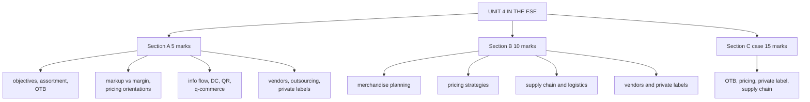

# MP-6: Unit 4 Exam Answers

Covers: what the ESE will ask from Unit 4, 5-mark and 10-mark skeletons, and a 15-mark case layout with a model answer. Numbers come from MP-1 to MP-5.

## What the test will ask

No course plan exists for Retail Management, so the pattern is **assumed** to match Bond Market: 50 marks, Section A 3 x 5 (internal choice), Section B 2 x 10 (internal choice), Section C one compulsory 15-mark case. Confirm with the faculty. Unit 4 is the most calculation-friendly unit: expect one sum (markup and margin, markdown, break-even, OTB or GMROI) and several descriptive 5-markers built on the faculty slides.

## Five-mark answer skeletons

**1. Objectives of a merchandise plan (MP-1).** Define the plan (what, how much, when, price); seven objectives with the slide examples (school products, umbrellas, Product A versus B, winter jackets).

**2. Steps in assortment planning (MP-1).** Nine steps in order; end with width = categories, depth = choices within a category.

**3. Open-to-buy (MP-2).** Definition, formula, one-line example (₹14.5 lakh), meaning of a negative OTB.

**4. Markup versus margin (MP-3).** Bases, conversion formulas, shirt example (₹800, 50% markup is ₹1,200 and a 33.33% margin; 30% margin is ₹1,142.86).

**5. Three pricing orientations (MP-3).** Cost, demand, competition, each with a definition, example and limit.

**6. Information flow in the supply chain (MP-4).** Backward flow, ten advantages (give five with examples), bullwhip.

**7. Distribution centres (MP-4).** Definition, six reasons, central kitchen analogy, 300 versus 103 routes.

**8. E-retailing versus quick commerce (MP-4).** Four-row table plus dark store.

**9. Vendor relationships (MP-5).** Four steps to establish, six to maintain, one scorecard.

**10. Outsourcing and private labels (MP-5).** Five reasons to outsource with the make-or-buy test; private label margin and risks.

## Ten-mark answer skeletons

**A. Merchandise planning and assortment (MP-1, MP-2).** Meaning, seven objectives, nine steps, width and depth, OTB with a worked figure, SKU rationalisation, markdown cadence, example.

**B. Retail pricing strategies (MP-3).** Six factors, three orientations with examples and limits, markup versus margin sum, break-even, markdown and EDLP versus high-low, blended approach.

**C. Retail supply chain and logistics (MP-4).** Flows, information flow advantages, DC and cross-docking, quick response (Zara), e-retailing, quick commerce and dark stores with the economics line.

**D. Vendors, outsourcing and private labels (MP-5).** Vendor life cycle, scorecard, outsourcing decision and make-or-buy, private-label strategy with margin comparison, risks.

## Fifteen-mark case layout (festive season planning)

1. **Open-to-buy (4):** compute OTB at retail and at cost; interpret.
2. **Pricing and break-even (4):** margin at the competitive price, and the volume to cover a fixed promotion cost.
3. **Private label versus national brand (3):** margins and break-even.
4. **Supply chain (4):** route count with a DC and the recommendation.

### Model answer, laid out as the exam answer

**Data (illustrative, fictional chain):** GreenLeaf Mart (fictional), a supermarket chain, plans a festive month. Planned sales ₹40 lakh, planned markdowns ₹3 lakh, planned end-of-month stock ₹30 lakh, beginning stock ₹28 lakh, stock on order ₹9 lakh (all at retail); initial markup on retail 25%. Annual sales ₹4.8 crore, cost of goods sold ₹3.6 crore, average inventory at cost ₹60 lakh. A festive hamper costs ₹800; the target margin is 30%; the nearest competitor sells at ₹1,050; a fixed promotion cost is ₹1,00,000. A private-label hamper costs ₹600 and also sells at ₹1,050. The chain has 5 stores and 40 suppliers.

1. **Open-to-buy:** OTB = 40 + 3 + 30 - 28 - 9 = **₹36 lakh at retail**. At cost: 36 x (1 - 0.25) = **₹27 lakh**. GMROI = (4.8 - 3.6) crore ÷ 0.60 crore = **2.0**; turnover = 3.6 ÷ 0.60 = **6.0 times**.
2. **Pricing:** target price for a 30% margin = 800 ÷ 0.70 = **₹1,142.86**, which is above the competitor's ₹1,050. At ₹1,050: profit ₹250, margin 250 ÷ 1,050 = **23.81%**, markup 250 ÷ 800 = **31.25%**. Break-even for the promotion = 1,00,000 ÷ 250 = **400 hampers**.
3. **Private label:** profit per hamper = 1,050 - 600 = **₹450**, margin 450 ÷ 1,050 = **42.86%**, against 23.81% for the national-brand hamper. Break-even = 1,00,000 ÷ 450 = 222.2, so **223 hampers**.
4. **Supply chain:** direct supply = 40 x 5 = **200 routes**; through a DC = 40 + 5 = **45 routes**, a **77.5%** reduction.

| Item | Result |
|---|---|
| OTB (retail / cost) | ₹36 lakh / ₹27 lakh |
| GMROI, turnover | 2.0, 6.0 times |
| Hamper at 30% margin | ₹1,142.86 |
| Margin at ₹1,050 | 23.81% (markup 31.25%) |
| Promotion break-even (national brand) | 400 hampers |
| Private-label margin, break-even | 42.86%, 223 hampers |
| Routes direct versus DC | 200 versus 45 |

**Decision line:** buy up to ₹27 lakh at cost this month, price the hamper at the competitive **₹1,050**, push the **private-label hamper**, and consolidate supply through a **distribution centre**. **Interpretation:** the 30% target margin is unreachable at market price, so the lever is cost: the private label earns ₹450 against ₹250 per hamper, breaks even at 223 units against 400, and a DC cuts routes by about three-quarters. The result holds only if private-label quality is controlled and vendor relationships are managed.

Close with one sentence on assumptions: the margin and break-even figures use the given costs only and ignore wastage, so check them against actual sell-through before the festive period.

## Time rule

If short of time: do the OTB line and the margin at ₹1,050 (they carry the marks), then the private-label comparison, then one line each on the DC and the risks.

## What to remember

- Unit 4 sums: OTB, markup versus margin, markdown, break-even, GMROI, make or buy.
- Case figures: OTB ₹36 lakh retail and ₹27 lakh at cost; margin 23.81% at ₹1,050; break-even 400 hampers; private label 42.86% and 223 hampers; 200 versus 45 routes.
- Always finish with a decision line and an interpretation.
- Multiply successive markdowns; never add them.
- State the base for markup (cost) and margin (price).

## Concept map

## Flashcards
Q: Which sums are most likely from Unit 4?
A: Open-to-buy, markup versus margin, markdown cascade, break-even quantity, GMROI and a make-or-buy or vendor scorecard.

Q: Skeleton for a 10-mark "retail pricing strategies" answer?
A: Six factors, three orientations with examples and limits, markup versus margin sum, break-even, markdown and EDLP versus high-low, blended approach.

Q: In the model case, why can the 30% target margin not be used?
A: It gives ₹1,142.86, above the competitor's ₹1,050; at ₹1,050 the margin is only 23.81%.

Q: Why does the private-label hamper win?
A: Profit ₹450 against ₹250, margin 42.86% against 23.81%, break-even 223 hampers against 400.

Q: What does the DC achieve in the case?
A: Routes fall from 200 (40 suppliers x 5 stores) to 45 (40 + 5), a 77.5% cut.

Q: What assumption should close the 15-mark answer?
A: The figures use only the given costs, ignore wastage and assume private-label quality is controlled; check against actual sell-through.

## Sources
- Assumed ESE pattern (50 marks, 3 x 5, 2 x 10, 1 x 15 case)
- MP-1 to MP-5 and the Unit 4 slides, RM Notes and student notes
- [[Retail Management Unit 4 - Merchandise MOC (Node Map)]]
