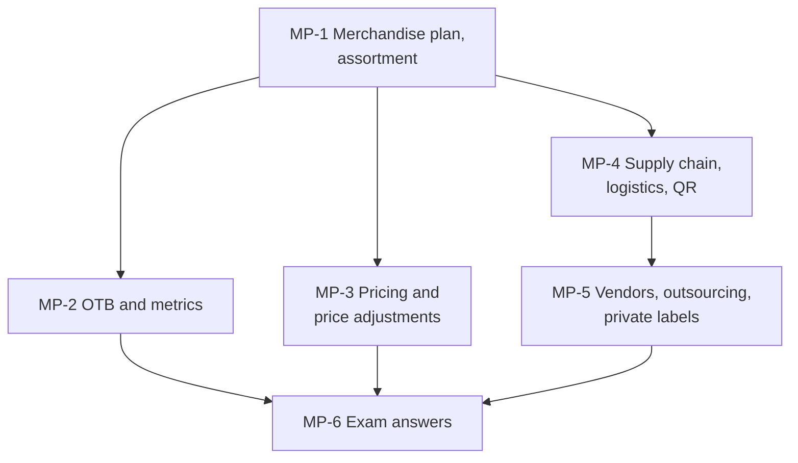

# Retail Management Unit 4: Merchandise and Product Management, node map

ESE (assumed, no course plan): 50 marks, Section A 3 x 5, Section B 2 x 10, Section C one compulsory 15-mark case. Unit 4 is the most numerical unit: open-to-buy, GMROI, markup and margin, markdown, break-even, make or buy, vendor scorecard. Examples are **illustrative**; slide material is tagged (syllabus) and additions (textbook) in each node.

## Nodes

| Node | Topic | Deps | Minutes | Exam focus |
|---|---|---|---|---|
| MP-1 | Merchandise Planning and Assortment | none | 35 | yes |
| MP-2 | Open-to-Buy and Merchandise Metrics | MP-1 | 35 | yes |
| MP-3 | Retail Pricing and Price Adjustments | MP-1 | 45 | yes |
| MP-4 | Supply Chain, Logistics and Quick Response | MP-1 | 45 | yes |
| MP-5 | Vendors, Outsourcing and Private Labels | MP-4 | 40 | yes |
| MP-6 | Unit 4 Exam Answers | MP-1 to MP-5 | 30 | yes |

Total reading time: about 230 minutes.

## Dependency graph

## Key frameworks and formulas

- Merchandise plan: right product, quantity, place, time, price. Seven objectives; nine assortment steps; width = categories, depth = choices per category.
- OTB = planned sales + planned markdowns + planned EOM stock - BOM stock - on order. Example ₹14.5 lakh (retail), ₹8.7 lakh at cost; negative OTB means over-bought.
- GMROI = gross margin ÷ average inventory at cost (2.0); turnover = COGS ÷ average inventory (6.0); sell-through = units sold ÷ received.
- Six price factors; cost, demand, competition orientations. Markup on cost, margin on price: M = MU ÷ (1 + MU). Shirt ₹800: 50% markup gives ₹1,200 (33.33% margin); 30% margin gives ₹1,142.86.
- Break-even quantity = fixed cost ÷ (price - variable cost): ₹6,00,000 ÷ ₹400 = 1,500 units. A 10% price cut on a ₹400 contribution needs 33.3% more volume.
- Markdown cascade: 20% then 25% from ₹3,000 gives ₹1,800 (40% cumulative), below a ₹2,000 cost.
- Supply chain: information flows backward; ten information-flow advantages; DC cuts 300 routes to 103; QR (Zara); q-commerce 10 to 30 minutes with dark stores.
- Vendors: 4 steps to establish, 6 to maintain; scorecard B 4.6, A 3.8, C 3.1. Make-or-buy break-even 8,000 orders. Private label 35.29% margin versus 25%.
- Case answer (MP-6): OTB ₹36 lakh retail and ₹27 lakh cost; hamper margin 23.81% at ₹1,050; private label 42.86%; 200 versus 45 routes.

## Open flags

- Planogram compliance uplift (10 to 15%) is a faculty-note claim with no source [VERIFY]. Private-label range names should be checked [VERIFY].

## Links
- [[Retail Management MOC]]
