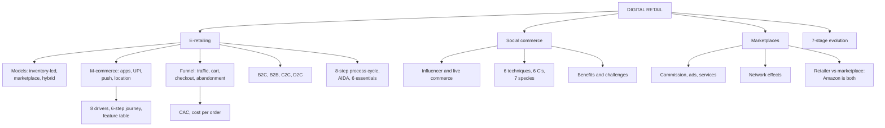

# DR-1: E-Retailing, M-Commerce and Social Commerce

Covers: e-tailing definition, process cycle, AIDA and essentials, the four e-retail models (B2C, B2B, C2C, D2C), the 7-stage evolution of retail, m-commerce drivers, journey and features, social commerce (6 techniques, 6 C's, 7 species, benefits, challenges), marketplaces versus retailers, the conversion funnel, and a funnel and a seller-economics worked example.

**Sources and tags.** The primary source is now the faculty decks **RM Unit 5.1 slides** and **RM Unit 5.2 slides**. **(slides)** marks content from those decks; give it as the exam answer. **(syllabus)** marks your own Unit 5 notes, kept where the slides are silent. **(textbook)** marks my additions. Where your earlier notes differ from the slides, the slides win and the difference is stated.

**Slide versus note, models.** Your note lists the e-retail models as inventory-led, marketplace and hybrid. Correct for the exam: the slides' four e-retail business models are **B2C, B2B, C2C and D2C**, and the slides' split of retailer versus marketplace is a separate table (below). Inventory-led versus marketplace is the same idea as "retailer versus marketplace", so your table stays valid under that heading.

## Where this fits in the ESE

Assumed pattern (no course plan): 50 marks, 3 x 5, 2 x 10, one 15-mark case. Likely: a 5-mark "inventory-led versus marketplace model", "m-commerce features", "social commerce", or a funnel metric inside the case. Link to Unit 4 (MP-4) for the fulfilment side.

## E-tailing: definition, process cycle, AIDA and essentials (slides)

**Definition (5.2):** electronic retailing (**e-tailing**) is the sale of goods and services through the Internet. It requires a company to tailor its business model to capture Internet sales, which includes building distribution channels: warehouses, Internet web pages and product shipping centres. **(slides)**

**Definition (5.1):** the sale of products and services through digital channels, mainly websites and online platforms. Store route: store, customer, purchase. E-retail route: website or app, customer, digital purchase, delivery. Examples on the slide: Amazon, Flipkart, Myntra, Nykaa, IKEA Online. **(slides)**

**Three revenue sources (5.2):** (1) sale of products and services, (2) subscriptions to website content, (3) advertising. 5.2 also calls e-retailing a **B2C** model: a transaction between a business and the end consumer. **(slides)**

**The 8-step e-tailing process cycle (5.2):** **(slides)**

| Step | What happens |
|---|---|
| 1 | Order placed by the user |
| 2 | Shopping cart |
| 3 | Credit card is charged (in India read this as card, UPI or wallet, **(textbook)**) |
| 4 | Order is completed |
| 5 | Email sent to customer and merchant |
| 6 | Order sent to the warehouse for fulfilment (steps 5 and 6 run in parallel after step 4) |
| 7 | Shipping carrier picks up the shipment |
| 8 | Shipment sent to the customer |

Link to Unit 4: steps 6 to 8 are the fulfilment backend (MP-4).

**AIDA in e-retailing (5.2).** The slide calls it a direct-mail marketing acronym applied to the website. **(slides)**

| Letter | Meaning | Online meaning (textbook) |
|---|---|---|
| **A**ttention | Grab the visitor's attention | Banner, search ad, social post |
| **I**nterest | Pique interest in your product | Clear photos, features, reviews |
| **D**esire | Build desire for the product | Offers, social proof, demo video |
| **A**ction | Get them to follow a call to action | "Add to cart", "Buy now", one-click checkout |

**Six essentials of e-retailing (5.2):** **(slides)**

1. An attractive B2C e-commerce model.
2. The right revenue model.
3. Penetration of the Internet.
4. **E-catalog:** database of products with prices and available stock.
5. **Shopping cart:** the customer fills it, the system calculates the price at checkout.
6. **Payment gateway:** credit card or e-cash, must be fully secure.

**Opportunities (5.2):** opens many doors; a greater range of people to sell to; higher profits and lower costs; better and cheaper selling through globalisation. To reach the global market: banners on other sites, word of mouth, social networking sites (Twitter, Facebook) to announce new products, and TV or radio ads if funds allow. **(slides)**

**What to sell online (5.2 list):** computer hardware and software, consumer electronics, office supplies, sporting goods, books and music, toys, health and beauty, apparel, jewellery, cars, services. **Successful e-retailers on the slide:** Amazon (books), Dell (computer hardware), Marks and Spencer (clothing, gifts), Boots (high street). These are the slide's examples from an earlier period; quote them as given and add a current Indian example (Flipkart, Nykaa). **[VERIFY]** current category mix.

## Business models: B2C, B2B, C2C and D2C (slides)

| Model | Parties | Slide example |
|---|---|---|
| **B2C** | Business sells to consumer | Amazon |
| **B2B** | Business sells to business | Alibaba |
| **C2C** | Consumer sells to consumer through a platform | OLX |
| **D2C** | Brand sells directly to its consumer, no middleman | Mamaearth |

**Slide discussion: why are brands adopting D2C?** Suggested answer **(textbook)**: the brand owns the customer data and relationship, keeps the intermediary margin, controls pricing and presentation, and gets feedback quickly for product development. Cost side: it must build its own traffic, logistics and service. Link to the platform-dependence risk in the marketplace section below.

## Evolution of retail: physical to phygital (slides)

| Stage | Name | Hook |
|---|---|---|
| 1 | Traditional retail | Customer goes to the store |
| 2 | E-retailing | Website, delivery |
| 3 | Mobile commerce | Phone as the shop and the wallet |
| 4 | Social commerce | Discovery and buying on social platforms |
| 5 | Omnichannel | One integrated journey (DR-4) |
| 6 | AI-driven retail | Prediction and personalisation (DR-2) |
| 7 | Smart and immersive | Smart stores, metaverse (DR-4) |

**Key idea (slide):** retail has moved from "Where do customers shop?" to "How does the customer want to shop?" **(slides)** Mnemonic: T-E-M-S-O-A-S.

## E-retailing and m-commerce

**E-retailing** is selling goods and services through internet-based channels. **M-commerce** is the part done through smartphones and apps, now the dominant and fastest-growing form in India. **(syllabus)**

Why it matters: it removed shelf-space limits, fixed hours and single geography. Mobile **leapfrogged** desktop in India, where mobile internet outgrew desktop.

**Retailer versus marketplace, by who holds stock (your note; the slides' table is in the marketplace section below).** The slides' four e-retail business models (B2C, B2B, C2C, D2C) are above. **(syllabus)**

| Model | Who holds stock | Revenue | Example |
|---|---|---|---|
| **Inventory-led** | The retailer | Product margin | Traditional e-commerce store |
| **Marketplace** | Third-party sellers | Commission, ads, services | Amazon Marketplace, Flipkart, Meesho |
| **Hybrid** | Both | Mix | Amazon's evolution |

**M-commerce features:** app shopping, wallets and UPI payments, push notifications, location-based offers, mobile-optimised checkout. Mobile-first design (not merely mobile-compatible) is the baseline.

**Three integrated systems for e-retail success:** digital storefront (UX and UI), reliable fulfilment and logistics backend (see MP-4), and digital marketing to drive traffic.

**Conversion funnel metrics:** traffic, add-to-cart rate, checkout completion rate, cart abandonment rate. **Digital acquisition:** paid search, social advertising, influencer marketing, against physical retail's footfall-driven acquisition.

**Advantages:** unlimited shelf space (long tail), lower incremental acquisition cost at scale, rich behavioural data for personalisation. **Limitations:** price transparency, high acquisition cost in crowded categories, dependency on third-party logistics and payments. **Practice:** A/B testing of layout, checkout and price display; cart-abandonment recovery by email, push and retargeting.

**Indian examples:** Flipkart and Myntra app-first strategies; UPI checkout cut payment friction compared with card-led Western e-commerce. **Managerial insight:** bolting a website onto a store business without new capabilities (digital marketing, UX, logistics-tech) underperforms digital natives.

Regulation to be aware of **(textbook)** **[VERIFY]**: Indian FDI rules allow foreign-owned platforms to run a marketplace but restrict them from holding inventory and selling directly; the Consumer Protection (E-Commerce) Rules, 2020, and the ONDC open network are also relevant. Check current provisions before quoting.

### Worked example: funnel, cost per order and CAC

**Question (illustrative, fictional retailer):** TrendNest (fictional) gets 1,00,000 visits in a month. 8% add to cart; 70% of carts are abandoned. Marketing spend is ₹5,00,000. Average order value is ₹1,000 at a 25% gross margin, and 60% of the orders come from new customers.

1. Carts = 1,00,000 x 8% = **8,000**. Abandoned = 8,000 x 70% = **5,600**. Orders = **2,400** (30% checkout completion).
2. Conversion = 2,400 ÷ 1,00,000 = **2.4%**.
3. Marketing cost per order = 5,00,000 ÷ 2,400 = **₹208.33**.
4. New customers = 2,400 x 60% = 1,440; **CAC** = 5,00,000 ÷ 1,440 = **₹347.22**.
5. Gross margin = 2,400 x ₹250 = **₹6,00,000**; after marketing = **₹1,00,000**.
6. Cart recovery: if 10% of abandoned carts are recovered, 560 orders, **₹5,60,000** revenue and **₹1,40,000** margin.

| Metric | Value |
|---|---|
| Visits, carts, orders | 1,00,000; 8,000; 2,400 |
| Conversion | 2.40% |
| Cost per order | ₹208.33 |
| CAC (new customers only) | ₹347.22 |
| Margin after marketing | ₹1,00,000 |
| Margin from 10% cart recovery | ₹1,40,000 |

**Interpretation:** marketing barely pays on the first order, but a recovery programme costs far less than winning new traffic, which is why cart abandonment is the first fix. Say CAC counts new customers only; cost per order counts all orders.

### Worked example: a marketplace seller's economics

**Question (illustrative):** a seller lists a product at ₹1,000; the platform charges 12% commission (illustrative rate), fulfilment costs ₹60, product cost is ₹650.

1. Commission = ₹120.
2. Net = 1,000 - 120 - 60 - 650 = **₹170**, which is **17%** of the price.

**Interpretation:** the seller gets traffic without building a store but gives up about 18% of the price to the platform and fulfilment. The inventory-led retailer keeps that share but pays for stock, traffic and delivery. Choose by capital, capability and control of customer data.

## M-commerce: drivers, journey and features (slides)

**Definition (5.1):** buying and selling products or services using mobile devices. **Examples in India on the slide:** Google Pay, PhonePe, Flipkart app, Amazon app, Zepto, Blinkit. **How it shows up:** shopping apps, mobile payments, push notifications, location-based offers, QR-code shopping. **(slides)**

**Eight growth drivers:** smartphone penetration, affordable internet, digital payments (UPI), mobile apps, convenience, faster checkout, quick commerce, personalised recommendations. **(slides)**

**The 6-step mobile consumer journey:** **Discover, Compare, Evaluate, Purchase, Track, Review.** **(slides)**

**Feature to retail application (slide table):**

| Feature | Retail application |
|---|---|
| Push notifications | Flash sales and cart reminders |
| GPS | Location-based offers |
| QR codes | Product information, in-store payment |
| Mobile wallets | Quick payment |
| Biometrics | Secure authentication |
| AI | Recommendations |
| Augmented reality | Virtual try-on |

**Exam use:** "What is m-commerce? Explain its features." Define, give the five ways it shows up, the seven-row table, then the drivers. The cart-reminder push is also the cart-recovery tool in the funnel example above.

## Social commerce and online marketplaces

**Social commerce:** shopping built into social platforms, so discovery, engagement and purchase happen in one session (Instagram Shopping, live-stream commerce). **(syllabus)**

- **Influencer-driven commerce:** creators drive discovery and trust, usually through affiliate links or shoppable content. Trust built by "normal", non-sponsored content is later monetised; too-frequent monetisation erodes it.
- **Live commerce:** real-time video selling that blends entertainment with transaction; big in China and growing in India.
- **Marketplace model:** the operator (Amazon, Flipkart, Meesho) hosts independent sellers and earns **commission, advertising (sponsored listings) and seller services** (fulfilment, financing).
- **Network effects:** more sellers mean more choice for buyers, and more buyers mean more demand for sellers, making challengers' lives hard.
- **Share of search:** sellers manage visibility in marketplace search the way brands once managed shelf placement.

**Advantages and limits:**

| | Advantage | Limitation |
|---|---|---|
| Social commerce | High engagement, trust transfer, low acquisition friction | Harder to own customer data; dependence on platform algorithms and policy |
| Marketplace (for sellers) | Instant access to a large customer base | Price competition among sellers, limited brand control, exposure to fee or policy changes |

**Indian examples:** Meesho's reseller-led marketplace; Instagram-led discovery for D2C beauty and fashion startups. **International:** TikTok Shop and Amazon Live.

**Ethics link (your notes):** the course caselet on ethical AI in a startup raises authenticity, disclosure and algorithmic bias in recommendations. Mention disclosure of sponsored content. The caselet is the faculty's HBS UV8553, answered in DR-2.

## Social commerce: the faculty frameworks (slides)

**Definition (5.2):** social commerce is a subset of electronic commerce that uses social media (online media that supports social interaction) and user contributions to assist the online buying and selling of products and services. **Definition (5.1):** buying and selling products directly through social media platforms. Use the 5.2 wording as the main definition and the 5.1 line as the short version. **(slides)**

| | Traditional e-commerce | Social commerce |
|---|---|---|
| Path | Social media, then website, then purchase | Social media, discovery, interaction, purchase |
| Key point | Buying happens on the retailer's site | The purchase happens **without leaving the platform**: discovery and buying merge |

**Examples (5.1):** Instagram Shopping, Facebook Marketplace, YouTube Shopping, live commerce. **(slides)**

**Evolution (5.2).** Started with social networking sites (Facebook, Twitter); Facebook commerce (f-commerce) became popular; customers, suppliers and retailers began to collaborate; retailers wanted their own Facebook page; consumers took buying decisions; a virtual marketplace of social shopping websites emerged. **(slides)**

| Combination | Result |
|---|---|
| Traditional commerce + Internet (1990s) | Electronic commerce |
| E-commerce + mobile technology | Mobile commerce |
| E-commerce + social media | Social commerce |
| M-commerce and S-commerce together | S-commerce reachable from the Internet and mobiles |

**How retailers influence shoppers through S-commerce (5.2):** bring shoppers with a common interest together on social networking sites; invite comments, feedback, reviews and opinions; make shoppers feel part of a community; use word of mouth and interaction as brand promotion; use the reviews to improve products and services. **(slides)**

**Influencer chain (5.1), six steps:** Influencer content, Attention, Interest, Trust, Consideration, Purchase. **(slides)** Slide discussion: why trust an influencer more than an advertisement? Suggested answer **(textbook)**: the influencer feels like a peer, not a seller; the content is relatable and repeated over time; and the audience chose to follow. The disclosure of paid posts matters for keeping that trust.

**Influencer Detective activity (5.1), six questions on one influencer's normal, non-sponsored posts:** how they became popular; type of content; target audience; products they naturally showcase; what makes followers interested; how the popularity could be converted into sales. Output: a 5-minute group presentation. **(slides)**

**Six marketing techniques within S-commerce (5.2):** **(slides)**

| Technique | Meaning |
|---|---|
| **SCRM** (social customer relationship management) | Close engagement between customers and retailers for a long-term relationship based on trust and brand loyalty |
| **Word of mouth** | One user shares a personal opinion or recommendation with others |
| **Social shopping** | Informed shopping from social sites, based on reviews, feedback or recommendations from friends, family or contacts |
| **Customer to customer** | Platform that lets one customer transact directly with another, for example eBay |
| **Open source** | Platform where users discuss and share ideas on products or services freely, at any time |
| **Viral** | Mass advertising spread through email footers, spam or ads (slide wording; in practice, avoid spam, **(textbook)**) |

**Features of social commerce (5.2):** user ratings and reviews; recommendation technology; recommendations based on one's own interests; customers check reviews before buying; networked users generate ideas, advertise and add value at almost no cost; the Facebook "Like" button on product pages; better understanding of consumer behaviour; instant personalisation; brand growth. **(slides)**

**The 6 C's of social commerce (5.2):** **(slides)**

| C | Meaning |
|---|---|
| **Content** | Engage customers, prospects and stakeholders through valuable published content |
| **Community** | Treat the audience as a community to build lasting relationships with tangible value; grew from registration and email programmes to forums, chat rooms and membership groups |
| **Commerce** | Fulfil needs through a transactional web presence (online retailers, banks, insurers, travel sites) |
| **Context** | The online world tracks real-world events, enabled mainly by mobile devices |
| **Connection** | Online networks define and record relationships between people, physical or online |
| **Conversation** | A conversation between two parties surfaces a need that can be met, a potential market |

Memory hook: C-C-C-C-C-C, in the order **Content, Community, Commerce, Context, Connection, Conversation**.

**The 7 species of social commerce (5.2):** **(slides)**

| # | Species | Slide examples | Idea |
|---|---|---|---|
| 1 | Social network driven sales | Facebook commerce, Twitter commerce | Sales on established social networks |
| 2 | Peer-to-peer sales platforms | eBay, Etsy, Amazon | Users sell directly to other users |
| 3 | Group buying | Groupon, LivingSocial | Lower price once enough users agree to buy |
| 4 | Peer recommendations | Amazon, Yelp, JustBought | See other users' recommendations |
| 5 | User-curated shopping | The Fancy, Lyst, Svpply | Users create and share lists others shop from |
| 6 | Participatory commerce | Threadless, Kickstarter, CutOnYourBias | Users get involved in production |
| 7 | Social shopping | Motilo, Fashism, GoTryItOn | Chat with friends or others for advice |

Some of these platforms have closed or changed since the slide was made. Quote them as given and add one Indian example if you can. **[VERIFY]** current status.

**Benefits (5.2):** **(slides)**

| For shoppers | For retailers |
|---|---|
| Informed purchases; reviews and feedback; information sharing; recommendations | Reach a vast audience at one location; learn which products are popular |
| Feel part of a community; transparency | Act on negative reviews and regain trust |
| Group buying, promotional vouchers, latest deals | Word-of-mouth referrals raise demand and profit; closer customer relationship |
| Single log-in | Product and shopper data for marketing and business decisions; more demand, sales and profit |

**Trends and challenges (5.2):** **(slides)** Trends: a move away from traditional media; a united shopping experience. Challenges: privacy; customer engagement; Facebook's security issue; tools change rapidly; hidden soft costs; strong relationships take time; customers can voice disappointment and hurt reputation; usability testing is complex and needs advanced skills; analytics needs domain knowledge.

**Success stories on the slide (company-reported, dated) [VERIFY]:**

| Company | Result on the slide |
|---|---|
| Groupon | $11 million in one day of sales for GAP |
| Spinback | $2.10 average extra revenue per Facebook wall post; 10.9% conversion on Facebook shares |
| Pampers | 1,000 diapers sold in 1 hour on its Facebook store |
| Baby & Me | 50% of online sales from Facebook |
| LivingSocial | 42,000+ Facebook shares in 1 day for the $20 Amazon voucher |
| Ticketfly | 3.25 average sales via Facebook shares (unit not stated on the slide) |
| F&F | GBP 2 million+ in sales with Facebook vouchers |

Fully integrated S-commerce retailers on the slide: ASOS, Dove, Delta Airlines, 1-800-flowers.com. Use two or three statistics in an answer, not the whole table, and say they are the slide's figures.

## Marketplaces: retailer versus marketplace (slides)

**Definition (5.1):** a digital platform where multiple sellers offer products to consumers. **Examples:** Amazon, Meesho, Flipkart, Alibaba, Etsy. **Structure:** consumers deal with the platform, which hosts Seller 1, Seller 2, Seller 3. **(slides)**

| Dimension | Retailer | Marketplace |
|---|---|---|
| Products | Owns or controls products | Multiple independent sellers |
| Assortment | Retailer-controlled | Seller-driven |
| Inventory | Retailer bears responsibility | Often seller-managed |
| Example | Brand website | Amazon marketplace |

**Slide question: is Amazon a retailer, a marketplace, or both?** Answer: **both**. It buys and sells some products itself (retailer, with its own inventory) and also hosts independent sellers (marketplace), so the right label depends on the item. This is the hybrid model in your notes. **(textbook)** In India, rules on foreign-owned platforms holding inventory limit how the hybrid can be run. **[VERIFY]**

## Traps

- Inventory-led and marketplace are defined by **who holds stock**, not by size.
- Conversion rate is orders ÷ visits; checkout completion is orders ÷ carts. Do not mix them.
- Social commerce reduces friction but the platform, not the brand, owns the customer relationship.
- The 6 C's (Content, Community, Commerce, Context, Connection, Conversation) are not the 6 marketing techniques (SCRM, word of mouth, social shopping, C2C, open source, viral). Keep the two lists apart.
- The slides' four e-retail models are B2C, B2B, C2C, D2C. Inventory-led versus marketplace answers a different question: who holds stock.

## What to remember

- Slide models: B2C (Amazon), B2B (Alibaba), C2C (OLX), D2C (Mamaearth). Retailer owns stock; marketplace hosts independent sellers; Amazon is both.
- E-tailing: 3 revenue sources, 8-step process cycle, AIDA, 6 essentials (e-catalog, cart, payment gateway). M-commerce: 8 drivers, 6-step journey, feature table.
- Social commerce: 6 techniques, 6 C's, 7 species, benefits for shoppers and for retailers, privacy as the main challenge.
- Funnel: traffic, add to cart, checkout, abandonment; example conversion 2.4%, cost per order ₹208.33, CAC ₹347.22.
- Marketplace seller net ₹170 (17%) after commission and fulfilment in the example.
- Social commerce: influencers, live commerce, shoppable content; risk is platform dependence.
- Network effects drive marketplace dominance.

## Concept map

## Flashcards
Q: Distinguish inventory-led and marketplace e-retail models.
A: Inventory-led: the retailer owns stock. Marketplace: a platform hosts third-party sellers who hold stock, and it earns commission, ads and service fees.

Q: Why did m-commerce leapfrog desktop in India?
A: Mobile internet penetration outpaced desktop adoption, and UPI cut payment friction.

Q: Name four funnel metrics.
A: Traffic, add-to-cart rate, checkout completion rate and cart abandonment rate.

Q: 1,00,000 visits, 8% add to cart, 70% abandon. Orders and conversion?
A: 8,000 carts, 2,400 orders, 2.4% conversion.

Q: Marketing ₹5,00,000, 1,440 new customers. CAC?
A: ₹347.22.

Q: Seller lists at ₹1,000, 12% commission, ₹60 fulfilment, ₹650 cost. Net profit?
A: ₹170 (17%).

Q: What is social commerce?
A: Shopping built into social platforms so discovery, engagement and purchase happen in one session.

Q: How do marketplaces earn?
A: Commission fees, advertising or sponsored listings, and seller services such as fulfilment and financing.

Q: What are network effects in a marketplace?
A: More sellers attract more buyers and vice versa, making the platform more valuable and harder to challenge.

Q: Key risk of relying on a marketplace or social platform?
A: Dependence on its algorithm, fees and policies, and weaker ownership of customer data.

Q: Define e-tailing and give its three revenue sources.
A: The sale of goods and services through the Internet, with a business model tailored to capture online sales. Revenue: sale of products and services, subscriptions to website content, advertising.

Q: List the 8 steps of the e-tailing process cycle.
A: Order placed, shopping cart, card charged, order completed, email to customer and merchant, sent to warehouse, carrier picks up, shipment sent to customer.

Q: What does AIDA stand for in e-retailing?
A: Attention, Interest, Desire, Action (a call to action such as "Buy now").

Q: Name the six essentials of e-retailing.
A: An attractive B2C model, the right revenue model, Internet penetration, an e-catalog, a shopping cart and a secure payment gateway.

Q: Name the four e-retail business models with the slide examples.
A: B2C (Amazon), B2B (Alibaba), C2C (OLX), D2C (Mamaearth).

Q: Why are brands adopting D2C?
A: They own the customer data and relationship, keep the middleman margin, control price and presentation, and get fast feedback. The cost is building their own traffic and logistics.

Q: Give the seven stages in the evolution of retail.
A: Traditional retail, e-retailing, mobile commerce, social commerce, omnichannel, AI-driven retail, smart and immersive.

Q: Name the six steps of the mobile consumer journey.
A: Discover, Compare, Evaluate, Purchase, Track, Review.

Q: Match these m-commerce features to applications: push notifications, GPS, QR codes, biometrics, AR.
A: Push: flash sales and cart reminders. GPS: location-based offers. QR: product information and in-store payment. Biometrics: secure authentication. AR: virtual try-on.

Q: List the key drivers of m-commerce growth.
A: Smartphone penetration, affordable internet, UPI digital payments, mobile apps, convenience, faster checkout, quick commerce, personalised recommendations.

Q: Define social commerce (class wording).
A: A subset of e-commerce that uses social media and user contributions to assist online buying and selling. Short form: buying and selling directly through social platforms, so discovery and purchase merge.

Q: Name the six marketing techniques in S-commerce.
A: SCRM, word of mouth, social shopping, customer to customer, open source, viral.

Q: Name the 6 C's of social commerce.
A: Content, Community, Commerce, Context, Connection, Conversation.

Q: Name the 7 species of social commerce with one example each.
A: Social network driven sales (Facebook commerce), peer-to-peer platforms (eBay), group buying (Groupon), peer recommendations (Yelp), user-curated shopping (Lyst), participatory commerce (Kickstarter), social shopping (GoTryItOn).

Q: Give four benefits of social commerce for retailers.
A: Reach a vast audience in one place, learn which products are popular, act on negative reviews to regain trust, and get word-of-mouth referrals plus shopper data.

Q: Give four challenges of social commerce.
A: Privacy, tools that change rapidly, hidden soft costs, and customers voicing disappointment publicly (also: relationships take time, usability testing and analytics need skills).

Q: What are the six steps in the influencer chain?
A: Influencer content, attention, interest, trust, consideration, purchase.

Q: Retailer versus marketplace: who holds inventory and who controls assortment?
A: Retailer: owns the products, controls assortment and bears inventory. Marketplace: multiple independent sellers, seller-driven assortment, usually seller-managed inventory.

Q: Is Amazon a retailer, a marketplace, or both?
A: Both. It sells some goods itself and also hosts independent sellers.

## Sources
- Faculty decks RM Unit 5.1 slides (Parts A to D) and RM Unit 5.2 slides (e-tailing and social commerce)
- Student notes Unit 5: E-Retailing and Mobile Commerce; Social Commerce and Online Marketplaces
- RM Unit 4 slides: e-retailing and quick commerce (supply-chain link)
- Next node: [[Retail Management Unit 5 - DR-2 Smart Stores and Retail Analytics]]
- [[Retail Management Unit 5 - Digital and Future Retail MOC (Node Map)]]
