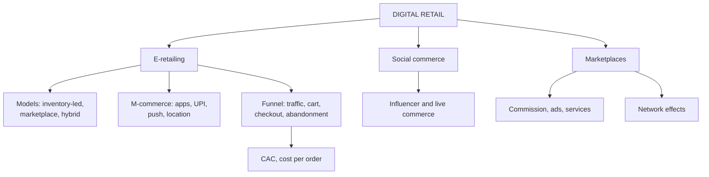

# DR-1: E-Retailing, M-Commerce and Social Commerce

Covers: e-retailing models, m-commerce, the conversion funnel and its metrics, digital acquisition, social and live commerce, marketplaces and network effects, with a funnel and a seller-economics worked example. **(syllabus)** means your Unit 5 notes: there are **no Unit 5 faculty slides**, so everything here comes from the notes and anything I add is tagged **(textbook)**.

## Where this fits in the ESE

Assumed pattern (no course plan): 50 marks, 3 x 5, 2 x 10, one 15-mark case. Likely: a 5-mark "inventory-led versus marketplace model", "m-commerce features", "social commerce", or a funnel metric inside the case. Link to Unit 4 (MP-4) for the fulfilment side.

## E-retailing and m-commerce

**E-retailing** is selling goods and services through internet-based channels. **M-commerce** is the part done through smartphones and apps, now the dominant and fastest-growing form in India. **(syllabus)**

Why it matters: it removed shelf-space limits, fixed hours and single geography. Mobile **leapfrogged** desktop in India, where mobile internet outgrew desktop.

**Models:**

| Model | Who holds stock | Revenue | Example |
|---|---|---|---|
| **Inventory-led** | The retailer | Product margin | Traditional e-commerce store |
| **Marketplace** | Third-party sellers | Commission, ads, services | Amazon Marketplace, Flipkart, Meesho |
| **Hybrid** | Both | Mix | Amazon's evolution |

**M-commerce features:** app shopping, wallets and UPI payments, push notifications, location-based offers, mobile-optimised checkout. Mobile-first design (not merely mobile-compatible) is the baseline.

**Three integrated systems for e-retail success:** digital storefront (UX and UI), reliable fulfilment and logistics backend (see MP-4), and digital marketing to drive traffic.

**Conversion funnel metrics:** traffic, add-to-cart rate, checkout completion rate, cart abandonment rate. **Digital acquisition:** paid search, social advertising, influencer marketing, against physical retail's footfall-driven acquisition.

**Advantages:** unlimited shelf space (long tail), lower incremental acquisition cost at scale, rich behavioural data for personalisation. **Limitations:** price transparency, high acquisition cost in crowded categories, dependency on third-party logistics and payments. **Practice:** A/B testing of layout, checkout and price display; cart-abandonment recovery by email, push and retargeting.

**Indian examples:** Flipkart and Myntra app-first strategies; UPI checkout cut payment friction compared with card-led Western e-commerce. **Managerial insight:** bolting a website onto a store business without new capabilities (digital marketing, UX, logistics-tech) underperforms digital natives.

Regulation to be aware of **(textbook)** **[VERIFY]**: Indian FDI rules allow foreign-owned platforms to run a marketplace but restrict them from holding inventory and selling directly; the Consumer Protection (E-Commerce) Rules, 2020, and the ONDC open network are also relevant. Check current provisions before quoting.

### Worked example: funnel, cost per order and CAC

**Question (illustrative, fictional retailer):** TrendNest (fictional) gets 1,00,000 visits in a month. 8% add to cart; 70% of carts are abandoned. Marketing spend is ₹5,00,000. Average order value is ₹1,000 at a 25% gross margin, and 60% of the orders come from new customers.

1. Carts = 1,00,000 x 8% = **8,000**. Abandoned = 8,000 x 70% = **5,600**. Orders = **2,400** (30% checkout completion).
2. Conversion = 2,400 ÷ 1,00,000 = **2.4%**.
3. Marketing cost per order = 5,00,000 ÷ 2,400 = **₹208.33**.
4. New customers = 2,400 x 60% = 1,440; **CAC** = 5,00,000 ÷ 1,440 = **₹347.22**.
5. Gross margin = 2,400 x ₹250 = **₹6,00,000**; after marketing = **₹1,00,000**.
6. Cart recovery: if 10% of abandoned carts are recovered, 560 orders, **₹5,60,000** revenue and **₹1,40,000** margin.

| Metric | Value |
|---|---|
| Visits, carts, orders | 1,00,000; 8,000; 2,400 |
| Conversion | 2.40% |
| Cost per order | ₹208.33 |
| CAC (new customers only) | ₹347.22 |
| Margin after marketing | ₹1,00,000 |
| Margin from 10% cart recovery | ₹1,40,000 |

**Interpretation:** marketing barely pays on the first order, but a recovery programme costs far less than winning new traffic, which is why cart abandonment is the first fix. Say CAC counts new customers only; cost per order counts all orders.

### Worked example: a marketplace seller's economics

**Question (illustrative):** a seller lists a product at ₹1,000; the platform charges 12% commission (illustrative rate), fulfilment costs ₹60, product cost is ₹650.

1. Commission = ₹120.
2. Net = 1,000 - 120 - 60 - 650 = **₹170**, which is **17%** of the price.

**Interpretation:** the seller gets traffic without building a store but gives up about 18% of the price to the platform and fulfilment. The inventory-led retailer keeps that share but pays for stock, traffic and delivery. Choose by capital, capability and control of customer data.

## Social commerce and online marketplaces

**Social commerce:** shopping built into social platforms, so discovery, engagement and purchase happen in one session (Instagram Shopping, live-stream commerce). **(syllabus)**

- **Influencer-driven commerce:** creators drive discovery and trust, usually through affiliate links or shoppable content. Trust built by "normal", non-sponsored content is later monetised; too-frequent monetisation erodes it.
- **Live commerce:** real-time video selling that blends entertainment with transaction; big in China and growing in India.
- **Marketplace model:** the operator (Amazon, Flipkart, Meesho) hosts independent sellers and earns **commission, advertising (sponsored listings) and seller services** (fulfilment, financing).
- **Network effects:** more sellers mean more choice for buyers, and more buyers mean more demand for sellers, making challengers' lives hard.
- **Share of search:** sellers manage visibility in marketplace search the way brands once managed shelf placement.

**Advantages and limits:**

| | Advantage | Limitation |
|---|---|---|
| Social commerce | High engagement, trust transfer, low acquisition friction | Harder to own customer data; dependence on platform algorithms and policy |
| Marketplace (for sellers) | Instant access to a large customer base | Price competition among sellers, limited brand control, exposure to fee or policy changes |

**Indian examples:** Meesho's reseller-led marketplace; Instagram-led discovery for D2C beauty and fashion startups. **International:** TikTok Shop and Amazon Live.

**Ethics link (your notes):** the course caselet on ethical AI in a startup raises authenticity, disclosure and algorithmic bias in recommendations. Mention disclosure of sponsored content.

## Traps

- Inventory-led and marketplace are defined by **who holds stock**, not by size.
- Conversion rate is orders ÷ visits; checkout completion is orders ÷ carts. Do not mix them.
- Social commerce reduces friction but the platform, not the brand, owns the customer relationship.

## What to remember

- E-retailing models: inventory-led, marketplace (commission, ads, services), hybrid. M-commerce: apps, UPI, push, location offers.
- Funnel: traffic, add to cart, checkout, abandonment; example conversion 2.4%, cost per order ₹208.33, CAC ₹347.22.
- Marketplace seller net ₹170 (17%) after commission and fulfilment in the example.
- Social commerce: influencers, live commerce, shoppable content; risk is platform dependence.
- Network effects drive marketplace dominance.

## Concept map

## Flashcards
Q: Distinguish inventory-led and marketplace e-retail models.
A: Inventory-led: the retailer owns stock. Marketplace: a platform hosts third-party sellers who hold stock, and it earns commission, ads and service fees.

Q: Why did m-commerce leapfrog desktop in India?
A: Mobile internet penetration outpaced desktop adoption, and UPI cut payment friction.

Q: Name four funnel metrics.
A: Traffic, add-to-cart rate, checkout completion rate and cart abandonment rate.

Q: 1,00,000 visits, 8% add to cart, 70% abandon. Orders and conversion?
A: 8,000 carts, 2,400 orders, 2.4% conversion.

Q: Marketing ₹5,00,000, 1,440 new customers. CAC?
A: ₹347.22.

Q: Seller lists at ₹1,000, 12% commission, ₹60 fulfilment, ₹650 cost. Net profit?
A: ₹170 (17%).

Q: What is social commerce?
A: Shopping built into social platforms so discovery, engagement and purchase happen in one session.

Q: How do marketplaces earn?
A: Commission fees, advertising or sponsored listings, and seller services such as fulfilment and financing.

Q: What are network effects in a marketplace?
A: More sellers attract more buyers and vice versa, making the platform more valuable and harder to challenge.

Q: Key risk of relying on a marketplace or social platform?
A: Dependence on its algorithm, fees and policies, and weaker ownership of customer data.

## Sources
- Student notes Unit 5: E-Retailing and Mobile Commerce; Social Commerce and Online Marketplaces (no faculty slides for Unit 5)
- RM Unit 4 slides: e-retailing and quick commerce (supply-chain link)
- Next node: [[Retail Management Unit 5 - DR-2 Smart Stores and Retail Analytics]]
- [[Retail Management Unit 5 - Digital and Future Retail MOC (Node Map)]]
