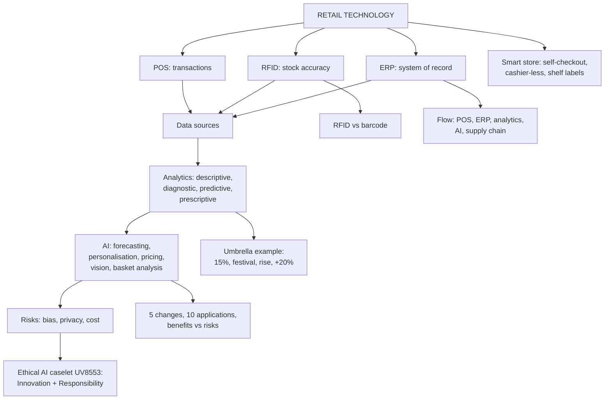

# DR-2: Smart Stores and Retail Analytics

Covers: POS, RFID (with RFID versus barcode) and ERP and the integrated flow, smart-store technologies, retail data sources, retail analytics and its four types with the umbrella examples, the supermarket data check, AI in retail (5 changes, 10 applications, personalisation, benefits and risks), the Ethical AI caselet UV8553, and sums on forecast error, basket analysis and technology payback.

**Sources and tags.** The primary source is the faculty deck **RM Unit 5.1 slides**. **(slides)** marks content from that deck; give it as the exam answer. **(syllabus)** marks your own Unit 5 notes and the RM Notes, kept where the slides are silent. **(textbook)** marks my additions.

**Slide versus note.** Your note says RFID "ends phantom inventory". The slide's benefit is "reduced stock errors", and RFID reduces phantom inventory but does not remove it (tags can be damaged or missed, and theft still happens). Write "reduces". Your note's five AI uses overlap with the slide's ten (forecasting, personalisation, dynamic pricing), but computer vision and basket analysis are not on the slide list. Learn the slide's ten and keep those two as extras.

## Where this fits in the ESE

Assumed pattern (no course plan): 50 marks, 3 x 5, 2 x 10, one 15-mark case. Likely: a 5-mark "POS, RFID and ERP", "AI applications in retail" or "analytics maturity", and a payback or forecast-accuracy sum inside the case.

## Smart stores: POS, RFID and ERP

These three are the infrastructure under omnichannel, analytics, CRM and the supply chain. **(syllabus)**

| Technology | What it is | Key benefit |
|---|---|---|
| **POS** (point of sale) | Records every transaction at checkout; modern POS links inventory, CRM and payments | Real-time sales and stock visibility |
| **RFID** (radio frequency identification) | Tags on products or pallets for wireless, automated tracking | Inventory accuracy far above manual barcode counts; cuts "phantom inventory" |
| **ERP** (enterprise resource planning) | One system of record for finance, inventory, procurement, HR and sales | Store-level operations tied to corporate planning and dashboards |

How they work together: POS captures the sale, RFID tracks physical stock in near real time, ERP integrates both with finance, procurement and planning. The loop supports forecasting, automated replenishment and unified reporting.

- **Phantom inventory:** the system shows stock the shelf does not have (shrinkage, misplacement, scanning errors), causing stockouts and bad planning. RFID addresses it.
- **Smart-store technologies:** self-checkout kiosks, computer-vision "just walk out" checkout (Amazon Go), **electronic shelf labels** for instant central price changes, in-store sensors for customer flow.
- **Where RFID pays most:** fashion, with many SKUs, sizes and colours, and "endless aisle" omnichannel promises. It adds less in basic grocery with few variants.
- **Limits:** upfront cost and complexity (ERP rollouts across large chains), maintenance, change management.
- **Indian examples:** Reliance Retail and Shoppers Stop have invested in integrated POS and ERP. The notes cite Amazon Go as the most advanced computer-vision store; the programme's status has changed over time **[VERIFY]**.
- **Managerial insight:** judge technology by the **downstream capability** it enables (analytics, omnichannel), not only direct savings.

## Technology in retail operations: POS, RFID, ERP (slides)

**What technology supports (5.1):** billing, customer management, supply chain, forecasting, inventory management, payments, product tracking, employee management. **Key technologies:** POS, RFID, ERP, AI, IoT, analytics. **(slides)**

**POS (point of sale):** the technology used to process transactions at the point of purchase. **(slides)**

| A POS can record | Retailer benefit chain |
|---|---|
| Product, price, customer, quantity, payment method, time of purchase | 1 Transaction, 2 Data, 3 Analysis, 4 Decision |

**RFID (radio frequency identification):** uses radio waves to identify and track products. **(slides)**

- **Process:** RFID tag, reader, data, inventory system.
- **Benefits (5):** faster inventory counting, product tracking, reduced stock errors, improved inventory visibility, loss prevention.

**RFID versus barcode (slide table):** **(slides)**

| Dimension | Barcode | RFID |
|---|---|---|
| Line of sight | Required | Usually not required |
| Reading | Scanned one at a time | Many tags read at once |
| Cost | Low | Relatively higher |
| Typical use | Checkout at POS | Inventory tracking |

**Slide question: why would a fashion retailer prefer RFID for inventory management?** Suggested answer **(textbook)**: fashion has many SKUs in sizes and colours, so counts by scanning each item are slow; RFID reads a whole rack or carton at once with no line of sight, so counts are faster and more accurate; accurate item-level stock supports "check stock in store" promises and cuts loss. Balance: tags cost more than barcodes, so RFID pays on higher-value, high-variety goods, while the cheap barcode stays at checkout.

**ERP (enterprise resource planning):** integrates different business functions into a single information system. One shared database means every function sees the same real-time data. Functions on the slide: **Sales, Purchasing, Inventory, Finance, Supply chain, HR.** **(slides)** Do not define ERP as billing (that is POS).

**Integrated retail technology, five steps (slide):** a customer buys a product. **(slides)**

| Step | System | What happens |
|---|---|---|
| 1 | POS | Sale recorded |
| 2 | ERP | Inventory updated |
| 3 | Analytics | Sales analysed |
| 4 | AI | Demand predicted |
| 5 | Supply chain | Stock replenished |

Result on the slide: **a connected retail ecosystem.** Write the flow as POS, ERP, Analytics, AI, Supply chain.

**Illustrative trace of the flow (textbook, made-up numbers):** a shelf holds 30 units and the POS records 6 sales on day one.

1. POS: 6 units sold. ERP: stock = 30 - 6 = **24**.
2. Analytics: average sales = **6 a day**; weekend sales run higher.
3. AI: predicts **9 a day** over the next supplier lead time of 3 days.
4. Reorder point = 9 x 3 + safety stock 6 = **33**.
5. Stock 24 is below 33, so the supply chain **reorders now**.

**Interpretation:** each system hands data to the next, so replenishment is triggered by a sale and a forecast, not by a clerk's count. Without the ERP step, the POS data would sit in one function and the stockout would be noticed on the shelf.

## Retail data sources (RM Notes)

| Internal source | Data | Output |
|---|---|---|
| POS | SKU transactions, time, basket size, payment mode | Sales per sq ft, units per transaction, average order value |
| Loyalty and CRM | Demographics, purchase history, redemptions | CLV, RFM |
| Web and app analytics | Impressions, click-through, cart abandonment, dwell time | Funnel optimisation, retargeting |
| In-store sensors and Wi-Fi | Footfall counts, aisle dwell, entry heat maps | Capture rate, conversion ratio |

External: syndicated audits (NielsenIQ, Kantar), industry reports (IMAGES Group, McKinsey, Deloitte), census and GIS data, competitor web scraping for prices and stock.

## Retail analytics and AI

**Retail analytics** is the systematic use of data and statistical or AI models to improve decisions in forecasting, personalisation, pricing and operations. It is the maturation of the retail market information system. Its advantage compounds: more data and use improve models. **(syllabus)**

**Four levels of analytics maturity** (the slides call them four types, with the umbrella examples in the slide section below):

1. **Descriptive:** what happened?
2. **Diagnostic:** why?
3. **Predictive:** what will happen?
4. **Prescriptive:** what should we do, often with automated action.

Most retailers are moving from predictive towards prescriptive.

**Applications:**
- **Demand forecasting** at SKU and store level, feeding merchandise planning (MP-1, MP-2).
- **Personalisation engines** for recommendations and CRM targeting (RL-4).
- **Dynamic pricing:** algorithmic real-time prices based on demand, competitors and inventory (MP-3).
- **Computer vision:** shelf monitoring for out-of-stocks, cashier-less checkout, customer-flow analysis.
- **Market basket analysis and association rules:** which products sell together, for cross-merchandising and promotions.

**Indian examples:** BigBasket and Reliance Retail use AI forecasting and personalisation. **International:** Amazon's recommendation engine; Amazon Go.

**Limits:** cost and data infrastructure; **algorithmic bias** if training data reflects historical inequity; scrutiny of automated pricing and recommendations. Poor data foundations limit any model.

**Case links in your notes:** *Amazon Go: Venturing into Traditional Retail* (computer vision at checkout) and *Move Fast but without bias: ethical AI development in a startup culture* (audit models for bias, not only conversion).

### Worked example: forecast accuracy (MAPE)

**Question (illustrative):** forecast versus actual units for four SKUs.

| SKU | Actual | Forecast | Absolute % error |
|---|---|---|---|
| 1 | 100 | 90 | 10.00% |
| 2 | 80 | 100 | 25.00% |
| 3 | 120 | 110 | 8.33% |
| 4 | 60 | 75 | 25.00% |
| Total | 360 | 375 | |

1. Absolute error % = |actual - forecast| ÷ actual for each SKU.
2. **MAPE** = (10 + 25 + 8.33 + 25) ÷ 4 = **17.08%**.
3. **Bias** = 375 - 360 = **+15 units**, or +4.17% of actual: over-forecast overall.

**Interpretation:** a 17% error level is high, and two SKUs are 25% off even though the total looks only 4% high. Errors cancelled in the total, so judge forecasts SKU by SKU. This is why the faculty notes say speed of replenishment matters more than forecast accuracy (MP-1).

### Worked example: basket analysis

**Question (illustrative):** of 1,000 baskets, 200 contain chips, 100 contain salsa, and 60 contain both.

1. **Support** of the pair = 60 ÷ 1,000 = **6%**.
2. **Confidence** (chips then salsa) = 60 ÷ 200 = **30%**.
3. **Lift** = 30% ÷ (100 ÷ 1,000 = 10%) = **3.0**.

**Interpretation:** a chips buyer is three times as likely to buy salsa as a random shopper, so place them together or bundle (cross-merchandising). Lift above 1 means a real association; support shows it is not too rare to act on.

### Worked example: technology payback

**Question (illustrative):** RFID across 30 stores costs ₹90 lakh. Annual sales are ₹30 crore, and better availability cuts lost sales from 4% to 2% of sales at a 35% gross margin. Shrinkage savings add ₹9 lakh a year.

1. Recovered sales = 2% x ₹30 crore = **₹60 lakh**; margin on it = 60 x 35% = **₹21 lakh**.
2. Total annual benefit = 21 + 9 = **₹30 lakh**.
3. **Payback** = 90 ÷ 30 = **3.0 years**.

**Decision and interpretation:** invest if the retailer accepts a three-year payback and also values the capabilities it unlocks (omnichannel stock visibility). Check sensitivity: if only half the lost sales are recovered, benefit is ₹19.5 lakh and payback is 4.6 years.

## Retail analytics: the slide framework (slides)

**Definition (5.1):** the use of data, statistical techniques and technology to understand customers and improve retail decisions. **Retailers analyse:** sales, inventory, promotions, store traffic, customers, pricing, website behaviour, product performance. **(slides)**

**Four types of retail analytics (slide, in order of increasing value and complexity):** **(slides)**

| Type | Question | Umbrella example from the slide |
|---|---|---|
| 1 Descriptive | What happened? | "Sales increased by 15%." |
| 2 Diagnostic | Why did it happen? | "Because of a festival promotion." |
| 3 Predictive | What is likely to happen? | "Umbrella demand may rise next week." |
| 4 Prescriptive | What should we do? | "Increase umbrella inventory by 20%." |

Exam tip: use one story across all four rows (sales, festival, umbrellas) so the answer reads as a ladder, then say each step needs more data and skill but gives more value.

### Worked example: the supermarket data slide (check the logic)

**Slide data:** sales 10 lakh; footfall 20,000; conversion 25%; average basket ₹2,000; returns 4%. The slide asks you to spot the inconsistency and ask what the true figure might be. **(slides)**

1. Buyers = 20,000 x 25% = **5,000**.
2. Implied sales = 5,000 x ₹2,000 = ₹1,00,00,000 = **₹1 crore = 100 lakh**.
3. Stated sales = ₹10 lakh. Gap = 100 ÷ 10 = **10 times**. The data cannot all be right.
4. Which single figure could be wrong? Fix one input at a time so that sales = ₹10 lakh:

| If only this input is wrong | It would have to be | Plausible? |
|---|---|---|
| Average basket | ₹10,00,000 ÷ 5,000 = **₹200** | Most likely: a one-zero slip, and ₹200 is a believable small basket |
| Conversion | ₹10,00,000 ÷ ₹2,000 = 500 buyers = **2.5%** of 20,000 | Unlikely, a supermarket converting 2.5% of visitors is very low |
| Footfall | 500 buyers ÷ 25% = **2,000 visitors** | Possible if the period is a single slow day |

5. The period is not stated either (a day or a month?), so ask for it.
6. Returns at 4%: 4% x 5,000 = **200** returned baskets. Value = ₹4 lakh at a ₹2,000 basket, or ₹40,000 at a ₹200 basket.

**Decision line:** do not act on the stated ₹10 lakh until it is reconciled with the POS totals; the likeliest slip is the basket (₹200 against ₹2,000). Exam fallback if the examiner presses: "I treat POS recorded sales as the most reliable figure and the basket as the probable error, and I would verify before deciding."

**What decisions follow (managerial question), by analytics type:**

| Type | Decision from this data |
|---|---|
| Descriptive | Report footfall, conversion, basket and returns by day and store |
| Diagnostic | Why do 15,000 visitors (75%) leave without buying: stockouts, queues, price? Why 4% returns? |
| Predictive | Forecast footfall and buyers for festival days to plan staff and stock |
| Prescriptive | Add billing counters, cross-sell to lift the basket, fix the top returned products |

**Sensitivity (illustrative):** one more point of conversion = 20,000 x 1% = 200 more buyers. At the ₹2,000 basket that is 200 x 2,000 = **₹4,00,000** of sales. At the ₹200 basket it is 200 x 200 = **₹40,000**. Interpretation: what a conversion point is worth depends entirely on the basket figure, so reconcile the basket before setting any conversion target.

## AI in retail (slides)

**AI is changing five things (5.1):** **(slides)**

| # | Area | Example on the slide |
|---|---|---|
| 1 | What customers **see** | Recommendations, search results, feeds |
| 2 | What customers **pay** | Dynamic and personalised pricing |
| 3 | What retailers **stock** | Demand forecasting and assortment |
| 4 | How customers **interact** | Chatbots and voice assistants |
| 5 | How products are **delivered** | Route optimisation and last-mile fulfilment |

**Ten AI applications (5.1):** product recommendations, dynamic pricing, customer segmentation, inventory optimisation, visual search, demand forecasting, chatbots, fraud detection, personalised promotions, sentiment analysis. Slide example: Amazon's recommendation system, "Customers who bought this also bought...". **(slides)**

**AI-powered personalisation (5.1):** traditional retail gives the same offer to many customers. AI retail runs four steps: **customer data, AI analysis, individual recommendation, personalised offer.** It is Netflix-style logic: "Because you purchased running shoes, you may like these sports socks." **(slides)** The longer 8-step loop is in DR-4.

**Benefits and risks of AI in retail (slide):** **(slides)**

| Benefits | Risks |
|---|---|
| Personalisation | Privacy concerns |
| Faster decisions | Algorithmic bias |
| Better forecasting | Data security |
| Cost reduction | Lack of transparency |
| Improved customer experience | Over-personalisation |

**Exam use:** a 5-mark "benefits and risks" answer pairs them: personalisation against privacy and over-personalisation, forecasting and speed against bias and opacity, cost reduction against data-security spend. End with a control: audit models, explain decisions, ask consent.

## Ethical AI caselet: "Move Fast but Without Bias" (slides)

The slide cites the Harvard Business Publishing caselet **UV8553**, "Ethical AI development in a startup culture". **Key concept: Innovation + Responsibility = Sustainable AI.** **(slides)** I do not have the caselet text, so the answers below are **suggested answers (textbook)**, built on the risks list above. Read the caselet and add its facts.

| # | Slide question | Suggested answer |
|---|---|---|
| 1 | What ethical problems can arise when AI is developed rapidly? | Untested models go live, bias goes unnoticed, privacy and consent are skipped, nobody owns errors |
| 2 | How can biased data affect customers? | Unfair offers, prices or credit; some groups are shown fewer options; mis-targeting that damages trust |
| 3 | Who should be responsible for AI decisions? | The company and its leadership, with a named owner, not "the algorithm"; humans review high-impact decisions |
| 4 | Speed or responsible AI development? | Both: ship in stages, test for bias before each release, and slow down where customers can be harmed. Speed without responsibility is not sustainable |
| 5 | How can retailers make AI systems more transparent? | Explain why a recommendation or price appears, let customers opt out, publish data use, audit the model regularly |

**Closing line for the exam:** innovation brings the benefit, responsibility keeps customer trust, and only the two together make AI sustainable.

## Traps

- POS records transactions; RFID tracks physical stock; ERP integrates. Do not define ERP as "billing".
- Descriptive analytics reports; prescriptive recommends or acts.
- Lift, not confidence alone, shows an association; a popular item has high confidence by chance.
- The supermarket slide does not add up: 5,000 buyers x ₹2,000 = ₹1 crore, not ₹10 lakh. Show the check before answering.
- Barcode needs line of sight and is read one at a time; RFID is the reverse. Do not swap the cost row (barcode low, RFID higher).

## What to remember

- Slide flow: POS (sale recorded), ERP (inventory updated), Analytics (sales analysed), AI (demand predicted), Supply chain (stock replenished).
- RFID vs barcode: line of sight, one at a time, low cost, checkout (barcode) versus no line of sight, many at once, higher cost, inventory (RFID).
- Four analytics types with umbrella examples: 15% rise, festival, demand may rise, increase inventory 20%.
- Supermarket check: 20,000 x 25% = 5,000 buyers x ₹2,000 = ₹1 crore against stated ₹10 lakh (10 times out; a ₹200 basket would fit).
- AI: 5 things it changes, 10 applications, 5 benefits against 5 risks; Innovation + Responsibility = Sustainable AI.
- POS (transactions), RFID (stock accuracy, phantom inventory), ERP (one system of record).
- Smart store: self-checkout, cashier-less (Amazon Go), electronic shelf labels, sensors.
- Analytics ladder: descriptive, diagnostic, predictive, prescriptive.
- AI uses: forecasting, personalisation, dynamic pricing, computer vision, basket analysis; risk is bias and privacy.
- Worked figures: MAPE 17.08% (bias +15 units), lift 3.0, RFID payback 3.0 years.

## Concept map

## Flashcards
Q: What are POS, RFID and ERP in retail?
A: POS records transactions at checkout; RFID wirelessly tracks tagged stock; ERP unifies finance, inventory, procurement, HR and sales in one system.

Q: What is phantom inventory and which technology tackles it?
A: System stock that does not physically exist on the shelf, caused by shrinkage, misplacement or scan errors; RFID.

Q: Why is RFID more valuable in fashion than in basic grocery?
A: Fashion has many SKUs, sizes and colours where accurate item-level stock matters; grocery has few variants.

Q: List the four levels of analytics.
A: Descriptive, diagnostic, predictive, prescriptive.

Q: Name five AI applications in retail.
A: Demand forecasting, personalisation, dynamic pricing, computer vision, market basket analysis.

Q: Main ethical risk of retail AI?
A: Algorithmic bias from skewed training data, and weak privacy and consent; models must be audited.

Q: How is MAPE computed?
A: Average of |actual - forecast| ÷ actual across SKUs; 17.08% in the example.

Q: Chips 200, salsa 100, both 60 in 1,000 baskets. Lift?
A: Confidence 30% divided by salsa's 10% share = 3.0.

Q: RFID costs ₹90 lakh and gives ₹30 lakh a year. Payback?
A: 3.0 years.

Q: Name four internal retail data sources.
A: POS, loyalty and CRM programmes, web and app analytics, in-store sensors and Wi-Fi.

Q: What can a POS record and what is the benefit chain?
A: Product, price, customer, quantity, payment method, time of purchase. Chain: transaction, data, analysis, decision.

Q: Define RFID and list its process and benefits.
A: Radio frequency identification uses radio waves to identify and track products. Process: tag, reader, data, inventory system. Benefits: faster counting, tracking, fewer stock errors, better visibility, loss prevention.

Q: RFID versus barcode on line of sight, reading, cost and use?
A: Barcode: line of sight required, one at a time, low cost, checkout at POS. RFID: usually not required, many tags at once, higher cost, inventory tracking.

Q: Why might a fashion retailer prefer RFID for inventory?
A: Many SKUs, sizes and colours; RFID reads many items at once without line of sight, so counts are faster and more accurate.

Q: Define ERP and name its functions on the slide.
A: Integrates business functions into one information system with a shared real-time database. Functions: sales, purchasing, inventory, finance, supply chain, HR.

Q: Give the integrated retail technology flow after a customer buys.
A: POS (sale recorded), ERP (inventory updated), analytics (sales analysed), AI (demand predicted), supply chain (stock replenished): a connected retail ecosystem.

Q: Define retail analytics and what it analyses.
A: Use of data, statistics and technology to understand customers and improve retail decisions. It analyses sales, inventory, promotions, store traffic, customers, pricing, website behaviour and product performance.

Q: Give the four analytics types with the umbrella example.
A: Descriptive (sales up 15%), diagnostic (because of a festival promotion), predictive (umbrella demand may rise next week), prescriptive (increase umbrella inventory by 20%).

Q: Supermarket slide: footfall 20,000, conversion 25%, basket ₹2,000, stated sales ₹10 lakh. What is wrong?
A: 20,000 x 25% = 5,000 buyers x ₹2,000 = ₹1 crore, ten times the stated ₹10 lakh. A ₹200 basket (or 2.5% conversion, or 2,000 visitors) would fit; verify against POS.

Q: What five things does AI change in retail?
A: What customers see, what they pay, what retailers stock, how customers interact, how products are delivered.

Q: Name ten AI applications from the slide.
A: Recommendations, dynamic pricing, customer segmentation, inventory optimisation, visual search, demand forecasting, chatbots, fraud detection, personalised promotions, sentiment analysis.

Q: Give the benefits and risks of AI in retail.
A: Benefits: personalisation, faster decisions, better forecasting, cost reduction, better experience. Risks: privacy, algorithmic bias, data security, lack of transparency, over-personalisation.

Q: What is the key concept in the Ethical AI caselet UV8553?
A: Innovation + Responsibility = Sustainable AI.

Q: How can retailers make AI more transparent?
A: Explain why a recommendation or price appears, allow opt-out, disclose data use and audit models regularly.

## Sources
- Faculty deck RM Unit 5.1 slides (Parts E to G, K and L)
- Student notes Unit 5: Smart Stores and Retail Technology (POS, RFID, ERP); Retail Analytics and AI Applications
- RM Notes: internal and external retail data sources
- Previous node: [[Retail Management Unit 5 - DR-1 E-Retailing M-Commerce and Social Commerce]]
- Next node: [[Retail Management Unit 5 - DR-3 Sustainable Ethical and Green Retailing]]
- [[Retail Management Unit 5 - Digital and Future Retail MOC (Node Map)]]
