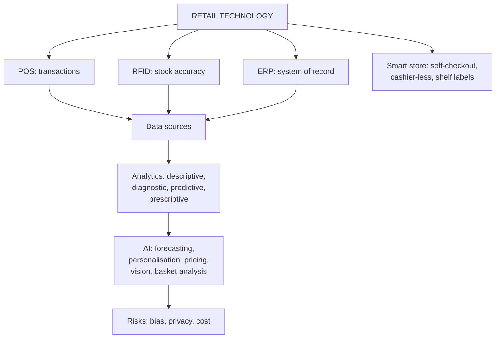

# DR-2: Smart Stores and Retail Analytics

Covers: POS, RFID and ERP, smart-store technologies, retail data sources, the four levels of analytics, AI applications (forecasting, personalisation, dynamic pricing, computer vision, basket analysis), and sums on forecast error, basket analysis and technology payback. **(syllabus)** means your Unit 5 notes and the RM Notes; there are **no Unit 5 faculty slides**. Additions are tagged **(textbook)**.

## Where this fits in the ESE

Assumed pattern (no course plan): 50 marks, 3 x 5, 2 x 10, one 15-mark case. Likely: a 5-mark "POS, RFID and ERP", "AI applications in retail" or "analytics maturity", and a payback or forecast-accuracy sum inside the case.

## Smart stores: POS, RFID and ERP

These three are the infrastructure under omnichannel, analytics, CRM and the supply chain. **(syllabus)**

| Technology | What it is | Key benefit |
|---|---|---|
| **POS** (point of sale) | Records every transaction at checkout; modern POS links inventory, CRM and payments | Real-time sales and stock visibility |
| **RFID** (radio frequency identification) | Tags on products or pallets for wireless, automated tracking | Inventory accuracy far above manual barcode counts; ends "phantom inventory" |
| **ERP** (enterprise resource planning) | One system of record for finance, inventory, procurement, HR and sales | Store-level operations tied to corporate planning and dashboards |

How they work together: POS captures the sale, RFID tracks physical stock in near real time, ERP integrates both with finance, procurement and planning. The loop supports forecasting, automated replenishment and unified reporting.

- **Phantom inventory:** the system shows stock the shelf does not have (shrinkage, misplacement, scanning errors), causing stockouts and bad planning. RFID addresses it.
- **Smart-store technologies:** self-checkout kiosks, computer-vision "just walk out" checkout (Amazon Go), **electronic shelf labels** for instant central price changes, in-store sensors for customer flow.
- **Where RFID pays most:** fashion, with many SKUs, sizes and colours, and "endless aisle" omnichannel promises. It adds less in basic grocery with few variants.
- **Limits:** upfront cost and complexity (ERP rollouts across large chains), maintenance, change management.
- **Indian examples:** Reliance Retail and Shoppers Stop have invested in integrated POS and ERP. The notes cite Amazon Go as the most advanced computer-vision store; the programme's status has changed over time **[VERIFY]**.
- **Managerial insight:** judge technology by the **downstream capability** it enables (analytics, omnichannel), not only direct savings.

## Retail data sources (RM Notes)

| Internal source | Data | Output |
|---|---|---|
| POS | SKU transactions, time, basket size, payment mode | Sales per sq ft, units per transaction, average order value |
| Loyalty and CRM | Demographics, purchase history, redemptions | CLV, RFM |
| Web and app analytics | Impressions, click-through, cart abandonment, dwell time | Funnel optimisation, retargeting |
| In-store sensors and Wi-Fi | Footfall counts, aisle dwell, entry heat maps | Capture rate, conversion ratio |

External: syndicated audits (NielsenIQ, Kantar), industry reports (IMAGES Group, McKinsey, Deloitte), census and GIS data, competitor web scraping for prices and stock.

## Retail analytics and AI

**Retail analytics** is the systematic use of data and statistical or AI models to improve decisions in forecasting, personalisation, pricing and operations. It is the maturation of the retail market information system. Its advantage compounds: more data and use improve models. **(syllabus)**

**Four levels of analytics maturity:**

1. **Descriptive:** what happened?
2. **Diagnostic:** why?
3. **Predictive:** what will happen?
4. **Prescriptive:** what should we do, often with automated action.

Most retailers are moving from predictive towards prescriptive.

**Applications:**
- **Demand forecasting** at SKU and store level, feeding merchandise planning (MP-1, MP-2).
- **Personalisation engines** for recommendations and CRM targeting (RL-4).
- **Dynamic pricing:** algorithmic real-time prices based on demand, competitors and inventory (MP-3).
- **Computer vision:** shelf monitoring for out-of-stocks, cashier-less checkout, customer-flow analysis.
- **Market basket analysis and association rules:** which products sell together, for cross-merchandising and promotions.

**Indian examples:** BigBasket and Reliance Retail use AI forecasting and personalisation. **International:** Amazon's recommendation engine; Amazon Go.

**Limits:** cost and data infrastructure; **algorithmic bias** if training data reflects historical inequity; scrutiny of automated pricing and recommendations. Poor data foundations limit any model.

**Case links in your notes:** *Amazon Go: Venturing into Traditional Retail* (computer vision at checkout) and *Move Fast but without bias: ethical AI development in a startup culture* (audit models for bias, not only conversion).

### Worked example: forecast accuracy (MAPE)

**Question (illustrative):** forecast versus actual units for four SKUs.

| SKU | Actual | Forecast | Absolute % error |
|---|---|---|---|
| 1 | 100 | 90 | 10.00% |
| 2 | 80 | 100 | 25.00% |
| 3 | 120 | 110 | 8.33% |
| 4 | 60 | 75 | 25.00% |
| Total | 360 | 375 | |

1. Absolute error % = |actual - forecast| ÷ actual for each SKU.
2. **MAPE** = (10 + 25 + 8.33 + 25) ÷ 4 = **17.08%**.
3. **Bias** = 375 - 360 = **+15 units**, or +4.17% of actual: over-forecast overall.

**Interpretation:** a 17% error level is high, and two SKUs are 25% off even though the total looks only 4% high. Errors cancelled in the total, so judge forecasts SKU by SKU. This is why the faculty notes say speed of replenishment matters more than forecast accuracy (MP-1).

### Worked example: basket analysis

**Question (illustrative):** of 1,000 baskets, 200 contain chips, 100 contain salsa, and 60 contain both.

1. **Support** of the pair = 60 ÷ 1,000 = **6%**.
2. **Confidence** (chips then salsa) = 60 ÷ 200 = **30%**.
3. **Lift** = 30% ÷ (100 ÷ 1,000 = 10%) = **3.0**.

**Interpretation:** a chips buyer is three times as likely to buy salsa as a random shopper, so place them together or bundle (cross-merchandising). Lift above 1 means a real association; support shows it is not too rare to act on.

### Worked example: technology payback

**Question (illustrative):** RFID across 30 stores costs ₹90 lakh. Annual sales are ₹30 crore, and better availability cuts lost sales from 4% to 2% of sales at a 35% gross margin. Shrinkage savings add ₹9 lakh a year.

1. Recovered sales = 2% x ₹30 crore = **₹60 lakh**; margin on it = 60 x 35% = **₹21 lakh**.
2. Total annual benefit = 21 + 9 = **₹30 lakh**.
3. **Payback** = 90 ÷ 30 = **3.0 years**.

**Decision and interpretation:** invest if the retailer accepts a three-year payback and also values the capabilities it unlocks (omnichannel stock visibility). Check sensitivity: if only half the lost sales are recovered, benefit is ₹19.5 lakh and payback is 4.6 years.

## Traps

- POS records transactions; RFID tracks physical stock; ERP integrates. Do not define ERP as "billing".
- Descriptive analytics reports; prescriptive recommends or acts.
- Lift, not confidence alone, shows an association; a popular item has high confidence by chance.

## What to remember

- POS (transactions), RFID (stock accuracy, phantom inventory), ERP (one system of record).
- Smart store: self-checkout, cashier-less (Amazon Go), electronic shelf labels, sensors.
- Analytics ladder: descriptive, diagnostic, predictive, prescriptive.
- AI uses: forecasting, personalisation, dynamic pricing, computer vision, basket analysis; risk is bias and privacy.
- Worked figures: MAPE 17.08% (bias +15 units), lift 3.0, RFID payback 3.0 years.

## Concept map

## Flashcards
Q: What are POS, RFID and ERP in retail?
A: POS records transactions at checkout; RFID wirelessly tracks tagged stock; ERP unifies finance, inventory, procurement, HR and sales in one system.

Q: What is phantom inventory and which technology tackles it?
A: System stock that does not physically exist on the shelf, caused by shrinkage, misplacement or scan errors; RFID.

Q: Why is RFID more valuable in fashion than in basic grocery?
A: Fashion has many SKUs, sizes and colours where accurate item-level stock matters; grocery has few variants.

Q: List the four levels of analytics.
A: Descriptive, diagnostic, predictive, prescriptive.

Q: Name five AI applications in retail.
A: Demand forecasting, personalisation, dynamic pricing, computer vision, market basket analysis.

Q: Main ethical risk of retail AI?
A: Algorithmic bias from skewed training data, and weak privacy and consent; models must be audited.

Q: How is MAPE computed?
A: Average of |actual - forecast| ÷ actual across SKUs; 17.08% in the example.

Q: Chips 200, salsa 100, both 60 in 1,000 baskets. Lift?
A: Confidence 30% divided by salsa's 10% share = 3.0.

Q: RFID costs ₹90 lakh and gives ₹30 lakh a year. Payback?
A: 3.0 years.

Q: Name four internal retail data sources.
A: POS, loyalty and CRM programmes, web and app analytics, in-store sensors and Wi-Fi.

## Sources
- Student notes Unit 5: Smart Stores and Retail Technology (POS, RFID, ERP); Retail Analytics and AI Applications (no faculty slides for Unit 5)
- RM Notes: internal and external retail data sources
- Previous node: [[Retail Management Unit 5 - DR-1 E-Retailing M-Commerce and Social Commerce]]
- Next node: [[Retail Management Unit 5 - DR-3 Sustainable Ethical and Green Retailing]]
- [[Retail Management Unit 5 - Digital and Future Retail MOC (Node Map)]]
