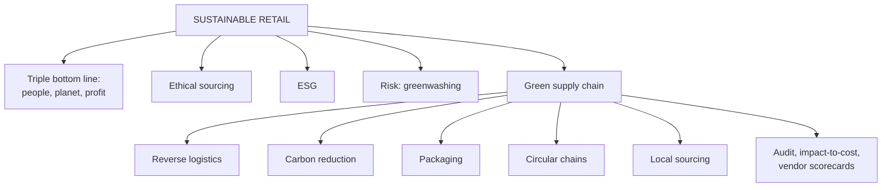

# DR-3: Sustainable, Ethical and Green Retailing

Covers: the triple bottom line, ethical sourcing, ESG, greenwashing, green supply chain levers (reverse logistics, carbon, packaging, circular chains, local sourcing), and sums on packaging savings, fleet payback, returns cost and a vendor scorecard with a sustainability criterion. **(syllabus)** means your Unit 5 notes; there are **no Unit 5 faculty slides**. Additions are tagged **(textbook)**.

## Where this fits in the ESE

Assumed pattern (no course plan): 50 marks, 3 x 5, 2 x 10, one 15-mark case. Likely: a 5-mark "sustainable retailing", "greenwashing", "green supply chain", or a 10-mark essay on how retailers can be sustainable and ethical. A short payback line fits inside the case.

## Sustainable and ethical retailing

**Sustainable and ethical retailing** is running sourcing, merchandising, operations and marketing so as to minimise environmental harm and treat workers, suppliers and customers fairly and transparently. **(syllabus)**

Why it matters: retail sits at the consumer end of long, opaque supply chains, so it carries reputational exposure for what is embedded in the products; younger shoppers link purchases to ethics, so it also differentiates.

**Key concepts:**
- **Triple bottom line:** performance across **People, Planet, Profit**, not financial return alone.
- **Ethical sourcing:** fair labour, safe conditions, fair pay, checked by third-party audits and certifications.
- **Sustainable practices:** less packaging waste, energy-efficient stores, organic, recycled or fair-trade materials, take-back and recycling.
- **Greenwashing:** overstating or falsely marketing sustainability credentials without real practice. A reputational and growing regulatory risk.
- **ESG:** environmental, social, governance, the framework investors and regulators use.

**How it works:** embed sustainability in the supply chain (sourcing standards, logistics emissions, packaging, store energy) rather than treating it as marketing; use third-party verification (organic, Fair Trade, B-Corp) for credibility.

**Applications:** fashion retailers launch recycled-material lines, garment take-back, resale and rental; grocers cut single-use plastic and source local, seasonal produce.

**Advantages:** brand trust and loyalty among conscious shoppers, lower long-term regulatory and reputational risk, lower energy and waste costs. **Limitations:** higher upfront cost and margin pressure; exposure if claims outrun practice.

**Examples:** Fabindia's ethical sourcing and artisan support (Indian); Patagonia's repair programme and activism (international benchmark).

Regulatory pointers **(textbook)** **[VERIFY]**: SEBI's business responsibility and sustainability reporting (BRSR) for large listed companies, India's Plastic Waste Management Rules with extended producer responsibility, and the consumer regulator's guidelines on misleading environmental claims. Confirm the current scope and dates before quoting.

## Green supply chains

A **green supply chain** builds environmental considerations into every stage: sourcing, production, transport, packaging and reverse logistics. The supply chain, not the shop, is usually where most of a retailer's emissions and waste arise, so it is the highest-leverage point. **(syllabus)**

| Lever | Meaning | Example |
|---|---|---|
| **Reverse logistics** | Managing returns, recycling and end-of-life disposal | Garment take-back, e-commerce returns |
| **Carbon footprint reduction** | Route optimisation, electric or low-emission fleets, efficient distribution centres | Electric delivery vans |
| **Sustainable packaging** | Less material, recyclable or biodegradable, right-sized boxes | Reusable packaging pilots in quick commerce |
| **Circular supply chain** | Design for reuse, refurbishment, recycling instead of take-make-dispose | IKEA take-back, resale and rental |
| **Local or regional sourcing** | Shorter transport distance | Local produce at grocers |

**Process:** start with a **carbon or environmental audit** across the chain to find the highest-impact stages (often transport and packaging), then rank actions by impact-to-cost ratio. Add sustainability to **vendor scorecards** next to cost and quality (MP-5).

**Why it is now a compliance matter:** carbon reporting, producer-responsibility rules and investor ESG expectations.

**Practical points:** quick-commerce and e-commerce face scrutiny over per-order packaging; **packaging reduction is a rare win-win** (lower cost and lower waste). Fashion invests in recycling, resale and rental.

**Advantages:** lower fuel and packaging cost over time, compliance readiness, brand trust. **Limitation:** capital for fleet upgrades, packaging redesign and supplier change, with payback that is hard to defend against short-term pressure.

**Examples:** Reliance Retail and other Indian chains are piloting electric fleets and sustainable packaging; IKEA's circular approach and Walmart's Project Gigaton (suppliers cutting a gigaton of emissions) are the international benchmarks **[VERIFY]** for current status.

### Worked example: packaging saving and fleet payback

**Question (illustrative, fictional retailer):** Saathi Mart (fictional) ships 1,00,000 orders a month. Right-sizing packaging cuts cost from ₹12 to ₹9 per order. Separately, it considers 20 electric vans at a ₹6,00,000 premium each, saving ₹1,50,000 a van a year in fuel and upkeep.

1. Packaging saving = (12 - 9) x 1,00,000 = **₹3,00,000 a month**, **₹36,00,000 a year**.
2. Fleet premium = 20 x ₹6,00,000 = **₹1,20,00,000**; annual saving = 20 x ₹1,50,000 = **₹30,00,000**.
3. **Payback** = 1,20,00,000 ÷ 30,00,000 = **4.0 years**.

| Initiative | Investment | Annual saving | Payback |
|---|---|---|---|
| Right-sized packaging | Small redesign cost | ₹36 lakh | Under a year (design cost not given) |
| 20 electric vans | ₹1.20 crore premium | ₹30 lakh | 4.0 years |

**Decision and interpretation:** do packaging first, since it pays almost at once and also cuts emissions; stage the fleet with a clear 4-year payback test and regulatory or brand benefits that the saving alone does not capture. This is the impact-to-cost ranking the notes recommend.

### Worked example: the cost of returns

**Question (illustrative):** 1,00,000 orders a month, 20% returned, reverse-logistics cost ₹150 per return.

1. Returns = 20,000; cost = 20,000 x ₹150 = **₹30,00,000 a month**.
2. If better size guidance cuts the rate by 5 points to 15%: returns = 15,000; saving = 5,000 x ₹150 = **₹7,50,000 a month**.

**Interpretation:** returns carry a hidden cost and an environmental cost (extra transport). Fewer returns serve both goals.

### Worked example: a vendor scorecard with a green criterion (textbook)

**Question (illustrative):** extend the MP-5 scorecard with a sustainability score. Weights: quality 0.30, delivery 0.20, price 0.30, sustainability 0.20. Scores out of 5: A (quality 5, delivery 4, price 2, sustainability 5); B (4, 5, 5, 2); C (1, 4, 5, 3).

1. A = 1.5 + 0.8 + 0.6 + 1.0 = **3.9**.
2. B = 1.2 + 1.0 + 1.5 + 0.4 = **4.1**.
3. C = 0.3 + 0.8 + 1.5 + 0.6 = **3.2**.

**Interpretation:** B still wins but its lead over A has shrunk to 0.2. With a higher sustainability weight or a certification threshold, A would win. The weight is a policy choice, and it must be backed by third-party verification to avoid greenwashing.

## Traps

- Sustainability in marketing without supply-chain action is greenwashing.
- The triple bottom line adds people and planet to profit; it does not replace profit.
- Packaging is a win-win; fleet changes are an investment with a payback test.

## What to remember

- Triple bottom line: People, Planet, Profit; ethical sourcing; ESG; greenwashing is the risk.
- Green supply chain levers: reverse logistics, carbon reduction, sustainable packaging, circular chains, local sourcing.
- Start with an audit; rank by impact-to-cost; add green criteria to vendor scorecards.
- Worked figures: packaging saving ₹36 lakh a year; electric-van payback 4.0 years; returns cost ₹30 lakh a month.
- Verified certification is how credibility is earned.

## Concept map

## Flashcards
Q: What is the triple bottom line?
A: Evaluating performance across People, Planet and Profit instead of financial return alone.

Q: Define greenwashing.
A: Overstating or falsely marketing sustainability credentials without substantive underlying practice.

Q: What is ESG?
A: Environmental, Social and Governance: the framework investors and regulators use to assess sustainability and ethics.

Q: Name five green supply chain levers.
A: Reverse logistics, carbon footprint reduction, sustainable packaging, circular supply chains, local or regional sourcing.

Q: Why is the supply chain the highest-leverage place for sustainability?
A: Most of a retailer's emissions, waste and resource use arise there rather than in the store.

Q: What is reverse logistics?
A: Managing returns, recycling and end-of-life disposal of products.

Q: Why is packaging reduction called a win-win?
A: It cuts both cost and waste, unlike initiatives that trade cost for sustainability.

Q: Packaging ₹12 to ₹9 on 1,00,000 monthly orders. Annual saving?
A: ₹36,00,000.

Q: 20 electric vans, ₹6,00,000 premium each, ₹1,50,000 saving each a year. Payback?
A: 4.0 years.

Q: How can a retailer avoid greenwashing accusations?
A: Embed real supply-chain practice and use third-party verification such as organic, Fair Trade or B-Corp certification.

## Sources
- Student notes Unit 5: Sustainable and Ethical Retailing; Green Supply Chains in Retail (no faculty slides for Unit 5)
- RM Notes: sustainability as a 2026 retail focus
- Previous node: [[Retail Management Unit 5 - DR-2 Smart Stores and Retail Analytics]]
- Next node: [[Retail Management Unit 5 - DR-4 Omnichannel Phygital and Future Retail]]
- [[Retail Management Unit 5 - Digital and Future Retail MOC (Node Map)]]
