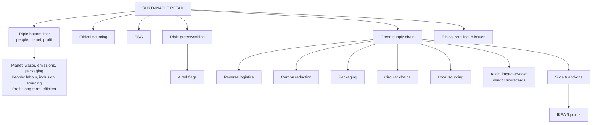

# DR-3: Sustainable, Ethical and Green Retailing

Covers: People, Planet, Profit with the slide bullets, why sustainability matters to consumers, the green supply chain's six add-ons, the IKEA six points, ethical retailing and its issues, greenwashing with its four red flags, ESG, other green levers (carbon, circular chains, local sourcing), and sums on packaging savings, fleet payback, returns cost and a vendor scorecard with a sustainability criterion.

**Sources and tags.** The primary source is the faculty deck **RM Unit 5.1 slides** (Parts H, I, J). **(slides)** marks content from the deck; give it as the exam answer. **(syllabus)** marks your own Unit 5 notes, kept where the slides are silent. **(textbook)** marks my additions.

**Slide versus note.** Two corrections.
- Your note lists five green levers (reverse logistics, carbon reduction, packaging, circular chains, local sourcing). The slide's green supply chain adds **six** things: sustainable sourcing, low-emission transport, eco-friendly packaging, waste reduction, energy efficiency, reverse logistics. Give the slide's six in the exam; your extra levers (circular chains, local sourcing) can be added as a closing line.
- Your table lists IKEA under "take-back, resale and rental". The slide's IKEA points are renewable materials, sustainable sourcing, efficient flat packaging, energy-efficient stores, product recycling and buy-back, and circular product design. Resale and rental are not on the slide, so do not attribute them to IKEA in the exam.

## Where this fits in the ESE

Assumed pattern (no course plan): 50 marks, 3 x 5, 2 x 10, one 15-mark case. Likely: a 5-mark "sustainable retailing", "greenwashing", "green supply chain", or a 10-mark essay on how retailers can be sustainable and ethical. A short payback line fits inside the case.

## Sustainable and ethical retailing

**Sustainable and ethical retailing** is running sourcing, merchandising, operations and marketing so as to minimise environmental harm and treat workers, suppliers and customers fairly and transparently. **(syllabus)**

Why it matters: retail sits at the consumer end of long, opaque supply chains, so it carries reputational exposure for what is embedded in the products; younger shoppers link purchases to ethics, so it also differentiates.

**Key concepts:**
- **Triple bottom line:** performance across **People, Planet, Profit**, not financial return alone.
- **Ethical sourcing:** fair labour, safe conditions, fair pay, checked by third-party audits and certifications.
- **Sustainable practices:** less packaging waste, energy-efficient stores, organic, recycled or fair-trade materials, take-back and recycling.
- **Greenwashing:** overstating or falsely marketing sustainability credentials without real practice. A reputational and growing regulatory risk.
- **ESG:** environmental, social, governance, the framework investors and regulators use.

**How it works:** embed sustainability in the supply chain (sourcing standards, logistics emissions, packaging, store energy) rather than treating it as marketing; use third-party verification (organic, Fair Trade, B-Corp) for credibility.

**Applications:** fashion retailers launch recycled-material lines, garment take-back, resale and rental; grocers cut single-use plastic and source local, seasonal produce.

**Advantages:** brand trust and loyalty among conscious shoppers, lower long-term regulatory and reputational risk, lower energy and waste costs. **Limitations:** higher upfront cost and margin pressure; exposure if claims outrun practice.

**Examples:** Fabindia's ethical sourcing and artisan support (Indian); Patagonia's repair programme and activism (international benchmark).

Regulatory pointers **(textbook)** **[VERIFY]**: SEBI's business responsibility and sustainability reporting (BRSR) for large listed companies, India's Plastic Waste Management Rules with extended producer responsibility, and the consumer regulator's guidelines on misleading environmental claims. Confirm the current scope and dates before quoting.

## Sustainable retailing: People, Planet, Profit (slides)

**Definition (5.1):** conducting retail activities while balancing **People + Planet + Profit**. **(slides)**

| Pillar | Slide label | Bullets on the slide |
|---|---|---|
| **Planet** | Environmental | Less waste; lower emissions; sustainable packaging |
| **People** | Social | Fair labour; inclusion; ethical sourcing |
| **Profit** | Economic | Long-term profitability; efficient resource use |

**Why it matters:** consumers increasingly consider product origin, packaging, carbon footprint, ethical sourcing, brand transparency, labour practices, product durability and recycling. **(slides)**

**Retailer response (slide formula):** sustainable products + sustainable operations + transparent communication. **(slides)** Example of how to write it: a store lists the origin of its products (product), switches to energy-efficient lighting (operations), and publishes verified results (communication).

## Green supply chains

A **green supply chain** builds environmental considerations into every stage: sourcing, production, transport, packaging and reverse logistics. The supply chain, not the shop, is usually where most of a retailer's emissions and waste arise, so it is the highest-leverage point. **(syllabus)**

| Lever | Meaning | Example |
|---|---|---|
| **Reverse logistics** | Managing returns, recycling and end-of-life disposal | Garment take-back, e-commerce returns |
| **Carbon footprint reduction** | Route optimisation, electric or low-emission fleets, efficient distribution centres | Electric delivery vans |
| **Sustainable packaging** | Less material, recyclable or biodegradable, right-sized boxes | Reusable packaging pilots in quick commerce |
| **Circular supply chain** | Design for reuse, refurbishment, recycling instead of take-make-dispose | IKEA buy-back and recycling, circular product design (slides) |
| **Local or regional sourcing** | Shorter transport distance | Local produce at grocers |

**Process:** start with a **carbon or environmental audit** across the chain to find the highest-impact stages (often transport and packaging), then rank actions by impact-to-cost ratio. Add sustainability to **vendor scorecards** next to cost and quality (MP-5).

**Why it is now a compliance matter:** carbon reporting, producer-responsibility rules and investor ESG expectations.

**Practical points:** quick-commerce and e-commerce face scrutiny over per-order packaging; **packaging reduction is a rare win-win** (lower cost and lower waste). Fashion invests in recycling, resale and rental.

**Advantages:** lower fuel and packaging cost over time, compliance readiness, brand trust. **Limitation:** capital for fleet upgrades, packaging redesign and supplier change, with payback that is hard to defend against short-term pressure.

**Examples:** Reliance Retail and other Indian chains are piloting electric fleets and sustainable packaging; IKEA's circular approach and Walmart's Project Gigaton (suppliers cutting a gigaton of emissions) are the international benchmarks **[VERIFY]** for current status.

### Worked example: packaging saving and fleet payback

**Question (illustrative, fictional retailer):** Saathi Mart (fictional) ships 1,00,000 orders a month. Right-sizing packaging cuts cost from ₹12 to ₹9 per order. Separately, it considers 20 electric vans at a ₹6,00,000 premium each, saving ₹1,50,000 a van a year in fuel and upkeep.

1. Packaging saving = (12 - 9) x 1,00,000 = **₹3,00,000 a month**, **₹36,00,000 a year**.
2. Fleet premium = 20 x ₹6,00,000 = **₹1,20,00,000**; annual saving = 20 x ₹1,50,000 = **₹30,00,000**.
3. **Payback** = 1,20,00,000 ÷ 30,00,000 = **4.0 years**.

| Initiative | Investment | Annual saving | Payback |
|---|---|---|---|
| Right-sized packaging | Small redesign cost | ₹36 lakh | Under a year (design cost not given) |
| 20 electric vans | ₹1.20 crore premium | ₹30 lakh | 4.0 years |

**Decision and interpretation:** do packaging first, since it pays almost at once and also cuts emissions; stage the fleet with a clear 4-year payback test and regulatory or brand benefits that the saving alone does not capture. This is the impact-to-cost ranking the notes recommend.

### Worked example: the cost of returns

**Question (illustrative):** 1,00,000 orders a month, 20% returned, reverse-logistics cost ₹150 per return.

1. Returns = 20,000; cost = 20,000 x ₹150 = **₹30,00,000 a month**.
2. If better size guidance cuts the rate by 5 points to 15%: returns = 15,000; saving = 5,000 x ₹150 = **₹7,50,000 a month**.

**Interpretation:** returns carry a hidden cost and an environmental cost (extra transport). Fewer returns serve both goals.

### Worked example: a vendor scorecard with a green criterion (textbook)

**Question (illustrative):** extend the MP-5 scorecard with a sustainability score. Weights: quality 0.30, delivery 0.20, price 0.30, sustainability 0.20. Scores out of 5: A (quality 5, delivery 4, price 2, sustainability 5); B (4, 5, 5, 2); C (1, 4, 5, 3).

1. A = 1.5 + 0.8 + 0.6 + 1.0 = **3.9**.
2. B = 1.2 + 1.0 + 1.5 + 0.4 = **4.1**.
3. C = 0.3 + 0.8 + 1.5 + 0.6 = **3.2**.

**Interpretation:** B still wins but its lead over A has shrunk to 0.2. With a higher sustainability weight or a certification threshold, A would win. The weight is a policy choice, and it must be backed by third-party verification to avoid greenwashing.

## Green supply chain: the slide version and IKEA (slides)

**Traditional chain (5 stages):** Supplier, Manufacturer, Warehouse, Retailer, Customer. A green supply chain runs the same process but builds in six add-ons: **(slides)**

| # | Add-on | Where it acts (textbook mapping) |
|---|---|---|
| 1 | Sustainable sourcing | Supplier |
| 2 | Low-emission transport | Between every stage |
| 3 | Eco-friendly packaging | Manufacturer, warehouse |
| 4 | Waste reduction | Manufacturer, warehouse, store |
| 5 | Energy efficiency | Warehouse, store |
| 6 | Reverse logistics | Customer back to retailer and supplier |

**IKEA example (six points):** **(slides)**

| # | IKEA point | Matches add-on |
|---|---|---|
| 1 | Renewable materials | Sustainable sourcing |
| 2 | Sustainable sourcing | Sustainable sourcing |
| 3 | Efficient flat packaging | Eco-friendly packaging, and fewer transport trips (textbook) |
| 4 | Energy-efficient stores | Energy efficiency |
| 5 | Product recycling and buy-back | Reverse logistics |
| 6 | Circular product design | Waste reduction |

Slide question: **can sustainability become a competitive advantage?** Suggested answer **(textbook)**: yes, if the practice is real and verified, because it builds trust with conscious shoppers and lowers energy, packaging and waste cost; no, if it is only a claim, because shoppers can punish greenwashing. IKEA's status and figures **[VERIFY]** before quoting any number.

**Exam answer layout for "green supply chain with an example":** definition, the five-stage chain, the six add-ons, IKEA's six points mapped to them, one limit (capital and supplier change), and the competitive-advantage line.

## Ethical retailing and greenwashing (slides)

**Ethical retailing (5.1):** making decisions that consider **fairness, transparency and social responsibility.** **(slides)**

**Major issues (eight, slide list):** child labour, fair wages, false advertising, data privacy, greenwashing, product safety, ethical sourcing, consumer manipulation. **(slides)** Grouping to help recall **(textbook)**:

| Theme | Issues |
|---|---|
| Workers and suppliers | Child labour, fair wages, ethical sourcing |
| Honest communication | False advertising, greenwashing, consumer manipulation |
| Customers | Data privacy, product safety |

**Greenwashing (5.1):** making products or brands appear more environmentally friendly than they actually are. **Slide example:** a product claims "100% Eco-Friendly" but provides no evidence or explanation. **(slides)**

**Four red flags:** **(slides)**

| Red flag | What to look for (textbook) |
|---|---|
| No certification | No recognised third-party label or audit behind the claim |
| Hidden trade-offs | One green feature highlighted while a larger harm is ignored |
| Irrelevant claims | A true claim that does not matter, such as praising something already required by law |
| Vague claims | Words like "eco", "natural", "green" with no detail |

Slide question: **is every "green" claim necessarily sustainable?** No. A claim is only as good as its evidence, so check the four flags.

### Worked example: testing a green claim (illustrative)

**Question:** a retailer's tote bag is labelled "100% Eco-Friendly". Is it greenwashing?

1. Vague claim? Yes: "eco-friendly" has no definition. **Red flag: vague claims.**
2. Certification? None printed. **Red flag: no certification.**
3. Hidden trade-off? Possible: the bag is made of plastic fibre and sold as "reusable" (assumed for the example). **Red flag: hidden trade-off (possible).**
4. Irrelevant claim? Not shown.

**Decision line:** at least two flags (vague, no certification) are confirmed, so treat it as likely greenwashing until the retailer gives evidence. **Interpretation:** the fix is a specific claim ("made with 60% recycled fibre, certified by [named body]") with a published figure. The 60% here is a made-up figure to show the form of a good claim.

## Traps

- Sustainability in marketing without supply-chain action is greenwashing.
- The triple bottom line adds people and planet to profit; it does not replace profit.
- Packaging is a win-win; fleet changes are an investment with a payback test.

- Slide green supply chain has six add-ons (sourcing, low-emission transport, eco packaging, waste reduction, energy efficiency, reverse logistics); do not give your older list of five in its place.
- Greenwashing red flags: no certification, hidden trade-offs, irrelevant claims, vague claims.

## What to remember

- Triple bottom line: People (fair labour, inclusion, ethical sourcing), Planet (less waste, lower emissions, packaging), Profit (long-term profitability, efficient resource use). Retailer response: sustainable products + operations + transparent communication.
- Green supply chain, slide version: six add-ons on the five-stage chain. IKEA: renewable materials, sustainable sourcing, flat packaging, energy-efficient stores, recycling and buy-back, circular design.
- Ethical retailing = fairness, transparency, social responsibility; eight issues from child labour to consumer manipulation. Greenwashing = looking greener than you are; four red flags.
- Extra levers from your notes: carbon reduction, circular chains, local sourcing; ESG; ethical sourcing.
- Start with an audit; rank by impact-to-cost; add green criteria to vendor scorecards.
- Worked figures: packaging saving ₹36 lakh a year; electric-van payback 4.0 years; returns cost ₹30 lakh a month.
- Verified certification is how credibility is earned.

## Concept map

## Flashcards
Q: What is the triple bottom line?
A: Evaluating performance across People, Planet and Profit instead of financial return alone.

Q: Define greenwashing.
A: Overstating or falsely marketing sustainability credentials without substantive underlying practice.

Q: What is ESG?
A: Environmental, Social and Governance: the framework investors and regulators use to assess sustainability and ethics.

Q: Name the five green levers in your notes (extra to the slide's six add-ons).
A: Reverse logistics, carbon footprint reduction, sustainable packaging, circular supply chains, local or regional sourcing.

Q: Why is the supply chain the highest-leverage place for sustainability?
A: Most of a retailer's emissions, waste and resource use arise there rather than in the store.

Q: What is reverse logistics?
A: Managing returns, recycling and end-of-life disposal of products.

Q: Why is packaging reduction called a win-win?
A: It cuts both cost and waste, unlike initiatives that trade cost for sustainability.

Q: Packaging ₹12 to ₹9 on 1,00,000 monthly orders. Annual saving?
A: ₹36,00,000.

Q: 20 electric vans, ₹6,00,000 premium each, ₹1,50,000 saving each a year. Payback?
A: 4.0 years.

Q: How can a retailer avoid greenwashing accusations?
A: Embed real supply-chain practice and use third-party verification such as organic, Fair Trade or B-Corp certification.

Q: Define sustainable retailing (class wording) and give the bullets under each of People, Planet, Profit.
A: Conducting retail activities while balancing People, Planet and Profit. Planet: less waste, lower emissions, sustainable packaging. People: fair labour, inclusion, ethical sourcing. Profit: long-term profitability, efficient resource use.

Q: What do consumers increasingly consider, and how should the retailer respond?
A: Product origin, packaging, carbon footprint, ethical sourcing, brand transparency, labour practices, durability, recycling. Response: sustainable products + sustainable operations + transparent communication.

Q: Name the six add-ons of a green supply chain on the slide.
A: Sustainable sourcing, low-emission transport, eco-friendly packaging, waste reduction, energy efficiency, reverse logistics.

Q: Which five stages make the traditional supply chain?
A: Supplier, manufacturer, warehouse, retailer, customer.

Q: List the six IKEA points.
A: Renewable materials, sustainable sourcing, efficient flat packaging, energy-efficient stores, product recycling and buy-back, circular product design.

Q: Define ethical retailing and name four of its major issues.
A: Making decisions that consider fairness, transparency and social responsibility. Issues include child labour, fair wages, false advertising, data privacy, greenwashing, product safety, ethical sourcing, consumer manipulation.

Q: Define greenwashing and give the slide example.
A: Making products or brands appear more environmentally friendly than they are. Example: a "100% Eco-Friendly" claim with no evidence or explanation.

Q: What are the four greenwashing red flags?
A: No certification, hidden trade-offs, irrelevant claims, vague claims.

Q: Is every green claim necessarily sustainable?
A: No. A claim needs evidence, certification and relevance; check the four red flags.

Q: Can sustainability be a competitive advantage for retailers?
A: Yes when practice is real and verified: it builds trust and cuts energy, packaging and waste costs. A claim without practice invites greenwashing backlash.

## Sources
- Faculty deck RM Unit 5.1 slides (Parts H, I, J)
- Student notes Unit 5: Sustainable and Ethical Retailing; Green Supply Chains in Retail
- RM Notes: sustainability as a 2026 retail focus
- Previous node: [[Retail Management Unit 5 - DR-2 Smart Stores and Retail Analytics]]
- Next node: [[Retail Management Unit 5 - DR-4 Omnichannel Phygital and Future Retail]]
- [[Retail Management Unit 5 - Digital and Future Retail MOC (Node Map)]]
