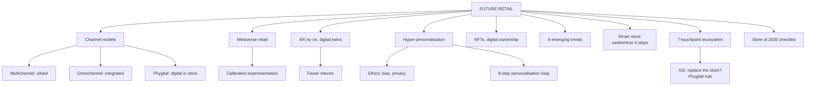

# DR-4: Omnichannel, Phygital and Future Retail

Covers: the 9 emerging trends, multichannel versus omnichannel versus phygital, the Retail 4.0 hybrid model, metaverse retail, smart stores and the cashierless flow, the 8-step AI personalisation loop, the future retail ecosystem, the "will technology replace the store" debate, the Store of 2035 task, AR try-on, digital twins, hyper-personalisation, NFTs and digital ownership, calibrated experimentation, and two sums on returns and an A/B test.

**Sources and tags.** The primary source is the faculty deck **RM Unit 5.1 slides** (Parts M and N and the closing activities). **(slides)** marks content from the deck; give it as the exam answer. **(syllabus)** marks the faculty RM Notes and your own Unit 5 notes, kept where the slides are silent. **(textbook)** marks my additions.

**Slide versus note.** The slides' 7-stage evolution (traditional, e-retailing, mobile, social, omnichannel, AI-driven, smart and immersive) has no separate "multichannel" stage, while the RM Notes table compares multichannel, omnichannel and phygital. Both are valid: use the 7-stage line for "evolution of retail" and the RM Notes table for "multichannel versus omnichannel versus phygital". The slide's definition of metaverse retail is shorter than your note's; give the slide's wording first (below).

## Where this fits in the ESE

Assumed pattern (no course plan): 50 marks, 3 x 5, 2 x 10, one 15-mark case. Likely: a 5-mark "multichannel versus omnichannel", "phygital retail", "metaverse in retail", and a 10-mark "future of retail: technology and strategy". The recommendation line in a case often asks "pilot or invest?".

## Multichannel, omnichannel and phygital (RM Notes)

| Basis | Multichannel | Omnichannel | Phygital |
|---|---|---|---|
| Philosophy | Several independent sales channels | One continuous customer journey across all channels | Physical space blended with digital tech for interactive experience |
| Integration | Low, siloed | High, systemic (ERP, POS, CRM linked in real time) | Experiential: sensory plus interactive interfaces in store |
| Customer journey | Fragmented; shopper restarts in each channel | Seamless; moves fluidly between touchpoints | Immersive; digital interfaces enhance the store |
| Enabler | Basic e-commerce site plus stores | Unified data layer, Customer Data Platform | IoT, AR and VR, RFID, smart mirrors |
| Inventory | Separate (store stock versus app stock) | Unified inventory system | Not stated in the notes; RFID is the usual enabler (textbook) |
| Example | Browse online, cannot return in store | Buy online, pick up in store, return via the app | Smart mirrors and interactive screens in store (textbook illustration) |

One-line difference: multichannel offers many channels; omnichannel **integrates** them; phygital makes the **store itself** digital. The Unit 1 faculty example: "customer buys online, picks up in store, and returns via mobile app" is omnichannel.

**Retail 4.0 or the hybrid model (RM Notes, India growth driver):** personalisation with an offline plus online approach; an agile, efficient, inclusive, interdependent retail ecosystem. **Also from the notes' 2026 focus list:** AI-powered personalisation, omnichannel, supply-chain modernisation, value-driven consumers, sustainability.

Enablers from DR-2 (POS, RFID, ERP, analytics) are the plumbing for omnichannel. Without a single customer view (RL-4) and unified stock, omnichannel is multichannel with a nicer app.

## Metaverse retail and AI-driven personalisation (your notes)

Retailers must keep scanning for technology shifts: early adopters of e-commerce and mobile gained lasting advantage. The current wave is metaverse and advanced AI personalisation. **(syllabus)**

**Key concepts:**
- **Metaverse retail:** persistent immersive virtual environments where brands build virtual stores, digital-only products and experiences, via VR or AR devices or ordinary screens.
- **AR virtual try-on:** AR overlays products (make-up, furniture, apparel) on the live camera feed, reducing purchase uncertainty and **returns**.
- **Digital twins:** virtual replicas of stores or products for planning, training or engagement.
- **Hyper-personalisation:** AI that goes beyond recommendations to individualised pricing, content and even store layout from real-time behaviour.
- **NFTs and digital ownership:** blockchain-based ownership for exclusive digital or phygital (physical plus digital twin) products. Still evolving.

**How it works:** metaverse experiments sit on top of existing e-commerce and social platforms, used for **engagement and brand building** rather than as a main sales channel today. AR try-on uses computer vision and 3D rendering to fix e-commerce's main limit: you cannot physically evaluate the product.

**Applications:** beauty and eyewear use AR try-on to cut hesitation and returns; furniture uses "place in your room" tools for size and fit worries.

**Advantages:** less uncertainty (AR), novel engagement, revenue from digital goods. **Limitations:** metaverse adoption is uncertain, usage of VR platforms is far below the hype, many initiatives are exploratory and ROI measurement is immature. Privacy risk rises with near-individual targeting.

**Examples:** Nike's virtual sneakers and the Nikeland experience (international); Sephora and IKEA for AR try-on and placement; Indian D2C fashion and beauty brands piloting AR in apps. The metaverse programmes of some large brands have since been scaled back **[VERIFY]**, which supports the calibrated approach below.

**Managerial rule (notes):** use **calibrated experimentation**: treat the metaverse as a learning and brand-engagement bet with a capped budget, and treat proven AI personalisation and AR try-on as the more immediately actionable investments. Separate real pain-point solutions (AR try-on) from hype-driven spend.

### Worked example: AR try-on and returns

**Question (illustrative, fictional):** NuWear (fictional) has 1,00,000 online orders a month. The return rate is 25%, and an AR try-on feature is expected to cut it to 20%. Each return costs ₹200 (reverse logistics, handling, lost resale). The feature costs ₹3,00,000 a month.

1. Returns now = 25,000; after = 20,000; fewer returns = **5,000**.
2. Saving = 5,000 x ₹200 = **₹10,00,000 a month**.
3. Net = 10,00,000 - 3,00,000 = **₹7,00,000 a month**.

**Decision and interpretation:** adopt, since the feature pays for itself over three times, assuming the cut in returns is real. Verify with a pilot on a subset of products and a control group before scaling.

### Worked example: is personalisation worth it? An A/B test

**Question (illustrative):** 1,00,000 sessions are split to the old and the new personalised experience. The old version converts at 2.0%, the new at 2.4%. Margin per order is ₹400; the engine costs ₹1,20,000 a month.

1. Orders: old **2,000**; new **2,400**; extra **400**.
2. Relative lift = (2.4 - 2.0) ÷ 2.0 = **20%**.
3. Extra margin = 400 x ₹400 = **₹1,60,000**.
4. Net = 1,60,000 - 1,20,000 = **₹40,000 a month**.

**Interpretation:** worth keeping but only just: a small drop in lift wipes out the gain, so check statistical significance (the two groups must be large enough, and run for a full cycle) before concluding. Also audit the model for bias and respect consent.

### Pilot or invest? A decision grid (textbook)

| Technology | Pain point solved | Evidence | Recommendation |
|---|---|---|---|
| AR try-on | Fit and style uncertainty, returns | Strong in beauty, eyewear, furniture | Invest, after a pilot |
| AI personalisation | Low conversion, generic offers | Proven by A/B tests | Invest, with bias audit |
| Metaverse store | Brand engagement | Adoption uncertain, ROI weak | Capped pilot only |
| NFTs and digital goods | Exclusive digital ownership | Evolving | Small experiment |

## Emerging trends in retail (slides)

**Nine trends (5.1):** **(slides)**

| # | Trend | Where it is covered |
|---|---|---|
| 1 | AI-powered retail | DR-2 |
| 2 | Metaverse retail | below |
| 3 | Smart stores | below |
| 4 | Hyper-personalisation | below, and the 8-step loop |
| 5 | Social commerce | DR-1 |
| 6 | Autonomous delivery | DR-2 (route optimisation, last mile) and MP-4 |
| 7 | Computer vision | smart stores, cashierless checkout |
| 8 | Conversational commerce | DR-2 (chatbots, voice assistants) |
| 9 | Circular retail | DR-3 (buy-back, recycling, circular design) |

Five of the nine belong to earlier nodes, so a 10-mark "future of retail" answer can name all nine in one line and develop three.

## Metaverse retail and smart stores (slides)

**Metaverse retail (5.1):** retail experiences in immersive digital environments: virtual worlds, avatars, AR and VR. **Possible applications:** virtual stores, digital fashion, avatar-based shopping, virtual product trials, virtual events, immersive brand experiences. **Slide example:** a customer enters a virtual fashion store, selects an avatar and tries on digital outfits before purchasing. **(slides)** For the evidence and the calibrated approach, see the metaverse notes above.

**Smart store (5.1):** a store that uses connected technologies and data to improve shopping and operations. **Technologies:** IoT, computer vision, RFID, AI, mobile apps, digital payments. **(slides)**

**Cashierless store, 4 steps (slide example):** **(slides)**

| Step | What happens | Technology doing the work (textbook mapping) |
|---|---|---|
| 1 | Customer enters | Mobile app or card identifies the shopper |
| 2 | Picks products | Computer vision, sensors and RFID track items |
| 3 | Leaves | Exit detected, basket finalised |
| 4 | Automated payment | Digital payment charged, no cashier |

Benefits (textbook): no queues, staff freed for service. Limits: cost, privacy of in-store cameras, errors in tracking. The status of Amazon Go style stores has changed over time **[VERIFY]**.

## AI-driven personalisation: the 8-step future journey (slides)

| Step | Stage |
|---|---|
| 1 | Customer data |
| 2 | AI analysis |
| 3 | Customer profile |
| 4 | Recommendation |
| 5 | Personalised offer |
| 6 | Purchase |
| 7 | Feedback |
| 8 | Continuous learning |

**The loop closes:** every purchase and click feeds the next recommendation. **(slides)** The 4-step version in DR-2 (data, analysis, recommendation, offer) is steps 1, 2, 4 and 5 of this loop.

**Slide question: at what point does personalisation become intrusive?** Suggested answer **(textbook)**: when the retailer uses data the customer did not knowingly share, infers sensitive facts, follows the customer across channels without a way to opt out, or cannot explain why an offer or price appears. Test with three questions: did the customer consent, is the offer relevant, and does the customer control it? Link to the risks in DR-2: privacy and over-personalisation.

## Future retail ecosystem and the store debate (slides)

**Seven touchpoints (5.1), one customer journey:** **(slides)**

| # | Touchpoint | Role |
|---|---|---|
| 1 | Social media | Influencer recommendation |
| 2 | Mobile app | Personalised recommendation |
| 3 | AI | Demand prediction |
| 4 | Smart store | RFID + computer vision |
| 5 | POS | Digital payment |
| 6 | ERP | Inventory update |
| 7 | Analytics | Customer insights |

**Each touchpoint generates data that improves the next one.** The sequence runs from DR-1 (social, app) through DR-2 (AI, POS, ERP, analytics) with the smart store in the middle.

**Group discussion: "Will technology replace the traditional retail store?" (slide)** The slide gives eight factors to consider: convenience, human interaction, technology, trust, social interaction, omnichannel retail, experience, cost. **(slides)** Arguments by side **(textbook)**:

| Factor | Group A: technology transforms or reduces stores | Group B: stores remain important |
|---|---|---|
| Convenience | 24x7 ordering, delivery in minutes | Immediate possession, no wait |
| Human interaction | Chatbots and voice assistants serve many | Trained staff advise and reassure |
| Technology | Cashierless stores, AI service, AR try-on | Technology runs inside the store, it does not remove it |
| Trust | Reviews and ratings substitute for touch | Customers see, touch and return goods in person |
| Social interaction | Social and live commerce are social too | Shopping is an outing with family and friends |
| Omnichannel retail | Online captures more of the journey | Stores serve as pick-up, return and fulfilment points |
| Experience | Immersive virtual trials | Sensory, event and community experience |
| Cost | Fewer stores, lower rent and staff | Stores cut delivery and returns cost; online customer acquisition is costly |

**Balanced conclusion for the exam:** technology is more likely to change the role of the store than to replace it. The store becomes an experience, service and fulfilment hub (phygital), while routine buying shifts online.

## Design the Retail Store of 2035 (slides)

**The task (5.1):** the store must include at least: one AI application, one sustainability initiative, one smart-store technology, one personalisation feature, one new customer experience, and one ethical concern. **Output:** store name, target customer, technology, sustainability, customer journey. **(slides)**

### Worked example: a Store of 2035 answer (illustrative, fictional store)

| Output | Answer |
|---|---|
| Store name | Sutra Market 2035 (fictional) |
| Target customer | Urban working families who want fast, local, low-waste grocery |
| AI application | Demand forecasting by store, so fresh stock is cut and waste falls |
| Personalisation feature | App offers built from past baskets, with a visible "why am I seeing this" link |
| Smart-store technology | RFID on packed goods and cashierless exit with digital payment |
| Sustainability initiative | Refill stations, buy-back of reusable containers, energy-efficient chillers |
| New customer experience | AR shelf guide in the app for recipes, allergens and origin |
| Ethical concern | Camera and purchase data: consent, retention limit and opt-out |
| Customer journey | App offer, walk in, pick items, walk out, payment and receipt on the app, feedback prompt, next offer |

**Decision line and interpretation:** the design covers all six required elements and shows the loop from the 8-step journey (data to offer to feedback). The ethical item shows that the technology choices were weighed, not just listed.

## Traps

- Omnichannel is about **integration**, not the number of channels.
- Phygital is not a fourth channel; it is a store enhanced with digital tools.
- Do not call metaverse retail proven revenue; call it exploratory brand engagement.
- Do not mix the 4-step personalisation (DR-2) with the 8-step loop (this node); the 8-step loop adds profile, purchase, feedback and continuous learning.
- In "will technology replace the store?", never argue one side only. Close with the store as a phygital hub.

## What to remember

- Nine trends: AI-powered retail, metaverse, smart stores, hyper-personalisation, social commerce, autonomous delivery, computer vision, conversational commerce, circular retail.
- Cashierless flow: enters, picks, leaves, automated payment. Smart store technologies: IoT, computer vision, RFID, AI, mobile apps, digital payments.
- 8-step loop: data, AI analysis, profile, recommendation, offer, purchase, feedback, continuous learning. Seven-touchpoint ecosystem: social, app, AI, smart store, POS, ERP, analytics.

- Multichannel = separate channels; omnichannel = integrated journey and unified inventory; phygital = digital inside the store (AR, IoT, RFID, smart mirrors).
- Retail 4.0 = hybrid offline plus online personalisation.
- Future tools: metaverse stores, AR try-on, digital twins, hyper-personalisation, NFTs.
- Calibrated experimentation: capped pilots for hype, investment for proven tools.
- Worked figures: AR try-on net ₹7,00,000 a month; personalisation lift 20% and net ₹40,000 a month.

## Concept map

## Flashcards
Q: Difference between multichannel and omnichannel retailing?
A: Multichannel uses several, often siloed channels; omnichannel integrates all channels into one seamless journey with unified inventory.

Q: Give the omnichannel example from the notes.
A: Customer buys online, picks up in store and returns via the mobile app.

Q: What is phygital retail?
A: Blending physical stores with digital technology (IoT, AR and VR, RFID, smart mirrors) for interactive, immersive experiences.

Q: What is metaverse retail?
A: Persistent immersive virtual environments where brands build virtual stores, digital goods and experiences.

Q: Which problem does AR virtual try-on address?
A: The inability to physically evaluate products online, reducing purchase uncertainty and returns.

Q: What is a digital twin?
A: A virtual replica of a physical store or product used for planning, training or customer engagement.

Q: What is hyper-personalisation?
A: AI that individualises pricing, content and even store experience from real-time behavioural signals.

Q: What does calibrated experimentation mean for metaverse retail?
A: Run capped pilots for learning and brand engagement; commit larger investment only to proven tools such as AR try-on and AI personalisation.

Q: Returns fall from 25% to 20% on 1,00,000 orders at ₹200 per return. Saving?
A: 5,000 fewer returns, ₹10,00,000 a month.

Q: Conversion 2.0% versus 2.4% on 1,00,000 sessions. Lift and extra orders?
A: 20% lift and 400 extra orders.

Q: Name the nine emerging trends in retail from the slide.
A: AI-powered retail, metaverse retail, smart stores, hyper-personalisation, social commerce, autonomous delivery, computer vision, conversational commerce, circular retail.

Q: Define metaverse retail (class wording) and give the slide example.
A: Retail experiences in immersive digital environments: virtual worlds, avatars, AR and VR. Example: a customer enters a virtual fashion store, picks an avatar and tries digital outfits before buying.

Q: Define a smart store and list its technologies.
A: A store that uses connected technologies and data to improve shopping and operations. Technologies: IoT, computer vision, RFID, AI, mobile apps, digital payments.

Q: Give the four steps of the cashierless store.
A: Customer enters, picks products, leaves, automated payment.

Q: List the 8 steps of the AI personalisation journey.
A: Customer data, AI analysis, customer profile, recommendation, personalised offer, purchase, feedback, continuous learning.

Q: When does personalisation become intrusive?
A: When it uses data the customer did not knowingly share, cannot be explained or opted out of, or follows the customer too closely. Test: consent, relevance, control.

Q: Name the seven touchpoints of the future retail ecosystem.
A: Social media, mobile app, AI, smart store, POS, ERP, analytics. Each touchpoint's data improves the next.

Q: Will technology replace the traditional store? Give one point each side.
A: Yes side: convenience and lower cost online. No side: human interaction, trust and in-person experience, with stores as omnichannel pick-up and return hubs. Conclusion: the store's role changes into a phygital hub.

Q: What must a Store of 2035 design include?
A: An AI application, a sustainability initiative, a smart-store technology, a personalisation feature, a new customer experience and an ethical concern. Output: name, target customer, technology, sustainability, customer journey.

## Sources
- Faculty deck RM Unit 5.1 slides (Parts M and N, discussion and experiential slides)
- RM Notes: multichannel versus omnichannel; the conceptual distinction table with phygital; Retail 4.0
- Student notes Unit 5: Future Trends - Metaverse Retail and AI-Driven Personalization
- Previous node: [[Retail Management Unit 5 - DR-3 Sustainable Ethical and Green Retailing]]
- Next node: [[Retail Management Unit 5 - DR-5 Unit 5 Exam Answers]]
- [[Retail Management Unit 5 - Digital and Future Retail MOC (Node Map)]]
