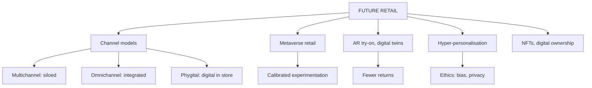

# DR-4: Omnichannel, Phygital and Future Retail

Covers: multichannel versus omnichannel versus phygital, the Retail 4.0 hybrid model, metaverse retail, AR try-on, digital twins, hyper-personalisation, NFTs and digital ownership, calibrated experimentation, and two sums on returns and an A/B test. **(syllabus)** means the faculty RM Notes and your Unit 5 notes; there are **no Unit 5 faculty slides**. Additions are tagged **(textbook)**.

## Where this fits in the ESE

Assumed pattern (no course plan): 50 marks, 3 x 5, 2 x 10, one 15-mark case. Likely: a 5-mark "multichannel versus omnichannel", "phygital retail", "metaverse in retail", and a 10-mark "future of retail: technology and strategy". The recommendation line in a case often asks "pilot or invest?".

## Multichannel, omnichannel and phygital (RM Notes)

| Basis | Multichannel | Omnichannel | Phygital |
|---|---|---|---|
| Philosophy | Several independent sales channels | One continuous customer journey across all channels | Physical space blended with digital tech for interactive experience |
| Integration | Low, siloed | High, systemic (ERP, POS, CRM linked in real time) | Experiential: sensory plus interactive interfaces in store |
| Customer journey | Fragmented; shopper restarts in each channel | Seamless; moves fluidly between touchpoints | Immersive; digital interfaces enhance the store |
| Enabler | Basic e-commerce site plus stores | Unified data layer, Customer Data Platform | IoT, AR and VR, RFID, smart mirrors |
| Inventory | Separate (store stock versus app stock) | Unified inventory system | Not stated in the notes; RFID is the usual enabler (textbook) |
| Example | Browse online, cannot return in store | Buy online, pick up in store, return via the app | Smart mirrors and interactive screens in store (textbook illustration) |

One-line difference: multichannel offers many channels; omnichannel **integrates** them; phygital makes the **store itself** digital. The Unit 1 faculty example: "customer buys online, picks up in store, and returns via mobile app" is omnichannel.

**Retail 4.0 or the hybrid model (RM Notes, India growth driver):** personalisation with an offline plus online approach; an agile, efficient, inclusive, interdependent retail ecosystem. **Also from the notes' 2026 focus list:** AI-powered personalisation, omnichannel, supply-chain modernisation, value-driven consumers, sustainability.

Enablers from DR-2 (POS, RFID, ERP, analytics) are the plumbing for omnichannel. Without a single customer view (RL-4) and unified stock, omnichannel is multichannel with a nicer app.

## Metaverse retail and AI-driven personalisation (your notes)

Retailers must keep scanning for technology shifts: early adopters of e-commerce and mobile gained lasting advantage. The current wave is metaverse and advanced AI personalisation. **(syllabus)**

**Key concepts:**
- **Metaverse retail:** persistent immersive virtual environments where brands build virtual stores, digital-only products and experiences, via VR or AR devices or ordinary screens.
- **AR virtual try-on:** AR overlays products (make-up, furniture, apparel) on the live camera feed, reducing purchase uncertainty and **returns**.
- **Digital twins:** virtual replicas of stores or products for planning, training or engagement.
- **Hyper-personalisation:** AI that goes beyond recommendations to individualised pricing, content and even store layout from real-time behaviour.
- **NFTs and digital ownership:** blockchain-based ownership for exclusive digital or phygital (physical plus digital twin) products. Still evolving.

**How it works:** metaverse experiments sit on top of existing e-commerce and social platforms, used for **engagement and brand building** rather than as a main sales channel today. AR try-on uses computer vision and 3D rendering to fix e-commerce's main limit: you cannot physically evaluate the product.

**Applications:** beauty and eyewear use AR try-on to cut hesitation and returns; furniture uses "place in your room" tools for size and fit worries.

**Advantages:** less uncertainty (AR), novel engagement, revenue from digital goods. **Limitations:** metaverse adoption is uncertain, usage of VR platforms is far below the hype, many initiatives are exploratory and ROI measurement is immature. Privacy risk rises with near-individual targeting.

**Examples:** Nike's virtual sneakers and the Nikeland experience (international); Sephora and IKEA for AR try-on and placement; Indian D2C fashion and beauty brands piloting AR in apps. The metaverse programmes of some large brands have since been scaled back **[VERIFY]**, which supports the calibrated approach below.

**Managerial rule (notes):** use **calibrated experimentation**: treat the metaverse as a learning and brand-engagement bet with a capped budget, and treat proven AI personalisation and AR try-on as the more immediately actionable investments. Separate real pain-point solutions (AR try-on) from hype-driven spend.

### Worked example: AR try-on and returns

**Question (illustrative, fictional):** NuWear (fictional) has 1,00,000 online orders a month. The return rate is 25%, and an AR try-on feature is expected to cut it to 20%. Each return costs ₹200 (reverse logistics, handling, lost resale). The feature costs ₹3,00,000 a month.

1. Returns now = 25,000; after = 20,000; fewer returns = **5,000**.
2. Saving = 5,000 x ₹200 = **₹10,00,000 a month**.
3. Net = 10,00,000 - 3,00,000 = **₹7,00,000 a month**.

**Decision and interpretation:** adopt, since the feature pays for itself over three times, assuming the cut in returns is real. Verify with a pilot on a subset of products and a control group before scaling.

### Worked example: is personalisation worth it? An A/B test

**Question (illustrative):** 1,00,000 sessions are split to the old and the new personalised experience. The old version converts at 2.0%, the new at 2.4%. Margin per order is ₹400; the engine costs ₹1,20,000 a month.

1. Orders: old **2,000**; new **2,400**; extra **400**.
2. Relative lift = (2.4 - 2.0) ÷ 2.0 = **20%**.
3. Extra margin = 400 x ₹400 = **₹1,60,000**.
4. Net = 1,60,000 - 1,20,000 = **₹40,000 a month**.

**Interpretation:** worth keeping but only just: a small drop in lift wipes out the gain, so check statistical significance (the two groups must be large enough, and run for a full cycle) before concluding. Also audit the model for bias and respect consent.

### Pilot or invest? A decision grid (textbook)

| Technology | Pain point solved | Evidence | Recommendation |
|---|---|---|---|
| AR try-on | Fit and style uncertainty, returns | Strong in beauty, eyewear, furniture | Invest, after a pilot |
| AI personalisation | Low conversion, generic offers | Proven by A/B tests | Invest, with bias audit |
| Metaverse store | Brand engagement | Adoption uncertain, ROI weak | Capped pilot only |
| NFTs and digital goods | Exclusive digital ownership | Evolving | Small experiment |

## Traps

- Omnichannel is about **integration**, not the number of channels.
- Phygital is not a fourth channel; it is a store enhanced with digital tools.
- Do not call metaverse retail proven revenue; call it exploratory brand engagement.

## What to remember

- Multichannel = separate channels; omnichannel = integrated journey and unified inventory; phygital = digital inside the store (AR, IoT, RFID, smart mirrors).
- Retail 4.0 = hybrid offline plus online personalisation.
- Future tools: metaverse stores, AR try-on, digital twins, hyper-personalisation, NFTs.
- Calibrated experimentation: capped pilots for hype, investment for proven tools.
- Worked figures: AR try-on net ₹7,00,000 a month; personalisation lift 20% and net ₹40,000 a month.

## Concept map

## Flashcards
Q: Difference between multichannel and omnichannel retailing?
A: Multichannel uses several, often siloed channels; omnichannel integrates all channels into one seamless journey with unified inventory.

Q: Give the omnichannel example from the notes.
A: Customer buys online, picks up in store and returns via the mobile app.

Q: What is phygital retail?
A: Blending physical stores with digital technology (IoT, AR and VR, RFID, smart mirrors) for interactive, immersive experiences.

Q: What is metaverse retail?
A: Persistent immersive virtual environments where brands build virtual stores, digital goods and experiences.

Q: Which problem does AR virtual try-on address?
A: The inability to physically evaluate products online, reducing purchase uncertainty and returns.

Q: What is a digital twin?
A: A virtual replica of a physical store or product used for planning, training or customer engagement.

Q: What is hyper-personalisation?
A: AI that individualises pricing, content and even store experience from real-time behavioural signals.

Q: What does calibrated experimentation mean for metaverse retail?
A: Run capped pilots for learning and brand engagement; commit larger investment only to proven tools such as AR try-on and AI personalisation.

Q: Returns fall from 25% to 20% on 1,00,000 orders at ₹200 per return. Saving?
A: 5,000 fewer returns, ₹10,00,000 a month.

Q: Conversion 2.0% versus 2.4% on 1,00,000 sessions. Lift and extra orders?
A: 20% lift and 400 extra orders.

## Sources
- RM Notes: multichannel versus omnichannel; the conceptual distinction table with phygital; Retail 4.0
- Student notes Unit 5: Future Trends - Metaverse Retail and AI-Driven Personalization (no faculty slides for Unit 5)
- Previous node: [[Retail Management Unit 5 - DR-3 Sustainable Ethical and Green Retailing]]
- Next node: [[Retail Management Unit 5 - DR-5 Unit 5 Exam Answers]]
- [[Retail Management Unit 5 - Digital and Future Retail MOC (Node Map)]]
