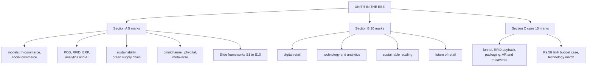

# DR-5: Unit 5 Exam Answers

Covers: what the ESE will ask from Unit 5, 5-mark skeletons built on the faculty slide frameworks, 10-mark skeletons, the slides' "Your store has a problem" budget case, the technology match table, and a 15-mark case layout with a model answer. Frameworks come from the **RM Unit 5.1 and 5.2 slides (slides)**; numbers come from DR-1 to DR-4.

## What the test will ask

No course plan exists for Retail Management, so the pattern is **assumed** to match Bond Market: 50 marks, Section A 3 x 5 (internal choice), Section B 2 x 10 (internal choice), Section C one compulsory 15-mark case. Confirm with the faculty. Unit 5 now has faculty slides (5.1 with 61 slides, 5.2 with 27 on e-tailing and social commerce). The slides are list-and-framework heavy, with discussion questions and activities, so the likeliest short questions are "list and explain" frameworks and "differentiate" tables. Reproduce the slide frameworks first, then add an Indian example. The case may be a decision case like the slides' budget challenge, plus payback, funnel and return-rate arithmetic.

**Slide-based skeletons come first below; the older skeletons that follow remain valid for questions the slides do not cover.**

## Five-mark skeletons from the slide frameworks (slides)

**S1. Four types of analytics (DR-2).** Definition (use of data, statistics and technology to improve retail decisions). Table: descriptive (what happened, sales up 15%), diagnostic (why, festival promotion), predictive (what is likely, umbrella demand may rise), prescriptive (what to do, raise umbrella stock 20%). Add "increasing value and complexity" and one line on data needed at each step.

**S2. RFID versus barcode (DR-2).** One line defining each, then the four-row table (line of sight, reading, cost, typical use), then the fashion answer (many SKUs and sizes, read many tags at once). Close: barcode stays at checkout, RFID for inventory.

**S3. Retailer versus marketplace (DR-1).** Four rows (products, assortment, inventory, example), the marketplace structure (platform with sellers 1 to 3), then "Amazon is both" as the closing line.

**S4. E-retail models (DR-1).** B2C (Amazon), B2B (Alibaba), C2C (OLX), D2C (Mamaearth), one line each, then why brands choose D2C (data ownership, margin, brand control).

**S5. Six C's and seven species of social commerce (DR-1).** Define social commerce (subset of e-commerce using social media and user contributions). Then either the 6 C's (Content, Community, Commerce, Context, Connection, Conversation) with one line each, or the 7 species with one example each. Write only the list asked for, with the other as a closing line.

**S6. Greenwashing (DR-3).** Definition (looking more environmentally friendly than it is), the "100% Eco-Friendly" example, four red flags (no certification, hidden trade-offs, irrelevant claims, vague claims), and how to avoid it (evidence and third-party verification).

**S7. Green supply chain with IKEA (DR-3).** Five-stage chain, six add-ons (sourcing, low-emission transport, eco packaging, waste reduction, energy efficiency, reverse logistics), IKEA's six points mapped to them, one limit and the competitive-advantage line.

**S8. Benefits and risks of AI in retail (DR-2).** Five things AI changes, benefits (personalisation, faster decisions, better forecasting, cost reduction, better experience) against risks (privacy, bias, data security, opacity, over-personalisation), the Amazon recommendation example, and the control: audit, explain, consent. Add "Innovation + Responsibility = Sustainable AI".

**S9. Smart stores (DR-4).** Definition, six technologies (IoT, computer vision, RFID, AI, mobile apps, digital payments), the four-step cashierless flow, benefit and limit.

**S10. ERP and its integration with POS, analytics and AI (DR-2).** ERP definition (one system, one shared database), six functions, then the five-step flow POS, ERP, analytics, AI, supply chain with what each does; result: a connected retail ecosystem.

## Older five-mark skeletons (your notes)

**1. Inventory-led versus marketplace models (DR-1).** Who holds stock, revenue source, example, one advantage and one limit each. Prefer the slide table in S3.

**2. M-commerce features and the funnel (DR-1).** Apps, UPI, push, location offers; four funnel metrics; cart-abandonment recovery.

**3. Social commerce and marketplaces (DR-1).** Definition, influencer and live commerce, network effects, commission and ads, platform-dependence risk.

**4. POS, RFID and ERP (DR-2).** One line each, how they fit together, phantom inventory, where RFID pays.

**5. Analytics maturity and AI applications (DR-2).** Four levels; five applications; bias and privacy.

**6. Sustainable and ethical retailing (DR-3).** Triple bottom line, ethical sourcing, ESG, greenwashing, one Indian and one international example.

**7. Green supply chain (DR-3).** Corrected to the slide version: the six add-ons (see S7), then your extra levers (carbon reduction, circular chains, local sourcing); audit first; packaging is a win-win; capital limit. Your earlier skeleton said "five levers"; the class answer is six add-ons.

**8. Multichannel versus omnichannel (DR-4).** Table of philosophy, integration, journey, inventory; the pick-up-and-return example; add phygital.

**9. Metaverse and AR in retail (DR-4).** Definitions, AR try-on use, adoption uncertainty, calibrated experimentation.

## Ten-mark answer skeletons

**A. Digital retail: e-retailing, m-commerce and social commerce (DR-1).** Models, m-commerce features, funnel and CAC with a one-line number, social and live commerce, marketplaces, risks, Indian examples.

**B. Technology and analytics in retail (DR-2).** POS, RFID, ERP loop, smart store, data sources, analytics ladder, AI uses, ethics, payback logic.

**C. Sustainable retailing and green supply chains (DR-3).** Triple bottom line, ethical sourcing, ESG, greenwashing, the slide's six green add-ons, audit and impact-to-cost, packaging and fleet figures, limits.

**D. Future of retail (DR-4, DR-1, DR-2).** Multichannel to omnichannel to phygital, Retail 4.0, metaverse, AR, hyper-personalisation, ethics, calibrated experimentation, pilot-or-invest grid.

**Add from the slides to the ten-mark answers.** A: e-tailing definition and process cycle, the four models, 7-stage evolution, m-commerce journey, social commerce 6 C's, retailer versus marketplace. B: the integrated flow, four analytics types, supermarket check, AI benefits and risks, Ethical AI caselet. C: People, Planet, Profit, six add-ons, IKEA, ethical issues and greenwashing red flags. D: nine trends, smart store, 8-step loop, seven-touchpoint ecosystem, "will technology replace the store".

## The slides' mini case: "Your store has a problem!" (budget of ₹50 lakh)

**The slide (5.1):** the store has overstocking, customer complaints, high energy costs, long checkout queues and rising e-commerce competition. Allocate a ₹50 lakh technology budget among **AI, POS, smart-store technology, RFID, ERP and sustainability**, and justify each decision against the problems it solves. The slide gives no split, so the split below is **my illustrative suggestion (textbook)**. Marks go to the reasoning, not the numbers.

**Layout of the answer:**

1. Diagnose: list the five problems and likely root causes (overstock from poor forecasting and stock visibility; complaints from stockouts, queues and service; energy cost from old lighting and chillers; queues from slow billing; e-commerce pressure from weak digital offer).
2. Allocate and justify (table).
3. Check the budget adds up.
4. Sequence and risk.
5. Decision line and interpretation.

| Investment | ₹ lakh | Share | Problems it solves | Reason |
|---|---|---|---|---|
| RFID | 12 | 24% | Overstocking, complaints | Accurate item-level stock, fewer stockouts and wrong counts |
| ERP | 10 | 20% | Overstocking, e-commerce competition | One real-time stock view across store and online; the base for AI and analytics |
| POS | 10 | 20% | Long queues, complaints | Faster billing, digital payments, clean sales data |
| AI | 8 | 16% | Overstocking, e-commerce competition, complaints | Demand forecasting, personalised offers, chatbot for queries |
| Smart-store technology | 5 | 10% | Long queues | Self-checkout or scan-and-go pilot at peak hours |
| Sustainability | 5 | 10% | High energy costs | Efficient lighting and chillers, with a payback test |
| **Total** | **50** | **100%** | | |

**Check:** 12 + 10 + 10 + 8 + 5 + 5 = **50**. Shares: 12 ÷ 50 = 24%, 10 ÷ 50 = 20%, 8 ÷ 50 = 16%, 5 ÷ 50 = 10%; 24 + 20 + 20 + 16 + 10 + 10 = 100%.

There is no single right split. The question bank's model answer uses RFID 10, ERP 10, POS 8, AI 8, smart store 8, sustainability 6 (also 50). Marks go to tying each amount to a named problem and checking the total.

**Payback test for the energy line (illustrative saving, not given):** if the ₹5 lakh saves ₹2 lakh a year, payback = 5 ÷ 2 = **2.5 years**. State the assumption in the exam.

**Sequence:** ERP and POS first (foundation and queues), RFID pilot in the highest-variety category, AI after about six months of clean data, smart-store pilot and energy upgrade in parallel. **Risk:** ERP rollouts overrun; hold part of each line until the pilot proves out.

**Decision line:** fund the stock-visibility chain (RFID, ERP, AI) first because overstocking and complaints drive the most cost, and fund POS and smart checkout for the queue problem. **Interpretation:** each rupee is tied to a named problem; there is no spend on metaverse or other brand experiments while basic operations fail. If the examiner changes the split, defend it the same way: problem, technology, benefit, limit.

## Technology match table (slide task, filled)

The slide leaves the application and example blank. Fill it as below. **(slides)** for the technology list and the examples marked slide; the rest **(textbook)** or **(syllabus)** as shown.

| Technology | Primary application | Real retail example |
|---|---|---|
| AI | Recommendations, demand forecasting, personalised pricing and offers | Amazon's "customers who bought this also bought" recommendations (slide) |
| RFID | Inventory tracking: fast counts, fewer stock errors, loss prevention | A fashion retailer tagging garments (slide question) |
| POS | Processing transactions and capturing sales data for analysis | A supermarket billing counter such as DMart (textbook, qualitative) |
| ERP | One shared database across sales, purchasing, inventory, finance, supply chain, HR | Integrated POS and ERP at large chains such as Reliance Retail and Shoppers Stop (your notes) |
| Analytics | Using data to explain and predict sales and customer behaviour | The supermarket footfall, conversion and basket data (slide) |
| AR / VR | Virtual try-on and immersive virtual stores | AR try-on at Sephora and AR placement at IKEA (your notes); the virtual fashion store (slide) |

## Fifteen-mark case layout (digital transformation)

1. **Funnel and CAC (4):** conversion, cost per order, CAC, margin after marketing, cart-recovery value.
2. **Technology payback (4):** RFID benefit and payback; sensitivity.
3. **Sustainability (3):** packaging saving and a greenwashing guard.
4. **Future technology (4):** AR try-on economics, metaverse recommendation, ethics.

### Model answer, laid out as the exam answer

**Data (illustrative, fictional chain):** UrbanLoom (fictional) is an apparel chain with 30 stores and an app. In a month the app has 2,00,000 visits; 6% add to cart; 75% of carts are abandoned; marketing spend is ₹6,00,000; 50% of orders are from new customers; average order value ₹1,600 at 35% gross margin. RFID in all 30 stores costs ₹90 lakh; annual sales are ₹30 crore; lost sales from stockouts would fall from 4% to 2%; shrinkage savings ₹9 lakh a year. Online orders are 1,20,000 a year; right-sizing packaging saves ₹3 per order. The return rate is 22%, each return costs ₹180, and an AR size guide is expected to cut returns to 18% at a pilot cost of ₹5,00,000 a year. A metaverse showroom is proposed.

1. **Funnel:** carts = 2,00,000 x 6% = 12,000; abandoned = 9,000; orders = **3,000**; conversion **1.5%**. Cost per order = 6,00,000 ÷ 3,000 = **₹200**. New customers = 1,500, so **CAC = ₹400**. Margin per order = 1,600 x 35% = ₹560; margin = 3,000 x 560 = **₹16,80,000**; after marketing **₹10,80,000**. If 12% of abandoned carts are recovered: 1,080 orders and **₹6,04,800** extra margin.
2. **RFID:** recovered sales = 2% x ₹30 crore = **₹60 lakh**; margin 35% = **₹21 lakh**; plus shrinkage ₹9 lakh = **₹30 lakh** a year; **payback = 90 ÷ 30 = 3.0 years**. If only half the sales are recovered: 10.5 + 9 = 19.5, payback **4.6 years**.
3. **Sustainability:** packaging saving = 1,20,000 x ₹3 = **₹3,60,000 a year**; make the claim only with third-party-verified material and report the figure, to avoid greenwashing.
4. **Future technology:** returns now = 1,20,000 x 22% = 26,400; after = 21,600; fewer = **4,800**; saving = 4,800 x ₹180 = **₹8,64,000**; less pilot ₹5,00,000 = **₹3,64,000 net**. Metaverse showroom: capped pilot only (for example ₹2,00,000), judged on engagement, not sales.

| Item | Result |
|---|---|
| Conversion, cost per order, CAC | 1.5%, ₹200, ₹400 |
| Margin after marketing | ₹10,80,000 |
| Cart recovery (12%) | 1,080 orders, ₹6,04,800 margin |
| RFID benefit, payback | ₹30 lakh a year, 3.0 years |
| Packaging saving | ₹3,60,000 a year |
| AR size guide, net first year | ₹3,64,000 |

**Decision line:** run the cart-recovery programme now, approve RFID on a 3-year payback, adopt the packaging change, pilot the AR size guide and cap the metaverse showroom. **Interpretation:** the first three are proven and pay back from data the retailer already has; AR is likely to pay but needs a control group; the metaverse is a brand-engagement experiment, not a sales plan. Close with the assumptions: all rates are given or illustrative, and the RFID case is sensitive to how much lost sales are actually recovered.

## Time rule

If short of time: do the funnel line (conversion, cost per order, CAC), the RFID payback, and one line on AR and the metaverse; those carry the marks.

## What to remember

- Unit 5 answers start from the slide frameworks (4 analytics types, RFID vs barcode, retailer vs marketplace, 6 C's, 7 species, 6 add-ons, red flags), then add an Indian example and tag claims you are unsure of.
- Budget case: ₹50 lakh split 12 (RFID), 10 (ERP), 10 (POS), 8 (AI), 5 (smart store), 5 (sustainability) = 50, each tied to a named problem.
- Case figures: conversion 1.5%, CAC ₹400, margin after marketing ₹10,80,000; RFID ₹30 lakh a year and 3.0-year payback (4.6 on half recovery); packaging ₹3,60,000; AR net ₹3,64,000.
- Pilot proven pain-point tools; cap hype-driven ones.
- Greenwashing is the risk when claims outrun practice.
- Always finish with a decision line and an interpretation.

## Concept map

## Flashcards
Q: What is the first move in a Unit 5 theory answer?
A: Reproduce the slide framework (for example the four analytics types, the RFID vs barcode table, or the 6 C's), then add an Indian example and tag anything unverified.

Q: Skeleton for a 5-mark "four types of analytics" answer?
A: Definition, then descriptive, diagnostic, predictive, prescriptive with the umbrella example for each, and "increasing value and complexity".

Q: Skeleton for a 5-mark "greenwashing" answer?
A: Definition, the "100% Eco-Friendly" example, four red flags (no certification, hidden trade-offs, irrelevant claims, vague claims), and the fix: evidence and third-party verification.

Q: ₹50 lakh technology budget case: how is the answer built and what is one allocation?
A: Diagnose the five problems, allocate and justify each line, check it totals 50, sequence it. Illustrative split: RFID 12, ERP 10, POS 10, AI 8, smart store 5, sustainability 5 (total 50).

Q: Which technology fits which application: AI, RFID, POS, ERP, analytics, AR/VR?
A: AI: recommendations and forecasting. RFID: inventory tracking. POS: transactions and sales data. ERP: one shared database across functions. Analytics: decisions from data. AR/VR: virtual try-on and immersive stores.

Q: Skeleton for a 10-mark "future of retail" answer?
A: Channel evolution to omnichannel and phygital, Retail 4.0, metaverse, AR, hyper-personalisation, ethics, calibrated experimentation, pilot-or-invest grid.

Q: In the model case, what are conversion, cost per order and CAC?
A: 1.5%, ₹200 and ₹400.

Q: RFID costs ₹90 lakh and returns ₹30 lakh a year. Payback and the half-recovery case?
A: 3.0 years; 4.6 years if only half the lost sales are recovered.

Q: What is the net first-year gain from the AR size guide in the case?
A: ₹3,64,000 (₹8,64,000 saved on 4,800 fewer returns, less ₹5,00,000 pilot).

Q: What should the case recommend for the metaverse showroom?
A: A capped pilot judged on engagement, not a sales commitment.

Q: How should the packaging saving be communicated to avoid greenwashing?
A: Backed by verified materials and reported figures, not marketing claims alone.

## Sources
- Assumed ESE pattern (50 marks, 3 x 5, 2 x 10, 1 x 15 case)
- Faculty decks RM Unit 5.1 slides and RM Unit 5.2 slides
- DR-1 to DR-4; Unit 5 notes and RM Notes
- [[Retail Management Unit 5 - Digital and Future Retail MOC (Node Map)]]
