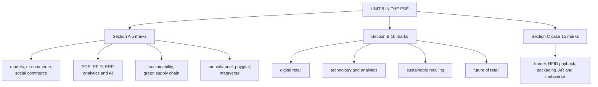

# DR-5: Unit 5 Exam Answers

Covers: what the ESE will ask from Unit 5, 5-mark and 10-mark skeletons, and a 15-mark case layout with a model answer. Numbers come from DR-1 to DR-4.

## What the test will ask

No course plan exists for Retail Management, so the pattern is **assumed** to match Bond Market: 50 marks, Section A 3 x 5 (internal choice), Section B 2 x 10 (internal choice), Section C one compulsory 15-mark case. Confirm with the faculty. Unit 5 has **no faculty slides**, so the question wording is the least predictable of the five units; answer from the concepts and always add an Indian example. Mostly theory, with payback, funnel and return-rate arithmetic in the case.

## Five-mark answer skeletons

**1. Inventory-led versus marketplace models (DR-1).** Who holds stock, revenue source, example, one advantage and one limit each.

**2. M-commerce features and the funnel (DR-1).** Apps, UPI, push, location offers; four funnel metrics; cart-abandonment recovery.

**3. Social commerce and marketplaces (DR-1).** Definition, influencer and live commerce, network effects, commission and ads, platform-dependence risk.

**4. POS, RFID and ERP (DR-2).** One line each, how they fit together, phantom inventory, where RFID pays.

**5. Analytics maturity and AI applications (DR-2).** Four levels; five applications; bias and privacy.

**6. Sustainable and ethical retailing (DR-3).** Triple bottom line, ethical sourcing, ESG, greenwashing, one Indian and one international example.

**7. Green supply chain (DR-3).** Five levers; audit first; packaging is a win-win; capital limit.

**8. Multichannel versus omnichannel (DR-4).** Table of philosophy, integration, journey, inventory; the pick-up-and-return example; add phygital.

**9. Metaverse and AR in retail (DR-4).** Definitions, AR try-on use, adoption uncertainty, calibrated experimentation.

## Ten-mark answer skeletons

**A. Digital retail: e-retailing, m-commerce and social commerce (DR-1).** Models, m-commerce features, funnel and CAC with a one-line number, social and live commerce, marketplaces, risks, Indian examples.

**B. Technology and analytics in retail (DR-2).** POS, RFID, ERP loop, smart store, data sources, analytics ladder, AI uses, ethics, payback logic.

**C. Sustainable retailing and green supply chains (DR-3).** Triple bottom line, ethical sourcing, ESG, greenwashing, five green levers, audit and impact-to-cost, packaging and fleet figures, limits.

**D. Future of retail (DR-4, DR-1, DR-2).** Multichannel to omnichannel to phygital, Retail 4.0, metaverse, AR, hyper-personalisation, ethics, calibrated experimentation, pilot-or-invest grid.

## Fifteen-mark case layout (digital transformation)

1. **Funnel and CAC (4):** conversion, cost per order, CAC, margin after marketing, cart-recovery value.
2. **Technology payback (4):** RFID benefit and payback; sensitivity.
3. **Sustainability (3):** packaging saving and a greenwashing guard.
4. **Future technology (4):** AR try-on economics, metaverse recommendation, ethics.

### Model answer, laid out as the exam answer

**Data (illustrative, fictional chain):** UrbanLoom (fictional) is an apparel chain with 30 stores and an app. In a month the app has 2,00,000 visits; 6% add to cart; 75% of carts are abandoned; marketing spend is ₹6,00,000; 50% of orders are from new customers; average order value ₹1,600 at 35% gross margin. RFID in all 30 stores costs ₹90 lakh; annual sales are ₹30 crore; lost sales from stockouts would fall from 4% to 2%; shrinkage savings ₹9 lakh a year. Online orders are 1,20,000 a year; right-sizing packaging saves ₹3 per order. The return rate is 22%, each return costs ₹180, and an AR size guide is expected to cut returns to 18% at a pilot cost of ₹5,00,000 a year. A metaverse showroom is proposed.

1. **Funnel:** carts = 2,00,000 x 6% = 12,000; abandoned = 9,000; orders = **3,000**; conversion **1.5%**. Cost per order = 6,00,000 ÷ 3,000 = **₹200**. New customers = 1,500, so **CAC = ₹400**. Margin per order = 1,600 x 35% = ₹560; margin = 3,000 x 560 = **₹16,80,000**; after marketing **₹10,80,000**. If 12% of abandoned carts are recovered: 1,080 orders and **₹6,04,800** extra margin.
2. **RFID:** recovered sales = 2% x ₹30 crore = **₹60 lakh**; margin 35% = **₹21 lakh**; plus shrinkage ₹9 lakh = **₹30 lakh** a year; **payback = 90 ÷ 30 = 3.0 years**. If only half the sales are recovered: 10.5 + 9 = 19.5, payback **4.6 years**.
3. **Sustainability:** packaging saving = 1,20,000 x ₹3 = **₹3,60,000 a year**; make the claim only with third-party-verified material and report the figure, to avoid greenwashing.
4. **Future technology:** returns now = 1,20,000 x 22% = 26,400; after = 21,600; fewer = **4,800**; saving = 4,800 x ₹180 = **₹8,64,000**; less pilot ₹5,00,000 = **₹3,64,000 net**. Metaverse showroom: capped pilot only (for example ₹2,00,000), judged on engagement, not sales.

| Item | Result |
|---|---|
| Conversion, cost per order, CAC | 1.5%, ₹200, ₹400 |
| Margin after marketing | ₹10,80,000 |
| Cart recovery (12%) | 1,080 orders, ₹6,04,800 margin |
| RFID benefit, payback | ₹30 lakh a year, 3.0 years |
| Packaging saving | ₹3,60,000 a year |
| AR size guide, net first year | ₹3,64,000 |

**Decision line:** run the cart-recovery programme now, approve RFID on a 3-year payback, adopt the packaging change, pilot the AR size guide and cap the metaverse showroom. **Interpretation:** the first three are proven and pay back from data the retailer already has; AR is likely to pay but needs a control group; the metaverse is a brand-engagement experiment, not a sales plan. Close with the assumptions: all rates are given or illustrative, and the RFID case is sensitive to how much lost sales are actually recovered.

## Time rule

If short of time: do the funnel line (conversion, cost per order, CAC), the RFID payback, and one line on AR and the metaverse; those carry the marks.

## What to remember

- Unit 5 has no faculty slides: answer from the concepts, add Indian examples, tag claims you are unsure of.
- Case figures: conversion 1.5%, CAC ₹400, margin after marketing ₹10,80,000; RFID ₹30 lakh a year and 3.0-year payback (4.6 on half recovery); packaging ₹3,60,000; AR net ₹3,64,000.
- Pilot proven pain-point tools; cap hype-driven ones.
- Greenwashing is the risk when claims outrun practice.
- Always finish with a decision line and an interpretation.

## Concept map

## Flashcards
Q: Which unit has no faculty slides, and what does that mean for answers?
A: Unit 5; answer from concepts in the notes, add Indian examples and avoid unverified facts.

Q: Skeleton for a 10-mark "future of retail" answer?
A: Channel evolution to omnichannel and phygital, Retail 4.0, metaverse, AR, hyper-personalisation, ethics, calibrated experimentation, pilot-or-invest grid.

Q: In the model case, what are conversion, cost per order and CAC?
A: 1.5%, ₹200 and ₹400.

Q: RFID costs ₹90 lakh and returns ₹30 lakh a year. Payback and the half-recovery case?
A: 3.0 years; 4.6 years if only half the lost sales are recovered.

Q: What is the net first-year gain from the AR size guide in the case?
A: ₹3,64,000 (₹8,64,000 saved on 4,800 fewer returns, less ₹5,00,000 pilot).

Q: What should the case recommend for the metaverse showroom?
A: A capped pilot judged on engagement, not a sales commitment.

Q: How should the packaging saving be communicated to avoid greenwashing?
A: Backed by verified materials and reported figures, not marketing claims alone.

## Sources
- Assumed ESE pattern (50 marks, 3 x 5, 2 x 10, 1 x 15 case)
- DR-1 to DR-4; Unit 5 notes and RM Notes (no Unit 5 faculty slides)
- [[Retail Management Unit 5 - Digital and Future Retail MOC (Node Map)]]
