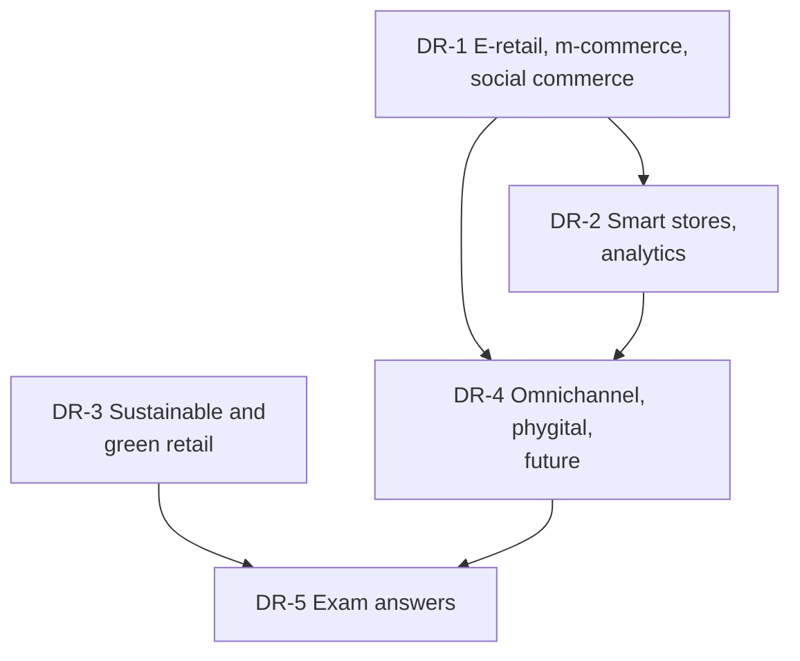

# Retail Management Unit 5: Digital, Sustainable and Future Retail, node map

ESE (assumed, no course plan): 50 marks, Section A 3 x 5, Section B 2 x 10, Section C one compulsory 15-mark case. **Primary sources: the faculty decks RM Unit 5.1 slides and RM Unit 5.2 slides**, tagged **(slides)** in the nodes. Your own notes and the RM Notes are tagged (syllabus) and fill gaps; additions are tagged (textbook). Where earlier notes differed from the slides, the slides win and each node says so. Mostly theory and frameworks, with funnel, payback, forecast-error, return-rate and data-check arithmetic. Examples are **illustrative**.

## Nodes

| Node | Topic | Deps | Minutes | Exam focus |
|---|---|---|---|---|
| DR-1 | E-Retailing, M-Commerce and Social Commerce | none | 45 | yes |
| DR-2 | Smart Stores and Retail Analytics | DR-1 | 45 | yes |
| DR-3 | Sustainable, Ethical and Green Retailing | none | 40 | yes |
| DR-4 | Omnichannel, Phygital and Future Retail | DR-1, DR-2 | 40 | yes |
| DR-5 | Unit 5 Exam Answers | DR-1 to DR-4 | 35 | yes |

Total reading time: about 205 minutes.

## Dependency graph

## Key frameworks and formulas

- E-retail models: inventory-led, marketplace (commission, ads, services), hybrid. Funnel: traffic, add to cart, checkout, abandonment. Example: conversion 2.4%, cost per order ₹208.33, CAC ₹347.22; marketplace seller net ₹170 (17%).
- POS (transactions), RFID (stock accuracy, phantom inventory), ERP (one system of record). Analytics ladder: descriptive, diagnostic, predictive, prescriptive.
- MAPE = average of |actual - forecast| ÷ actual (17.08% in the example); lift = confidence ÷ item share (3.0); payback = investment ÷ annual benefit (RFID 3.0 years).
- Triple bottom line (People, Planet, Profit); ESG; greenwashing. Green levers: reverse logistics, carbon, packaging, circular chains, local sourcing. Packaging saving ₹36 lakh a year; electric-van payback 4.0 years.
- Multichannel (siloed) versus omnichannel (integrated) versus phygital (digital in store). Calibrated experimentation for the metaverse.
- AR try-on net ₹7,00,000 a month; personalisation lift 20%, net ₹40,000 a month.
- Case answer (DR-5): conversion 1.5%, CAC ₹400, RFID payback 3.0 (4.6) years, packaging ₹3,60,000, AR net ₹3,64,000.

### Faculty slide frameworks (slides)

- **DR-1 (5.1 and 5.2):** e-tailing = sale through the Internet, 3 revenue sources (products, subscriptions, ads), 8-step process cycle, AIDA, 6 essentials (e-catalog, cart, payment gateway). Models: B2C Amazon, B2B Alibaba, C2C OLX, D2C Mamaearth. 7-stage evolution: traditional, e-retailing, mobile, social, omnichannel, AI-driven, smart and immersive. M-commerce: 8 drivers, 6-step journey (Discover, Compare, Evaluate, Purchase, Track, Review), 7-row feature table. Social commerce: 6 techniques (SCRM, word of mouth, social shopping, C2C, open source, viral), **6 C's** (Content, Community, Commerce, Context, Connection, Conversation), **7 species**, benefits and challenges, influencer chain (6 steps). Retailer versus marketplace table; Amazon is both.
- **DR-2 (5.1):** POS records product, price, customer, quantity, payment method, time. **RFID versus barcode** (line of sight, reading, cost, use). ERP functions: sales, purchasing, inventory, finance, supply chain, HR. Flow: POS, ERP, analytics, AI, supply chain. **Four analytics types** with the umbrella examples. Supermarket check: 20,000 x 25% = 5,000 buyers x ₹2,000 = ₹1 crore, not the stated ₹10 lakh. AI: 5 changes, 10 applications, 5 benefits against 5 risks. Ethical AI caselet UV8553: Innovation + Responsibility = Sustainable AI.
- **DR-3 (5.1):** People (fair labour, inclusion, ethical sourcing), Planet (less waste, lower emissions, packaging), Profit (long-term, efficient). Green supply chain: six add-ons; IKEA six points. Ethical retailing: eight issues. Greenwashing: four red flags (no certification, hidden trade-offs, irrelevant claims, vague claims).
- **DR-4 (5.1):** 9 emerging trends; metaverse retail; smart store with 6 technologies and the 4-step cashierless flow; 8-step AI personalisation loop; 7-touchpoint future retail ecosystem; "will technology replace the store" and Store of 2035.
- **DR-5:** slide-based skeletons S1 to S10, the ₹50 lakh budget case (12 + 10 + 10 + 8 + 5 + 5 = 50, illustrative) and the technology match table.

## Quick revision: the 5 big areas (slides)

| # | Area | Contents |
|---|---|---|
| 1 | **Digital** | E-retailing + m-commerce + social commerce (DR-1) |
| 2 | **Data** | Retail analytics + AI (DR-2) |
| 3 | **Responsibility** | Sustainable + ethical retail (DR-3) |
| 4 | **Technology** | POS + RFID + ERP (DR-2) |
| 5 | **Future** | Metaverse + smart stores + AI personalisation (DR-4) |

The slides' key takeaway: retail is becoming digital, data-driven, intelligent, sustainable, connected (POS, RFID, ERP and analytics integrate operations) and experiential.

## Open flags

- The "no Unit 5 faculty slides" flag is cleared: slides RM Unit 5.1 and 5.2 now exist and are the primary source.
- Slide versus earlier-note differences, resolved in favour of the slides: e-retail models (B2C, B2B, C2C, D2C, not inventory-led, marketplace, hybrid); green supply chain has six add-ons (not five levers); IKEA points exclude resale and rental; RFID "reduces" (not "ends") phantom inventory; the 10-application AI list.
- The supermarket slide contains an arithmetic inconsistency (₹1 crore against ₹10 lakh). Ask the faculty which figure is intended.
- The 5.2 success-story figures and example companies are dated and company-reported, so they are tagged [VERIFY] in DR-1.
- FDI and e-commerce rules, BRSR, plastic EPR and greenwashing guidelines, Amazon Go status, the metaverse programmes of large brands, and Project Gigaton status are tagged [VERIFY] in DR-1, DR-2, DR-3 and DR-4.
- The UV8553 caselet text was not available, so the Ethical AI answers in DR-2 are suggested answers; read the caselet and add its facts.

## Links
- [[Retail Management MOC]]
