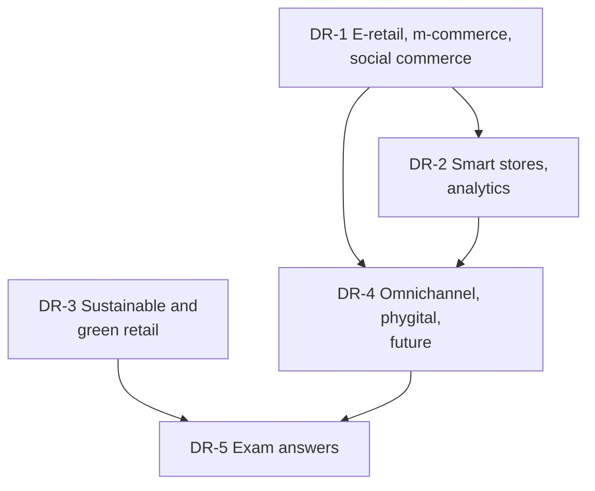

# Retail Management Unit 5: Digital, Sustainable and Future Retail, node map

ESE (assumed, no course plan): 50 marks, Section A 3 x 5, Section B 2 x 10, Section C one compulsory 15-mark case. **There are no Unit 5 faculty slides**, so these nodes are built from your notes and the RM Notes; every addition is tagged (textbook). Mostly theory, with funnel, payback, forecast-error and return-rate arithmetic. Examples are **illustrative**.

## Nodes

| Node | Topic | Deps | Minutes | Exam focus |
|---|---|---|---|---|
| DR-1 | E-Retailing, M-Commerce and Social Commerce | none | 40 | yes |
| DR-2 | Smart Stores and Retail Analytics | DR-1 | 40 | yes |
| DR-3 | Sustainable, Ethical and Green Retailing | none | 35 | yes |
| DR-4 | Omnichannel, Phygital and Future Retail | DR-1, DR-2 | 35 | yes |
| DR-5 | Unit 5 Exam Answers | DR-1 to DR-4 | 30 | yes |

Total reading time: about 180 minutes.

## Dependency graph

## Key frameworks and formulas

- E-retail models: inventory-led, marketplace (commission, ads, services), hybrid. Funnel: traffic, add to cart, checkout, abandonment. Example: conversion 2.4%, cost per order ₹208.33, CAC ₹347.22; marketplace seller net ₹170 (17%).
- POS (transactions), RFID (stock accuracy, phantom inventory), ERP (one system of record). Analytics ladder: descriptive, diagnostic, predictive, prescriptive.
- MAPE = average of |actual - forecast| ÷ actual (17.08% in the example); lift = confidence ÷ item share (3.0); payback = investment ÷ annual benefit (RFID 3.0 years).
- Triple bottom line (People, Planet, Profit); ESG; greenwashing. Green levers: reverse logistics, carbon, packaging, circular chains, local sourcing. Packaging saving ₹36 lakh a year; electric-van payback 4.0 years.
- Multichannel (siloed) versus omnichannel (integrated) versus phygital (digital in store). Calibrated experimentation for the metaverse.
- AR try-on net ₹7,00,000 a month; personalisation lift 20%, net ₹40,000 a month.
- Case answer (DR-5): conversion 1.5%, CAC ₹400, RFID payback 3.0 (4.6) years, packaging ₹3,60,000, AR net ₹3,64,000.

## Open flags

- FDI and e-commerce rules, BRSR, plastic EPR and greenwashing guidelines, Amazon Go status, the metaverse programmes of large brands, and Project Gigaton status are tagged [VERIFY] in DR-1, DR-2, DR-3 and DR-4.

## Links
- [[Retail Management MOC]]
