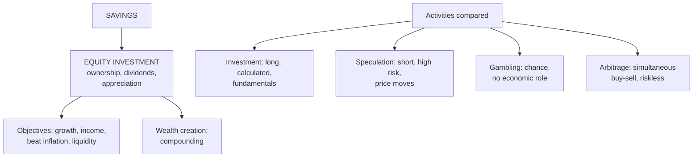

# EI-1: Equity Investment, Savings, and Investment vs Speculation, Gambling and Arbitrage

Covers: the meaning and objectives of equity investment, why savings and equity investment matter for wealth creation, and how investment differs from speculation, gambling and arbitrage, with an arbitrage example. **(syllabus)**

## Where this fits in the ESE

ESE: 50 marks (assume 3 × 5, 2 × 10, one 15-mark case). Unit 1 is CO1 (key investment concepts). "Distinguish investment, speculation and gambling" is one of the most predictable 5- or 10-mark questions in SAPM.

## Meaning of equity investment

**Investment** is committing money today to assets expected to give a return in the future, accepting some risk. **Equity investment** is buying **ownership shares** of companies: the investor becomes a part-owner, shares in profits through **dividends** and in growth through **capital appreciation**, and bears the residual risk (shareholders are paid last).

## Objectives of equity investment

1. **Capital appreciation:** growth in the share price as the company grows.
2. **Regular income:** dividends.
3. **Beating inflation:** equities have historically delivered real (inflation-beating) returns over long periods.
4. **Wealth creation through compounding.**
5. **Liquidity:** listed shares can be sold quickly on exchanges.
6. **Ownership and voting rights.**
7. **Tax efficiency:** long-term capital gains on listed equity are taxed at concessional rates compared with interest income.
8. **Safety of capital** through diversification (absolute safety is not possible in equity).

## Importance of savings and equity investment in wealth creation

- **Savings** are the source of investment: income not consumed. Household savings fund the economy's capital formation.
- **Compounding:** ₹1 lakh growing at 12% a year becomes about ₹3.1 lakh in 10 years and ₹9.6 lakh in 20 years. Starting early matters more than the amount.
- **Inflation:** money kept idle or in low-yield deposits loses purchasing power; equity is the main asset class that has outpaced inflation over long horizons.
- **For the economy:** equity investment channels savings to productive companies, supports entrepreneurship and employment, and deepens capital markets.
- **Financialisation of savings in India:** a shift from physical assets (gold, real estate) to financial assets (SIPs, mutual funds, direct equity).

## Investment vs speculation vs gambling

| Basis | Investment | Speculation | Gambling |
|---|---|---|---|
| Time horizon | Long term | Short term | Very short / one event |
| Risk | Moderate, calculated | High, calculated | Very high, uncalculated |
| Return expected | Moderate, steady (income + growth) | High, from price changes | Very high, from chance |
| Basis of decision | Fundamental analysis | Technical analysis, market information, hunches | Luck, rumours |
| Use of funds | Own funds | Often borrowed (leverage) | Own or borrowed |
| Income source | Dividends and appreciation | Price differences | Outcome of an event |
| Economic role | Productive: funds companies | Adds liquidity, price discovery | No economic purpose |
| Legality and attitude | Legal, encouraged | Legal, regulated | Often illegal; socially discouraged |

**Key line:** the difference is in **time horizon, risk attitude, basis of decision and expected return**, not in the asset itself: the same share can be an investment for one person and a speculation for another.

## Arbitrage

**Arbitrage** is earning a **riskless profit** by **simultaneously buying and selling** the same asset (or equivalent assets) in different markets to exploit a **price difference**.

- Low risk (in theory, riskless) because both trades happen at once.
- Brings prices in different markets into line (law of one price): an important market-efficiency function.
- Types: **spatial arbitrage** (NSE vs BSE), **cash-futures arbitrage** (buy in cash market, sell futures when futures trade above fair value), **merger arbitrage** (risk arbitrage, not riskless).

### Worked example

A share trades at **₹500 on NSE** and **₹502 on BSE** at the same moment. An arbitrageur buys 1,000 shares on NSE and sells 1,000 on BSE.
- Gross profit = (502 − 500) × 1,000 = **₹2,000**.
- If transaction costs are 0.05% of each side's value: 0.0005 × (5,00,000 + 5,02,000) = ₹501. **Net profit ≈ ₹1,499**.
- The buying on NSE and selling on BSE quickly close the gap. In practice such gaps are tiny and last seconds; algorithmic traders capture them.

<svg width="100%" style="max-width:680px;display:block;margin:12px auto" viewBox="0 0 680 235" role="img" xmlns="http://www.w3.org/2000/svg">
<title>Arbitrage on a Rs 2 price gap</title>
<desc>Buy 1,000 shares on NSE at 500 and sell 1,000 on BSE at 502 at the same moment. The gap of 2 per share gives gross profit of 2,000, of which 501 goes to transaction costs, leaving about 1,499 net.</desc>
<defs><marker id="ei1-arrow" viewBox="0 0 10 10" refX="9" refY="5" markerWidth="7" markerHeight="7" orient="auto"><path d="M1 1 L9 5 L1 9" fill="none" stroke="#5F5E5A" stroke-width="1.5" stroke-linejoin="round"/></marker></defs>
<rect x="40" y="24" width="180" height="72" rx="6" fill="none" stroke="#5F5E5A" stroke-width="2"/>
<text font-size="14" font-weight="500" fill="currentColor" font-family="inherit" x="130" y="52" text-anchor="middle">NSE: ₹500</text>
<text font-size="12" fill="currentColor" opacity="0.7" font-family="inherit" x="130" y="76" text-anchor="middle">Buy 1,000 shares</text>
<rect x="460" y="24" width="180" height="72" rx="6" fill="none" stroke="#5F5E5A" stroke-width="2"/>
<text font-size="14" font-weight="500" fill="currentColor" font-family="inherit" x="550" y="52" text-anchor="middle">BSE: ₹502</text>
<text font-size="12" fill="currentColor" opacity="0.7" font-family="inherit" x="550" y="76" text-anchor="middle">Sell 1,000 shares</text>
<line x1="222" y1="60" x2="458" y2="60" stroke="#5F5E5A" stroke-width="2" marker-end="url(#ei1-arrow)"/>
<text font-size="12" fill="currentColor" opacity="0.7" font-family="inherit" x="340" y="48" text-anchor="middle">both trades at the same moment</text>
<text font-size="12" fill="currentColor" opacity="0.7" font-family="inherit" x="340" y="82" text-anchor="middle">gap = 502 − 500 = ₹2 a share</text>
<text font-size="14" font-weight="500" fill="currentColor" font-family="inherit" x="40" y="136" text-anchor="start">Gross profit ₹2,000 (₹2 × 1,000 shares)</text>
<rect x="40" y="148" width="449.7" height="32" fill="#639922" stroke="#3B6D11" stroke-width="1"/>
<rect x="489.7" y="148" width="150.3" height="32" fill="#E24B4A" stroke="#A32D2D" stroke-width="1"/>
<text font-size="14" font-weight="500" fill="currentColor" font-family="inherit" x="264.9" y="202" text-anchor="middle">Net profit ≈ ₹1,499</text>
<text font-size="14" font-weight="500" fill="currentColor" font-family="inherit" x="564.9" y="202" text-anchor="middle">Costs ₹501</text>
</svg>

## Speculation is not useless

Speculators provide **liquidity** and help **price discovery**, and they take risks that hedgers want to shed. Excessive speculation with borrowed money, however, causes bubbles and crashes; SEBI's margin rules and position limits aim to contain it.

## What to remember

- Equity investment = ownership; return from dividends + appreciation; residual risk.
- Objectives: appreciation, income, beat inflation, liquidity, tax efficiency.
- Investment vs speculation vs gambling: horizon, risk, basis, return, economic role.
- Arbitrage = simultaneous buy and sell to capture a price gap; riskless in principle; aligns prices.
- Example: ₹500 vs ₹502 on 1,000 shares: ₹2,000 gross, about ₹1,499 net of 0.05% costs.

## Concept map

## Flashcards
Q: What is equity investment?
A: Buying ownership shares in companies to earn dividends and capital appreciation, bearing the residual risk of ownership.

Q: Name five objectives of equity investment.
A: Capital appreciation, regular income, beating inflation, liquidity, tax efficiency (also ownership rights, compounding).

Q: Give three differences between investment and speculation.
A: Investment is long-term, moderate calculated risk, based on fundamentals; speculation is short-term, high risk, based on price movements and often uses borrowed funds.

Q: How does gambling differ from speculation?
A: Gambling depends on chance with uncalculated risk and no economic function; speculation takes calculated risks on price changes and adds liquidity.

Q: Define arbitrage.
A: Simultaneously buying and selling the same asset in different markets to earn a riskless profit from a price difference.

Q: Share at ₹500 on NSE, ₹502 on BSE, 1,000 shares. Gross arbitrage profit?
A: ₹2,000 (before transaction costs).

Q: What economic role does arbitrage play?
A: It brings prices in different markets into line (law of one price).

## Sources
- BBA301F-5 course plan, Unit 1 (meaning and objectives of equity investment; savings; investment, speculation, gambling and arbitrage)
- Fischer & Jordan; Bhalla, *Investment Management*
- Next node: [[SAPM Unit 1 - EI-2 Types of Risk in Equity Investment]]
- [[SAPM Unit 1 - Equity Investments MOC (Node Map)]]
