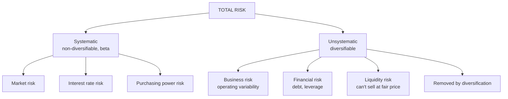

# EI-2: Risk in Equity Investment

Covers: the meaning of risk, systematic and unsystematic risk, and the specific risks the syllabus names (market, business, financial, liquidity), plus interest rate and purchasing power risk as the other systematic risks. **(syllabus)**

## Where this fits in the ESE

"Explain systematic and unsystematic risk with examples" is a near-certain 5- or 10-mark question. This node also sets up Unit 5 (diversification removes unsystematic risk; CAPM prices only systematic risk).

## Meaning of risk

**Risk** is the possibility that the **actual return differs from the expected return**, especially that it falls short. It is measured by the **variability (standard deviation)** of returns (EI-3). Higher risk must be compensated by higher expected return (the risk-return trade-off).

**Total risk = systematic risk + unsystematic risk**

## Systematic risk (market risk, non-diversifiable)

Arises from **economy-wide** factors that affect **all** securities. It **cannot be removed by diversification**. Measured by **beta** (Unit 5).

1. **Market risk:** variability caused by swings in investor sentiment and the overall market (bull and bear phases), often triggered by events such as elections, wars, global crises. Even sound companies' shares fall in a market crash (e.g. March 2020).
2. **Interest rate risk:** changes in interest rates change required returns; a rate rise lowers share and bond prices and raises borrowing costs.
3. **Purchasing power (inflation) risk:** inflation erodes the real value of returns; high inflation also raises interest rates.
4. (Also: exchange rate risk, political and regulatory risk at the national level.)

## Unsystematic risk (specific, diversifiable)

Arises from factors **specific to a company or industry**. It **can be reduced by diversification**.

1. **Business risk:** variability in **operating income** from the nature of the business: demand changes, competition, input costs, technology, management decisions, strikes. *Internal* (efficiency, operating leverage) and *external* (government policy for the industry, competitors).
2. **Financial risk:** extra variability in returns to shareholders from **debt in the capital structure**. Interest must be paid regardless of profits, so more debt (financial leverage) magnifies EPS swings and increases default risk. An all-equity firm has no financial risk.
3. **Liquidity risk:** the risk of not being able to **sell quickly at a fair price**: thinly traded small-cap shares, wide bid-ask spreads, stocks in the trade-to-trade segment or frozen in circuit limits.
4. (Also: management risk, fraud/governance risk, default/credit risk.)

## Comparison table

| Basis | Systematic | Unsystematic |
|---|---|---|
| Source | Economy-wide factors | Company or industry factors |
| Affects | All securities | One firm or industry |
| Diversifiable? | No | Yes |
| Examples | Market, interest rate, inflation risk | Business, financial, liquidity risk |
| Measured by | Beta | Residual variance |
| Rewarded with a premium? | Yes (CAPM) | No |
| Control | Hedging, asset allocation | Diversification, research |

## How investors manage risk

- **Diversification** across stocks and sectors (removes unsystematic risk).
- **Asset allocation** across equity, debt, gold (reduces exposure to market risk).
- **Hedging** with derivatives (index futures and options).
- **Research and monitoring** (business and financial risk).
- **Holding liquid stocks** and keeping an emergency cash buffer (liquidity risk).
- **Matching horizon to risk**: equity for long-term goals.

## What to remember

- Risk = variability of actual return around expected; measured by SD.
- Total risk = systematic (market, interest rate, inflation) + unsystematic (business, financial, liquidity).
- Systematic can't be diversified away and is measured by beta; unsystematic can.
- Business risk = operating variability; financial risk = from debt; liquidity risk = can't sell at fair price quickly.

## Concept map

## Flashcards
Q: Define risk in investment.
A: The possibility that the actual return differs from the expected return, measured by the variability (SD) of returns.

Q: What is systematic risk? Give three examples.
A: Economy-wide risk affecting all securities, not diversifiable: market risk, interest rate risk, purchasing power risk.

Q: What is unsystematic risk? Give three examples.
A: Company- or industry-specific risk that diversification can reduce: business risk, financial risk, liquidity risk.

Q: What is financial risk?
A: Extra variability in shareholders' returns caused by debt in the capital structure.

Q: What is business risk?
A: Variability in operating income from the nature of the business: demand, competition, costs, technology.

Q: What is liquidity risk?
A: The risk of not being able to sell an investment quickly at a fair price.

Q: Which risk does beta measure?
A: Systematic risk.

## Sources
- BBA301F-5 course plan, Unit 1 (risk in equity investment: systematic and unsystematic; market, business, financial, liquidity risk)
- Fischer & Jordan; Reilly & Brown
- Previous: [[SAPM Unit 1 - EI-1 Investment Speculation Gambling and Arbitrage]] · Next: [[SAPM Unit 1 - EI-3 Single Security Return and Risk]]
- [[SAPM Unit 1 - Equity Investments MOC (Node Map)]]
