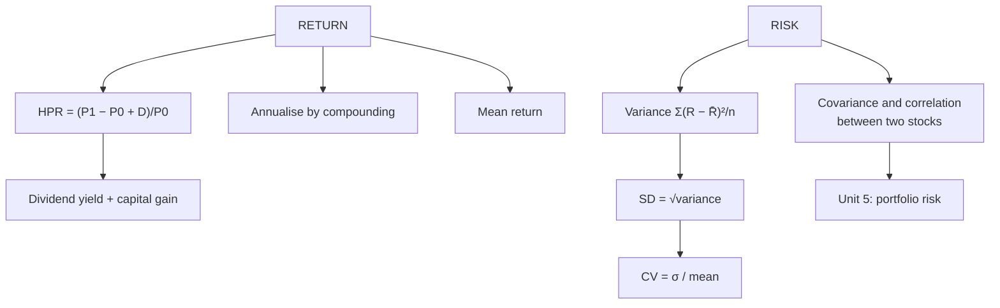

# EI-3: Risk-Return Analysis for a Single Security

Covers: holding period return, total return (income + capital gain), annualising returns, average return, variance and standard deviation from historical data, the coefficient of variation, and covariance and correlation between two securities. **(syllabus)**

## Where this fits in the ESE

The numerical core of Unit 1: a 5-mark HPR or SD sum, or a 10-mark "compute return, SD, covariance and correlation for two stocks and advise". The same tables reappear in Unit 5 (PM-1) for portfolios.

## Return

**Holding period return (HPR)** = (P₁ − P₀ + D) ÷ P₀
= dividend yield + capital gain yield = D/P₀ + (P₁ − P₀)/P₀.

**Total return** is the same idea: income (dividends) + capital gain (or loss), as a % of the price paid.

*Example:* buy at ₹250, receive a dividend of ₹8, sell at ₹280.
HPR = (280 − 250 + 8) ÷ 250 = 38 ÷ 250 = **15.2%** (dividend yield 3.2% + capital gain 12%).

**Annualising:** if the 15.2% was earned over 2 years, annual return = (1.152)^(1/2) − 1 = **7.33%** a year (compound), not 7.6%.

**Average (mean) return** from historical returns: R̄ = ΣR ÷ n (arithmetic mean).

## Risk: variance and standard deviation

From historical returns:
- **Variance σ² = Σ(R − R̄)² ÷ n** (use n − 1 for a sample if the question says so)
- **Standard deviation σ = √σ²**

From probabilities (expected scenarios): E(R) = ΣpR; σ² = Σp(R − E(R))² (see PM-1).

**Coefficient of variation (CV) = σ ÷ R̄**: risk per unit of return. Use it to compare stocks with different average returns: lower CV is better.

## Covariance and correlation (two securities)

- **Covariance = Σ(R_A − R̄_A)(R_B − R̄_B) ÷ n**: positive if the two move together, negative if opposite.
- **Correlation ρ = Cov ÷ (σ_A × σ_B)**, between −1 and +1: the strength of co-movement, unit-free.
  - +1: perfect positive; 0: no linear relation; −1: perfect negative.

## Worked example, laid out as the exam answer

**Question (illustrative):** annual returns over five years:

| Year | Stock A | Stock B |
|---|---|---|
| 1 | 12% | 8% |
| 2 | −4% | 2% |
| 3 | 18% | 12% |
| 4 | 10% | 6% |
| 5 | 14% | 12% |

Compute the mean, SD, CV, covariance and correlation, and advise a risk-averse investor.

1. **Means:** R̄_A = 50 ÷ 5 = **10%**; R̄_B = 40 ÷ 5 = **8%**.
2. **Deviations:**

| Year | d_A | d_B | d_A² | d_B² | d_A × d_B |
|---|---|---|---|---|---|
| 1 | 2 | 0 | 4 | 0 | 0 |
| 2 | −14 | −6 | 196 | 36 | 84 |
| 3 | 8 | 4 | 64 | 16 | 32 |
| 4 | 0 | −2 | 0 | 4 | 0 |
| 5 | 4 | 4 | 16 | 16 | 16 |
| **Total** | | | **280** | **72** | **132** |

3. **Variance and SD (÷ n):** σ²_A = 280 ÷ 5 = 56, **σ_A = 7.48%**; σ²_B = 72 ÷ 5 = 14.4, **σ_B = 3.79%**. (With n − 1: 8.37% and 4.24%.)
4. **CV:** A = 7.48 ÷ 10 = **0.75**; B = 3.79 ÷ 8 = **0.47**.
5. **Covariance** = 132 ÷ 5 = **26.4**; **correlation** = 26.4 ÷ (7.48 × 3.79) = **0.93**.

**Interpretation and advice:** A offers a higher average return (10% vs 8%) but much higher risk; per unit of return, B is less risky (CV 0.47 vs 0.75), so a **risk-averse investor should prefer B**. The correlation of 0.93 means the two move almost together, so combining them would give little diversification benefit (PM-2).

## Traps

- **Leaving out the dividend** in HPR.
- **Simple-dividing a multi-year return** instead of compounding.
- **Mixing n and n − 1**: state which you use.
- **Comparing SDs of stocks with different means** without CV.
- **Correlation outside −1 to +1** = arithmetic error.

## What to remember

- HPR = (P₁ − P₀ + D)/P₀: ₹250 → ₹280 with ₹8 dividend = 15.2%; over 2 years = 7.33% a year.
- σ = √[Σ(R − R̄)²/n]; CV = σ/R̄.
- Cov = Σd_A d_B/n; ρ = Cov/(σ_Aσ_B).
- Example: A 10% / 7.48% (CV 0.75); B 8% / 3.79% (CV 0.47); Cov 26.4; ρ 0.93.

## Concept map

## Flashcards
Q: Formula for holding period return?
A: (P₁ − P₀ + D) ÷ P₀.

Q: Buy ₹250, dividend ₹8, sell ₹280. HPR?
A: 15.2%.

Q: A 15.2% return over two years. Annual compound return?
A: (1.152)^(1/2) − 1 = 7.33%.

Q: Formula for standard deviation from historical returns?
A: √[Σ(R − R̄)² ÷ n] (or n − 1 for a sample).

Q: What does the coefficient of variation measure?
A: Risk per unit of return: σ ÷ mean return.

Q: Formula for the correlation coefficient?
A: Covariance ÷ (σ_A × σ_B).

Q: What does a correlation of 0.93 between two stocks imply for diversification?
A: They move almost together, so combining them reduces risk very little.

## Sources
- BBA301F-5 course plan, Unit 1 (risk-return analysis for a single security: HPR, total return, SD, variance, correlation, covariance)
- Fischer & Jordan; Reilly & Brown
- Previous: [[SAPM Unit 1 - EI-2 Types of Risk in Equity Investment]] · Next: [[SAPM Unit 1 - EI-4 Regulatory Framework and Indian Investors]]
- [[SAPM Unit 1 - Equity Investments MOC (Node Map)]]
