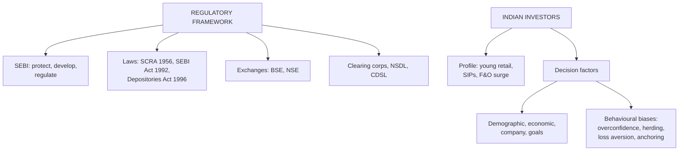

# EI-4: Regulatory Framework of Indian Equity Markets, and Indian Equity Investors

Covers: SEBI (establishment, objectives, functions, powers), the key laws, stock exchanges (NSE, BSE) and market infrastructure (clearing corporations, depositories), investor protection; the profile of Indian equity investors and the factors influencing their equity decisions, including behavioural biases. **(syllabus)**

## Where this fits in the ESE

Theory: a 5-mark "functions of SEBI" or "factors influencing equity investment decisions", or a 10-mark "regulatory framework of Indian equity markets". Your CIA1 interviews on investor behaviour are useful examples here.

## SEBI

**Securities and Exchange Board of India**: set up in 1988, given statutory powers by the **SEBI Act, 1992**. Headquarters Mumbai.

**Objectives (Preamble of the Act):** (1) protect the interests of investors in securities; (2) promote the development of the securities market; (3) regulate the securities market.

**Functions:**
- *Protective:* prohibit insider trading and fraudulent and unfair trade practices; investor education; grievance redressal (SCORES portal).
- *Regulatory:* register and regulate intermediaries (brokers, merchant bankers, portfolio managers, mutual funds, rating agencies, depositories, investment advisers); regulate takeovers (SAST Regulations); disclosure norms (ICDR, LODR Regulations); regulate stock exchanges.
- *Developmental:* promote training of intermediaries, new products, market infrastructure, technology (T+1 settlement, ASBA, UPI for IPOs).

**Powers:** quasi-legislative (make regulations), quasi-executive (inspect, investigate, pass orders), quasi-judicial (impose penalties, ban entities); appeals go to the Securities Appellate Tribunal (SAT).

## Key laws

| Law | Purpose |
|---|---|
| Securities Contracts (Regulation) Act, 1956 | Regulates stock exchanges and securities contracts |
| Companies Act, 2013 | Issue of securities, prospectus, corporate governance |
| SEBI Act, 1992 | Establishes SEBI and its powers |
| Depositories Act, 1996 | Dematerialised holding and transfer of securities |
| Prevention of Money Laundering Act, 2002 | KYC and anti-money-laundering rules for intermediaries |

## Stock exchanges and market infrastructure

- **BSE (1875):** Asia's oldest exchange; index **Sensex** (30 stocks).
- **NSE (1992, trading from 1994):** introduced fully electronic, screen-based nationwide trading; index **Nifty 50**; the largest exchange by equity derivatives volume.
- **Functions of exchanges:** liquidity and marketability; price discovery; safe and fair trading; listing and disclosure; investor protection; channel for savings into industry.
- **Clearing corporations** (NSE Clearing, Indian Clearing Corporation): central counterparty to trades, guarantee settlement; Indian equities settle on **T+1** (optional same-day T+0 for some stocks).
- **Depositories:** **NSDL** and **CDSL** hold shares in electronic (demat) form through depository participants.
- **Investor protection:** investor protection funds, SCORES complaints, arbitration, circuit breakers, margin requirements, surveillance.

## Profile of Indian equity investors

- **Rapid growth of retail participation** since 2020: demat accounts multiplied, crossing well over 15 crore by 2024; many first-time and young investors from smaller towns, entering through discount brokers and mobile apps.
- **Mutual fund SIPs** have become the main channel for regular equity investment.
- **Concentration:** a large share of market wealth is still held by promoters, institutions (FPIs, DIIs such as LIC and mutual funds) and high-net-worth individuals.
- **Household savings** remain tilted to bank deposits, gold and real estate, though the share of financial assets is rising.
- **Derivatives (F&O) trading** by retail traders has surged; SEBI studies found most individual F&O traders lose money, prompting tighter rules.
- Investor types: **long-term investors, traders, speculators**; by risk: conservative, moderate, aggressive.

## Factors influencing equity investment decisions

1. **Demographic:** age (younger investors bear more risk), income, occupation, education, gender, family responsibilities.
2. **Economic and market:** expected returns, interest rates on alternatives (FDs), inflation, market trends, tax rules (capital gains tax).
3. **Company-specific:** fundamentals, brand, dividend record, management quality.
4. **Personal financial goals and horizon:** retirement, children's education, wealth creation.
5. **Risk appetite and financial literacy.**
6. **Information sources:** advisers, brokers, financial media, social media "finfluencers", peers.
7. **Behavioural biases:**
   - *Overconfidence:* overestimating one's own skill; excessive trading.
   - *Herd behaviour:* following the crowd (IPO frenzies).
   - *Loss aversion / disposition effect:* holding losers too long, selling winners too early.
   - *Anchoring:* fixating on a past price.
   - *Availability and recency bias:* overweighting recent news.
   - *Home bias / familiarity:* buying only known brands.

## What to remember

- SEBI (1988; statutory 1992): protect investors, develop and regulate the market; protective, regulatory, developmental functions; SAT for appeals.
- Laws: SCRA 1956, SEBI Act 1992, Depositories Act 1996, Companies Act 2013.
- BSE (Sensex), NSE (Nifty 50); clearing corporations guarantee T+1 settlement; NSDL and CDSL hold demat accounts.
- Indian investors: fast-growing young retail base, SIPs, F&O surge, savings still tilted to deposits and gold.
- Decision factors: demographic, economic, company, goals, risk appetite, information, behavioural biases.

## Concept map

## Flashcards
Q: What are SEBI's three objectives?
A: Protect investors' interests, promote the development of the securities market, and regulate it.

Q: Name SEBI's three types of functions.
A: Protective, regulatory and developmental.

Q: Where do appeals against SEBI orders go?
A: The Securities Appellate Tribunal (SAT).

Q: Which law regulates stock exchanges and securities contracts?
A: The Securities Contracts (Regulation) Act, 1956.

Q: Name India's two depositories.
A: NSDL and CDSL.

Q: What is the settlement cycle for Indian equities?
A: T+1 (with an optional same-day segment for some stocks).

Q: Name four behavioural biases that affect equity investors.
A: Overconfidence, herd behaviour, loss aversion (disposition effect), anchoring (also recency, familiarity).

## Sources
- BBA301F-5 course plan, Unit 1 (regulatory framework of equity markets in India; profile of Indian equity investors and factors influencing decisions)
- SEBI Act, 1992; SEBI and NSE/BSE public material
- Previous: [[SAPM Unit 1 - EI-3 Single Security Return and Risk]] · Next: [[SAPM Unit 1 - EI-5 Unit 1 Exam Answers]]
- [[SAPM Unit 1 - Equity Investments MOC (Node Map)]]
